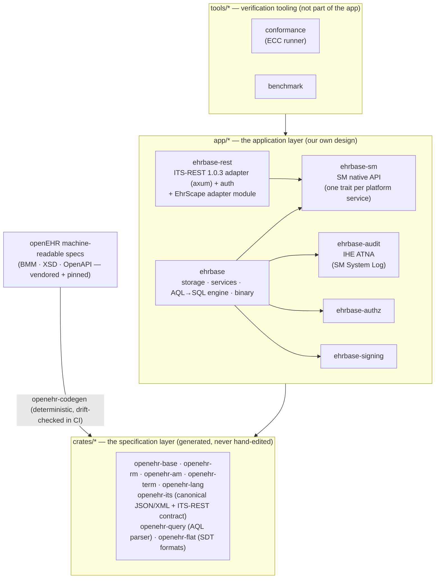

<div align="center">

# EHRbase-rs

**A pure-Rust openEHR Clinical Data Repository**

openEHR REST API (ITS-REST 1.0.3) &nbsp;·&nbsp; AQL 1.1 query engine &nbsp;·&nbsp; PostgreSQL 18-native storage

[](https://github.com/rubentalstra/ehrbase-rs/actions/workflows/ci.yml)
[](https://github.com/rubentalstra/ehrbase-rs/actions/workflows/containers.yml)
[](https://github.com/rubentalstra/ehrbase-rs/commits/develop)

[](rust-toolchain.toml)
[](Cargo.toml)
[](docs/VERSIONS.md)
[](https://specifications.openehr.org/)
[](docs/conformance/CONFORMANCE_REPORT.md)
[](docs/conformance/CONFORMANCE_REPORT.md)
[](docs/conformance/CONFORMANCE_REPORT.md)
[](docs/conformance/CONFORMANCE_REPORT.md)
[](https://github.com/rubentalstra/ehrbase-rs/pkgs/container/ehrbase-rs)

[](LICENSE)
[](SECURITY.md)
[](CONTRIBUTING.md)
[](CODE_OF_CONDUCT.md)

[Quickstart](#quickstart) · [Features](#features) · [Architecture](#architecture) · [Building](#building-from-source) · [Documentation](#documentation) · [Contributing](#contributing-and-security)

</div>

---

<p align="center">
  
</p>

[openEHR](https://www.openehr.org/) separates clinical knowledge from software:
applications store and query structured health records through a vendor-neutral
REST API and the Archetype Query Language, against a shared clinical information
model. **EHRbase-rs** implements that standard natively in Rust — one small
binary, no JVM, no external SDKs — with the openEHR type system, serialization,
and REST contract **generated deterministically from the official
machine-readable specifications**, and the storage engine, AQL engine, and
services designed from first principles for PostgreSQL 18.

> [!IMPORTANT]
> EHRbase-rs is a from-scratch Rust reimplementation, forked from
> [`ehrbase/ehrbase`](https://github.com/ehrbase/ehrbase) (Java). Its conformance
> target is the **openEHR specifications** — verified against the official CNF
> conformance framework — not parity with upstream. It is **pre-release
> software** and not yet ready for production use.

## Features

- **The complete openEHR REST API** — EHR, EHR_STATUS, COMPOSITION,
  DIRECTORY/FOLDER, CONTRIBUTION, QUERY, and template management (OPT 1.4), with
  canonical JSON and XML content negotiation.
- **A full AQL query engine** — typed path analysis over a spec-generated
  Reference Model, compiled to efficient SQL: `CONTAINS` is an integer interval
  join, never a JSON tree walk. Supports `LATEST_VERSION` **and** `ALL_VERSIONS`.
- **Temporal, versioned storage** — every write is a new immutable version with
  contribution and audit metadata in the same transaction; point-in-time reads
  ("what did this record look like on that date?") are first-class.
- **Composition validation** — Reference Model invariants, terminology bindings,
  and template constraints enforced on every write.
- **Simplified data formats** — WebTemplate, FLAT, and STRUCTURED JSON for
  form-driven clients.
- **Authentication built in** — HTTP Basic and OAuth2/OIDC bearer
  (Keycloak-style); role- and attribute-based authorization is in active
  development.
- **Security audit trail (IHE ATNA)** — every API operation emits a DICOM
  AuditMessage over syslog (UDP/TLS), with build-time coverage guarantees.
- **Production-grade telemetry** — structured logs, OTLP traces, Prometheus
  metrics, and a locked-down management surface; identified data never enters
  telemetry.
- **A clean deployment story** — distroless, non-root, shell-less multi-arch
  containers (amd64 + arm64) with a pure-Rust TLS stack.

## Quickstart

Run the server and a preconfigured PostgreSQL 18 with Docker Compose:

```shell
docker compose up --build
```

```shell
# Probe the status endpoint
curl http://localhost:8080/ehrbase/rest/status

# Create an EHR (development credentials: ehrbase / ehrbase)
curl -u ehrbase:ehrbase -X POST -i \
  http://localhost:8080/ehrbase/rest/openehr/v1/ehr

# Query it with AQL
curl -u ehrbase:ehrbase -H 'Content-Type: application/json' \
  -d '{"q":"SELECT e/ehr_id/value FROM EHR e"}' \
  http://localhost:8080/ehrbase/rest/openehr/v1/query/aql
```

Published images: [`ghcr.io/rubentalstra/ehrbase-rs`](https://github.com/rubentalstra/ehrbase-rs/pkgs/container/ehrbase-rs)
and [`ghcr.io/rubentalstra/ehrbase-rs-postgres`](https://github.com/rubentalstra/ehrbase-rs/pkgs/container/ehrbase-rs-postgres)
(PostgreSQL 18 with roles, schemas, and extensions pre-created; the server runs
its own migrations at boot). Configuration is environment-driven (`EHRBASE_*`);
the development credentials come from
[`docker/ehrbase.dev.toml`](docker/ehrbase.dev.toml) and must be replaced outside
development.

<details>
<summary><b>Optional: local observability stack (Grafana LGTM)</b></summary>

<br>

One overlay adds an OTLP collector, Prometheus, Tempo, Loki, and Grafana with a
provisioned service-overview dashboard:

```shell
docker compose -f docker-compose.yml -f docker-compose.observability.yml up --build
# Grafana → http://localhost:3000
```

Dashboards and alert rules live in [`docker/observability/`](docker/observability/);
the design is documented in [`docs/design/observability.md`](docs/design/observability.md).

</details>

## Architecture

The workspace has three directories with a strict one-way dependency
(`tools/* → app/* → crates/*`): the application builds on the specification,
never the reverse, and the verification tooling sits outside the application.
Internally the service layer follows the **openEHR SM Platform Service
Model** — the standard's own decomposition of a CDR platform — with the
REST server as one protocol adapter over a native service API.



| Crate | Role |
|---|---|
| `crates/openehr-base` · `openehr-rm` · `openehr-am` · `openehr-lang` | the openEHR type system, generated from the BMM meta-model |
| `crates/openehr-term` | the openEHR terminology bundle |
| `crates/openehr-its` | canonical JSON/XML serialization + the generated ITS-REST contract |
| `crates/openehr-query` | the AQL lexer/parser (`logos` + `chumsky`, no ANTLR) |
| `crates/openehr-flat` | WebTemplate / FLAT / STRUCTURED formats |
| `crates/openehr-codegen` · `openehr-derive` | the spec-to-Rust generator and its proc-macro |
| `app/ehrbase-sm` | the SM Platform Service Model native API — one trait per platform service |
| `app/ehrbase-rest` | the axum REST server (ITS-REST adapter), authentication, EhrScape |
| `app/ehrbase-audit` | the IHE ATNA audit trail (the SM System Log component) |
| `app/ehrbase-authz` | role- and attribute-based authorization |
| `app/ehrbase-signing` | version signing |
| `app/ehrbase` | the server binary: storage, services, and the AQL engine |
| `tools/conformance` | the ECC conformance runner (verification, not shipped) |
| `tools/benchmark` | the benchmark harness (verification, not shipped) |

A CI drift check regenerates the specification layer on every commit and fails
if it differs from the vendored specs — the generated code can never silently
diverge from the standard. The full design is described in
[`docs/architecture.md`](docs/architecture.md) and the SM-alignment design set
in [`docs/design/sm-platform/`](docs/design/sm-platform/README.md).

## Tech stack

| | |
|---|---|
| Language | Rust 1.96, edition 2024 |
| Database | PostgreSQL 18 — `uuidv7()`, temporal `WITHOUT OVERLAPS` keys, `JSON_TABLE`, `RETURNING OLD/NEW` |
| HTTP | `axum` · `tower-http` · `tokio` |
| Persistence | `sqlx` + `sea-query` |
| Auth | `oauth2` · `openidconnect` · `jsonwebtoken` · `argon2` |
| Telemetry | `tracing` · OpenTelemetry · Prometheus |

## Building from source

Requires the pinned toolchain (installed automatically by `rustup`), Docker for
the PostgreSQL integration tests, and `xmllint` for the canonical-XML tests.

```shell
cargo build --workspace
cargo nextest run --workspace
```

Every commit passes the full gate: 600+ tests against real PostgreSQL 18,
`clippy -D warnings`, rustfmt, supply-chain policy (`cargo deny`, `cargo audit`),
unused-dependency checks, spec-codegen drift, and a container smoke test.
See [CONTRIBUTING.md](CONTRIBUTING.md) for the complete developer workflow.

## Status

The core CDR is functional today: the REST API, versioned storage, templates,
validation, simplified formats, the AQL engine, authentication, auditing, and
the container images all work and are covered by the test suite. The service
layer is being aligned to the **openEHR SM Platform Service Model** with full
platform coverage — including EHR Extract, TDD import, the EHR Index,
Terminology and Subject Proxy services, and the complete Admin set
([`docs/design/sm-platform/`](docs/design/sm-platform/README.md)). Before a
first stable release the project will complete that alignment, EhrScape
compatibility, certification against the official openEHR conformance test
suite, and a performance pass. Detailed progress lives in
[`docs/PROGRESS.md`](docs/PROGRESS.md).

## Documentation

| | |
|---|---|
| [`docs/architecture.md`](docs/architecture.md) | system design |
| [`docs/ADRs/`](docs/ADRs/) | architecture decision records |
| [`docs/design/`](docs/design/) | subsystem designs — AQL engine, observability, container images |
| [`docs/enterprise/`](docs/enterprise/) | ATNA audit trail, access control |
| [`docs/specs/openehr/`](docs/specs/openehr/) | the vendored openEHR specifications (the conformance oracle) |

For the openEHR standard itself, see the
[openEHR specifications](https://specifications.openehr.org/); for the upstream
Java implementation, the [EHRbase documentation](https://docs.ehrbase.org).

## Contributing and security

Contributions are welcome — see [CONTRIBUTING.md](CONTRIBUTING.md) and the
[Code of Conduct](CODE_OF_CONDUCT.md). Please report suspected vulnerabilities
privately per the [security policy](SECURITY.md), not in public issues.

## Acknowledgments and license

EHRbase-rs began as a fork of **EHRbase**, developed by
[vitasystems GmbH](https://www.vitagroup.ag/) and the
[Peter L. Reichertz Institute](https://www.plri.de/), and keeps that lineage in
its git history; it is not affiliated with or endorsed by the upstream project.
The openEHR specifications and the machine-readable models this project
generates from are published by the
[openEHR Foundation](https://www.openehr.org/).

Licensed under the [Apache License 2.0](LICENSE), the same license as upstream
EHRbase.
