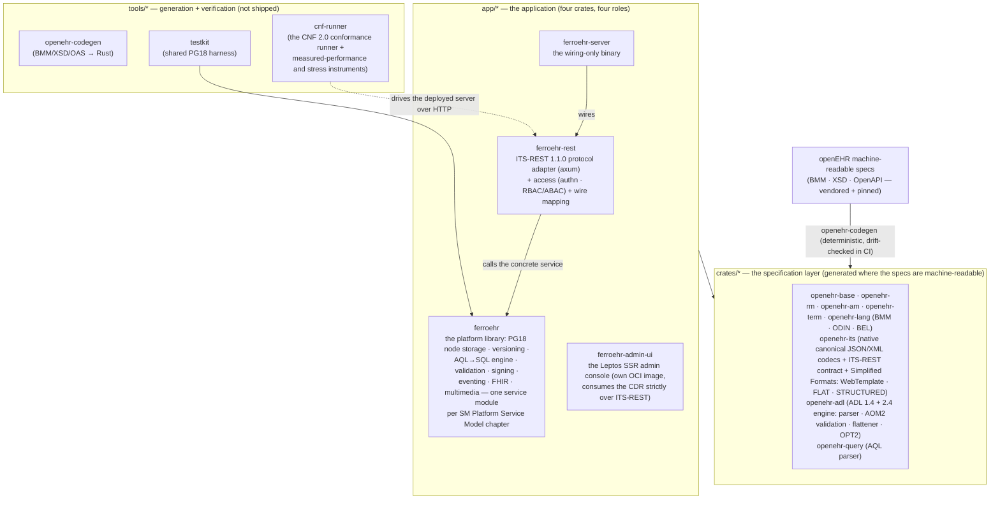
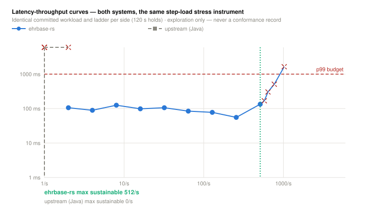

<div align="center">


**A pure-Rust openEHR® Clinical Data Repository — spec-conformant, measured, and built for production.**

*Pronounced "FER-ro-E-H-R" — from **ferrum**, iron: the element Rust is named for.\
(Saying "ferro-air" is unsupported, but we can't stop you.)*

ITS-REST 1.1.0 &nbsp;·&nbsp; AQL 1.1 &nbsp;·&nbsp; RM 1.2.0 &nbsp;·&nbsp; ADL 1.4 + 2.4 &nbsp;·&nbsp; PostgreSQL 18 &nbsp;·&nbsp; Rust 1.96

[](https://github.com/rubentalstra/FerroEHR/actions/workflows/ci.yml)
[](docs/conformance/ferroehr/CONFORMANCE_REPORT.md)
[](docs/conformance/ferroehr/CONFORMANCE_CERTIFICATE.md)
[](https://github.com/rubentalstra/FerroEHR/pkgs/container/ferroehr)
[](LICENSE)

[**Documentation**](https://rubentalstra.github.io/ferroehr/) · [Quick start](#quick-start) · [Features](#features) · [Architecture](#architecture) · [Conformance](#conformance-measured-not-asserted) · [Deployment](#deployment) · [Contributing](#contributing-and-security)

</div>

---

[openEHR](https://www.openehr.org/) separates clinical knowledge from
software: applications store and query structured health records through a
vendor-neutral REST API and the Archetype Query Language, against a shared
clinical information model. **FerroEHR** implements that standard natively
in Rust — a headless, API-first Clinical Data Repository shipped as a single
static binary on PostgreSQL 18. No JVM, no runtime dependencies, and every
compliance claim it makes is **machine-verified**: each release runs the full
conformance catalogue against the live server and generates its own
Conformance Statement and Certificate.

## Why FerroEHR

- **Compliance you can verify, not just read.** The built-in CNF 2.0
  conformance runner executes the complete machine-readable catalogue across
  the claimed wire formats and computes the openEHR profile verdicts as pure
  functions of the run records. The conformance badges above render straight
  from the committed run artifacts — generated from real runs, never
  hand-edited — and the
  [Conformance Report](docs/conformance/ferroehr/CONFORMANCE_REPORT.md)
  carries the full per-case record.
- **Performance is a verdict, not a slogan.** Volumetric deployment classes
  are *earned* by open-loop measured runs (population-anchored offered-load
  floors held for at least the normative hour, extendable to half-day
  holds), with re-checkable latency histograms embedded in the committed
  results; a separate step-load stress instrument finds the maximum
  sustainable throughput. Every published chart regenerates from those
  committed records, guarded in CI.
- **The latest openEHR specifications**, generated from the official
  machine-readable models: REST API 1.1.0, AQL 1.1, RM 1.2.0, Archetype
  Model 1.4 + 2.4, Terminology 3.1. A specification update is a
  regeneration, not a rewrite — and a CI drift-check makes silent divergence
  impossible.
- **Both generations of the archetype language, end to end.** ADL 2.4
  source templates are parsed, validated against the full AOM2 validity
  catalogue, specialisation-flattened, and compiled to operational
  templates; ADL 1.4 OPTs and source archetypes are validated against
  their own 1.4 rules — and can be migrated to ADL 2 in-CDR. Every
  template, either dialect, generates spec-valid example compositions
  that pass the server's own validation.
- **One static Rust binary.** Predictable memory, fast cold starts, a
  minimal distroless container image, no garbage-collection pauses in the
  write path.
- **PostgreSQL 18-native clinical storage.** Temporal versioning with
  database-enforced non-overlap, time-ordered UUIDv7 keys, and canonical
  openEHR JSON stored verbatim — what you store is exactly what the API
  serves.

## Features

### openEHR platform

- **REST API (ITS-REST 1.1.0)** — EHR, EHR_STATUS, COMPOSITION, DIRECTORY,
  CONTRIBUTION, query, template, and admin resources, with canonical JSON
  *and* XML on the wire
- **AQL 1.1 engine** — typed path analysis over a spec-generated Reference
  Model, compiled to efficient SQL; including `ALL_VERSIONS`,
  terminology-backed `TERMINOLOGY()` expansion inside `matches`, and stored
  parameterised queries
- **Full versioning semantics** — contribution-atomic commits, indelible
  version history, logical delete, attestations, per-version digital
  signatures, point-in-time reads
- **Templates & validation, both ADL generations** — ADL 2.4 source
  templates (full ADL2/cADL/ODIN parser, the AOM2 validity catalogue with
  typed rule codes on the wire, specialisation flattening, OPT2
  compilation) and OPT 1.4 ingestion with artefact validity checking;
  WebTemplate, FLAT and STRUCTURED formats from either dialect; deep
  archetype-constraint validation plus the RM invariant catalogue
  (including the terminology-backed invariants) on every write
- **Example generation** — every stored template, ADL 1.4 or 2.4, serves
  deterministic example compositions that pass the server's own full
  validation, in canonical JSON/XML and the simplified formats
- **ADL 1.4 → ADL 2 migration** — stored 1.4 archetypes convert to ADL 2
  source in-CDR, with a reproducible conversion log
- **EHR Extract & messaging** — whole-EHR export/import with preserved
  distributed version identity, EHR cloning across systems, TDD import
- **Demographics** — a versioned party store (person, organisation, group,
  agent, role) with relationships
- **Terminology** — the bundled openEHR terminology plus pluggable external
  FHIR terminology servers (validate, expand, subsume)

### Integration

- **Change events** — a transactional outbox publishes every commit to
  AMQP/RabbitMQ with per-EHR ordering, filterable server-side
  subscriptions, and PHI-free payloads by default
- **FHIR R4 connectors** — bidirectional and mapping-driven: ingest FHIR
  resources as validated compositions with full provenance, expose
  committed data through a FHIR read façade, emit FHIR resources on change
- **Binary & object storage** — large multimedia is content-addressed into
  any S3-compatible store with cryptographic integrity verification;
  SeaweedFS works out of the box for self-hosted setups

### Security & operations

- **Authentication** — Basic and OAuth2/OIDC (Keycloak, Active Directory,
  any standards-compliant identity provider)
- **Authorization** — role-based access control plus attribute-based
  policies, via the embedded policy engine or an external policy decision
  point
- **Multi-tenancy** — fully integrated: each tenant is an isolated logical
  openEHR system, enforced by PostgreSQL row-level security
- **ATNA audit logging** — IHE ATNA-compliant system log (DICOM audit
  messages over TLS syslog), alongside the openEHR contribution audit
  trail; identified data never enters telemetry
- **Hardened by default** — layered database roles, a pure-Rust TLS stack,
  and built-in observability: Prometheus metrics, OpenTelemetry traces,
  structured logs, health probes

### Deployment

- **Docker Compose** for development and evaluation, with an optional
  Grafana observability overlay
- **Distroless, non-root, shell-less multi-arch containers** (amd64 +
  arm64), published to GHCR
- **Helm chart** with security-hardened defaults (non-root, read-only
  filesystem, network policies) for Kubernetes
- **Operations guide** covering database roles, backup/PITR, and upgrades

## Quick start

Run the full stack (server + PostgreSQL 18) with Docker Compose:

```shell
docker compose up --build
```

```shell
# Probe the status endpoint
curl http://localhost:8080/ferroehr/rest/status

# Create an EHR (development credentials: ferroehr / ferroehr)
curl -u ferroehr:ferroehr -X POST -i \
  http://localhost:8080/ferroehr/rest/openehr/v1/ehr

# Query it with AQL
curl -u ferroehr:ferroehr -H 'Content-Type: application/json' \
  -d '{"q":"SELECT e/ehr_id/value FROM EHR e"}' \
  http://localhost:8080/ferroehr/rest/openehr/v1/query/aql
```

Interactive OpenAPI documentation is served at
`http://localhost:8080/ferroehr/rest/swagger-ui`.

Published images: [`ghcr.io/rubentalstra/ferroehr`](https://github.com/rubentalstra/FerroEHR/pkgs/container/ferroehr)
and [`ghcr.io/rubentalstra/ferroehr-postgres`](https://github.com/rubentalstra/FerroEHR/pkgs/container/ferroehr-postgres)
(PostgreSQL 18 with roles, schemas, and extensions pre-created; the server
runs its own migrations at boot). Configuration is environment-driven
(`FERROEHR_*`); the development credentials come from
[`docker/ferroehr.dev.toml`](docker/ferroehr.dev.toml) and must be replaced
outside development.

<details>
<summary><b>Optional: local observability stack (Grafana LGTM)</b></summary>

<br>

One overlay adds an OTLP collector, Prometheus, Tempo, Loki, and Grafana with
a provisioned service-overview dashboard:

```shell
docker compose -f docker-compose.yml -f docker-compose.observability.yml up --build
# Grafana → http://localhost:3000
```

Dashboards and alert rules live in [`docker/observability/`](docker/observability/).

</details>

## Architecture

Three directories, one strict dependency direction — the application
consumes the generated specification layer (`app/* → crates/*`), and the
tools verify from outside (the conformance runner drives the deployed
server purely over HTTP):



The service layer follows the openEHR **SM Platform Service Model**: one
service module per SM component, whose concrete methods carry the spec's
call names and error vocabulary — the "native API behind protocol
adapters" architecture the SM itself prescribes. The specification layer
carries no serde: canonical JSON and XML are native codecs generated
alongside the types, so the wire contract is explicit, tested code. The
full design is documented in
[`docs/architecture.md`](docs/architecture.md).

## Conformance, measured not asserted

<!-- CNF 2.0 profile badges: shields.io endpoint scheme over the
     runner-generated badge JSONs on develop — auto-updating on every merged
     conformance ratchet, zero manual edits. -->
[](docs/conformance/ferroehr/CONFORMANCE_CERTIFICATE.md)
[](docs/conformance/ferroehr/CONFORMANCE_CERTIFICATE.md)
[](docs/conformance/ferroehr/CONFORMANCE_CERTIFICATE.md)
[](docs/conformance/ferroehr/CONFORMANCE_CERTIFICATE.md)

```shell
bash scripts/conformance.sh
```

One command builds the current sources into a container, runs the complete
machine-readable openEHR conformance catalogue against it across the claimed
wire formats, and writes the
[report](docs/conformance/ferroehr/CONFORMANCE_REPORT.md), the
[Conformance Statement](docs/conformance/ferroehr/CONFORMANCE_STATEMENT.md), and the
[Certificate](docs/conformance/ferroehr/CONFORMANCE_CERTIFICATE.md). Profile verdicts
are computed by the runner — never hand-asserted — and the badges at the top
of this page are generated from real runs.

Performance is graded the same way. A volumetric deployment class is
**earned** by holding its population-anchored offered-load floor for the
sustained window — the normative hour by default, extendable to longer
demonstrations, never shorter — with every latency histogram embedded in the
committed results so the verdict re-derives from the artifact alone:

```shell
# the measured class stage (hour-plus, on the exclusively composed server)
CONF_PERF_CLASS=POC bash scripts/conformance.sh

# an extended sustained hold (a stricter demonstration of the same class)
CONF_PERF_CLASS=POC CONF_PERF_HOURS=8 bash scripts/conformance.sh

# the step-load stress instrument — exploration only, never a conformance record
cargo run -p cnf-runner -- stress --root tools/cnf-runner/artifacts \
  --ixit tools/cnf-runner/party/ferroehr/ixit.json \
  --out docs/conformance/ferroehr/stress.json
```

The published performance visuals — the class ladder, per-operation latency
percentiles, and the latency-throughput stress curve — regenerate from the
committed records (`bash scripts/render-perf-assets.sh`) and are diff-guarded
in CI, exactly like the conformance numbers.

The committed stress run's latency-throughput curve — the knee, the p99
budget line, and the class floors as context — renders straight from
[`docs/conformance/ferroehr/stress.json`](docs/conformance/ferroehr/stress.json)
(exploration only; the chart carries the measured numbers so none are typed
here):


Every measured class run and every stress step also records **resource
telemetry**: per-container CPU, resident memory, and block/network I/O for
the server and the database separately — plus, on class runs, the database
volume's disk anchors down to the storage cost per committed composition.
The committed record shows what a run cost the machine and where saturation
lives; telemetry is measured context only and never influences a verdict:


## Measured against EHRbase (Java)

One instrument, two servers, byte-identical requests: both systems run the
**same committed CNF catalogue** for conformance and the **same step-load
stress ladder** for throughput — the hospital-simulation workload on
official openEHR CKM templates, seeded fresh through the public API on each
side's own composed stack. Both directions are always published, and every
number derives from committed run artifacts — nothing here is hand-typed.

The stress ladder climbs geometrically until the system leaves the envelope
(p99 over budget or errors past tolerance), then bisects to the **maximum
sustainable throughput** — every load step embeds its own re-checkable
histograms and per-container resource telemetry, and a breached step is
reported with the exact violation. Where upstream sustains a higher rate,
its curve is drawn exactly like one where it doesn't:



Both systems' capability conformance, rendered from each party's own
committed verdicts (one cell per claimed capability, evidence as color and
glyph):


And the per-chapter outcomes side by side:


The full, generated comparison — profile verdicts, capability-by-capability
evidence, failures in both directions, and the stress overlay once both
committed reports exist — is the
[comparison page](https://rubentalstra.github.io/ferroehr/docs/latest/comparison.html)
on the website and [`docs/conformance/COMPARISON.md`](docs/conformance/COMPARISON.md)
in the repo, with each system's committed measurement records under
[`docs/conformance/`](docs/conformance/). Reproduce either side with the
built-in instruments: `bash scripts/conformance.sh` (`CONF_SUT=ehrbase-java`
for upstream) and `cnf-runner stress` / `cnf-runner aql-probe`
(`tools/cnf-runner/`).

## Deployment

```shell
helm install ferroehr deploy/helm/ferroehr \
  --set database.existingSecret=my-db-secret
```

See the [documentation website](https://rubentalstra.github.io/ferroehr/)
for the production checklist: database role separation, TLS, backup and
point-in-time recovery, and audit logging.

## Building from source

Requires the pinned toolchain (installed automatically by `rustup`), Docker
for the PostgreSQL integration tests, and `xmllint` for the canonical-XML
tests.

```shell
cargo build --workspace
cargo nextest run --workspace
```

CI gates every commit: the full test suite against real PostgreSQL 18,
`clippy -D warnings`, rustfmt, supply-chain policy (`cargo deny`, `cargo
audit`), unused-dependency checks, spec-codegen drift, and a container smoke
test. See [CONTRIBUTING.md](CONTRIBUTING.md) for the developer workflow.

## Documentation

| | |
|---|---|
| [Documentation website](https://rubentalstra.github.io/ferroehr/) | The user guide + OpenAPI endpoint reference (versioned per release) |
| [Architecture](docs/architecture.md) | How the system is built, and why |
| [Conformance report](docs/conformance/ferroehr/CONFORMANCE_REPORT.md) | The latest measured results, per test case |
| [Version matrix](docs/VERSIONS.md) | Every pin: openEHR spec versions, Rust toolchain, PostgreSQL |
| [Product roadmap](ROADMAP.md) | Where the product goes next |
| [Developer documentation](docs/README.md) | Contributing, design decisions, specifications |
| [Vendored openEHR specifications](docs/specs/openehr/) | The oracle every spec-facing decision cites |

For the openEHR standard itself, see the
[openEHR specifications](https://specifications.openehr.org/); for the
upstream Java implementation, the
[EHRbase documentation](https://docs.ehrbase.org).

## Contributing and security

Contributions are welcome — see [CONTRIBUTING.md](CONTRIBUTING.md) and the
[Code of Conduct](CODE_OF_CONDUCT.md). Please report suspected
vulnerabilities privately per the [security policy](SECURITY.md), not in
public issues.

## Acknowledgments and license

FerroEHR began as a fork of **EHRbase**, developed
by [vitasystems GmbH](https://www.vitagroup.ag/) and the
[Peter L. Reichertz Institute](https://www.plri.de/), and keeps that lineage
in its git history; it is not affiliated with or endorsed by the upstream
project. The openEHR specifications and the machine-readable models this
project generates from are published by the
[openEHR Foundation](https://www.openehr.org/).

openEHR® is the registered trademark of the openEHR Foundation. FerroEHR is
an independent implementation of the openEHR® specifications and is not
endorsed by the openEHR Foundation.

The admin console's feature set — the Template Manager, the point-and-click
Query Builder, and saved/grouped/cohort queries — is inspired by
[Cabolabs EHRServer](https://github.com/ppazos/cabolabs-ehrserver) by Pablo
Pazos / CaboLabs Health Informatics (Apache-2.0). The UX is reimplemented
fresh in Rust over this project's own AQL engine — no code is copied — but
the design lineage is gratefully credited.

**Licensing.** FerroEHR's own code — the application, the tooling, and the
generated crates — is licensed under the [MIT License](LICENSE). Vendored
third-party material keeps its upstream terms: the openEHR machine-readable
specification artifacts (BMM, XSDs, OpenAPI) and CKM-derived clinical models
are used under the [Apache License 2.0](LICENSE-APACHE-2.0), and each
vendored tree documents its exact origin in a `PROVENANCE.md`. Upstream
EHRbase itself remains Apache-2.0; no code from it is present in this tree.
