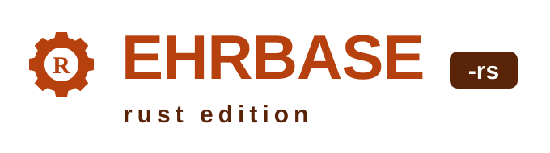
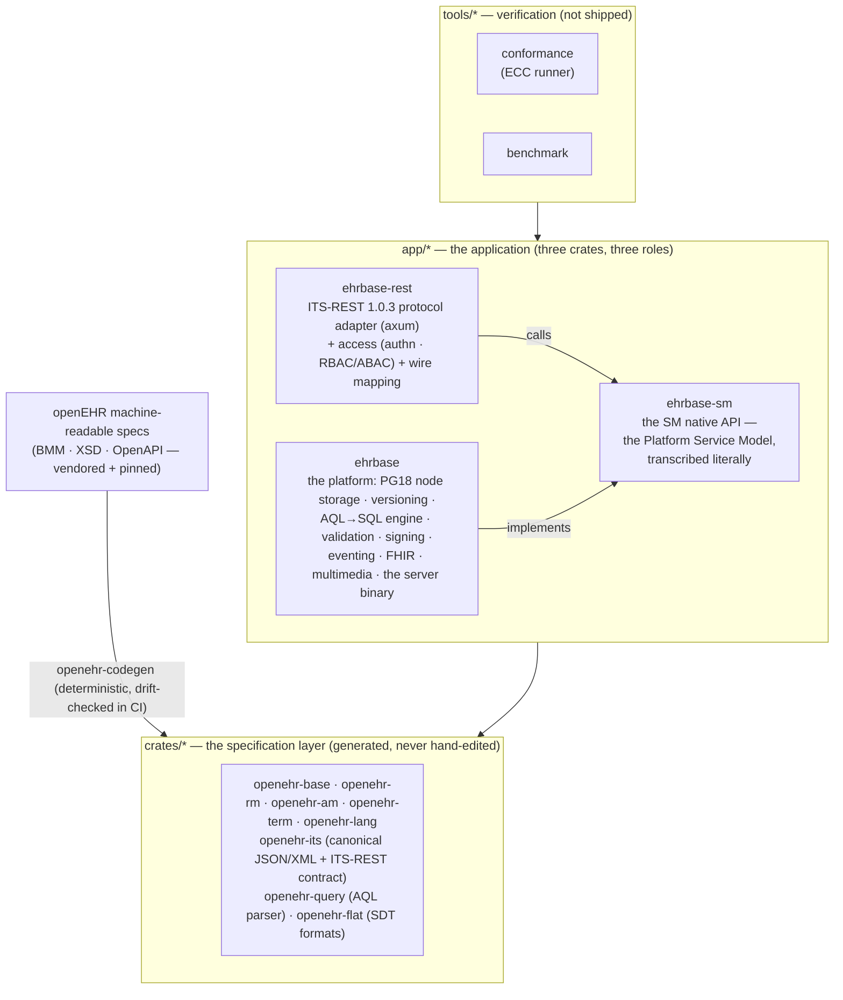

<div align="center">

# EHRbase-rs

**A pure-Rust openEHR Clinical Data Repository — spec-compliant, measured, and built for production.**

openEHR REST API (ITS-REST 1.0.3) &nbsp;·&nbsp; AQL 1.1 query engine &nbsp;·&nbsp; SM Platform Service Model &nbsp;·&nbsp; PostgreSQL 18-native storage

[](https://github.com/rubentalstra/ehrbase-rs/actions/workflows/ci.yml)
[](https://rubentalstra.github.io/ehrbase-rs/)
[](https://github.com/rubentalstra/ehrbase-rs/actions/workflows/containers.yml)
[](https://github.com/rubentalstra/ehrbase-rs/commits/develop)

[](rust-toolchain.toml)
[](Cargo.toml)
[](docs/VERSIONS.md)
[](https://specifications.openehr.org/)
[](docs/conformance/ehrbase-rs/CONFORMANCE_REPORT.md)
[](docs/conformance/ehrbase-rs/CONFORMANCE_CERTIFICATE.md)
[](docs/conformance/ehrbase-rs/CONFORMANCE_CERTIFICATE.md)
[](docs/conformance/ehrbase-rs/CONFORMANCE_CERTIFICATE.md)
[](https://github.com/rubentalstra/ehrbase-rs/pkgs/container/ehrbase-rs)

[](LICENSE)
[](SECURITY.md)
[](CONTRIBUTING.md)
[](CODE_OF_CONDUCT.md)

[**Documentation website**](https://rubentalstra.github.io/ehrbase-rs/) · [Quick start](#quick-start) · [Features](#features) · [Architecture](#architecture) · [Conformance](#conformance-measured-not-asserted) · [Deployment](#deployment) · [Building](#building-from-source) · [Documentation](#documentation)

</div>

---

<p align="center">
  
</p>

[openEHR](https://www.openehr.org/) separates clinical knowledge from
software: applications store and query structured health records through a
vendor-neutral REST API and the Archetype Query Language, against a shared
clinical information model. **EHRbase-rs** implements that standard natively
in Rust — a headless, API-first Clinical Data Repository shipped as a single
static binary on PostgreSQL 18. No JVM, no runtime dependencies, and every
compliance claim it makes is **machine-verified**: each release runs the full
conformance catalogue against the live server and generates its own
Conformance Statement and Certificate.

## Why EHRbase-rs

- **Compliance you can verify, not just read.** The built-in conformance
  runner executes the complete catalogue (341 cases, JSON and XML) and
  computes the openEHR profile verdicts — currently **CORE: PASS ·
  STANDARD: PASS · OPTIONS: OBTAINED**, zero failing cases. The badges above
  are generated from real runs.
- **The latest openEHR specifications**, generated from the official
  machine-readable models: REST API 1.0.3, AQL 1.1, RM 1.2.0, Archetype
  Model 1.4 + 2.4, Terminology 3.1. A specification update is a
  regeneration, not a rewrite — and a CI drift-check makes silent divergence
  impossible.
- **One static Rust binary.** Predictable memory, fast cold starts, a
  minimal distroless container image, no garbage-collection pauses in the
  write path.
- **PostgreSQL 18-native clinical storage.** Temporal versioning with
  database-enforced non-overlap, time-ordered UUIDv7 keys, and canonical
  openEHR JSON stored verbatim — what you store is exactly what the API
  serves.

## Features

### openEHR platform

- **REST API (ITS-REST 1.0.3)** — EHR, EHR_STATUS, COMPOSITION, DIRECTORY,
  CONTRIBUTION, query, template, and admin resources, with canonical JSON
  *and* XML on the wire
- **AQL 1.1 engine** — typed path analysis over a spec-generated Reference
  Model, compiled to efficient SQL; including `ALL_VERSIONS`,
  terminology-backed `TERMINOLOGY()` expansion inside `matches`, and stored
  parameterised queries
- **Full versioning semantics** — contribution-atomic commits, indelible
  version history, logical delete, attestations, per-version digital
  signatures, point-in-time reads
- **Templates & validation** — OPT 1.4 ingestion with artefact validity
  checking, WebTemplate, FLAT and STRUCTURED formats, deep
  archetype-constraint validation on every write
- **EHR Extract & messaging** — whole-EHR export/import with preserved
  distributed version identity, EHR cloning across systems, TDD import
- **Demographics** — a versioned party store (person, organisation, group,
  agent, role) with relationships
- **Terminology** — the bundled openEHR terminology plus pluggable external
  FHIR terminology servers (validate, expand, subsume)

### Integration

- **Change events** — a transactional outbox publishes every commit to
  AMQP/RabbitMQ with per-EHR ordering, filterable server-side
  subscriptions, and PHI-free payloads by default
- **FHIR R4 connectors** — bidirectional and mapping-driven: ingest FHIR
  resources as validated compositions with full provenance, expose
  committed data through a FHIR read façade, emit FHIR resources on change
- **Binary & object storage** — large multimedia is content-addressed into
  any S3-compatible store with cryptographic integrity verification;
  SeaweedFS works out of the box for self-hosted setups

### Security & operations

- **Authentication** — Basic and OAuth2/OIDC (Keycloak, Active Directory,
  any standards-compliant identity provider)
- **Authorization** — role-based access control plus attribute-based
  policies, via the embedded policy engine or an external policy decision
  point
- **Multi-tenancy** — fully integrated: each tenant is an isolated logical
  openEHR system, enforced by PostgreSQL row-level security
- **ATNA audit logging** — IHE ATNA-compliant system log (DICOM audit
  messages over TLS syslog), alongside the openEHR contribution audit
  trail; identified data never enters telemetry
- **Hardened by default** — layered database roles, a pure-Rust TLS stack,
  and built-in observability: Prometheus metrics, OpenTelemetry traces,
  structured logs, health probes

### Deployment

- **Docker Compose** for development and evaluation, with an optional
  Grafana observability overlay
- **Distroless, non-root, shell-less multi-arch containers** (amd64 +
  arm64), published to GHCR
- **Helm chart** with security-hardened defaults (non-root, read-only
  filesystem, network policies) for Kubernetes
- **Operations guide** covering database roles, backup/PITR, and upgrades

## Quick start

Run the full stack (server + PostgreSQL 18) with Docker Compose:

```shell
docker compose up --build
```

```shell
# Probe the status endpoint
curl http://localhost:8080/ehrbase/rest/status

# Create an EHR (development credentials: ehrbase / ehrbase)
curl -u ehrbase:ehrbase -X POST -i \
  http://localhost:8080/ehrbase/rest/openehr/v1/ehr

# Query it with AQL
curl -u ehrbase:ehrbase -H 'Content-Type: application/json' \
  -d '{"q":"SELECT e/ehr_id/value FROM EHR e"}' \
  http://localhost:8080/ehrbase/rest/openehr/v1/query/aql
```

Interactive OpenAPI documentation is served at
`http://localhost:8080/ehrbase/swagger-ui`.

Published images: [`ghcr.io/rubentalstra/ehrbase-rs`](https://github.com/rubentalstra/ehrbase-rs/pkgs/container/ehrbase-rs)
and [`ghcr.io/rubentalstra/ehrbase-rs-postgres`](https://github.com/rubentalstra/ehrbase-rs/pkgs/container/ehrbase-rs-postgres)
(PostgreSQL 18 with roles, schemas, and extensions pre-created; the server
runs its own migrations at boot). Configuration is environment-driven
(`EHRBASE_*`); the development credentials come from
[`docker/ehrbase.dev.toml`](docker/ehrbase.dev.toml) and must be replaced
outside development.

<details>
<summary><b>Optional: local observability stack (Grafana LGTM)</b></summary>

<br>

One overlay adds an OTLP collector, Prometheus, Tempo, Loki, and Grafana with
a provisioned service-overview dashboard:

```shell
docker compose -f docker-compose.yml -f docker-compose.observability.yml up --build
# Grafana → http://localhost:3000
```

Dashboards and alert rules live in [`docker/observability/`](docker/observability/);
the design is documented in [`docs/design/observability.md`](docs/design/observability.md).

</details>

## Architecture

Three directories, three spec layers, one strict dependency direction
(`tools/* → app/* → crates/*`):



The service layer is the openEHR **SM Platform Service Model, transcribed
literally**: one Rust trait per platform-service interface, carrying the
spec's exact call names, parameters, and error vocabulary — the "native API
behind protocol adapters" architecture the SM itself prescribes. The full
design, and the decision records behind it, are documented in
[`docs/architecture.md`](docs/architecture.md).

## Conformance, measured not asserted

```shell
scripts/conformance.sh
```

One command builds the current sources into a container, runs the complete
openEHR conformance catalogue against it in both wire formats, and writes
the [report](docs/conformance/ehrbase-rs/CONFORMANCE_REPORT.md), the
[Conformance Statement](docs/conformance/ehrbase-rs/CONFORMANCE_STATEMENT.md), and the
[Certificate](docs/conformance/ehrbase-rs/CONFORMANCE_CERTIFICATE.md). Profile verdicts
are computed by the runner — never hand-asserted — and the badges at the top
of this page are generated from real runs.

## Deployment

```shell
helm install ehrbase-rs deploy/helm/ehrbase-rs \
  --set database.existingSecret=my-db-secret
```

See the [deployment guide](docs/enterprise/deployment.md) for the production
checklist: database role separation, TLS, backup and point-in-time recovery,
and audit logging.

## Building from source

Requires the pinned toolchain (installed automatically by `rustup`), Docker
for the PostgreSQL integration tests, and `xmllint` for the canonical-XML
tests.

```shell
cargo build --workspace
cargo nextest run --workspace
```

CI gates every commit: the full test suite against real PostgreSQL 18,
`clippy -D warnings`, rustfmt, supply-chain policy (`cargo deny`, `cargo
audit`), unused-dependency checks, spec-codegen drift, and a container smoke
test. See [CONTRIBUTING.md](CONTRIBUTING.md) for the developer workflow.

## Documentation

| | |
|---|---|
| [Documentation website](https://rubentalstra.github.io/ehrbase-rs/) | The user guide + OpenAPI endpoint reference (versioned per release) |
| [Architecture](docs/architecture.md) | How the system is built, and why |
| [Conformance report](docs/conformance/ehrbase-rs/CONFORMANCE_REPORT.md) | The latest measured results, per test case |
| [Deployment guide](docs/enterprise/deployment.md) | Production operations |
| [Product roadmap](docs/enterprise/product-roadmap.md) | The capability matrix and what's next |
| [Developer documentation](docs/README.md) | Contributing, design decisions, specifications |
| [Vendored openEHR specifications](docs/specs/openehr/) | The oracle every spec-facing decision cites |

For the openEHR standard itself, see the
[openEHR specifications](https://specifications.openehr.org/); for the
upstream Java implementation, the
[EHRbase documentation](https://docs.ehrbase.org).

## Contributing and security

Contributions are welcome — see [CONTRIBUTING.md](CONTRIBUTING.md) and the
[Code of Conduct](CODE_OF_CONDUCT.md). Please report suspected
vulnerabilities privately per the [security policy](SECURITY.md), not in
public issues.

## Acknowledgments and license

EHRbase-rs began as a fork of **EHRbase**, developed by
[vitasystems GmbH](https://www.vitagroup.ag/) and the
[Peter L. Reichertz Institute](https://www.plri.de/), and keeps that lineage
in its git history; it is not affiliated with or endorsed by the upstream
project. The openEHR specifications and the machine-readable models this
project generates from are published by the
[openEHR Foundation](https://www.openehr.org/).

Licensed under the [Apache License 2.0](LICENSE), the same license as
upstream EHRbase.
