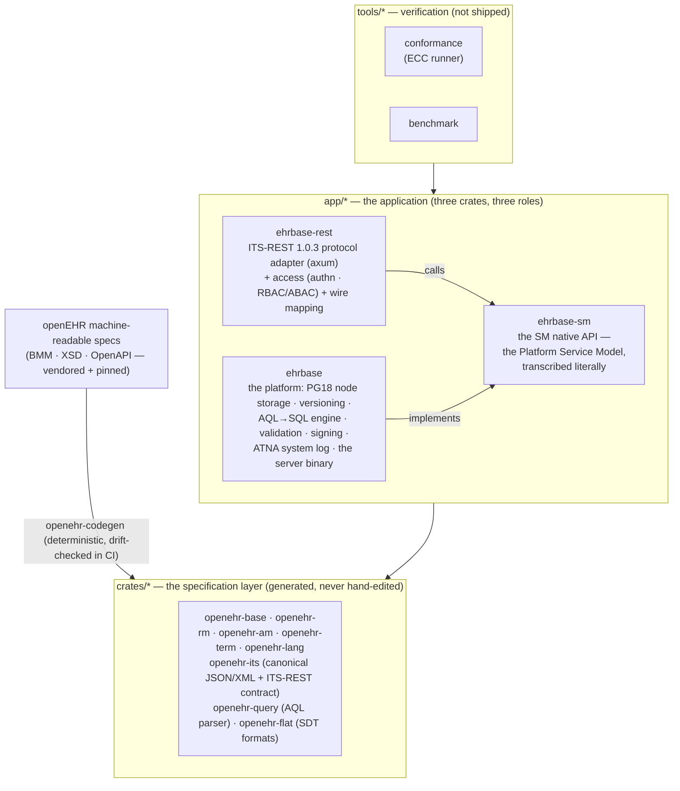

<div align="center">

# EHRbase-rs

**A pure-Rust openEHR Clinical Data Repository**

openEHR REST API (ITS-REST 1.0.3) &nbsp;·&nbsp; AQL 1.1 query engine &nbsp;·&nbsp; SM Platform Service Model &nbsp;·&nbsp; PostgreSQL 18-native storage

[](https://github.com/rubentalstra/ehrbase-rs/actions/workflows/ci.yml)
[](https://github.com/rubentalstra/ehrbase-rs/actions/workflows/containers.yml)
[](https://github.com/rubentalstra/ehrbase-rs/commits/develop)

[](rust-toolchain.toml)
[](Cargo.toml)
[](docs/VERSIONS.md)
[](https://specifications.openehr.org/)
[](docs/conformance/CONFORMANCE_REPORT.md)
[](docs/conformance/CONFORMANCE_REPORT.md)
[](docs/conformance/CONFORMANCE_REPORT.md)
[](docs/conformance/CONFORMANCE_REPORT.md)
[](https://github.com/rubentalstra/ehrbase-rs/pkgs/container/ehrbase-rs)

[](LICENSE)
[](SECURITY.md)
[](CONTRIBUTING.md)
[](CODE_OF_CONDUCT.md)

[Quickstart](#quickstart) · [Features](#features) · [Architecture](#architecture) · [Compliance](#spec-compliance-measured-not-asserted) · [Building](#building-from-source) · [Documentation](#documentation)

</div>

---

<p align="center">
  
</p>

[openEHR](https://www.openehr.org/) separates clinical knowledge from software:
applications store and query structured health records through a vendor-neutral
REST API and the Archetype Query Language, against a shared clinical information
model. **EHRbase-rs** implements that standard natively in Rust — one small
binary, no JVM, no external SDKs.

Three things set the project apart:

1. **The specification layer is generated, not hand-written.** The openEHR type
   system, canonical JSON/XML serialization, and the REST contract are produced
   deterministically from the official machine-readable specifications (BMM,
   XSD, OpenAPI), with a CI drift-check that makes silent divergence impossible.
2. **The service layer is the openEHR SM Platform Service Model, transcribed
   literally.** Every service trait carries the spec's exact call names,
   parameters, pre/post-conditions, and error vocabulary — the "native API
   behind protocol adapters" architecture the SM itself prescribes.
3. **Compliance is measured, not asserted.** A vendored conformance suite (ECC)
   runs the openEHR platform test schedule against the server; every gap is
   tracked in a citation-backed [blueprint](docs/blueprint/00-THE-BLUEPRINT.md)
   of 223 verified requirements.

> [!IMPORTANT]
> EHRbase-rs is a from-scratch Rust reimplementation, forked from
> [`ehrbase/ehrbase`](https://github.com/ehrbase/ehrbase) (Java). Its
> conformance target is the **openEHR specifications** — not parity with
> upstream. It is **pre-release software** undergoing an active greenfield
> rebuild and is not yet ready for production use.

## Features

- **The complete openEHR REST API** — EHR, EHR_STATUS, COMPOSITION,
  DIRECTORY/FOLDER, CONTRIBUTION, QUERY, template management (OPT 1.4 + an
  ADL2 artefact store), demographics (PARTY + PARTY_RELATIONSHIP), with
  canonical JSON and XML content negotiation.
- **Spec-faithful change control** — every write is a new immutable version
  inside an atomic CONTRIBUTION with audit metadata; the full five-state
  version lifecycle (`complete`, `incomplete`, `deleted`, `inactive`,
  `abandoned`); **ATTESTATION** support per RM change control; per-version
  digital signatures (RFC 8785 canonicalization); point-in-time reads.
- **A full AQL query engine** — typed path analysis over a spec-generated
  Reference Model, compiled to efficient SQL: `CONTAINS` is an integer
  interval join, never a JSON tree walk. `LATEST_VERSION` **and**
  `ALL_VERSIONS`; population queries honour the `is_queryable` gate.
- **The SM platform services** — EHR, Definitions (ADL 1.4 archetypes + OPTs,
  ADL2 artefacts, stored queries), Demographic, EHR Index, Query, Terminology,
  Validity checking, Admin (statistics, physical delete, archive), and the
  IHE-ATNA System Log — one Rust trait per SM interface.
- **Composition validation** — Reference Model invariants, openEHR terminology
  bindings, and template constraints enforced on every write.
- **Simplified data formats** — WebTemplate, FLAT, and STRUCTURED JSON for
  form-driven clients.
- **Security built in** — HTTP Basic and OAuth2/OIDC bearer authentication with
  a unified authn→authz pipeline (RBAC role gate + ABAC/Cedar policy engine);
  every API operation emits a DICOM AuditMessage over syslog (UDP/TLS) with
  build-time coverage guarantees.
- **Production-grade telemetry** — structured logs (pretty in dev, JSON for
  collectors), OTLP traces, Prometheus metrics, and a locked-down management
  surface; identified data never enters telemetry.
- **A clean deployment story** — distroless, non-root, shell-less multi-arch
  containers (amd64 + arm64) with a pure-Rust TLS stack.

## Quickstart

Run the server and a preconfigured PostgreSQL 18 with Docker Compose:

```shell
docker compose up --build
```

```shell
# Probe the status endpoint
curl http://localhost:8080/ehrbase/rest/status

# Create an EHR (development credentials: ehrbase / ehrbase)
curl -u ehrbase:ehrbase -X POST -i \
  http://localhost:8080/ehrbase/rest/openehr/v1/ehr

# Query it with AQL
curl -u ehrbase:ehrbase -H 'Content-Type: application/json' \
  -d '{"q":"SELECT e/ehr_id/value FROM EHR e"}' \
  http://localhost:8080/ehrbase/rest/openehr/v1/query/aql
```

Published images: [`ghcr.io/rubentalstra/ehrbase-rs`](https://github.com/rubentalstra/ehrbase-rs/pkgs/container/ehrbase-rs)
and [`ghcr.io/rubentalstra/ehrbase-rs-postgres`](https://github.com/rubentalstra/ehrbase-rs/pkgs/container/ehrbase-rs-postgres)
(PostgreSQL 18 with roles, schemas, and extensions pre-created; the server runs
its own migrations at boot). Configuration is environment-driven (`EHRBASE_*`);
the development credentials come from
[`docker/ehrbase.dev.toml`](docker/ehrbase.dev.toml) and must be replaced
outside development.

<details>
<summary><b>Optional: local observability stack (Grafana LGTM)</b></summary>

<br>

One overlay adds an OTLP collector, Prometheus, Tempo, Loki, and Grafana with a
provisioned service-overview dashboard:

```shell
docker compose -f docker-compose.yml -f docker-compose.observability.yml up --build
# Grafana → http://localhost:3000
```

Dashboards and alert rules live in [`docker/observability/`](docker/observability/);
the design is documented in [`docs/design/observability.md`](docs/design/observability.md).

</details>

## Architecture

Three directories, three spec layers, one strict dependency direction
(`tools/* → app/* → crates/*`):



| Layer | Crates | Spec authority |
|---|---|---|
| `crates/*` | `openehr-base` · `openehr-rm` · `openehr-am` · `openehr-term` · `openehr-lang` · `openehr-its` · `openehr-query` · `openehr-flat` (+ `openehr-codegen`/`openehr-derive` tooling) | RM 1.2 · BASE 1.3 · AM 1.4/2.4 · TERM 3.1 · AQL 1.1 · ITS-JSON/XML/REST |
| `app/ehrbase-sm` | The SM native API: one trait per platform-service interface, the `UPDATE_VERSION` commit envelope, the `CALL_STATUS` error model — protocol-free by construction | SM (Platform Service Model) |
| `app/ehrbase-rest` | The ITS-REST protocol adapter: generic `AppState<S: Platform>` (no dynamic dispatch), all wire mapping, authn/authz, management surface | ITS-REST 1.0.3 |
| `app/ehrbase` | The platform component: decomposed node storage + temporal versioning (PG 18 `WITHOUT OVERLAPS`), the AQL engine, validation, version signing, the ATNA system log, the binary | RM/BASE/AM/TERM/QUERY semantics |
| `tools/*` | `conformance` (the ECC runner) · `benchmark` | CNF test schedule |

Design decisions are recorded as ADRs — the load-bearing ones are
[ADR-008](docs/ADRs/ADR-008-greenfield-pg18-storage.md) (greenfield PG18
storage + conformance as the acceptance target),
[ADR-010](docs/ADRs/ADR-010-sm-aligned-service-architecture.md) (the SM
Platform Service Model as the internal decomposition), and
[ADR-011](docs/ADRs/ADR-011-app-crate-redesign.md) (the literal SM catalog +
three-crate consolidation).

## Spec compliance, measured not asserted

- **[THE BLUEPRINT](docs/blueprint/00-THE-BLUEPRINT.md)** tracks **223
  normative requirements** across seven spec chapters (RM, BASE+TERM, AM,
  QUERY, ITS, SM, CNF), each with a citation and a *verified*
  DONE/PARTIAL/MISSING state against the code — plus the single build order
  to full compliance.
- **The ECC conformance suite** (our own runner over the openEHR CNF platform
  test schedule, 310 catalogued cases) gates every phase; the badges above are
  generated from real runs.
- **Storage semantics are formally audited**: the persistence layer was
  verified line-by-line against RM change control (indelibility, contribution
  atomicity, the version lifecycle, attestations, revision history) with every
  finding fixed and test-proven.
- Deliberate spec-gap decisions are never silent — they carry `PORT NOTE`
  comments with spec citations, across the codebase.

## Tech stack

| | |
|---|---|
| Language | Rust 1.96, edition 2024 |
| Database | PostgreSQL 18 — `uuidv7()`, temporal `WITHOUT OVERLAPS` keys, `JSON_TABLE`, `RETURNING OLD/NEW` |
| HTTP | `axum` · `tower-http` · `tokio` |
| Persistence | `sqlx` + `sea-query` |
| Auth | `oauth2` · `openidconnect` · `jsonwebtoken` · `argon2` · `cedar-policy` |
| Telemetry | `tracing` · OpenTelemetry · Prometheus |

## Building from source

Requires the pinned toolchain (installed automatically by `rustup`), Docker for
the PostgreSQL integration tests, and `xmllint` for the canonical-XML tests.

```shell
cargo build --workspace
cargo nextest run --workspace
```

CI gates every commit: the full test suite against real PostgreSQL 18,
`clippy -D warnings`, rustfmt, supply-chain policy (`cargo deny`, `cargo
audit`), unused-dependency checks, spec-codegen drift, and a container smoke
test. See [CONTRIBUTING.md](CONTRIBUTING.md) for the developer workflow.

## Status

The platform core works today: the REST API, temporal versioned storage with
attestations and signing, templates, validation, simplified formats, the AQL
engine, authentication/authorization, ATNA auditing, and the container images.
The codebase is mid-way through an owner-directed **greenfield rebuild**
([ADR-011](docs/ADRs/ADR-011-app-crate-redesign.md)) that made the service
layer a literal transcription of the openEHR SM Platform Service Model.

The road to a first stable release is written down in one place —
[THE BLUEPRINT](docs/blueprint/00-THE-BLUEPRINT.md): finish the rebuild →
archetype/template constraint-validation depth (the single largest conformance
gap) → the remaining SM components (EHR Extract/TDD messaging, Subject Proxy,
dump/load) → terminology-server integration testing (HAPI FHIR harness) →
conformance-tooling refresh → full ECC re-convergence. Progress is recorded in
[`docs/PROGRESS.md`](docs/PROGRESS.md).

## Documentation

| | |
|---|---|
| [`docs/README.md`](docs/README.md) | the documentation map + authority hierarchy |
| [`docs/blueprint/`](docs/blueprint/00-THE-BLUEPRINT.md) | **the build document**: 223 verified spec requirements + the build order |
| [`docs/architecture.md`](docs/architecture.md) | system design |
| [`docs/ADRs/`](docs/ADRs/) | architecture decision records |
| [`docs/design/`](docs/design/) | subsystem designs — SM platform digests, AQL engine, observability, terminology-server integration, version signing |
| [`docs/spec-audit/`](docs/spec-audit/) | the per-finding spec-compliance ledger |
| [`docs/specs/openehr/`](docs/specs/openehr/) | the vendored openEHR specifications (the oracle — never edited) |

For the openEHR standard itself, see the
[openEHR specifications](https://specifications.openehr.org/); for the upstream
Java implementation, the [EHRbase documentation](https://docs.ehrbase.org).

## Contributing and security

Contributions are welcome — see [CONTRIBUTING.md](CONTRIBUTING.md) and the
[Code of Conduct](CODE_OF_CONDUCT.md). Please report suspected vulnerabilities
privately per the [security policy](SECURITY.md), not in public issues.

## Acknowledgments and license

EHRbase-rs began as a fork of **EHRbase**, developed by
[vitasystems GmbH](https://www.vitagroup.ag/) and the
[Peter L. Reichertz Institute](https://www.plri.de/), and keeps that lineage in
its git history; it is not affiliated with or endorsed by the upstream project.
The openEHR specifications and the machine-readable models this project
generates from are published by the
[openEHR Foundation](https://www.openehr.org/).

Licensed under the [Apache License 2.0](LICENSE), the same license as upstream
EHRbase.
