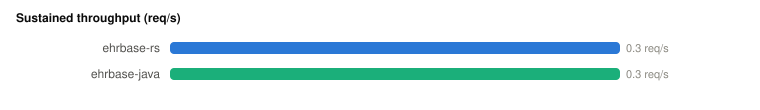
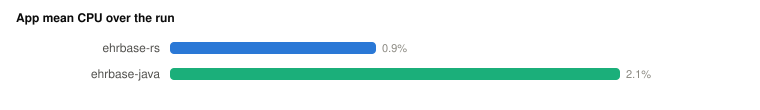
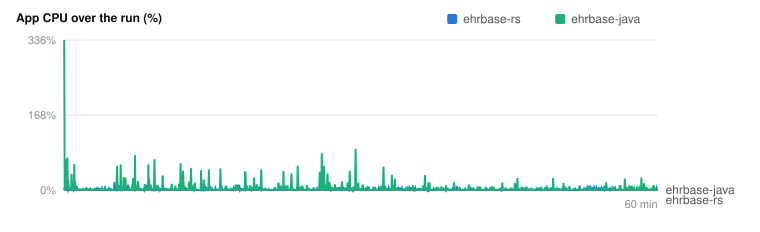
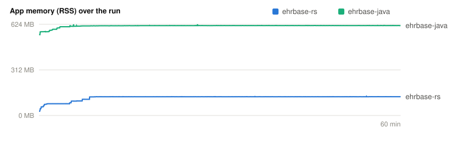
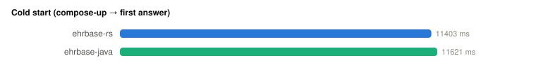
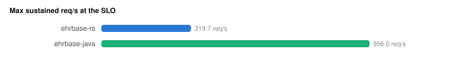
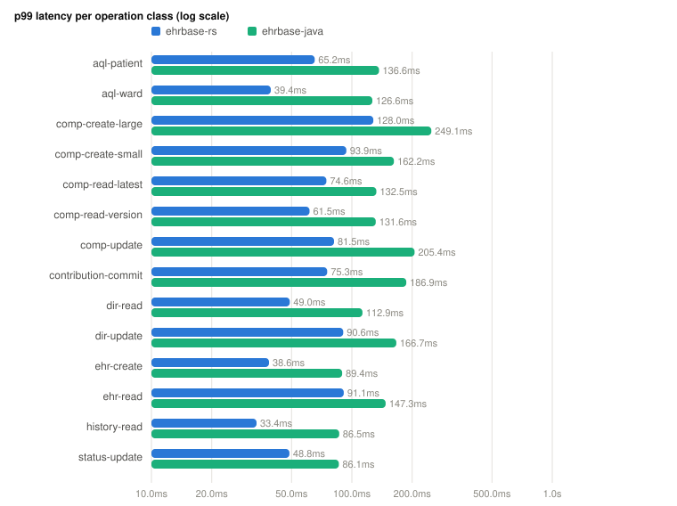
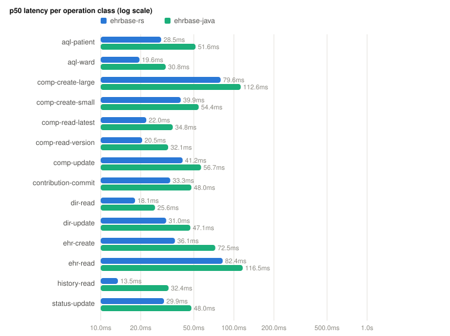

# Benchmark comparison (generated)

> **Measured, not asserted.** Every number below is read from a committed `results.json`; both directions are reported. The workload, client, and host are identical by construction (`docs/design/benchmarking.md` §3).

## Runs

| | Product | Profile | Scale | Ward | Requests | req/s | Error rate |
|---|---|---|---|--:|--:|--:|--:|
| **ehrbase-rs** | ehrbase-rs 3.0.0 | hour | 10k | 20 | 1209 | 0.3 | 0.000% |
| **ehrbase-java** | EHRbase upstream | hour | 10k | 20 | 1209 | 0.3 | 0.000% |

## Throughput

## Resources — app container

## Cold start

## Efficiency (computed)

| | req/s per CPU-core | req/s per GB peak RSS |
|---|--:|--:|
| **ehrbase-rs** | 36.9 | 1.8 |
| **ehrbase-java** | 19.3 | 0.6 |

## Maximum sustained throughput (knee)

> The last sustainable step on the load-factor ladder (p99 ≤ 1 s, error ≤ 0.1%), per SUT — the honest capacity signal, not peak req/s. Each SUT's own `KNEE.md` carries the full ladder and the single-run/same-host lower-bound caveat.

| | Knee L | Sustained req/s | p99 at knee (µs) |
|---|--:|--:|--:|
| **ehrbase-rs** | 16 | 161.4 | 33951 |
| **ehrbase-java** | 64 | 643.0 | 46783 |

## Latency — p99 per operation class

## Latency — p50 per operation class

## Per-class detail (µs)

| Class | ehrbase-rs p50 | ehrbase-java p50 | ehrbase-rs p90 | ehrbase-java p90 | ehrbase-rs p99 | ehrbase-java p99 | ehrbase-rs p99.9 | ehrbase-java p99.9 | ehrbase-rs max | ehrbase-java max | ehrbase-rs err | ehrbase-java err | p99 gap |
|---|--:|--:|--:|--:|--:|--:|--:|--:|--:|--:|--:|--:|---|
| aql-patient | 39103 | 32351 | 57503 | 74559 | 66751 | 104511 | 69951 | 295935 | 69951 | 295935 | 0 | 0 | 1.6× |
| aql-ward | 50303 | 26207 | 70143 | 76031 | 78399 | 103935 | 78399 | 103935 | 78399 | 103935 | 0 | 0 | 1.3× |
| comp-create-large | 81279 | 54527 | 142591 | 86911 | 142591 | 86911 | 142591 | 86911 | 142591 | 86911 | 0 | 0 | 1.6× |
| comp-create-small | 38303 | 30287 | 69247 | 88127 | 95615 | 105983 | 135167 | 110015 | 135167 | 110015 | 0 | 0 | 1.1× |
| comp-read-latest | 25439 | 22463 | 42591 | 60287 | 59167 | 89279 | 64063 | 104895 | 64063 | 104895 | 0 | 0 | 1.5× |
| comp-read-version | 26207 | 19119 | 40991 | 58335 | 58079 | 88255 | 59295 | 107711 | 59295 | 107711 | 0 | 0 | 1.5× |
| comp-update | 44831 | 39039 | 72383 | 78399 | 79359 | 110719 | 79359 | 110719 | 79359 | 110719 | 0 | 0 | 1.4× |
| contribution-commit | 37535 | 41311 | 75903 | 66623 | 90175 | 138239 | 90175 | 138239 | 90175 | 138239 | 0 | 0 | 1.5× |
| dir-read | 26927 | 22671 | 46495 | 57887 | 65727 | 116927 | 65727 | 116927 | 65727 | 116927 | 0 | 0 | 1.8× |
| dir-update | 37151 | 43551 | 131327 | 103423 | 131327 | 103423 | 131327 | 103423 | 131327 | 103423 | 0 | 0 | 1.3× |
| ehr-create | 58367 | 25663 | 61375 | 33919 | 61375 | 33919 | 61375 | 33919 | 61375 | 33919 | 0 | 0 | 1.8× |
| ehr-read | 127231 | 63135 | 129983 | 65727 | 129983 | 65727 | 129983 | 65727 | 129983 | 65727 | 0 | 0 | 2.0× |
| history-read | 22143 | 31967 | 44927 | 59167 | 48703 | 71167 | 48703 | 71167 | 48703 | 71167 | 0 | 0 | 1.5× |
| status-update | 54975 | 57023 | 80255 | 57247 | 80255 | 57247 | 80255 | 57247 | 80255 | 57247 | 0 | 0 | 1.4× |

## Resources

| | Idle RSS | Peak RSS | Mean CPU | Cold start | Storage bytes/composition |
|---|--:|--:|--:|--:|--:|
| **ehrbase-rs** | 47 MB | 188 MB | 0.9% | 11403 ms | 28232 |
| **ehrbase-java** | 515 MB | 606 MB | 1.7% | 11621 ms | 33482 |

## Where ehrbase-rs wins (p99, computed)

- `aql-patient`: 66751 µs vs 104511 µs
- `aql-ward`: 78399 µs vs 103935 µs
- `comp-create-small`: 95615 µs vs 105983 µs
- `comp-read-latest`: 59167 µs vs 89279 µs
- `comp-read-version`: 58079 µs vs 88255 µs
- `comp-update`: 79359 µs vs 110719 µs
- `contribution-commit`: 90175 µs vs 138239 µs
- `dir-read`: 65727 µs vs 116927 µs
- `history-read`: 48703 µs vs 71167 µs

## Where ehrbase-java wins (p99, computed)

- `comp-create-large`: 86911 µs vs 142591 µs
- `dir-update`: 103423 µs vs 131327 µs
- `ehr-create`: 33919 µs vs 61375 µs
- `ehr-read`: 65727 µs vs 129983 µs
- `status-update`: 57247 µs vs 80255 µs

## Limitations

Single run per SUT (no inter-run variance yet — the ≥5-run protocol is the publication step); same host, sequential execution; see each run's own `REPORT.md` §Limitations for sampler availability.
