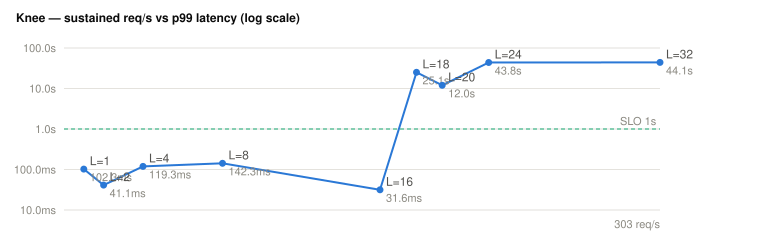

# Maximum sustained throughput (knee) — EHRbase upstream

> Generated from `knee.json` (never hand-typed). Scale **10k**. The `hour` rate shape is driven at an ascending load-factor ladder on short fixed windows; the ladder stops at the first step past the SLO (p99 > 1 s) or the 0.1% error-rate flag. Method: `docs/design/benchmark/01-measurement.md` §3, `docs/design/benchmarking.md` §2.2.

**No sustainable step:** even the first ladder step breached the SLO. The knee is below the smallest offered load factor.

## Ladder

| L | req/s | error rate | p99 (µs) | requests | dispatch lag (ms) | verdict |
|--:|--:|--:|--:|--:|--:|---|
| 2 | 17.2 | 15.617% | 2174975 | 2064 | 23 | SLO breached |

## Limitations

- **Single run per step** (no inter-run variance): the ≥5-run protocol (benchmarking.md §4.4) is the publication step; these numbers are indicative, not certified.
- **Same-host load generator:** the generator competes for CPU with the SUT at high load, so the measured knee is a **lower bound** on the SUT's real capacity — an isolated load generator would push it higher.
- Provisioning is re-applied idempotently at each step; scale seeding runs once before the ladder.

