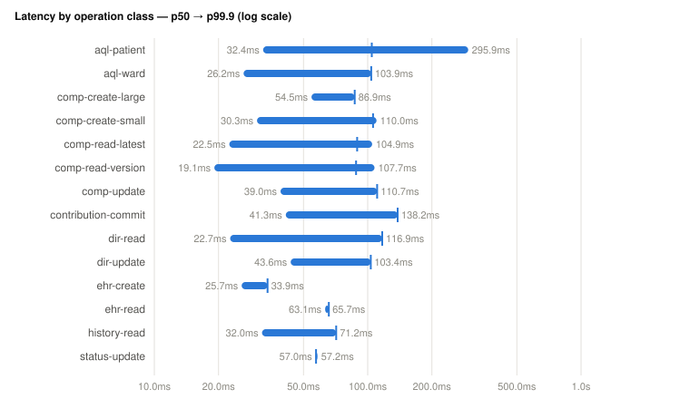
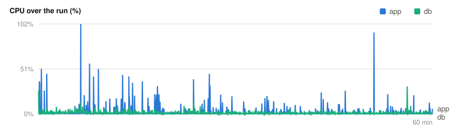
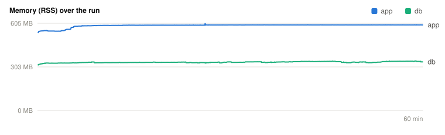

# Benchmark report — EHRbase upstream

> Generated from `results.json` (never hand-typed). Workload **smoke** · scale **10k** · ward **20** · load factor **1** · seed `2953956094`. Latencies are microseconds, coordinated-omission-corrected against planned send times. Methodology: `docs/design/benchmarking.md`; workload: `docs/design/benchmark/00-workload-model.md`.

## 1. Environment

> **Load generator:** Apple M2 (8 logical CPUs, 16384 MiB RAM) · Darwin 26.5.1 · arm64

| Field | Value |
|---|---|
| SUT | EHRbase upstream (foreign) |
| Base URL | http://localhost:8091/ehrbase/rest/openehr/v1 |
| Run start | 2026-07-13T19:57:02.600916Z |
| Load-gen host | 8 logical CPUs, 16384 MiB RAM |
| Harness rev | 3ddc598c2 |
| Workload lock | `afa48bd156dc31d9e22d9ac8e4a7f9425f717480b04c28d746d28ae9a9fbec26` |

> A report with a different load-generator line is not directly comparable.

## 2. Latency — per operation class

p50 / p90 / p99 / p99.9 / max latency (µs) and error count per class. Raw HdrHistograms are exported to `histograms/<class>.hdr.b64`.

| Class | count | errors | p50 | p90 | p99 | p99.9 | max |
|---|--:|--:|--:|--:|--:|--:|--:|
| ehr-create | 2 | 0 | 15703 | 43871 | 43871 | 43871 | 43871 |
| ehr-read | 2 | 0 | 63551 | 67391 | 67391 | 67391 | 67391 |
| comp-create-small | 90 | 0 | 27279 | 45567 | 98879 | 98879 | 98879 |
| comp-create-large | 4 | 0 | 48351 | 93311 | 93311 | 93311 | 93311 |
| comp-update | 28 | 0 | 34239 | 68927 | 165119 | 165119 | 165119 |
| comp-read-latest | 66 | 0 | 24127 | 41663 | 64895 | 64895 | 64895 |
| comp-read-version | 22 | 0 | 21551 | 38783 | 86975 | 86975 | 86975 |
| contribution-commit | 22 | 0 | 40511 | 78719 | 147327 | 147327 | 147327 |
| aql-patient | 22 | 0 | 42239 | 55903 | 225663 | 225663 | 225663 |
| aql-ward | 22 | 0 | 17887 | 55167 | 201087 | 201087 | 201087 |
| dir-read | 22 | 0 | 19343 | 37311 | 53279 | 53279 | 53279 |
| dir-update | 5 | 0 | 41087 | 82751 | 82751 | 82751 | 82751 |
| history-read | 22 | 0 | 24639 | 56735 | 61023 | 61023 | 61023 |
| status-update | 2 | 0 | 31775 | 84287 | 84287 | 84287 | 84287 |
| opt-upload | 0 | 0 | 0 | 0 | 0 | 0 | 0 |
| tpl-list | 0 | 0 | 0 | 0 | 0 | 0 | 0 |







## 3. Throughput

Sustained **2.8 req/s** over a 120 s window (331 measured requests, error rate 0.000%). The knee/saturation series (register 01 §3) is the multi-run publication step.

## 4. Resource efficiency

| Container | mean CPU | peak RSS | idle RSS |
|---|--:|--:|--:|
| benchmark-ehrbase-java-1 | 16.3% | 592.9 MiB | 531.5 MiB |
| benchmark-ehrbase-java-db-1 | 3.6% | 197.9 MiB | 184.5 MiB |

- **16.9 req/s per app CPU-core** (2.8 req/s ÷ 0.16 cores).
- **4.4 req/s per GB peak app RSS** (2.8 req/s ÷ 0.622 GB).

## 5. Storage footprint

Database on-disk size **319.1 MiB** over **10000** compositions = **32.7 KiB/composition** (`pg_total_relation_size` over tables/indexes/TOAST/matviews).

## 6. Cold start

Compose-up → first successful HTTP answer: **11827 ms** (11.8 s).

## 7. Limitations

- Templates excluded for this SUT: none (all provisioning uploads accepted).
- No sampler gaps: latency, throughput, resources, storage, and cold start were all captured.
- Single-host, single-run figures. Publication requires ≥5 runs + coefficient of variation (benchmarking.md §4.4) and a config-parity table (§3.4) for any cross-SUT claim.

## 8. Reproduce it

```bash
cargo run -q -p benchmark --bin bench -- run --sut ehrbase-java --base-url http://localhost:8091/ehrbase/rest/openehr/v1 --profile smoke --scale 10k --ward-size 20 --load-factor 1 --seed 2953956094
```
