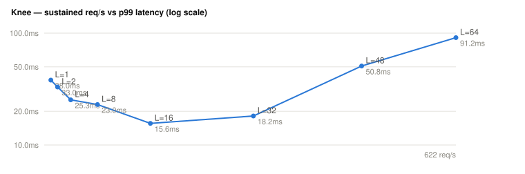

# Maximum sustained throughput (knee) — ehrbase-rs 3.0.3

> Generated from `knee.json` (never hand-typed). Scale **10k**. The `hour` rate shape is driven at an ascending load-factor ladder on short fixed windows; the ladder stops at the first step past the SLO (p99 > 1 s) or the 0.1% error-rate flag. Method: `docs/design/benchmark/01-measurement.md` §3, `docs/design/benchmarking.md` §2.2.

**Knee: L = 56 → 553.4 req/s (33202 req/min) at p99 132479 µs** (the last sustainable step; SLO p99 ≤ 1 s, error ≤ 0.1%) — sustaining 13706.5 clinical events/min.

## Ladder

| L | req/s | error rate | p99 (µs) | requests | dispatch lag (ms) | verdict |
|--:|--:|--:|--:|--:|--:|---|
| 1 | 10.1 | 0.000% | 60383 | 1209 | 7 | sustained |
| 2 | 20.1 | 0.000% | 39199 | 2416 | 11 | sustained |
| 4 | 40.1 | 0.000% | 31551 | 4817 | 12 | sustained |
| 8 | 80.5 | 0.000% | 26303 | 9663 | 9 | sustained |
| 16 | 160.5 | 0.005% | 17231 | 19263 | 9 | sustained |
| 32 | 316.2 | 0.008% | 20031 | 37940 | 16 | sustained |
| 48 | 475.2 | 0.025% | 256639 | 57020 | 51 | sustained |
| 56 | 553.4 | 0.027% | 132479 | 66404 | 9 | sustained |
| 60 | 569.2 | 3.824% | 27246591 | 68307 | 9 | SLO breached |
| 64 | 630.6 | 0.177% | 7770111 | 75669 | 7 | SLO breached |

## Limitations

- **Single run per step** (no inter-run variance): the ≥5-run protocol (benchmarking.md §4.4) is the publication step; these numbers are indicative, not certified.
- **Same-host load generator:** the generator competes for CPU with the SUT at high load, so the measured knee is a **lower bound** on the SUT's real capacity — an isolated load generator would push it higher.
- Provisioning is re-applied idempotently at each step; scale seeding runs once before the ladder.

