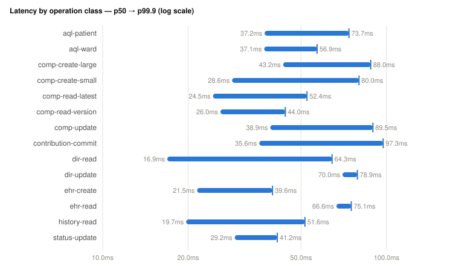
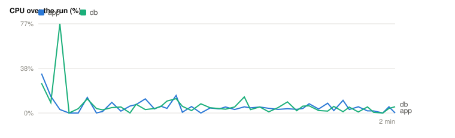
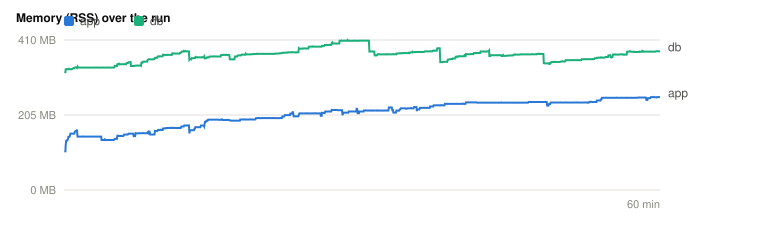

# Benchmark report — ehrbase-rs 3.0.0

> Generated from `results.json` (never hand-typed). Workload **smoke** · scale **10k** · ward **20** · load factor **1** · seed `2953956094`. Latencies are microseconds, coordinated-omission-corrected against planned send times. Methodology: `docs/design/benchmarking.md`; workload: `docs/design/benchmark/00-workload-model.md`.

## 1. Environment

> **Load generator:** Apple M2 (8 logical CPUs, 16384 MiB RAM) · Darwin 26.5.1 · arm64

| Field | Value |
|---|---|
| SUT | ehrbase-rs 3.0.0 (ours) |
| Base URL | http://localhost:8080/ehrbase/rest/openehr/v1 |
| Run start | 2026-07-13T19:40:51.401599Z |
| Load-gen host | 8 logical CPUs, 16384 MiB RAM |
| Harness rev | 327554d09 |
| Workload lock | `afa48bd156dc31d9e22d9ac8e4a7f9425f717480b04c28d746d28ae9a9fbec26` |

> A report with a different load-generator line is not directly comparable.

## 2. Latency — per operation class

p50 / p90 / p99 / p99.9 / max latency (µs) and error count per class. Raw HdrHistograms are exported to `histograms/<class>.hdr.b64`.

| Class | count | errors | p50 | p90 | p99 | p99.9 | max |
|---|--:|--:|--:|--:|--:|--:|--:|
| ehr-create | 2 | 0 | 21775 | 46943 | 46943 | 46943 | 46943 |
| ehr-read | 2 | 0 | 64831 | 72767 | 72767 | 72767 | 72767 |
| comp-create-small | 90 | 0 | 32191 | 54559 | 78655 | 78655 | 78655 |
| comp-create-large | 4 | 0 | 50559 | 87615 | 87615 | 87615 | 87615 |
| comp-update | 28 | 0 | 45055 | 79103 | 80959 | 80959 | 80959 |
| comp-read-latest | 66 | 0 | 26095 | 37887 | 47935 | 47935 | 47935 |
| comp-read-version | 22 | 0 | 25471 | 37855 | 47583 | 47583 | 47583 |
| contribution-commit | 22 | 0 | 34495 | 45087 | 63903 | 63903 | 63903 |
| aql-patient | 22 | 0 | 37535 | 52031 | 58143 | 58143 | 58143 |
| aql-ward | 22 | 0 | 32159 | 56799 | 72959 | 72959 | 72959 |
| dir-read | 22 | 0 | 21247 | 31791 | 33279 | 33279 | 33279 |
| dir-update | 5 | 0 | 45983 | 75839 | 75839 | 75839 | 75839 |
| history-read | 22 | 0 | 26815 | 34463 | 35295 | 35295 | 35295 |
| status-update | 2 | 0 | 41119 | 49727 | 49727 | 49727 | 49727 |
| opt-upload | 0 | 0 | 0 | 0 | 0 | 0 | 0 |
| tpl-list | 0 | 0 | 0 | 0 | 0 | 0 | 0 |







## 3. Throughput

Sustained **2.8 req/s** over a 120 s window (331 measured requests, error rate 0.000%). The knee/saturation series (register 01 §3) is the multi-run publication step.

## 4. Resource efficiency

| Container | mean CPU | peak RSS | idle RSS |
|---|--:|--:|--:|
| ehrbase-rs-ehrbase-1 | 5.5% | 121.6 MiB | 54.0 MiB |
| ehrbase-rs-ehrbase-postgres-1 | 4.5% | 284.3 MiB | 197.7 MiB |

- **50.3 req/s per app CPU-core** (2.8 req/s ÷ 0.05 cores).
- **21.6 req/s per GB peak app RSS** (2.8 req/s ÷ 0.128 GB).

## 5. Storage footprint

Database on-disk size **268.9 MiB** over **10000** compositions = **27.5 KiB/composition** (`pg_total_relation_size` over tables/indexes/TOAST/matviews).

## 6. Cold start

Compose-up → first successful HTTP answer: **11531 ms** (11.5 s).

## 7. Limitations

- Templates excluded for this SUT: none (all provisioning uploads accepted).
- No sampler gaps: latency, throughput, resources, storage, and cold start were all captured.
- Single-host, single-run figures. Publication requires ≥5 runs + coefficient of variation (benchmarking.md §4.4) and a config-parity table (§3.4) for any cross-SUT claim.

## 8. Reproduce it

```bash
cargo run -q -p benchmark --bin bench -- run --sut ehrbase-rs --base-url http://localhost:8080/ehrbase/rest/openehr/v1 --profile smoke --scale 10k --ward-size 20 --load-factor 1 --seed 2953956094
```
