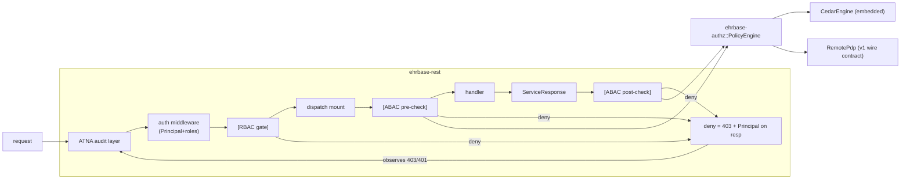

# RBAC + ABAC Access Control — Rust-native design

> **AMENDMENT (2026-07-09, ADR-011 crate consolidation):** the former leaf crate
> `ehrbase-authz` has been dissolved into the **`ehrbase-rest::access`** module
> (authorization is a protocol-adapter concern — it classifies ITS-REST
> operations and enforces at the request boundary, so it lives with the wire
> layer, not in the platform crate). All references below to the `ehrbase-authz`
> *crate* / `ehrbase_authz::*` now read as the `ehrbase-rest::access` *module* /
> `ehrbase_rest::access::*`; its source moved to `app/ehrbase-rest/src/access/`.
> The `PolicyEngine`, classification table, request model, and total-coverage
> guard are unchanged in behaviour.

- **Status:** implemented (RBAC+ABAC) (2026-07-07)
- **Stage:** Stage 2 capability, owner-prioritized into Stage 1 (same route as the
  ATNA audit trail — an enterprise capability pulled forward)
- **Owner:** —
- **Prior art (not a port target):** EHRbase v1 (`reference/v1` = v0.32.0) ABAC
  (`application/.../abac/*`) + the v1/v2 Spring Security RBAC config. The exact
  v1 semantics were extracted from the git ref on 2026-07-07 and are summarized
  in §2/§3 below; we replicate the *behaviour and the external wire contract*,
  fix its documented defects, and implement natively (ADR-006/008 discipline:
  prior art, not an oracle).
- **Related docs:** `docs/design/atna-audit.md` (the integration pattern this
  design copies: leaf crate + tower/dispatch hook + data-driven table +
  total-coverage guard); the pre-v2 enterprise archaeology lives in the
  read-only `reference/v1` git ref (v0.32.0).
- **Out of scope here:** multi-tenancy (its own Stage 2 design; the tenant
  attribute slot in §5.3 is reserved for it), openEHR `EHR_ACCESS`-driven
  policies (v1 never enforced them either; see §10), demographic-API policies
  beyond the coarse RBAC gate.

---

## 1. Goals and shape

Two independent, composable layers:

1. **RBAC (coarse, always on when auth is enabled).** Every generated ITS-REST
   operation is classified (Admin / Management / Clinical / Public) in a static,
   total-coverage-guarded table; a role model (default `USER`/`ADMIN`, extracted
   from JWT claims or Basic-auth config) gates each class. This replaces today's
   placeholder path-string check (`Authenticator::authorize_admin`,
   `app/ehrbase-rest/src/auth/mod.rs:161-173`, marked
   `// TODO(port): Stage 2 RBAC`).
2. **ABAC (fine-grained, opt-in `authz.abac.enabled`).** A policy decision point
   (PDP) is consulted per clinical operation with resolved attributes
   (organization, patient, template). Two interchangeable PDP engines behind one
   trait:
   - **Embedded Cedar** (`cedar-policy` 4.x) — the default; policies live in
     files, no external service needed.
   - **Remote PDP** — byte-compatible with the EHRbase v1 external
     policy-server contract (§2), for deployments that already run one.

Non-goals: row-level security in Postgres, per-node filtering, policy
administration UI.

### 1.1 Why Cedar over casbin (decision record)

Both are already pinned in the workspace (`casbin = "2"`, `cedar-policy = "4"`,
root `Cargo.toml` — the ADR-006 "decide at S2" candidates). Decision: **Cedar**,
verified 2026-07-07 (cedar-policy 4.11.2, updated 2026-06; casbin 2.20.0,
updated 2026-02).

- Cedar has a **typed schema**: principals/actions/resources are declared, and
  policies are validated against the schema at load time — a healthcare CDR
  wants "this policy references a resource attribute that doesn't exist" to be
  a boot-time error, not a silent always-deny.
- One language expresses **both RBAC and ABAC** (role membership = principal
  groups; attribute conditions = `when` clauses), so advanced deployments can
  push the coarse layer into policies later without a second engine.
- The evaluator is small, formally modeled, and **deny-by-default with forbid
  overriding permit** — the right defaults for clinical data.
- casbin's model is stringly-typed tuples + a matcher DSL in config; it is
  runtime-flexible but unverifiable, and its Rust port trails the Go original.

The `PolicyEngine` trait (§5.4) keeps this swappable; if a deployment demands
casbin, it is one new impl, not a redesign. Record this as an ADR
(`/write-adr "Cedar as the embedded authorization engine"`) when
implementation starts; this section is the content.

---

## 2. Prior art: exact EHRbase v1 semantics (extracted from `reference/v1`)

What v1 actually did — the parity baseline. (Full extraction in the 2026-07-07
investigation; verbatim quotes from `application/.../abac/AbacConfig.java` and
`CustomMethodSecurityExpressionRoot.java`.)

### 2.1 The external-PDP wire contract (we keep this, byte-compatible)

- **Request:** `POST {abac.server}{policy-name}` — the policy name is appended
  as a path segment to the configured base URL (which ends in a slash, e.g.
  `http://pdp:3001/rest/v1/policy/execute/name/` + `has_consent_template`).
  Body: a **flat JSON object** with only the configured/resolved parameters,
  keys exactly `"organization"`, `"patient"`, `"template"`. Header
  `Content-Type: application/json`. No auth forwarded.
- **Response:** HTTP **200 = permit**; any other status = deny. The response
  body is ignored entirely.
- **Errors are fail-closed:** connection/IO failure → HTTP 500 to the caller
  (request not served). Deny → 403. There is no fail-open mode; we keep that.
- **Multi-valued fan-out:** when patient and/or template resolve to *sets*
  (query, contribution), v1 sends **one POST per combination** (full cartesian
  product) and requires **all** to return 200; the first non-200 denies.

### 2.2 Attribute resolution (v1)

- `organization` ← JWT claim named by `abac.organizationClaim` (default
  `organization_id`). Configured-but-missing claim → error (500).
- `patient` ← JWT claim named by `abac.patientClaim` (default `patient_id`).
  **Local gate before any PDP call:** for non-query resources the claim must
  equal the target EHR's subject external-ref id (`getSubjectExtRef(ehr_id)`),
  except a subject-less EHR (`null`) passes. Mismatch → immediate deny (403),
  no PDP call. For queries, *every* EHR id in the result set must map to a
  subject external ref equal to the claim (logical AND) or deny.
- `template` ← per resource type: composition create/update → parse the request
  body's `archetype_details/template_id/value`; composition delete → retrieve
  the preceding version and read its template id; composition read (post) →
  from the response body; contribution → the set of template ids across all
  versions in the payload; query → the set of template ids in the result. EHR
  and EHR_STATUS policies configuring `template` → hard error.
- ABAC required JWT auth (Basic → "no JWT available" error).

### 2.3 Enforcement coverage (v1) and its defects

Pre-checks (`@PreAuthorize`): composition create/update/delete, contribution
create, EHR get (by id + by subject), EHR_STATUS get/get-by-version/update,
versioned-EHR_STATUS reads. Post-checks (`@PostAuthorize`): composition get,
versioned-composition reads, **all query execution** (attributes read from the
executed result set).

Defects we deliberately fix (each a `// PORT NOTE:` in code):

1. **The query result-set hack.** v1 extracted patient/template for query
   post-checks from the *SELECT columns* — the check only worked if the AQL
   happened to select `ehr_id/value` / `archetype_details/template_id/value`,
   otherwise **500**. We own the AQL engine: the executor knows the touched VO
   roots regardless of the projection (§6.4). No dependency on what the query
   selects.
2. **Method security coupled to the ABAC flag.** v1's service-layer
   `hasRole('ADMIN')` checks were only active when `abac.enabled=true`
   (the `@EnableGlobalMethodSecurity` bean was conditional on it). Our RBAC
   layer is unconditional.
3. **Coverage gaps.** v1 never checked EHR create, DIRECTORY/FOLDER, or
   DEFINITION ops. Our classification table covers **every** generated
   operation (total-coverage guard); ABAC adds a `DIRECTORY` resource family
   (new, marked as an extension over v1).
4. **No timeouts on the PDP client.** Ours has explicit connect/request
   timeouts (fail-closed on expiry).

### 2.4 RBAC (v1/v2, retained behaviour)

- Roles `USER` / `ADMIN`. Basic auth: two configured users, one role each.
  OAuth: authorities from `realm_access.roles` (Keycloak) **and** the
  space-separated `scope` claim, upper-cased; the role names to match are
  configurable (`oauth2UserRole`/`oauth2AdminRole`, default USER/ADMIN).
- URL rules: `/rest/admin/**` and management endpoints → ADMIN; management
  access is tri-state (`ADMIN_ONLY` | `PRIVATE` | `PUBLIC`); everything else →
  any authenticated user.

---

## 3. Current-code integration map (verified 2026-07-07)

The seams this design binds to, as the code stands today:

| Fact | Where |
|---|---|
| `Principal { subject, scopes, method }` — **no roles/claims retained** | `app/ehrbase-rest/src/auth/mod.rs:26-42`; JWT reduction in `auth/jwt.rs` |
| Principal inserted into request extensions + `REQUEST_PRINCIPAL` task-local + republished on the response | `auth/mod.rs:198-251` (`middleware`), `current_principal()` at `:191` |
| Placeholder admin gate (path-segment == "admin" + one scope) | `auth/mod.rs:161-178` — **replaced by this design** |
| Generated routes: `(&str method, &str path-template, &str operation_id)` per API group; ~96 ops | `crates/openehr-its/src/rest/generated/{ehr,query,definition,admin,demographic}.rs` (`ROUTES`) |
| Generic dispatch choke point — has `op` id + resolved path params (`RequestParts.path: IndexMap`) + `AppState`; already inserts `AuditOpId(op)` | `app/ehrbase-rest/src/dispatch/mod.rs:100-141` (`mount`) |
| `Backend` seam (`EhrService + DefinitionApi + WebTemplateService + QueryService`) on `AppState` | `app/ehrbase-rest/src/backend.rs:485-507`, `state.rs:33` |
| EHR subject lookup: promoted `ehr.subject_id`/`subject_namespace` columns; forward resolver precedent (`SubjectResolver` closure, binary-owned) | `app/ehrbase/src/service/ehr.rs:77-93`; `app/ehrbase/src/main.rs:197-213` |
| `vo_version.template_id` **stored but not read back** (`VersionRead` lacks it) | written at `service/vobject.rs:449,459`; `VersionRead` at `:88-105`; reads at `:594-632` |
| AQL EHR scoping: `SqlCtx { ehr_id: Option<Uuid>, .. }` → `WHERE vo.ehr_id = $x` on every VO root | `app/ehrbase/src/aql/sql.rs:63-67, 383-388`; `service/aql_query.rs:76-81` |
| ATNA audit layer sits **outside** auth; any inner 403 with `Principal` on the response extensions is audited automatically | `app/ehrbase-rest/src/audit.rs:98-115`; convention at `auth/mod.rs:218-220` |
| Config precedent: standalone `AuditConfig` (`EHRBASE_ATNA_*`), loaded in `main.rs:83`, threaded as `Option<AuditSender>` | `app/ehrbase-audit/src/config.rs`, `main.rs:175-192` |
| `casbin = "2"` + `cedar-policy = "4"` pinned, unconsumed | root `Cargo.toml:80-81` |

---

## 4. Architecture overview



- **RBAC gate** runs inside the auth middleware (it already has the Principal
  and runs before dispatch), using the operation classification resolved from
  the request path via axum's `MatchedPath` + a route-template → op-id map
  built once from the generated `ROUTES` tables.
- **ABAC pre-checks** run in the generic `mount` closure — the one place with
  the machine-readable `operation_id`, the resolved path params, and
  `AppState` — before `dispatch()` is called. No per-operation code.
- **ABAC post-checks** (composition reads, query) run after the backend call,
  where the `ServiceResponse`/`ResourceMeta`/result set is available.
- Every deny is a 403 carrying the `Principal` on the response extensions —
  the ATNA layer audits it with zero new audit code.

### 4.1 Crate layout

New workspace crate **`app/ehrbase-authz`** (application layer, hand-written,
`thiserror`; leaf like `ehrbase-audit` — no `ehrbase-*` deps):

```
app/ehrbase-authz/src/
├── lib.rs
├── config.rs      # AuthzConfig (figment-compatible serde; EHRBASE_AUTHZ_*)
├── roles.rs       # Role model + extraction rules (claim paths → roles)
├── classify.rs    # operation_id → OperationClass table (total-coverage-guarded)
├── request.rs     # AuthzRequest / Decision / ResourceKind / Attribute types
├── engine.rs      # PolicyEngine trait (the PDP seam)
├── cedar.rs       # CedarEngine: schema, entity building, policy loading
└── remote.rs      # RemotePdp: the v1-compatible HTTP client (reqwest)
```

Dependencies: `cedar-policy` (workspace), `reqwest` (workspace, rustls),
`serde`/`serde_json`, `thiserror`, `tracing`, `metrics`, `figment` (config),
`indexmap`. Dev-deps: `wiremock`, `insta`, `openehr-its` (path dep, **dev-only**,
for the total-coverage guard over `ROUTES` — same trick as `ehrbase-audit`).

`ehrbase-rest` gains: the extended `Principal`, the RBAC gate, the ABAC PEP in
dispatch, and an `Option<Arc<AuthzHandle>>` on `AppState` beside `audit`
(`state.rs:31-39`). `ehrbase` (binary) gains: `AuthzConfig::load()`, engine
construction, and the attribute resolvers (DB lookups stay in the binary, like
the audit `SubjectResolver`). Dependency arrows stay downward:
`ehrbase-rest → ehrbase-authz`, `ehrbase → ehrbase-authz`.

---

## 5. The pieces, precisely

### 5.1 Principal extension (prerequisite)

`app/ehrbase-rest/src/auth/mod.rs`:

```rust
pub struct Principal {
    pub subject: String,
    pub scopes: Vec<String>,
    pub roles: Vec<String>,                       // NEW — normalized, upper-cased
    pub claims: serde_json::Map<String, Value>,   // NEW — retained JWT claims (Bearer only; empty for Basic)
    pub method: AuthMethod,
}
```

- `auth/jwt.rs`: retain the validated claim set; extract roles from (a)
  `realm_access.roles` (Keycloak array) and (b) the space-separated `scope`
  claim — both upper-cased — matching v1's converter; the claim paths are
  configurable (`authz.rbac.role_claims`, default `["realm_access.roles",
  "scope"]`). Scopes stay as-is (they already feed the old admin gate; keep
  populating them for back-compat).
- `auth/basic.rs` + `AuthConfig`: each configured Basic user gains a
  `roles: Vec<String>` (defaults: the existing user → `["USER"]`, admin user →
  `["ADMIN"]`, preserving current behaviour).
- Claims retention is what makes ABAC work under Bearer; ABAC under Basic is
  rejected exactly as v1 did (typed error → 403 with a clear body, not 500).

### 5.2 RBAC: operation classification + role gate

`ehrbase-authz::classify`:

```rust
pub enum OperationClass { Public, Clinical, Management, Admin }
pub fn class_of(operation_id: &str) -> Option<OperationClass>  // static table
```

- Data-driven table keyed by the generated operation ids (all ~96), plus the
  non-generated surface (status/health/swagger/management) classified by route.
  **Total-coverage guard:** a dev-test walks every op id in every generated
  `ROUTES` table and asserts it is classified — a new generated operation fails
  the build until classified (identical pattern to
  `ehrbase-audit/src/table.rs` §8.3 of the ATNA doc).
- Gate rules (evaluated in the auth middleware, unconditionally — fixing v1
  defect #2):
  - `Admin` (the `admin_*` ops) → requires `authz.rbac.admin_role` (default `ADMIN`).
  - `Management` → tri-state `authz.rbac.management_access`:
    `admin_only` (default) | `private` (any authenticated) | `public`.
  - `Clinical` → any authenticated principal (`USER` or `ADMIN` — i.e. at
    least one configured role; principals with zero roles are denied when
    RBAC is enabled).
  - `Public` → no check (root/status/health per current router).
- Deny → 403 + `Principal` on the response extensions (ATNA picks it up).
- `authz.rbac.enabled` defaults to `true` whenever auth is enabled; disabling
  restores today's behaviour (auth only + the legacy admin path gate removed).
- The old `authorize_admin`/`is_admin_path`/`admin_scope` path hack is deleted;
  config keeps accepting `admin_scope` as a deprecated alias that maps to a
  role grant (a scope named X already surfaces as role X via the scope→role
  extraction, so migration is automatic).

### 5.3 ABAC: the authorization request

`ehrbase-authz::request`:

```rust
pub enum ResourceKind { Ehr, EhrStatus, Composition, Contribution, Query, Directory }

pub struct AuthzRequest<'a> {
    pub operation_id: &'a str,          // the generated op id (the "action")
    pub kind: ResourceKind,
    pub ehr_id: Option<Uuid>,
    pub organization: Option<String>,   // resolved JWT claim
    pub patient: Option<Patients>,      // String or Set (query)
    pub template: Option<Templates>,    // String or Set (contribution/query)
    // reserved: tenant (multi-tenancy design will occupy this slot)
}

pub enum Decision { Permit, Deny }
```

`ResourceKind` is derived from the operation-id prefix (`ehr_*`,
`ehr_status_*`/`versioned_ehr_status_*`, `composition_*`/`versioned_composition_*`,
`contribution_*`, `query_execute_*`, `directory_*`) — one function beside
`classify`, covered by the same guard. `Directory` is our extension (v1 defect
#3); its default policy config is absent = unchecked, preserving v1 parity
unless the operator opts in.

### 5.4 The PDP seam

`ehrbase-authz::engine`:

```rust
#[async_trait]
pub trait PolicyEngine: Send + Sync + std::fmt::Debug {
    async fn decide(&self, req: &AuthzRequest<'_>) -> Result<Decision, AuthzError>;
}
```

- `AuthzError` (engine unreachable, policy load failure, malformed attributes)
  is **fail-closed**: the PEP maps it to 500 (v1 parity), never Permit.
- Multi-valued attributes: the **engine** owns fan-out semantics. `RemotePdp`
  implements v1's cartesian product (one POST per combination, all must
  permit, short-circuit deny). `CedarEngine` evaluates one query per
  combination against the in-memory policy set (cheap) with the same
  all-must-permit rule, so both engines are behaviourally identical.

### 5.5 `RemotePdp` (v1 wire contract, byte-compatible)

- `reqwest` (workspace, rustls) client with explicit timeouts
  (`authz.abac.remote.connect_timeout_ms` default 2000,
  `request_timeout_ms` default 5000 — v1 defect #4 fixed).
- URL = `server` (must end with `/`, validated at boot) + the configured
  policy name for the resource kind. Body = flat JSON with only the resolved
  keys `organization` / `patient` / `template`. Permit iff status 200.
- Per-kind policy config mirrors v1:
  `authz.abac.policy.{ehr,ehr_status,composition,contribution,query,directory}`
  each `{ name, parameters: [organization|patient|template] }`. Configuring
  `template` for `ehr`/`ehr_status` is a boot-time config error (v1 made it a
  runtime 500).

### 5.6 `CedarEngine` (embedded, default)

- **Schema** (shipped, `cedar-policy` validated at load):
  - Principal `User` with attrs `organization?: String`, `patient?: String`,
    `roles: Set<String>`, `scopes: Set<String>`.
  - Actions: one Cedar action per `ResourceKind` × access mode
    (`"composition.create"`, `"composition.read"`, `"query.execute"`, …),
    derived from the op classification — *not* 96 raw op ids; op ids map onto
    these action names in `cedar.rs` (table beside `classify`, guarded by the
    same coverage test).
  - Resources: `Ehr { subject?: String }`, `Composition { template: String,
    subject?: String }`, `Query { }` (the per-combination evaluation puts the
    candidate patient/template on the resource), `Directory { subject?: String }`.
- **Policies** from `authz.abac.cedar.policy_dir` (`*.cedar` files), parsed +
  schema-validated at boot; invalid policy set → refuse to start (fail-closed
  at the earliest possible moment). Optional periodic reload
  (`authz.abac.cedar.reload_secs`, default off) with swap-on-valid semantics
  (`arc-swap`).
- Deny-by-default; `forbid` overrides `permit` (Cedar semantics — document in
  the shipped example policies).
- Shipped examples reproducing v1's defaults (`has_consent_patient`,
  `has_consent_template`) as commented `.cedar` files under
  `app/ehrbase-authz/examples/policies/`.

### 5.7 The patient gate (local, before any engine call)

v1's subject-match check is **not** policy — it is a hard invariant we keep in
the PEP (both engines behind it):

- Non-query: if `authz.abac.patient_claim` is configured, resolve the target
  EHR's subject external-ref id (via the resolver, §6.1). Claim ≠ subject and
  subject non-null → **immediate 403**, no engine call. Subject null → pass
  (v1 parity; a subject-less EHR is not patient-scoped).
- Query: every distinct EHR touched by the executed result must map to a
  subject equal to the claim, else 403 (§6.4).
- Missing configured claim on the token → 403 with typed detail (v1 threw 500;
  PORT NOTE the improvement).

---

## 6. Attribute resolution (Rust-native)

DB lookups live in the **binary** as resolver closures handed to the REST
layer at boot — the audit `SubjectResolver` precedent (`main.rs:197-213`) —
packaged as one struct:

```rust
pub struct AuthzResolvers {
    /// ehr_id → EHR subject external-ref id (promoted ehr.subject_id column).
    pub subject: Arc<dyn Fn(Uuid) -> BoxFuture<'static, Result<Option<String>, E>> + Send + Sync>,
    /// composition version → template_id (vo_version.template_id).
    pub template_of_version: Arc<dyn Fn(Uuid /*vo_id*/, Option<i32>) -> … + Send + Sync>,
}
```

### 6.1 `subject` — one indexed `SELECT subject_id FROM ehr WHERE id = $1`
(the exact query the audit resolver already runs).

### 6.2 `template` for compositions — from storage, not body re-parsing

`vo_version.template_id` is already **written** on every composition commit
(`service/vobject.rs:449,459`) but not read back. Add `template_id:
Option<String>` to `VersionRead` (`vobject.rs:88-105`) and the two SELECTs
(`read_current`/`read_version`, `vobject.rs:594-632`) — a contained change that
gives every post-check and the delete pre-check the template id without
touching payload bytes (v1 re-parsed request/response bodies; we don't need
to). For composition **create/update pre-checks** the template id is read from
the incoming payload the same way validation already does
(`service/composition.rs:311-315`, JSON pointer
`/archetype_details/template_id/value`; the XML path goes through the existing
`FromXml` parse that dispatch performs anyway — resolve *after* body
deserialization inside the dispatch arm boundary, see §7.2).

### 6.3 `template` set for contributions — from the parsed contribution
payload (all versions' `archetype_details/template_id/value`), computed in the
pre-check after deserialization. Missing on any COMPOSITION version → treat as
unresolvable → 403 (fail-closed).

### 6.4 Query attributes — engine-computed, projection-independent (fixes v1 defect #1)

Two mechanisms, both in `app/ehrbase/src/aql/`:

- **Pre-execution scope (cheap, always):** when the caller is patient-scoped
  (patient claim configured), resolve the patient's EHR set is unnecessary —
  instead thread the *subject* predicate into the SQL: extend `SqlCtx`
  (`aql/sql.rs:63-67`) from `ehr_id: Option<Uuid>` to also carry
  `subject_scope: Option<String>`, adding
  `AND <vo-root>.ehr_id IN (SELECT id FROM ehr WHERE subject_id = $s)` to the
  same VO-root predicate site (`sql.rs:383-388`). Rows the caller may not see
  are never fetched. (`PERF(port)`: replace the IN-subquery with a join if
  measured hot at P20.)
- **Post-execution attribute collection (for the PDP call):** the executor
  (`aql/exec.rs:44-80`) knows each result row's VO root; collect the distinct
  `ehr_id` set and distinct `template_id` set of the touched versions during
  result assembly (both are columns on `vo_version`/the fetched rows — no
  dependency on what the query SELECTs). Surface them on the query result
  context handed back through `QueryService`, and run the ABAC post-check
  (patient gate over the EHR set + PDP fan-out over the template set) before
  the RESULT_SET is serialized. Empty result → nothing to check → permit
  (v1 behaviour: empty sets skip the fan-out loop).

The pre-execution scope makes the post-check patient gate a no-op in practice
(rows are pre-filtered), but both are kept: the post-check is the
belt-and-suspenders guarantee and the template attributes are needed for the
PDP call regardless.

---

## 7. Enforcement matrix (ours)

Pre = in dispatch `mount` before the backend call; Post = after the backend
call, before response serialization. Families map to the generated op ids via
the §5.3 prefix rules; the guard test asserts every clinical op id appears
here or in the explicit `UNCHECKED` allowlist (with a reason).

| Family (op-id prefix) | Check | Attributes | v1 parity note |
|---|---|---|---|
| `ehr_create`, `ehr_create_with_id` | **Pre** | organization, patient (claim only — no EHR exists yet) | extension (v1 unchecked) |
| `ehr_get_by_id`, `ehr_get_by_subject` | **Pre** | organization, patient (subject gate; for by-subject the request param is the subject, as v1) | parity |
| `ehr_status_*`, `versioned_ehr_status_*` | **Pre** | organization, patient | parity (template illegal) |
| `composition_create`, `composition_update` | **Pre** | organization, patient, template (from request body) | parity |
| `composition_delete` | **Pre** | organization, patient, template (from `vo_version.template_id` of the preceding version) | parity, cleaner source |
| `composition_get*` (incl. versioned reads) | **Post** | organization, patient, template (from `VersionRead.template_id`) | parity |
| `contribution_create` | **Pre** | organization, patient, template-set (from payload) | parity |
| `contribution_get` | **Post** | organization, patient | extension (v1 unchecked) |
| `query_execute_*` (ad-hoc + stored) | **Pre-scope + Post** | organization; patient/template sets engine-computed (§6.4) | parity, defect #1 fixed |
| `directory_*` | **Pre** | organization, patient | extension; unchecked unless a `directory` policy is configured |
| `definition_*`, `demographic_*`, admin, management | RBAC only | — | parity (v1 ABAC never covered these) |

Every ABAC deny and every RBAC deny: **403**, problem-details body per the
ITS-REST error shape already used by `ApiError`, `Principal` attached to the
response extensions (audited by ATNA for free). Engine failure: **500**
(fail-closed).

---

## 8. Configuration

Standalone `AuthzConfig` (the `AuditConfig` precedent): own prefix
`EHRBASE_AUTHZ_`, optional TOML via `EHRBASE_AUTHZ_CONFIG`, nested keys split
on `__`, all defaults valid, master switches.

| Key | Env | Default | Meaning |
|---|---|---|---|
| `rbac.enabled` | `EHRBASE_AUTHZ_RBAC__ENABLED` | `true` | coarse role gate (active only when auth is enabled) |
| `rbac.admin_role` | … | `ADMIN` | role required for Admin-class ops |
| `rbac.user_role` | … | `USER` | baseline clinical role |
| `rbac.role_claims` | … | `["realm_access.roles","scope"]` | JWT claim paths mined for roles |
| `rbac.management_access` | … | `admin_only` | `admin_only` \| `private` \| `public` |
| `abac.enabled` | `EHRBASE_AUTHZ_ABAC__ENABLED` | `false` | master ABAC switch |
| `abac.engine` | … | `cedar` | `cedar` \| `remote` |
| `abac.organization_claim` | … | `organization_id` | JWT claim for `organization` |
| `abac.patient_claim` | … | `patient_id` | JWT claim for `patient` (enables the subject gate) |
| `abac.cedar.policy_dir` | … | — (required for cedar) | directory of `.cedar` files |
| `abac.cedar.reload_secs` | … | off | optional policy hot-reload |
| `abac.remote.server` | … | — (required for remote) | PDP base URL, must end `/` |
| `abac.remote.connect_timeout_ms` / `request_timeout_ms` | … | 2000 / 5000 | PDP client timeouts |
| `abac.policy.<kind>.name` / `.parameters` | … | unset | per-resource policy (remote engine; kinds: ehr, ehr_status, composition, contribution, query, directory) |

Boot validation (hard errors): `template` parameter on ehr/ehr_status; remote
server without trailing `/`; cedar dir missing/unparseable/schema-invalid;
ABAC enabled with auth disabled.

Binary wiring: `main.rs` loads `AuthzConfig` beside `AuditConfig`, builds
`Option<Arc<AuthzHandle>>` (`None` when everything disabled) where
`AuthzHandle = { config-derived rules, Arc<dyn PolicyEngine>, AuthzResolvers }`,
and threads it into `serve_full`/`AppState` beside `audit`.

---

## 9. Testing (binding)

Same rigor as the ATNA plan (§8.5 there):

1. **Total-coverage guards** (dev-tests in `ehrbase-authz` against
   `openehr-its::ROUTES`): (a) every generated op id has an `OperationClass`;
   (b) every clinical op id is in the §7 matrix or the `UNCHECKED` allowlist
   with a reason string. New generated ops fail the build until classified.
2. **Role extraction unit tests:** Keycloak-shaped `realm_access.roles`,
   scope-claim mining, upper-casing, Basic-user role config, zero-role deny.
3. **RemotePdp contract tests (`wiremock`):** URL = base + policy name; flat
   JSON body with exactly the configured keys; 200→permit, 401/403/500→deny;
   connect error / timeout → `AuthzError` (→ 500 at the PEP); cartesian
   fan-out order + short-circuit (patient set × template set); all-must-permit.
4. **CedarEngine tests:** schema validation rejects a bad policy at load;
   the shipped example policies permit/deny golden cases (insta on the
   decision + diagnostics); forbid-overrides-permit; per-combination fan-out
   equivalence with RemotePdp (same `AuthzRequest` corpus, same decisions —
   a differential test between the two engines).
5. **Patient-gate unit tests:** claim==subject pass, mismatch deny (no engine
   call — assert via a counting mock engine), null-subject pass, missing
   claim → 403.
6. **e2e over the real axum app (testcontainers PG18):** Bearer principal with
   patient claim: composition create permitted for own EHR, 403 for another
   patient's EHR (and the ATNA UDP listener sees the deny record — reuse the
   audit e2e harness); composition get post-check deny; AQL query returns only
   the caller's EHR rows under `subject_scope` and the post-check attributes
   are computed for a projection that selects neither `ehr_id/value` nor
   template (the v1-defect regression test); admin op 403 for USER role /
   200 for ADMIN; RBAC-disabled fallback preserves today's behaviour.
7. **Config boot-validation tests** per §8.

---

## 10. Relationship to openEHR EHR_ACCESS

openEHR's `EHR_ACCESS` object is the RM-native per-EHR access-control slot.
v1 never enforced it and the RM leaves the `ACCESS_CONTROL_SETTINGS` subtree
deliberately unspecified (RM common IM — access control model is
implementation-defined). We already create a default `EHR_ACCESS` per EHR
(`service/ehr.rs:411-417`). This design keeps policy **outside** the RM object
(Cedar files / external PDP); a future iteration may project per-EHR settings
into `EHR_ACCESS.settings` for interoperability, but no CNF test exercises it
and it is explicitly out of scope here. `// PORT NOTE:` this in the PEP.

---

## 11. Implementation plan (hand this to the implementer)

Ordered, compiling+tested increments; each step cites its governing sections.
Branch `claude/s2-access-control`. Hard rules apply (no test weakening, no
`// @generated` edits, `thiserror` in libs, no `unwrap` outside tests).

1. **Principal extension** (§5.1): `roles` + `claims` on `Principal`; jwt/basic
   producers + `AuthConfig` roles; unit tests (§9.2). Nothing consumes roles
   yet — behaviour unchanged.
2. **`ehrbase-authz` crate scaffold** (§4.1): types (`request.rs`),
   `classify.rs` table + both total-coverage guards (§9.1), `config.rs` +
   boot validation (§8, §9.7). `/crate-scaffold ehrbase-authz` then fill.
3. **RBAC gate** (§5.2): wire classification into the auth middleware via a
   route-template→op-id map from `ROUTES`; replace `authorize_admin`
   (delete `is_admin_path`); deprecated `admin_scope` alias; e2e admin
   gate tests (§9.6 subset). Ship this as its own PR — it is independently
   valuable and removes the TODO.
4. **PDP seam + RemotePdp** (§5.4, §5.5): trait, fan-out semantics, reqwest
   client, wiremock contract suite (§9.3).
5. **CedarEngine** (§5.6): schema, action mapping (guarded), policy loading +
   validation, example policies, differential tests vs RemotePdp (§9.4).
6. **Resolvers + template read-back** (§6): `template_id` into `VersionRead`
   + the two SELECTs; `AuthzResolvers` in the binary; unit tests.
7. **ABAC PEP — non-query** (§5.7, §7): patient gate + pre/post checks in
   dispatch `mount` per the matrix; 403/500 mapping; ATNA deny e2e (§9.5,
   §9.6).
8. **ABAC PEP — query** (§6.4): `SqlCtx.subject_scope` + executor attribute
   collection + post-check; the projection-independence regression test.
9. **Docs + close-out:** config reference into the deploy docs; `/write-adr`
   for the Cedar decision (§1.1); workspace gate (`cargo nextest run
   --workspace`, clippy, fmt, deny/audit/machete green).

Estimated shape: steps 1–3 are one bounded PR (RBAC); steps 4–8 the ABAC PR
(or two: engines, then PEP). Everything is behind config defaults that
preserve current behaviour until an operator opts in.
