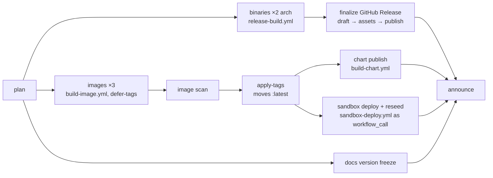

# The greenfield workflow estate (#2772)

The design for the full rewrite of `.github/workflows/` — all 23 files rethought
as one system. Grounded in the 2026-08-26 first-hand inventory of every
workflow (triggers, job graphs, waits, duplication, failure recovery, and the
red lanes on the last three release tags) and in the documented behaviour of
the platform primitives (citations inline). This file is working material: it
is deleted by the PR that lands the last phase; the durable record is #2772,
its sub-issues, and the PR descriptions.

No openEHR spec governs any of this — our own delivery engineering.

## 1. What is broken, precisely

Measured on tags v4.0.3 → v4.0.5 and the estate as it stands:

1. **Cross-workflow ordering by polling.** Four workflows start simultaneously
   on a `v*` tag (Release, Containers, Publish chart, Docs) with one ordering
   dependency expressed — and it is expressed as two nested `gh api` poll
   loops in the chart lane, coupled to the literal job name
   `"app image / build"`. At v4.0.4 a single transient TLS handshake timeout
   inside that loop failed the lane under `set -euo pipefail` with nothing
   wrong with the chart. The loop also burns 20+ idle minutes per tag.
2. **Run-level conclusions gate unrelated things.** The sandbox deploys on
   `workflow_run` filtered to Containers `conclusion == success` — but
   `tree-scan` and `dockerfile-lint` run in that workflow with no `needs`
   edge to the images, so an advisory scan failure silently suppresses the
   sandbox deploy (exactly v4.0.3).
3. **The guard tier is absent at tag time.** All release-fact guards
   (`chart-appversion`, `citation`, `compose-version`, `docs-claims`, ...)
   run on PRs and develop pushes only; `ci.yml` has no tag trigger. Worse:
   GitHub cancels a PENDING run in a concurrency group when a newer one
   queues, regardless of `cancel-in-progress`
   (workflow-syntax docs §concurrency), and the v4.0.5 release merge
   commit's develop CI run was cancelled exactly that way — so the guard
   tier never reported for the release commit at all. The tag lanes
   re-verify only two facts (tag ↔ workspace version, tag ↔ appVersion).
4. **~10 hand-edited pin sites per cut**, each caught (or not) by a
   differently-timed guard. One site (`verifying-releases.md` image tags) had
   no guard and shipped stale into the frozen `/docs/v4.0.5/`.
5. **Duplication that drifts**: the prerelease rule spelled 4 ways in 4
   files; image names derived 3 different ways; the postgres pin in 5 places
   (2 unguarded); the docs toolchain pins declared verbatim twice; the
   helm-pin read step copied 3 times; six file-an-issue watchers sharing no
   code and using 3 different dedup idioms; zero composite actions.
6. **Failures that need undocumented manual recovery**: a re-run of Docs for
   an already-cut tag can never succeed (the refuse-rebuild guard); a
   one-arch binary failure leaves a visible partial draft; a post-push chart
   failure consumes the chart version; a cancelled develop CI run hides the
   guard tier and nothing notices; orphaned untagged digests accumulate in
   GHCR when a gated run dies after push-by-digest.
7. **Trigger scope mismatches**: `docs.yml` runs the full site pipeline on
   every PR (no paths); `sonar.yml` re-runs the entire instrumented DB test
   suite beside `ci.yml`'s on every PR; `fossa.yml` triggers on `main` (not
   the default branch); escape-hatch labels don't re-run CI (bare
   `pull_request:` lacks the `labeled` type); no workflow declares
   `merge_group`; `codeql.yml` path-filters on a directory that doesn't
   exist.

What already works and is kept as the pattern: the `changes` +
`conclusion`-aggregate shape in `ci.yml` (the documented answer to required
checks vs path filters), the draft → assets → publish release shape (GitHub's
own recommendation for immutable releases), the four `workflow_call` builders
with SLSA-L3 construction, scan-before-tags via `apply-tags` (#2750), and the
sandbox lane's verified wait asserting the served version (#2751/#2755).

## 2. The target architecture

### 2.1 One event, one owner

| Event | Owner workflow(s) | Everything else |
|---|---|---|
| Pull request | `ci.yml` (checks) + scoped analysis (CodeQL/Sonar/FOSSA/fuzz-build, path-filtered) | nothing publishes |
| Push to develop | `ci.yml` + `containers.yml` (develop images) + `docs.yml` (dev site) + analysis | nothing user-facing releases |
| `v*` tag | **`release.yml` — THE release pipeline, one workflow, `needs`-ordered end to end** | no other workflow triggers on tags |
| Schedule | the watcher family (one shared engine) + nightly reseed + nightly fuzz | file issues, never gate |
| Manual | `publish-crates.yml`, re-runs of the above | |

### 2.2 The release pipeline (the core of the redesign)

One workflow on `push: tags: ["v*"]`, every ordering a `needs` edge — the only
primitive with a guarantee (concurrency groups have explicitly *no* queue-order
guarantee, and `workflow_run` carries a run-level conclusion, which defect 2
shows is too coarse). Reusable workflows keep the SLSA-L3 construction; ten
nesting levels and 50 calls are allowed (reuse-workflows docs), we use 2 and ~7.

- **`plan`** (new, minutes, publishes nothing): re-runs the ENTIRE release-fact
  guard tier against the tagged commit — tag ↔ workspace version, changelog
  section, chart appVersion + artifacthub images, CITATION/zenodo/statement,
  compose + Dockerfile.vercel tags, `docs-claims --all`, helm goldens — plus
  the asset-name manifest the finalize step will require. A red `plan` costs
  seconds and NOTHING has been built or published. This closes defect 3
  structurally: the cancelled-develop-CI hole stops mattering because the tag
  itself re-verifies everything. (Shape: cargo-dist's generated pipeline —
  one `plan` job computes the whole manifest up front, every downstream job
  gates on it.)
- **`chart` needs `apply-tags`**: the appVersion image is pullable *by
  construction* when the chart job starts. The 60-minute poll loop, the job-name
  coupling, and the entire defect-1 class are deleted, closing #2771. The
  chart lane's own safety chain (refuse-overwrite, cosign retry, read-back,
  ownership tag, post-push failure guidance) is kept verbatim.
- **`sandbox` needs `apply-tags`** — not the run conclusion, so an advisory
  scanner can never again suppress a deploy (defect 2). The deploy/verify/
  reseed logic stays in `sandbox-deploy.yml`, which gains `workflow_call:`;
  the environment secret stays reachable because the CALLED job declares
  `environment:` (the `on.workflow_call` keyword itself cannot —
  reusing-workflow-configurations docs — the same constraint the reseed
  already documents). Its `workflow_run` trigger is deleted; its push-paths
  and dispatch triggers stay for posture changes and manual redeploys.
- **`docs-freeze`**: the `/docs/vX.Y.Z/` cut moves out of `docs.yml` into the
  pipeline (needs `plan` only — it publishes docs, not images), gains a
  prerelease guard (today an `-rc1` tag would re-point `/docs/latest/` while
  the image lane correctly refuses to move `:latest` — four spellings of the
  prerelease rule, one of them missing), and becomes idempotent: an
  already-cut version is a green no-op, so re-running the pipeline never
  wedges on the refuse-rebuild guard (defect 6).
- **`announce`** (aggregate, `if: always()`): asserts every leg landed,
  writes the one summary a human reads, and on any failure names the exact
  recovery (re-run = safe by idempotence, or "bump the chart version", or
  "cut a patch") instead of leaving it tribal.
- `containers.yml` keeps ONLY develop-push image builds; `publish-chart.yml`
  (the 6-line caller) is deleted; `release.yml` and `release-build.yml`
  merge into the pipeline unchanged in substance.

Idempotence is the re-run story for every leg: images push by digest and
re-tag (already true), the GitHub Release updates its draft (already true),
the chart refuses an existing version loudly (already true — and stays the
one leg where re-run-after-publish means "next chart version"), docs-freeze
becomes a no-op on an existing version, the sandbox hook ping is naturally
re-runnable. A partial failure is therefore always answered by re-running
the pipeline for the tag.

### 2.3 Shared facts get one home

- **`.github/actions/` composite actions** (today zero; `codeql.yml` already
  path-filters on the directory): `checkout-hardened` (checkout +
  `persist-credentials: false`), `rust-toolchain` (setup + the cache posture
  as an input), `helm-pinned` (the `.tool-versions` read, today copied 3×),
  `file-watcher-issue` (the dedup/file/comment loop, today 6 divergent
  copies), `retry-net` (the guarded network-retry idiom for publish lanes).
  Composite actions are the documented mechanism for shared steps; reusable
  workflows stay the mechanism for whole jobs (about-custom-actions docs).
- **One constants file** (`.github/release-facts.env` or equivalent) read by
  every lane: registry + the three image names (today 3 derivation styles),
  the prerelease rule (today 4 spellings), shared digests where a guard can't
  reach. `scripts/checks/image-labels.sh` extends to the service-container
  pins it misses today (postgres 18.6 in `ci.yml`/`sonar.yml`).
- **Release facts that are facts-about-a-release get INJECTED, not
  hand-edited**: `helm package --app-version ${TAG#v}` plus packaging-time
  injection of the `artifacthub.io/images` tags — the chart lane already does
  exactly this for `artifacthub.io/changes` with the recorded rationale ("a
  committed copy would be stale from the next merge onwards"). That deletes
  two hand-edit sites and their guard; `Chart.yaml` keeps only the chart's
  own SemVer. The remaining hand-edited sites (changelog, workspace version,
  CITATION, statement, compose defaults, book pins) stay guard-checked — but
  now also at tag time via `plan`, and `verifying-releases.md` gains the
  guard it never had (bare image-tag and asset-name literals).

### 2.4 CI and analysis trigger surgery

- `ci.yml`: add `types: [opened, synchronize, reopened, labeled, unlabeled]`
  (the escape-hatch labels re-evaluate without close+reopen — today's trap),
  add `merge_group` (mandatory before a merge queue can ever be enabled —
  managing-a-merge-queue docs), and fix the develop-push concurrency group to
  include the SHA so a queued push run can never be pending-cancelled under a
  newer one (the documented default that silently ate the v4.0.5 release
  commit's guard run).
- `docs.yml`: PR runs get the same in-workflow `changes` gate CI uses (a
  workflow-level `paths:` filter would break it as a required check —
  troubleshooting-required-status-checks docs); tag behaviour moves to the
  pipeline (§2.2).
- `sonar.yml`: gains the `changes` gate — the 90-minute instrumented suite
  runs when code changed, not on every docs PR. (The duplicate-suite question
  — Sonar consuming CI's coverage artifact instead of re-running — is
  recorded as a follow-up, not this program: it trades a clean boundary for
  artifact plumbing.)
- `fossa.yml`: drop the `main` trigger (not the default branch), add the gate.
- `codeql.yml`: the `.github/actions/**` filter becomes live the moment
  composite actions exist; keep.
- `containers.yml` (develop half): `dockerfile-lint`/`tree-scan` become
  `needs`-independent but conclusion-relevant only to themselves — they stop
  being able to redden the run that other systems key on, because after §2.2
  nothing keys on the run conclusion at all.

### 2.5 The watcher family standardizes

Six watchers, one engine: a reusable `watcher-issue.yml` (or the composite
action) takes title, labels, body-file, and dedup key; every watcher becomes
its schedule + its probe + one call. Uniform rules: dedup by exact-title
search, comment on the existing issue, red run only when the PROBE fails
(finding something is a green run that files work — today image-scan reds on
findings while base-image-watcher greens on them). The two `scripts/watch/*`
shells keep their logic and adopt the engine for the filing half. The
schedule collision (base-image-watcher and toolchain-watcher both at Mon
07:43) gets restaggered.

### 2.6 Retry discipline (the v4.0.4 lesson, generalized)

Every network call in a publishing lane follows one of two idioms, provided
by the `retry-net` composite: idempotent reads use `curl --retry` (with
`--retry-connrefused`; `--retry-all-errors` only where re-sending is safe —
everything-curl retry docs), and anything inside a poll loop is guarded in an
`if` so a transient failure means "not observed yet", never lane death (the
idiom `publish-crates.yml` already gets right). The cosign 3-attempt loop
pattern (chart lane) is the template for state-changing calls. zizmor +
actionlint keep gating the estate; the hardening posture (permissions: {},
SHA pins, no context interpolation) is already uniform and is preserved
as-is.

## 3. What deliberately does NOT change

- The `ferroehr-*` product SemVer + milestone-driven cuts, the changelog
  discipline, and the release-PR-then-tag shape (release-plz's automation of
  that same shape is noted as prior art, not adopted — the hand-authored
  changelog is a product feature here).
- `publish-crates.yml` stays a manual, resumable dispatch on its own
  decoupled SemVer line; the pipeline's `announce` summary REMINDS when
  `crates/*` content shipped in the cycle, closing today's silent-forget.
- The SLSA-L3 reusable-builder construction, the attestation set, immutable
  releases with draft-then-publish, scan-before-tags, and the sandbox
  verified-wait: all kept; the redesign moves their ORDERING into `needs`
  edges and their facts into one home.
- `ci.yml` stays the one mega-workflow with `changes` + `conclusion` — the
  inventory confirms that shape is the documented best practice, not the
  problem.

## 4. Phases (= the sub-issues of #2772)

Each phase is independently shippable and leaves every lane green.

1. **Foundation: composite actions + one home for shared facts** — no
   behaviour change; pure deduplication so the later phases edit one place.
2. **The release pipeline** — the §2.2 workflow; deletes the chart poll loop
   (#2771), the tag triggers on `containers.yml`/`publish-chart.yml`/
   `docs.yml`, and the sandbox `workflow_run` trigger; adds `plan`,
   `docs-freeze` (idempotent + prerelease-guarded), and `announce`.
3. **CI trigger surgery** — label types, `merge_group`, the develop-push
   concurrency fix, and the analysis-lane scoping (§2.4).
4. **Watcher unification** — the shared engine, uniform dedup/red-run
   semantics, restaggered schedules (§2.5).
5. **Release-fact injection + the missing guards** — packaging-time
   appVersion/images injection, the `verifying-releases.md` guard, the
   service-container pin guard, GHCR orphan-digest pruning.
6. **Verification cut** — a `vX.Y.Z-rc` dry-run tag through the new pipeline
   proving: green end to end, prerelease semantics (no `:latest`, no
   `/docs/latest/`, GitHub prerelease), then the first real cut on it.

## 5. Risks and their answers

- **`workflow_run` semantics were load-bearing for the sandbox** (tag name in
  `head_branch`, default-branch file resolution): the pipeline removes that
  dependency entirely — the sandbox becomes a called job.
- **A single pipeline is a bigger blast radius per edit**: mitigated by the
  reusable units staying separate files, `plan` failing before anything
  publishes, idempotent re-runs, and zizmor/actionlint/CodeQL continuing to
  gate every workflow edit.
- **Matrix outputs from reusable workflows return only the last success**
  (reusing-workflow docs) — the pipeline never reads per-arch outputs from
  the binary matrix; asset completeness is checked by the finalize manifest,
  as today.
- **Branch-protection continuity**: required checks stay `ci.yml`'s
  `conclusion` only; nothing in the pipeline is a required PR check, so the
  rewrite cannot wedge merges.
