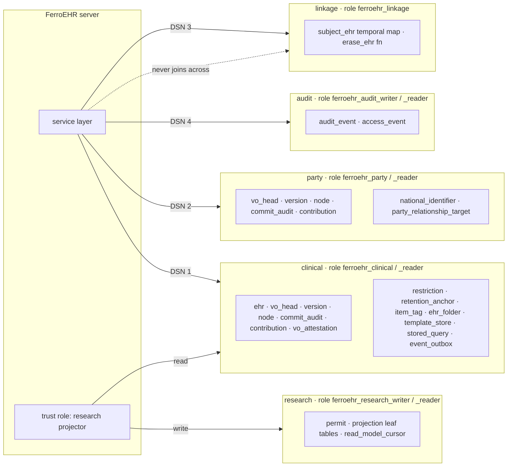
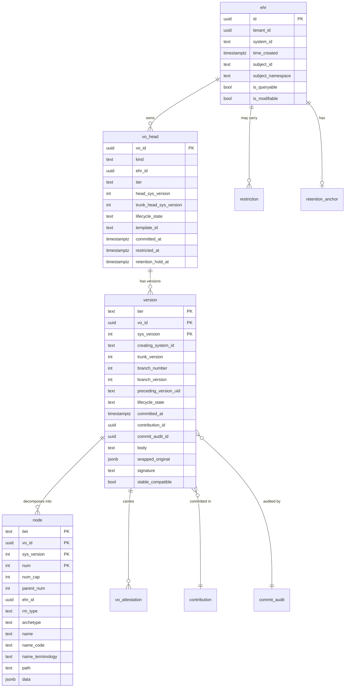
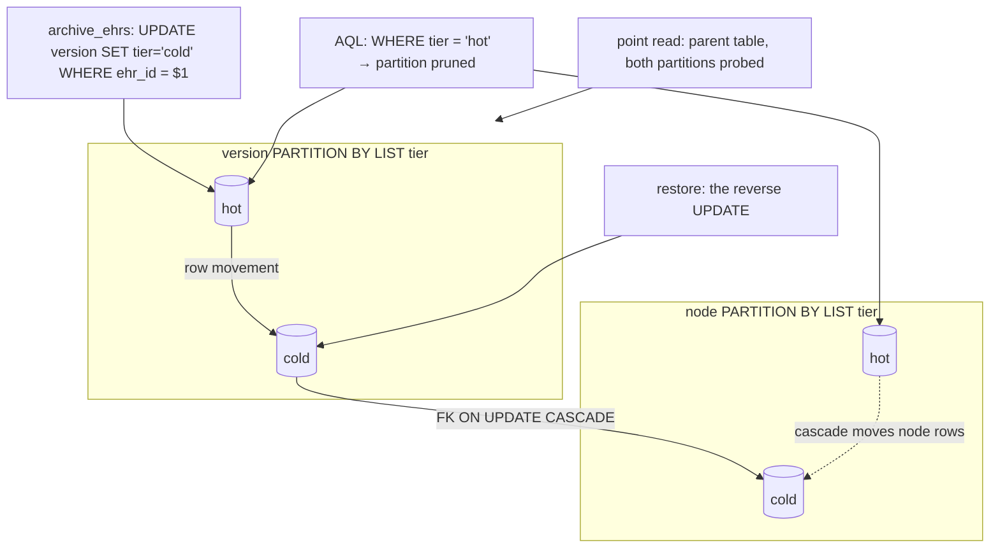
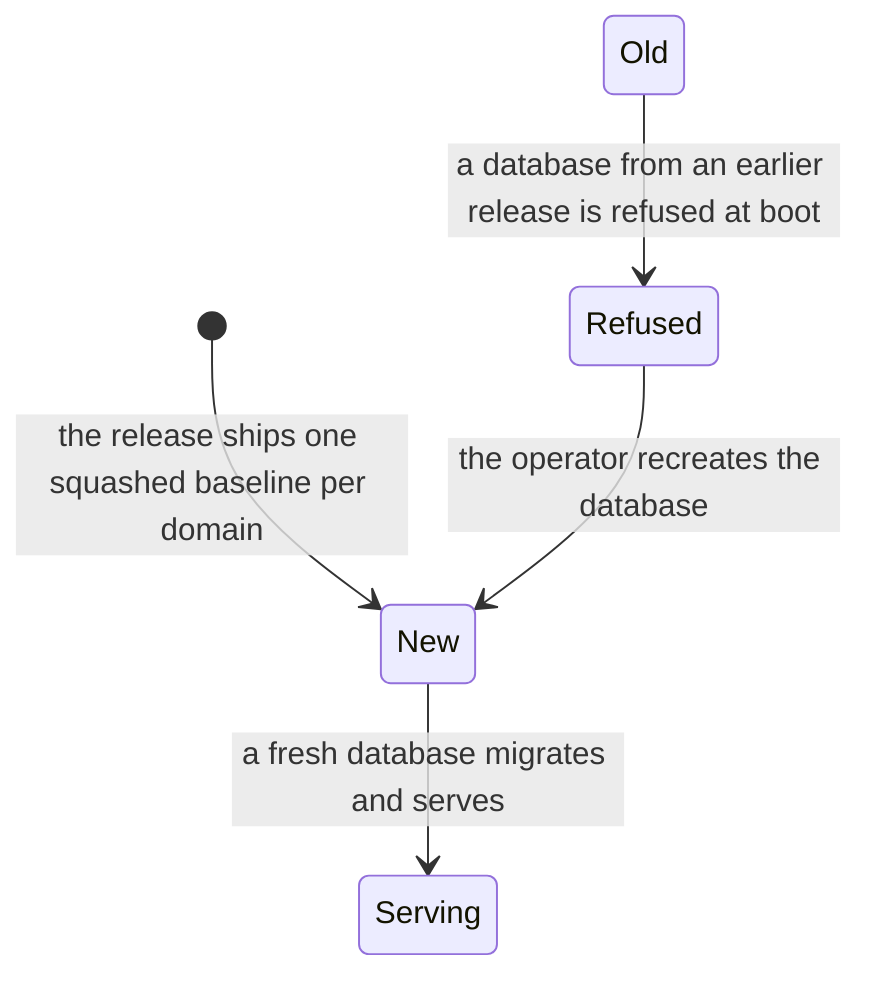

# Storage redesign: the second storage generation

Tracker: #3337 (the parent; its Sub-issues panel is the canonical list of
implementation issues). This is a deep working plan under the standing
lifecycle rule: it is deleted by the pull request that lands the last of its
sub-issues (the drop of the first storage generation). Its three research
appendices live beside it in `docs/plans/storage-redesign/` and go with it.

## Evidence read

Every verdict below rests on one of three first-hand reports, each written
to disk as it was produced:

- **Report 1**, `storage-redesign/research-postgresql-18.md`: the PostgreSQL
  18 documentation (`https://www.postgresql.org/docs/18/`) for every
  mechanism the current schema relies on or the target proposes, quoted, with
  the design consequence per fact and a list of twelve places where the
  repository's own comments and pages contradict the documentation or claim a
  mechanism the code does not use.
- **Report 2**, `storage-redesign/research-inventory-prior-art.md`: the
  inventory of every migration set (`ext`, `ehr`, `demographic`, `linkage`,
  `audit`, the unlanded `secondary` draft), every table, index, view,
  function, trigger, role, grant and policy, with the Rust code paths that
  write and read each relation; the node data shape; the cold tier, the
  domains, the outbox, tenancy, multimedia and the physical delete as the
  code performs them; thirty-two documented claims checked against the code;
  sixteen defects; and EHRbase 2.x's storage read in its upstream migrations
  as prior art.
- **Report 3**, `storage-redesign/research-specs-law.md`: what the openEHR
  specifications require of storage (seventy-two testable statements from RM
  common master06, RM ehr master04, RM common master03/04, BASE master05/07,
  ITS-REST 1.1.0, AQL 1.1 and the SM, with the sentences that grant
  implementation freedom quoted), and the storage-relevant provisions of the
  vendored law (`docs/law/`) as a provision × requirement matrix for the EU,
  the Netherlands, Germany and Switzerland, followed by a cross-check of the
  current design and of the compliance page's claims.

Rulings that shaped the present design were re-read with their evidence:
the UNLOGGED refusal (#2698) stands; the GiST removal stands as a fact but
loses its stated rationale; schema-per-domain stays the default and gains a
per-domain connection so cluster-per-domain becomes a configuration; the
migration-immutability stabilisation of 2026-09-09 is set aside for this one
rework by the owner ruling of 2026-09-14 (a greenfield rewrite, no production
installations), and holds again over the new baselines from the merge on. Where a claim would rest on
a number nobody has measured, this plan names the measurement (owner ruling
2026-09-13: no performance runs in v4.3.0).

## Evaluation of every in-scope component

Evidence codes: **R1** = `storage-redesign/research-postgresql-18.md`
(PostgreSQL 18 documentation, section numbers), **R2** =
`storage-redesign/research-inventory-prior-art.md` (the inventory, access
paths, claims-vs-code and defect list, plus EHRbase prior art), **R3** =
`storage-redesign/research-specs-law.md` (the openEHR specifications and the
vendored law). Verdicts: **keep** (with the reason re-affirmed), **change**
(the component survives with a different mechanism), **replace**.

| Component | Evidence read | Finding | Verdict | Target |
|---|---|---|---|---|
| `vo_version` as one temporal table with `sys_period`, four partial indexes on `upper_inf(sys_period)`, `fillfactor 90` | R1 §2.1-2.2, §3.4, §7.7, §15.1; `ehr/0001:323-513`; `commit.rs:307-330` | the close-out UPDATE modifies a column referenced by index predicates, so it is never HOT: eleven index inserts and one dead tuple per supersession; `fillfactor` cannot change that; the partial-index predicates match only because the app spells `upper_inf(sys_period)` literally | **replace** | append-only `version` + one mutable `vo_head` row per object (HOT-eligible); validity derived from `committed_at`; `fillfactor 100` on `version` |
| The removed GiST `EXCLUDE` constraints and the "inserts serialise" rationale | R1 §3.2-3.4; `ehr/0001:450-467`; `linkage/0001:107-109` | the PostgreSQL docs contain no such statement; the only doc-grounded cost fact is that equality exclusion is slower than UNIQUE; non-overlap today rests on the advisory lock, not the indexes | **replace** the rationale; the constraint stays absent because the target has no interval to protect | the advisory lock stays as the `sys_version`/412 serialiser; the miscited comment leaves with the table |
| `vo_version.body text` verbatim beside decomposed `node.data` (dual write, R2 §Defects D2) | R1 §1.5, §1.3; R3 A.7 56; R2 §Node data shape | jsonb drops key order and E-notation, and ITS-REST requires date/time literals returned as sent, so a served body cannot come from jsonb; AQL needs typed leaves and integer containment, so it cannot come from `text`. Both stores are spec-forced; the overhead is storage, not correctness | **keep**, stated as spec-forced | `version.body text COMPRESSION lz4`; `node.data jsonb`; the ratio measured (performance model H11) |
| `node`: nested set, promoted columns, ~360 B fragments, `COMPRESSION lz4` | R1 §1.1-1.2, §1.6, §7.5, §8.1; R2 §Node data shape, D1, D3, A1, A8; QUERY master03 | the decomposition and the interval join are right; `citem_num` is written on every row and read by nothing (D1); `path` is reassembly-only, not a predicate as the architecture page says (A1); lz4 on a sub-2 kB row is inert; the AQL node predicate on `name/defining_code` has no promoted column | **change** | drop `citem_num`; add `name_code`, `name_terminology`; drop the inert compression annotation; `tier` in the key; `tenant_id` on every partition; the emitter spells columns through `db/iden.rs` (D12) |
| `ext` helper functions (`openehr_magnitude`, `openehr_timestamp`, the parsers) | R1 §7.6, §9.2; R2 D3; `ext/0001` | each ends in `EXCEPTION WHEN others THEN RETURN NULL`, which opens a subtransaction on every call, and they are emitted once per candidate row per predicate; `openehr_timestamp` is STABLE (correctly, TimeZone) and so never indexable | **change** | rewrite as `LANGUAGE sql` IMMUTABLE/STABLE with regex-validated input and no exception block (inlinable, no subtransaction); the STABLE/IMMUTABLE split stays |
| `cold`/`cold_demographic` mirror relations, `*_all` union views, alias views | R1 §5.8, §6, §10.4, §17 #9; R2 §The cold tier, D6, D11, A7, B2 | FK-free by construction; RLS re-declared per mirror and missing on `cold.vo_attestation`; every new `vo_version` column needs a hand-written mirror change and a view rebuild (three so far); a fresh install skips `0011` entirely; the book's "retry cold on a miss" describes a design that no longer exists | **replace** | `PARTITION BY LIST (tier)` on `version`, `node`, `vo_attestation`; archive/restore = row movement; one policy, one FK set, no views |
| `ehr`, `demographic`, `linkage` schemas selected by `search_path` on one DSN | R1 §11.1, §11.3; R3 B.3 §35-41, B.6 EPDV Art. 10 Abs. 1 lit. b, DSV Art. 4 Abs. 5; BASE master07 §Anonymity; R2 §Pseudonymisation domains, A14 | the barrier is a SQL-privilege property inside one database; a superuser, a base backup, WAL and physical replication carry every schema together; the law asks for separation that can be another machine; in dev/compose the roles do not exist, so the boot gate checks nothing (A14) | **change** | a pool and DSN per domain (co-located by default); the gate refuses missing roles under the production deployment profile; `ext` per database |
| `linkage.party_ehr` temporal map | R1 §3.1; R3 A.9 71, A.4 30; R2 §Pseudonymisation domains, D10 | the temporal PK is correctly GiST (`WITHOUT OVERLAPS`); the table is live (the architecture page's "no pool reaches it yet" is stale); a physical EHR delete leaves its mapping in force | **change** | `linkage.subject_ehr` absorbing `ehr_index`; `linkage.erase_ehr` reached by admin delete |
| `ehr.ehr_index`, `sp_subject`/`sp_*` subject columns in the clinical schema | R3 A.9 71, C.2 7; R2 D9; SM master02 | subject identifiers sit in the clinical domain outside the pseudonym guard, reachable by the clinical role | **replace** | moved to `linkage`; no subject identifier remains in `clinical` other than the guarded `ehr.subject_id` |
| The pseudonym guard trigger and `posture` | `ehr/0009`; R2 §Pseudonymisation domains | validates a UUID shape once namespaces are declared; the caller mints the pseudonym; the guard covers `ehr` only | **keep**, widened | the trigger stays; the guard is the only place a subject id may sit |
| Tenancy: GUC + `FORCE ROW LEVEL SECURITY` per table | R1 §5.2, §10.1-10.3; R2 §Tenancy, D6, D8, D16 | correct mechanism; coverage holes on `vo_attestation` (all four), `ehr_folder`, `ehr_index`, `vo_archive`, `sp_sample`; `ext.current_tenant_id()` resolves an unset GUC to the default tenant (fails open) | **keep**, completed | every gen-2 table carries `tenant_id` and the policy, declared once per partitioned parent; `current_tenant_id()` raises when unset and the posture is multi-tenant |
| Commit path: one CTE per Contribution, server `time_committed`, advisory lock | R3 A.3 16-20; R2 A9; `commit.rs` | correct and spec-grounded | **keep** | unchanged shape; the close-out statement becomes the `vo_head` UPDATE |
| `wrapped_original`, `preceding_version_uid`, per-version `creating_system_id`, `stable_compatible`, `origins`, signature | R3 A.1-A.3; `ehr/0001` | each answers a named RM requirement | **keep** | columns on `version` |
| `contribution`, commit `audit` | R3 A.3; R2 D13 | correct; the commit-audit table's name collides with the `audit` domain and its comments contradict the later CHECKs | **keep**, renamed | `commit_audit`; the CHECKs stated in the DDL |
| `vo_attestation` | R3 A.3 23; R2 D6, D15 | append table is right; no tenant policy, no compression | **keep**, completed | partitioned by tier with the others; `tenant_id`; policy |
| `item_tag`, `ehr_folder`, `template_*`, `stored_query`, `archetype_store`, `adl2_artefact`, `event_subscription`, `fhir_mapping`, `tenant` | R2 §Inventory, D16 | fit for purpose; `ehr_folder` lacks `tenant_id` | **keep** | copied into `clinical` with `tenant_id` everywhere |
| `event_outbox` and its readers (`published_at`, `fhir_outbound_cursor`, the draft `read_model_cursor`) | R1 §12; R2 §The outbox, D7, D14 | the envelope carries identifiers only (no content, no subject); the prune reads `published_at` alone and ignores every cursor reader (#3330 confirmed); the draft `secondary` set has no tenancy | **keep**, fixed | prune floor = `min(cursor)` over registered readers; the `research` domain carries `tenant_id` and RLS like every other |
| Multimedia blob GC on delete | R2 §Multimedia, D4 | a full double-domain scan with a substring match, and every node's `data` of the EHR pulled into the process | **replace** | a `blob_ref (uri, vo_id, sys_version, tier)` table maintained at commit; GC is an anti-join |
| Admin physical delete | R3 A.7 55; R2 §Admin physical delete, D10 | reaches both tiers and the outbox; leaves `linkage`, the `sp_*` family and (correctly) the ATNA trail | **change** | the order in §Erasure reach; linkage and research reached; the trail kept and said so |
| Restriction of processing | R3 B.1 Art. 18 + 4(3), C.2 1, C.3 | nothing at any grain; `is_queryable` limits population queries only | **add** | the `restriction` register and the head marks |
| Retention | R3 B.1 Art. 5(1)(e), 30(1)(f); B.6 DSG Art. 25(2)(d), EPDV Art. 10; C.2 3 | no datum anywhere for clinical content | **add** | `retention_policy`, `retention_anchor`, `retention_due`; the audit ceiling |
| Encryption of clinical payload | R1 §13; R3 B.1 Art. 32(1)(a), B.6 EPDV Art. 10 Abs. 1 lit. c; threat-model page | no TDE in core; pgcrypto is the documented wrong tool for a distrusted DBA; column encryption ends AQL | **keep** (no payload encryption; sealed identifiers stay) | the deployment boundary is stated per provision |
| The `secondary` domain draft (#3331) | R3 B.3 §116-120, B.1 Art. 89(1); R2 §Draft secondary domain, D14 | the per-permit relationship pseudonym is the EDPB's own shape; the draft lacks tenancy | **keep**, renamed `research`, amended | tenancy added; the trust-role shape re-affirmed; expiry rules from GDNG § 6 |
| Migration sets and their order (`ext → ehr → demographic → linkage → audit`) | R2 §Schemas; the immutability rule | the order is load-bearing (the `LIKE` copies depend on it, D11) | **replace** | one DDL template rendered into `clinical/0001` and `party/0001`; each domain self-contained; the old sets deleted and an old database refused at boot (greenfield, owner 2026-09-14) |
| Documentation of the storage layer | R1 §17; R2 §Claims vs code A1-A15, B1-B9, C1-C8, P1-P9 | `JSON_TABLE`, GIN pre-filters, jsonpath item methods, `MERGE`, `RETURNING OLD/NEW`, virtual generated columns, "retry cold on a miss", "no pool reaches linkage" are described and not present; four migration comments cite measurements no committed artifact carries | **replace** the prose | corrected in the first sub-issue (D1); every future number rides a committed record |
| UNLOGGED tiers | owner ruling 2026-08-25 (#2698) | not re-opened | **keep** | every relation LOGGED |
| Migration immutability | owner rulings 2026-09-09 and 2026-09-14 | declared for installations that exist; set aside for this one greenfield rework | **keep**, set aside once | the PR that lands the new baselines deletes the old sets and re-declares the guard over the new ones |
| Schema-per-domain over cluster-per-domain | this plan | the earlier choice stays the default; the per-domain DSN makes the other a configuration | **keep**, generalised | §Domain topology |

Prior art, read for what it teaches and not as an oracle (R2 §Prior art):
EHRbase 2.x keeps per-node rows for the CURRENT version only and, since its
V25 migration, one newline-delimited text blob per past version, so history
is not queryable there; it removed multitenancy and RLS in V5; it never had a
pseudonymisation domain or an archival tier; its nested set was retrofitted
onto a materialised index string in V15; and its winning indexes are
parent-keyed and `citem_num`-keyed covering (`INCLUDE`) indexes. Two lessons
carry over: covering indexes over the nested-set join are worth measuring
(performance model, S9), and short key aliases in `data` (EHRbase's `T`, `A`,
`U`) are still rejected here because storage equals API is the property that
lets `body` serve the wire verbatim.

## What the openEHR specifications require of storage

The specifications leave the physical layout free and say so (RM common
master06 §Overview and §Versioned Objects: "any other mechanism", "not defined
by this specification, only the form of any given version is"; RM ehr
master04 §Versioning of Compositions: "how it stores successive versions in
time is an implementation concern"; BASE architecture_overview master08
§Managing Changes in Time: deltas "may or may not" be used). What they fix is
the functional interface. Each statement below is a storage invariant the
target schema carries, with the element that carries it.

| # | Requirement (citation) | Target element |
|---|---|---|
| S1 | `OBJECT_VERSION_ID` = `object_id::creating_system_id::version_tree_id`, `version_tree_id = trunk[.branch.branch_version]`, trunk from 1 by single increments, branch pairs from 1 (BASE base_types master05 §Syntaxes; RM common master06 §Local Versioning) | `version (vo_id, creating_system_id, trunk_version, branch_number, branch_version)` unique; the three tree parts are columns, never re-derived from an ordinal |
| S2 | `creating_system_id` is per version and may change along one container's trunk after a move (master06 §Distributed Versioning, §Moving Version Containers) | column on `version`, not on the container |
| S3 | `preceding_version_uid` stored; present iff not the first (RM UML `version.adoc` Preceding_version_uid_validity) | column on `version`, verbatim text |
| S4 | the container answers `latest_version` (any branch) AND `latest_trunk_version` separately, plus `version_at_time`, `has_version_at_time`, `revision_history`, `version_count` (RM UML `versioned_object.adoc`) | `vo_head (vo_id, head_sys_version, trunk_head_sys_version, latest_committed_at)`; `version.committed_at` with index `(vo_id, committed_at DESC)`; `revision_history` = a scan of `version` joined to `audit` and `vo_attestation` |
| S5 | indelible: every change including deletion is a new version; deletion = a version with Void data and lifecycle 523; incomplete (553) content may lack mandatory attributes (master06 §Contributions, §Logical Deletion, §Incomplete Content) | `version` rows are IMMUTABLE after commit (no in-place close-out); `body`/`node` nullable-shaped for 553; 523 rows have no `node` rows |
| S6 | a Contribution commits atomically or not at all, its audit copied into each version's `commit_audit`; `time_committed` is server time (master06 §Committal and Audits; ITS-REST Requests_and_responses.md) | one transaction per Contribution; `version.committed_at` = the audit's `time_committed`, stored on the version row for the at-time path |
| S7 | imported versions keep the original verbatim; time travel uses the LOCAL commit time (master06 §The Copy Operation, §Subsequent Local Modifications) | `version.wrapped_original`; `committed_at` local |
| S8 | attestations append to an existing version without a new version (master06 §Attestation) | `vo_attestation` append table; no version row change |
| S9 | `VERSION.signature` stored; canonical form not yet defined upstream (master06 §Digital Signature) | `version.signature` text, `signature_client_supplied` |
| S10 | the root EHR's `system_id`, `ehr_id`, `time_created` are immutable; `EHR_STATUS.is_queryable` gates population queries only; `is_modifiable` gates writes other than EHR_STATUS (RM ehr master04 §Root EHR Object, §EHR Status; SM `i_query_service.adoc`) | `ehr` row immutable columns; promoted `is_queryable`/`is_modifiable` on `ehr` maintained from the EHR_STATUS head; the restriction register is a separate, finer mechanism (Art. 18 is not `is_queryable`) |
| S11 | the subject↔EHR association may be "done elsewhere for security reasons"; scheme 2 puts one `PARTY_SELF.external_ref` in EHR_STATUS; the identity cross-reference database "would be easy to encrypt or protect" and can be "on different machines" (RM common master04 §PARTY_SELF; RM UML `ehr_status.adoc`; BASE master07 §Anonymity) | scheme 2 with an opaque per-EHR pseudonym; the cross-reference in `linkage`, relocatable to its own database or cluster |
| S12 | ITS-REST `ehr_get_by_subject` matches `EHR_STATUS.subject.external_ref` (`id.value`, `namespace`); one EHR per (subject id, namespace) (`ehr_get_by_subject.yaml`; `409_EHR.yaml`) | promoted `ehr.subject_id`, `ehr.subject_namespace` with the partial unique index; the pseudonym guard trigger |
| S13 | a version is addressed by `(OBJECT_VERSION_ID, path)`; nodes have no GUIDs (RM common master03 §Unique Node Identification; BASE UML `locatable_ref.adoc`) | `node (vo_id, sys_version, num)` with `path COLLATE "C"`; `LOCATABLE_REF` resolution = head or version lookup + path equality |
| S14 | AQL CONTAINS is parent/child containment; node predicates on `archetype_node_id`, `name/value`, `name/defining_code/code_string` + `terminology_id/value`; ORDER BY on Ordered types; no default order (QUERY master03) | nested set `(num, num_cap, parent_num, citem_num)`; promoted `archetype`, `name`, and NEW `name_code`, `name_terminology`; `ext.openehr_magnitude` for ordering |
| S15 | `LATEST_VERSION`/`ALL_VERSIONS` exist only in the grammar; the prose defines neither (QUERY grammar `AqlParser.g4`; master03 silent) | `LATEST_VERSION` = the trunk head (`vo_head.trunk_head_sys_version`); `ALL_VERSIONS` = every `version` row of the container; recorded as our adjudication and registered as an ambiguity with the conformance instrument, never stated as the spec's definition |
| S16 | `composition_get` by `version_at_time` distinguishes no version at t (404), a 523 version at t (204), a version at t (200) (`composition_get.yaml`, `204_deleted_at_time.yaml`) | the at-time lookup returns the version row including `lifecycle_state`; the service maps |
| S17 | the latest version uid must be cheap for `If-Match`/412, `DELETE`/409, `ETag` (Requests_and_responses.md §If-Match, §ETag) | `vo_head` row per container, one PK probe |
| S18 | date/time literals are preserved as the client sent them and returned in the original format (ITS-REST Resources.md §Datetime format) | `version.body text` verbatim for every served body; `node.data jsonb` serves AQL leaves (jsonb keeps string scalars verbatim; numbers keep their scale) |
| S19 | `admin_ehr_delete` physically deletes the EHR and everything it owns including historical versions, possibly asynchronously (`admin_ehr_delete.yaml`) | one `DELETE FROM ehr` cascades through every partition; linkage, outbox, research tombstone, multimedia follow in the same service transaction or a tracked job (202) |
| S20 | `I_ADMIN_ARCHIVE.archive_ehrs` moves EHRs "to archival storage"; no form defined (SM `i_admin_archive.adoc`) | the `tier` partition key: archive = `UPDATE ... SET tier = 'cold'`, restore = the reverse; one set of relations, FKs and RLS intact |
| S21 | `I_EHR_INDEX` is the EHR-id/subject cross-reference service (SM master02 table; `i_ehr_index.adoc`) | realised by `linkage`, not by a table in the clinical schema |
| S22 | every Party in its own version container; relationships stored in the source party; a reverse index is implied (RM demographic master02 §Versioning Semantics, §Party Relationships) | the same `version`/`node`/`vo_head` DDL in the `demographic` domain (LIKE-built), plus `party_relationship_target (target_party_id, source_vo_id)` for `reverse_relationships` |
| S23 | tags do not re-version and want an index on the key (RM ehr master04 §Tags) | `item_tag` unchanged, indexed by `(ehr_id, key)` |
| S24 | read-access logs are outside EHR content and unmodelled by openEHR (BASE master07 §Security Policy) | the `audit` domain, its own schema and DSN, never versioned |

## The target design

Five findings drive it. The version close-out UPDATE can never be HOT, so
every supersession pays eleven index inserts and leaves dead tuples behind
(research report 1 §2.1). The cold tier is an FK-free mirror that every read
path has to know about, rebuilt by hand whenever a column is added (report 1
§10.4, §17 #9). The domain barrier is a SQL-privilege property inside one
database, while the law asks for separation that can reach another machine
(report 3 B.3 §35-41, B.6 EPDV Art. 10, BASE master07 §Anonymity). Restriction
of processing and retention have no home in storage at all (report 3 C.2 1, 3).
And a second subject cross-reference sits inside the clinical schema (report 3
C.2 7). The target answers each with a structural change; everything else the
current design got right is kept and says why.

### Principles

1. **Write once.** A version row and its node rows are never updated after
   commit (BASE master07 §Integrity: "1 Version = 1 copy" is a write-once
   system). Mutable state lives in one small row per versioned object.
2. **One relation set per domain, tiers inside it.** Archival is a partition,
   never a second table. FKs, RLS and every read path see one relation.
3. **A domain is a connection, not a search path.** Each pseudonymisation
   domain has its own schema, role pair, pool and DSN. Co-located by default;
   relocatable to another database or cluster by configuration alone.
4. **The law's marks are columns.** Restriction, retention and holds are
   rows the read paths join, not documentation.
5. **Claims carry their instrument.** Every performance statement in this plan
   names the measurement that proves or refutes it; none is stated as a number.

### Domain topology



Every arrow is a separate pool with its own DSN in the configuration tree
(`[storage.clinical]`, `[storage.party]`, `[storage.linkage]`,
`[storage.audit]`, `[storage.research]`), each defaulting to the same
database with the domain's schema, so the compose quickstart is unchanged and
a regulated deployment moves any domain to its own database or cluster by
editing one URL. The reciprocal role revokes and the boot gate
(`verify_domain_isolation`) stay for the co-located case; the gate additionally
refuses two domains configured on the same DSN with a shared role. No SQL
statement joins two domains; the service layer already works that way and the
per-domain pools make it impossible to regress.

`ext` (the IMMUTABLE helper functions, the tenant GUC reader) is applied per
database by whichever domain migrator runs first there, so a relocated domain
carries its own copy. No openEHR spec governs schemas, roles or pools; the
EDPB guidelines' "pseudonymisation domain" (§35-41) is the concept realised.

### The clinical relations



**`version` is append-only.** It carries everything the RM fixes about a
version (S1-S3, S5-S7, S9 in the invariants table): the three tree parts,
`creating_system_id`, `preceding_version_uid`, `lifecycle_state`, the verbatim
`body text`, `wrapped_original`, the signature, the `stable_compatible` stamp,
and `committed_at` copied from the commit audit (the RM itself copies the
contribution audit into every version's `commit_audit`, master06 §Committal
and Audits). There is no `sys_period`, no partial index on a mutable
predicate, no close-out statement. Validity of version *i* is
`[committed_at_i, committed_at_{i+1})` by construction; `version_at_time(t)`
is the trunk row with the greatest `committed_at <= t`, one probe on
`(vo_id, committed_at DESC) WHERE branch_number = 0`. Uniqueness: the PK
`(tier, vo_id, sys_version)` and
`(tier, vo_id, creating_system_id, trunk_version, branch_number, branch_version)`;
the tree position `(vo_id, trunk_version) WHERE branch_number = 0` stays as a
per-partition unique index. `fillfactor` returns to 100 (report 1 §2.2: "For
a table whose entries are never updated, complete packing is the best
choice"). A BRIN index on `committed_at` serves time-range listing
(`list_contributions(time_range)`, revision histories) on the append-only
heap (report 1 §7.4).

**`vo_head` is the one mutable row per versioned object.** It answers every
"what is current" question in one primary-key probe: the ETag for `If-Match`
and `DELETE` (S17), the latest trunk version for `LATEST_VERSION` and the
latest any-branch version for the RM's `latest_version` (S4), the lifecycle
state for the "already deleted" 400 (S16), the template for template-scoped
queries, and the two legal marks (`restricted_at`, `retention_hold_at`). Its
indexes are `PRIMARY KEY (vo_id)`, `(ehr_id, kind)` and
`(ehr_id, template_id) WHERE template_id IS NOT NULL`; the columns a commit
changes (`head_sys_version`, `trunk_head_sys_version`, `lifecycle_state`,
`committed_at`) are in no index, so the per-commit UPDATE is HOT-eligible
(report 1 §2.1). The only non-HOT updates are a template change, an archive
(tier) and the legal marks, each rare by nature. `vo_head` and `ehr` are the
two tables that keep a `fillfactor` below 100.

**The advisory lock stays.** Per-object commits serialise on
`pg_advisory_xact_lock(hashtextextended(vo_id))` as today; with no
range constraint left to protect, the lock's remaining job is the
`If-Match`/412 check against `vo_head` and the monotonic `sys_version`, both
of which the head row's `UPDATE ... WHERE head_sys_version = $expected`
also enforces (zero rows updated means a concurrent commit won, the service
maps it to 412). The GiST exclusion question is therefore moot: nothing in
the target has an interval to keep non-overlapping, and the schema comment
that miscited the PostgreSQL docs (report 1 §3.3) goes with the table it
described.

**`node` keeps the decomposed nested-set model and its reasons.** JSONB has
no documented partial detoast (report 1 §1.2), so a leaf access on a whole
document pays a whole-document decompress; the per-node fragment keeps the
typical row under the 2 kB TOAST threshold (§1.1). CONTAINS as an integer
interval join over `(num, num_cap)` needs no JSON walk (QUERY master03
§Containment). `citem_num` is dropped: it is written on every row and read by nothing
(report 2 D1); EHRbase indexes on it, and if the S9 measurement shows a
path-skipping index pays, it returns with that index. Two promoted columns are added for the AQL node predicate the
spec defines and the current schema cannot serve without a JSON probe:
`name_code` and `name_terminology` from `name/defining_code` (master03 §Node
predicate). `node.data` holds the node's own attributes with structure children
removed, as today (`storage/codec.rs` `prune_children`; research report 2
§Node data shape); the verbatim
body for point reads is `version.body`, so `node.data` is never re-assembled
into a served document and its jsonb normalisation (§1.5) is harmless.
`COMPRESSION lz4` is dropped from `node.data` (inert under 2 kB, §1.1) and
kept on `version.body` and `wrapped_original` where it applies; the
cluster-level `default_toast_compression` is left to the deployment. The
promoted columns stay populated by the decomposer at write time rather than
as generated columns: VIRTUAL columns may not call user-defined functions and
STORED ones may not call the STABLE timestamp parser (§8.1), and the
decomposer already holds the parsed RM value, so the database would only
re-derive what the writer knows.

**Indexes on `node`** per partition: the PK; `(ehr_id, rm_type, archetype)`
for the per-EHR CONTAINS entry; `(rm_type, arch_entity, arch_major, arch_concept text_pattern_ops)`
for archetype-subsumption population queries; `(ehr_id, context_start) WHERE rm_type = 'COMPOSITION'`.
No GIN index: the emitter produces no GIN-servable operator (report 1 §7.5),
and adding one is a measured decision that also changes the emitter
(`@?`/`@@` with `jsonb_path_ops`). The documentation that describes
`JSON_TABLE` and GIN pre-filters is corrected in the same PR that lands the
schema (report 1 §17 #4, #5).

### Tiers as partitions



`version`, `node` and `vo_attestation` are `PARTITION BY LIST (tier)` with
two partitions, `hot` and `cold`, and no default partition. Archiving an EHR
is `UPDATE version SET tier = 'cold' WHERE ehr_id = $1` inside a transaction
that also sets `vo_head.tier`; PostgreSQL moves the rows between partitions
(an UPDATE that changes the partition key is a delete plus insert, report 1
§5.8), and the node FK `(tier, vo_id, sys_version) REFERENCES version ON UPDATE CASCADE`
carries the node rows with it. Restore is the reverse statement. What this
buys over the mirror tables: one relation, so FKs hold across the tier (the
mirror is FK-free by construction), the tenant RLS policy is declared once on
the parent, every read path and every future column reaches cold without a
view rebuild (the union views were rebuilt three times for exactly this,
report 1 §10.4), and AQL excludes cold by writing `tier = 'hot'`, which the
planner prunes at plan time because it is a literal. The `cold` partitions
carry fewer indexes (the PK and the FK support index only) and may sit on a
cheaper tablespace (`ALTER TABLE version_cold SET TABLESPACE`, report 1 §6);
the mirror could do neither. What it costs: the partition key is in every
unique constraint (§5.1), so the PK widens by one short column; a point read
on the parent probes both partitions' PK indexes (two probes, one empty); and
the archive statement is still a row copy, so it leaves dead tuples for
VACUUM exactly as the mirror's `DELETE ... RETURNING` did (§5.8). The per-EHR
archival unit is what the SM asks for (`I_ADMIN_ARCHIVE.archive_ehrs`), so
time-bucketed partitions that could be detached wholesale do not fit it;
the plan names that as the measured alternative if archival volume ever
dominates.

Two facts to prove in the first implementation PR, each a test rather than
an assumption: that a foreign key from a partitioned `node` to a partitioned
`version` with `ON UPDATE CASCADE` performs the cross-partition row movement
on the referencing side (report 1 §5.9: the docs read neither permit nor
forbid it), and that `FORCE ROW LEVEL SECURITY` on the parent filters the
cold partition for the archive role. If the cascade proves unsupported, the
archive statement moves `node` rows explicitly first under a deferred FK; the
design does not change.

### Demographic and linkage

The `party` domain carries the same `vo_head`/`version`/`node`/
`commit_audit`/`contribution`/`vo_attestation` DDL, generated from one
migration template so the two domains cannot drift, plus
`national_identifier` (sealed, unchanged) and a new
`party_relationship_target (target_party_id, source_vo_id, tenant_id)` index
table for `PARTY.reverse_relationships` (RM demographic master02 §Party
Relationships implies it). `cold_demographic` becomes the `cold` partition of
the party relations.

`linkage` holds one table, `subject_ehr`:

| column | note |
|---|---|
| `party_id uuid` | the party's versioned-object id in `party`; no FK across the boundary |
| `ehr_id uuid` | the EHR; no FK across the boundary |
| `subject_id text`, `subject_namespace text` | the identifier the clinical side carries in `EHR_STATUS.subject.external_ref` (the opaque pseudonym), so `I_EHR_INDEX` lookups resolve here |
| `status text`, `location text` | `I_EHR_INDEX.add_ehr_subject(status, loc_desc)` |
| `tenant_id uuid` | key part |
| `sys_period tstzrange` | `PRIMARY KEY (party_id, tenant_id, sys_period WITHOUT OVERLAPS)`, kept: a merge closes a row (report 1 §3.1 confirms the GiST key) |

This absorbs today's `ehr.ehr_index` and the subject columns of the `sp_*`
tables: the SM names EHR Index "the EHR id / demographic subject
cross-reference service" (SM master02), and a cross-reference belongs in the
cross-reference domain, never in the clinical one. `ehr.subject_id` and
`ehr.subject_namespace` stay promoted in `clinical` because the wire binds
`ehr_get_by_subject` and the 409 to EHR_STATUS content (S12), guarded by the
pseudonym trigger; the linkage role holds the map from that pseudonym to the
party. `linkage.erase_ehr(ehr_id)` is a `SECURITY DEFINER` function the
linkage role may execute while holding no table `DELETE`, so physical erasure
reaches the map without widening the role.

### Restriction and retention

```sql
CREATE TABLE clinical.restriction (
    id            uuid PRIMARY KEY DEFAULT uuidv7(),
    tenant_id     uuid NOT NULL DEFAULT ext.current_tenant_id(),
    ehr_id        uuid NOT NULL REFERENCES ehr (id) ON DELETE CASCADE,
    vo_id         uuid,                       -- NULL = the whole EHR
    ground        text NOT NULL,              -- 'gdpr-18-1-a' … a closed list
    requested_at  timestamptz NOT NULL,
    lifted_at     timestamptz,
    note          text
);
```

The register is the evidence; `vo_head.restricted_at` (and `ehr.restricted_at`
for the whole-EHR case) is the denormalised mark every read path filters on.
Restricted objects: point reads and versioned reads answer `403` with a typed
problem naming the restriction (our own extension; no ITS-REST operation
defines restriction); AQL adds `restricted_at IS NULL` to the head join;
exports, the outbox emitter and the research projector skip the object; a
write to a restricted object is refused (Art. 18(2) leaves only storage).
Lifting writes `lifted_at` and clears the mark. No openEHR spec governs
restriction of processing; `is_queryable` is not it (RM ehr master04 §EHR
Status limits it to population queries).

```sql
CREATE TABLE clinical.retention_policy (
    tenant_id     uuid NOT NULL,
    kind          text NOT NULL,              -- COMPOSITION | EHR_STATUS | FOLDER | EHR
    jurisdiction  text NOT NULL,              -- 'NL' | 'CH' | 'DE' | …
    period        interval NOT NULL,
    anchor        text NOT NULL,              -- 'last_commit' | 'death' | 'majority'
    source        text NOT NULL,              -- the legal citation, e.g. 'BW 7:454 lid 3'
    PRIMARY KEY (tenant_id, kind, jurisdiction)
);
CREATE TABLE clinical.retention_anchor (
    ehr_id        uuid PRIMARY KEY REFERENCES ehr (id) ON DELETE CASCADE,
    tenant_id     uuid NOT NULL,
    jurisdiction  text NOT NULL,
    anchored_at   timestamptz,                -- NULL until the anchor event is known
    hold_at       timestamptz,                -- EPDV Art. 10 Abs. 2 lit. b, litigation holds
    hold_ground   text
);
CREATE VIEW clinical.retention_due AS … ;     -- EHRs whose period has run, without a hold
```

The CDR never deletes clinical content on a timer: indelibility (master06
§Logical Deletion) and the national record-keeping periods both forbid it,
and the controller decides. What storage does is know the period per category
(GDPR Art. 30(1)(f), DSG Art. 25(2)(d)) and list what is due. The audit
domain gains `retention_ceiling_days` beside its floor (SGB V § 309 Abs. 3),
refused when below the floor.

### Erasure reach

`admin_ehr_delete` runs, in order and in one service transaction per domain:
(1) `DELETE FROM clinical.ehr WHERE id = $1`, cascading through `vo_head`,
`version` (both partitions), `node`, `vo_attestation`, `contribution`,
`commit_audit`, `item_tag`, `ehr_folder`, `restriction`, `retention_anchor`
and pending `event_outbox` rows; (2) `SELECT linkage.erase_ehr($1)`; (3) an
`erase` tombstone appended to the outbox before step 1 commits, which the
research projector applies by deleting every projection row derived from
that `ehr_id` under every permit; (4) multimedia blob GC as today. Audit
events naming the `ehr_id` stay (report 3 B.1 Art. 17(3)(b): the logging
periods are a legal obligation), and the page says so. The delete test asserts
zero rows per relation per domain. `admin_ehr_delete_all` stays behind the
production refusal (`405`, `admin_ehr_delete_all.yaml`).

### The research domain

```mermaid
sequenceDiagram
  participant W as clinical writer
  participant O as event_outbox (clinical)
  participant T as trust role (projector)
  participant R as research
  participant Q as research reader
  W->>O: version committed (vo_id, sys_version, ehr_id, kind)
  T->>O: read after min(cursor) of every reader
  T->>W: read the version's leaves under ferroehr_clinical_reader
  T->>T: pseudonym = HMAC-SHA-256(permit.secret, ehr_id) per active permit
  T->>R: upsert leaf rows keyed by (permit_id, pseudonym, path)
  T->>R: advance read_model_cursor
  Q->>R: cohort queries; no grant in clinical, party or linkage
  Note over R: permit expiry deletes its rows and its secret
```

The `research` domain (today's "secondary", #3331) is kept and re-affirmed
with the EDPB's own shape: a lookup-free relationship pseudonym per permit
(§117-118; §88 keyed one-way function), computed by a trust role that reads
`clinical` and writes `research` and is the only principal holding both
grants; research readers hold nothing outside `research`; the permit secret's
identifier is stored beside each pseudonym so an algorithm change re-derives
from `ehr_id` without touching personal data (§91); a permit carries
`started_at` and `expires_at` (GDNG § 6: at most 30 years) and expiry deletes
its rows. Logical replication was considered as the feed and rejected: a row
filter cannot call a pseudonymising function and column lists are "not a
security boundary" (report 1 §12.1), so the transformation has to run in the
application. The outbox prune floor becomes `min(cursor)` across every
registered reader (#3330).

### What stays, and why

| Component | Verdict | Reason |
|---|---|---|
| Decomposed `node` with nested set and promoted columns | keep | report 1 §1.1-1.2, §1.6; QUERY master03 §Containment |
| `body text` verbatim | keep | report 1 §1.5; ITS-REST Resources.md §Datetime format |
| `wrapped_original`, `preceding_version_uid`, per-version `creating_system_id` | keep | RM master06 §The Copy Operation, §Moving Version Containers |
| Server-set `committed_at`, one transaction per Contribution | keep | master06 §Committal and Audits |
| `FORCE ROW LEVEL SECURITY` tenancy on every table, policy on the parent | keep | report 1 §10.1; declared once per partitioned relation |
| Sealed national identifiers in `party` | keep | report 1 §13.2: pgcrypto is the documented wrong tool for a distrusted DBA |
| LOGGED tables everywhere | keep | owner ruling 2026-08-25 (#2698) |
| Schema-per-domain in one database as the DEFAULT | keep, generalised | the per-domain DSN makes cluster-per-domain a configuration, not a fork |
| Migration immutability | set aside once (owner 2026-09-14) | greenfield: the new baselines replace the old sets in one PR that also re-declares the guard; the rule holds again from that merge |
| `LATEST_VERSION` = trunk head | keep, re-labelled | our adjudication; the prose defines neither token (S15) |
| Advisory lock per object | keep | still the serialiser for `sys_version` and 412 |
| Temporal `vo_version` with `sys_period` and partial indexes | replace | report 1 §2.1 |
| `cold`/`cold_demographic` mirror relations and `*_all` views | replace | report 1 §5.8, §10.4 |
| `ehr.ehr_index`, subject columns in `sp_*` | move to `linkage` | SM master02; report 3 C.2 7 |
| `search_path`-selected domains, one DSN | replace | EPDV Art. 10 Abs. 1 lit. b; BASE master07 §Anonymity |
| `COMPRESSION lz4` on `node.data` | drop | report 1 §1.1 |
| GiST exclusion "serialises" comment | delete | report 1 §3.3: the docs do not say it |

## Compliance mapping, article by article

Every row cites the vendored text (`docs/law/<jurisdiction>/<act>/`, article or
section) and says what the TARGET design does about it and what remains the
deployment's. Nothing in this table claims compliance; it records which storage
property serves which provision and how that property is checked. The
addressee column matters: a provision that binds a health data access body or
a certified community reaches a CDR only when the deployment is, or acts for,
that addressee.

### GDPR (`docs/law/eu/gdpr/`)

| Provision | What the text asks of storage | Target design | Deployment | Checked by |
|---|---|---|---|---|
| Art. 4(5) pseudonymisation | additional information "kept separately and ... subject to technical and organisational measures" | the clinical domain holds only `ehr_id` and an opaque per-EHR subject pseudonym; the party↔EHR map lives in the `linkage` domain under its own role, reachable through its own pool and DSN; the second cross-reference that sits inside the clinical schema today (`ehr.ehr_index`, the `sp_*` subject tables) moves to `linkage` | choosing separate databases or clusters per domain (the design supports it; the default compose is co-located) | `db::verify_domain_isolation` at boot for the co-located case; the per-domain DSN test that boots with `linkage` on a second database |
| Art. 4(3) + Art. 18 restriction | "marking of stored personal data with the aim of limiting their processing"; after restriction only storage and the named exceptions | a `restriction` register at EHR and versioned-object grain, denormalised into `vo_head.restricted_at`; every read path (point reads, versioned reads, revision history, AQL, exports, the outbox emitter, the research feed) filters on it; writes to a restricted object are refused with a typed error; storage continues untouched; lifting is a second row, so the sequence is auditable (Art. 18(3)) | recording the request and informing the subject | integration tests per read path; a CNF-style wire case per ITS-REST operation for a restricted object (our own extension, no openEHR spec governs restriction) |
| Art. 5(1)(e) storage limitation, Art. 25(2) "the period of their storage", Art. 30(1)(f) | data kept in identifying form "for no longer than is necessary"; the record of processing names envisaged time limits per category | a `retention_policy` register (tenant × kind × jurisdiction → period and anchor rule) and a per-EHR `retention_anchor`; a `retention_due` view lists EHRs past their period for the controller's decision; the CDR never deletes clinical content on a timer (indelibility, master06 §Logical Deletion, and the national medical-record periods in BW 7:454 / EPDV Art. 10) | setting the periods; acting on the list | the view's tests; the book page that renders the register |
| Art. 5(1)(f), Art. 32(1)(b)-(c) | integrity, availability, "restore the availability and access ... in a timely manner" | a per-domain dump path (each domain has its own DSN, so each has its own `pg_dump`/PITR scope when separated); FK integrity across the archival tier (the tier is a partition of the same table, never an FK-free mirror) | backups, PITR, their encryption and retention | `scripts/deploy-probe.sh` restore stage (to add) |
| Art. 32(1)(a), Art. 34(3)(a) encryption | "pseudonymisation and encryption of personal data"; breach communication waived where data is "unintelligible ... such as encryption" | national identifiers stay sealed (AES-256-GCM, keyed HMAC lookup, per-tenant subkey) in `demographic`; clinical payload is NOT encrypted inside PostgreSQL: there is no transparent data encryption in PostgreSQL 18 and column encryption of `node.data` would end AQL (the docs-verified reason on the threat-model page). Re-affirmed. | disk or volume encryption, TLS, key custody | the threat-model page names the boundary; the k8s probe reads the storage class encryption flag (to add) |
| Art. 17 erasure | "erase personal data without undue delay"; ITS-REST `admin_ehr_delete`: physically delete the EHR "and their historical versions ... in compliance with applicable data protection regulations" | physical delete reaches: every tier (one partitioned table, so one DELETE); `linkage` rows for the EHR through `linkage.erase_ehr(ehr_id)`, a `SECURITY DEFINER` function the linkage role may execute while holding no table `DELETE`; pending outbox rows; a tombstone event so the research domain drops that EHR's projections under every permit; multimedia blobs. Audit events naming the `ehr_id` are KEPT: the logging periods (NL 5 years, CH 1 year, DE § 309 3 years) are the Art. 17(3)(b) legal obligation, and the `ehr_id` maps to nothing once the EHR is gone | backup rotation (the erasure completes when the last backup holding the EHR expires; the page states the window) | the `delete_ehr` integration test asserts zero rows per table per domain, including linkage and outbox |
| Art. 11 | the controller need not hold identifiers merely to comply | the clinical domain holds none; subject-rights requests resolve through `linkage` | | the domain-isolation boot gate |
| Art. 25(1)-(2) | pseudonymisation from design time; by default not accessible without the individual's intervention | the domains and the pseudonym guard (the DB trigger that refuses a non-UUID subject id once namespaces are declared); the EHR_ACCESS default is #3323's question, not storage's | declaring `privacy.subject_namespaces` | trigger tests |
| Art. 89(1) research safeguards | pseudonymisation where the purpose allows; anonymisation where it suffices | the `research` domain (today's "secondary"): a leaf projection under per-permit relationship pseudonyms (EDPB §117-118), written by a trust role that reads the clinical domain and writes research, never readable back into clinical; readers of `research` hold nothing in `ehr`, `demographic` or `linkage`; permit expiry deletes the permit's rows and its secret (§117) | issuing permits; the data access body role | the reciprocal-revoke matrix in `verify_domain_isolation`; per-permit tests |

### EHDS (`docs/law/eu/ehds/`), addressee: health data access bodies, holders, entities acting for them

| Provision | Storage-relevant text | Target design | Deployment |
|---|---|---|---|
| Art. 66(3) | reversal information "available only to the health data access body or ... a trusted third party" | the permit secret and the `linkage` map are never in `research`; the trust role is the only principal that can compute a permit pseudonym | who operates the trust role |
| Art. 73(1)(e) | identifiable access logs "for the period necessary to verify and audit", at least one year | the `audit` domain records reads of `research` under the permit; floors are per jurisdiction (`retention_floor_days`) | forwarding to the SPE's log store |
| Art. 87 | personal electronic health data stored and processed in the Union for the Art. 67-72 operations | nothing in storage records location; the design keeps every domain relocatable (per-domain DSN) so the research domain can sit inside the Union while the CDR does not have to | region choice; the page states that this falls on the operator |

### EDPB Guidelines 01/2025 (`docs/law/eu/edpb-guidelines-01-2025-pseudonymisation/`)

§35-41 (the pseudonymisation domain): each PostgreSQL role plus the pool that holds it IS a domain in the guidelines' sense; the reciprocal revokes keep additional information out of the clinical domain and pseudonymised data out of the research domain's reach into the originals. §88-91: the permit pseudonym is HMAC-SHA-256 over `ehr_id` under a per-permit secret of 32 random bytes, with the secret's identifier stored beside each pseudonym so an algorithm change re-derives from `ehr_id` without reconstituting personal data (§91). §116-120: the clinical domain's `ehr_id` is a record identifier the RM itself mandates (it is not a person pseudonym: one subject may hold several EHRs and the RM keeps `ehr_id` "distinct from any identifier for the subject of care"); the research domain uses relationship pseudonyms per permit and no person pseudonym.

### Netherlands (`docs/law/nl/`)

| Provision | Text | Target design |
|---|---|---|
| Besluit vaststelling bewaartermijn logging | logging kept "ten minste 5 jaar vanaf het moment dat de logregel wordt geschreven" | `retention_floor_days("NL") = 1830` stays; the audit domain's reaper refuses a shorter setting at boot (unchanged) |
| Wabvpz Art. 15e | the patient may learn who made data available and who consulted it, with dates | the audit domain's per-EHR access events are the source of that answer (unchanged); the ITI-81 read side serves it |
| UAVG Art. 46 | a legally prescribed number used only for that law's purposes | the BSN never enters the clinical domain (scanner rule `nl-bsn`, the pseudonym guard); sealed in `demographic.national_identifier` |

### Germany (`docs/law/de/`)

| Provision | Text | Target design |
|---|---|---|
| BDSG § 22 Abs. 2 Nr. 2, 5, 6, 7, 8 | traceability of entry/change/removal "ob und von wem"; access restriction within the controller; pseudonymisation; encryption; restore | contribution + audit chain per write (unchanged); roles per domain; the sealed identifiers; per-domain restore |
| BDSG § 27 Abs. 3 | identifying features "gesondert zu speichern", merged only when the research purpose requires | the research domain never receives the `linkage` map; a permit that needs re-identification goes back through the trust role, logged |
| BDSG § 35 | restriction in place of erasure where erasure would harm the subject or a retention period bars it | the restriction register covers it; the compliance page's row is narrowed to Abs. 2 and 3 (Abs. 1 is scoped to non-automated processing; the current page overstates) |
| SGB V § 309 Abs. 1, 3 (TI applications) | access logs reviewable for three years and deleted "unverzüglich" after | the audit domain gains a per-jurisdiction CEILING beside the floor (`retention_ceiling_days`), refused if below the floor; DE ceiling 3 years applies only when the deployment declares itself a § 307 controller |
| GDNG § 6 Abs. 1 | own further processing pseudonymised, logged, role-restricted, deleted at latest 30 years after start | research permits carry a `started_at` and a hard `expires_at ≤ started_at + 30 years`; expiry deletes the projection |

### Switzerland (`docs/law/ch/`)

| Provision | Text | Target design |
|---|---|---|
| DSG Art. 6 Abs. 4 | destroyed or anonymised as soon as no longer required | the retention register + `retention_due` view; research permits expire |
| DSG Art. 7, 8 | privacy by design and default; security delegated to the DSV | the domains and the pseudonym guard; DSV rows below |
| DSG Art. 25 Abs. 2 lit. d | the subject learns the retention period or its criteria | the retention register is what the page and the access answer cite |
| DSV Art. 3 Abs. 1-3 | access control; data-carrier and storage control; restore; input control ("welche Personendaten zu welcher Zeit und von welcher Person") | roles per domain; per-domain dumps; the contribution/audit chain and the audit domain |
| DSV Art. 4 Abs. 1, 4, 5 | log storing/changing/disclosing/deleting/accessing; actor, type, date, time, recipient; kept at least one year, "getrennt vom System, in welchem die Personendaten bearbeitet werden", readable only by oversight roles | the audit domain gets its own DSN like every other domain, so a Swiss deployment can place it in another database or cluster with its own roles; `retention_floor_days("CH") = 366` (#3339) | the compliance page's DSV Art. 4 status changes from "shipped" to "shipped for the trail; the separation is the deployment's DSN choice" |
| EPDG Art. 10, EPDV Art. 10 Abs. 1 lit. b-e, Abs. 2 (certified communities) | medical EPD data "von anderen Datenbeständen getrennt gespeichert"; storage encryption; destruction after 20 years; per-datum exemption from destruction; destruction on request | separation: the per-domain DSN and the tenant RLS; destruction after 20 years: the retention register with CH = 20 years anchored on the last entry, listed for the community to act on; exemption: `retention_hold` on the EHR or versioned object; destruction on request: `admin_ehr_delete` / per-object physical delete | volume encryption; running the destruction |
| EPDV Art. 12 Abs. 5 | data stores in Switzerland under Swiss law | not a storage property; relocatable domains make it satisfiable per domain | region choice |

## Cutover: a greenfield rewrite

Owner ruling 2026-09-14: this is a greenfield rewrite. No organisation runs
FerroEHR in production, so no database has to survive the change, and the
target carries no second generation beside the first. Greenfield is the
cleaner and the faster path: one relation set, one code path, no copy tool,
no generation stamp, no legacy branch in the readers.



### What the release does

1. **One baseline per domain.** `ext/0001`, `clinical/0001`, `party/0001`
   (rendered from the same DDL template as clinical), `linkage/0001`,
   `audit/0001` and `research/0001` are re-authored as squashed baselines.
   The `ehr`, `demographic` and the present `linkage` and `audit` sets are
   deleted in the same pull request; the schema names change with the
   domains (`clinical`, `party`).
2. **The boot sequence refuses an old database.** A database whose
   `_sqlx_migrations` record names files the binary no longer carries is
   refused with a message saying it predates the storage rewrite and must be
   recreated; nothing is upgraded in place, nothing is copied.
3. **The immutability rule is set aside once.** The migration-immutability
   stabilisation (owner ruling 2026-09-09) was declared for installations
   that exist; the 2026-09-14 ruling sets it aside for this one rework. The
   pull request that lands the new baselines deletes the old sets and
   re-declares `scripts/checks/migration-immutability.sh` over the new ones
   in the same change, so from that merge on the new baselines are the
   immutable files and the rule holds again with no escape hatch.
4. **Everything that seeds a database starts from the new baselines**: the
   testkit template, the compose quickstart, the Helm chart's boot, the
   hosted sandbox's reseed, the conformance pipeline's fresh volumes.

### What breaks, and how a deployment is told

| Change | Who sees it | Where it is said |
|---|---|---|
| A database from an earlier release is refused | anyone who kept one | `CHANGELOG.md` `### Changed` with a **BREAKING** lead; the release notes; the boot refusal message itself; the book's upgrade page ("recreate the database") |
| Five DSNs instead of one (defaulting to the old one) | operators editing `ferroehr.toml` or Helm values | `config-*.md` pages; the Helm chart's `database.*` values gain per-domain overrides; `config check` reports the layout |
| Backup procedure per domain | operators | `operations.md` §Backup: five dumps or one, by DSN layout; the k8s probe gains a restore stage |
| Schema names `clinical` and `party` | anyone reading the database directly | the storage page; the DPIA |
| `LATEST_VERSION` semantics unchanged; `ALL_VERSIONS` now includes branch rows explicitly | AQL authors | the AQL page; a CNF-style case pins it |
| Restricted objects answer `403` | API clients | the REST pages; the compliance page's Art. 18 row |
| `admin_ehr_delete` reaches linkage and research | operators | the admin page; the DPIA |
| The `secondary` name becomes `research` | nobody yet (unshipped, #3331) | the #3331 contract is re-pointed |

### Spec-profile and conformance

The `stable_compatible` stamp and the assembly gate move unchanged onto
`version`. The CNF baseline is re-run on the new schema before the release
(`scripts/conformance.sh`), on fresh volumes as always.

## The performance model

No measurement runs in v4.3.0 (owner ruling 2026-09-13). Every expected
improvement below is a hypothesis with the instrument that decides it; none
is a number, and the first implementation PR of each sub-issue carries the
measurement as its acceptance criterion where the class allows. Instruments
are the ones the PostgreSQL docs name (research report 1 §15.2): `EXPLAIN
(ANALYZE, BUFFERS, WAL)` inside a rolled-back transaction,
`pg_stat_user_tables`, `pg_stat_statements` (already preloaded in the
compose stack), and the conformance instrument's `perf` classes and
`aql-probe` for the wire-level view.

| # | Hypothesis | Mechanism (doc-grounded) | Measurement | Class / instrument |
|---|---|---|---|---|
| H1 | Commit latency and write amplification fall | the supersession no longer inserts into eleven indexes and no longer leaves a dead `vo_version` tuple (report 1 §2.1); the `vo_head` UPDATE is HOT | `pg_stat_user_tables.n_tup_upd` vs `n_tup_hot_upd` on `vo_head` (expect the ratio near 1) and `n_dead_tup` on `version` (expect near 0) after a seeded run; `EXPLAIN (ANALYZE, WAL)` WAL bytes per commit before vs after | `veredictum perf` class S write mix; `aql-probe` statement attribution |
| H2 | Bloat and VACUUM pressure on the version store fall | `version` is append-only; autovacuum rides the insert threshold instead of the 20% update scale factor (report 1 §15.1) | `pgstattuple` dead-tuple percentage on `version` vs today's `vo_version` after the same seed; autovacuum run count | class L seed via synthgen (#3332) |
| H3 | Current-version probes get cheaper and stay cheap | one PK probe on `vo_head` replaces a partial-index probe whose predicate calls `upper_inf` (report 1 §7.7); index-only scans on `version` stop degrading because pages become all-visible once (§7.2) | `EXPLAIN (ANALYZE, BUFFERS)` shared-hit counts for `composition_get` latest and `If-Match` paths | `aql-probe` |
| H4 | Population AQL over a store with an archive is unaffected by the archive's size | `tier = 'hot'` is a literal, pruned at plan time (report 1 §5.2); the mirror design already excluded cold, so the claim is parity, not gain | `EXPLAIN` shows one partition; latency equal within noise to a store with no cold rows | class L with a 30% archived seed |
| H5 | Point reads on the partitioned parent cost one extra empty probe | two partition PK indexes are probed (report 1 §5.1 corollary) | `EXPLAIN (ANALYZE, BUFFERS)` on `version_get_by_id`: expect one additional index probe with zero heap fetches | `aql-probe`; acceptance is "no p99 regression" on class S |
| H6 | Archive and restore are no slower than the mirror copy | both are row copies (report 1 §5.8); the target drops the view layer and FK-free mirror, not the copy | rows per second archived on a class L seed, before vs after | admin archive timing in the deploy probe |
| H7 | Time-range listings serve from BRIN | `committed_at` is physically correlated on an append-only heap (report 1 §7.4) | `EXPLAIN` shows a Bitmap Heap Scan on the BRIN index for `list_contributions(time_range)` | `aql-probe` |
| H8 | The node write path is unchanged | rows are inserted through `unnest` arrays as today; two promoted columns are added | `EXPLAIN (ANALYZE, WAL)` per composition commit: WAL bytes within a few percent of today | class S |
| H9 | RLS costs nothing extra under partitioning | the policy is declared once on the parent and prunes at executor start (report 1 §5.2, §10.2) | `EXPLAIN` of a tenant-scoped AQL query shows the policy qual pushed to the partition scan | `aql-probe` |
| H11 | The dual write (`body` + `node`) costs storage, not latency | both are spec-forced (evaluation table); the ratio is a fact to record, not a claim | `pg_total_relation_size` of `version` vs `node` on a seeded corpus; point-read latency of `body` vs a reassembly from `node` | class S seed; `aql-probe` |
| H10 | The per-domain pools add no latency in the co-located default | five pools to one database; connection counts are configured per pool | `pg_stat_activity` connection count under class S; p99 unchanged | class S |

Two alternatives the plan names for measurement rather than adopting:

- **Hash partitioning of `version`/`node` on `vo_id`** (the only key-compatible
  scheme, report 1 §5.1): pays off only if per-partition VACUUM or parallel
  append on population queries is shown to matter at class L/R; costs planner
  memory per session (§5.4) and partitionwise-join tuning (§5.3).
- **Time-bucketed `cold` partitions** detached wholesale (§5.8): pays off only
  if archival volume dominates and the archive unit can be a time range
  rather than an EHR.

Both are decided by a class L run on the synthgen corpus, after v4.3.0.

### The measurement program

Owner direction 2026-09-14: the rewrite is shown faster or more optimised,
never asserted. The program is filed as sub-issues of #3337 and sequenced so a
comparison exists before the rewrite lands:

| Issue | What it delivers | Sequencing |
|---|---|---|
| #3367 | the storage benchmark harness (`benches/storage.rs`, criterion over a testkit database): commit and supersession, point reads, `version_at_time`, revision history, `If-Match`, AQL CONTAINS over one EHR and the population, archive, restore, prune; database-side facts (`n_tup_hot_upd`, `n_dead_tup`, WAL bytes, buffer hits) beside wall-clock; a comparable JSON record under `docs/conformance/storage/<generation>/` | first |
| #3368 | the pre-rewrite baseline: the harness and the conformance instrument (class S, `aql-probe`) recorded for the current schema | blocks #3342 |
| #3369 | plan-shape tests: `EXPLAIN (ANALYZE, BUFFERS)` in a rolled-back transaction pins the node type, index and partition of every hot path, in the ordinary test battery | after #3342 |
| #3350 | the after-rewrite comparison: H1-H11 against the baseline, no hot path slower beyond the stated tolerance, the partitioning and GIN alternatives decided | after #3342, #3367, #3368 |
| #3370 | a dispatch-only lane that repeats the comparison against the committed record with a stated tolerance; exploration, never a conformance record | after #3367 |

Every number that reaches a page comes through a generated include over a
committed record; the stale-numbers gate refuses a hand-typed one.

## Decomposition into implementation issues

Each item below is filed as a sub-issue of #3337 (the Sub-issues panel is
the canonical list; this table is the plan's working view and is deleted
with the plan). Owner ruling 2026-09-14: the sub-issues and every issue
blocked on them sit in **v4.3.1**, the next patch milestone; nothing from this
redesign goes to a v5.x milestone. Two exceptions ride the current milestone
under the fix-first rule: the documentation corrections (D1) and the tenant
reader (D2). Sequencing is expressed as native `blocked-by` edges, set with
`scripts/gh/rel.sh`.

| Key | Issue | Milestone | Blocked by | Acceptance (summary; the issue carries the full list) |
|---|---|---|---|---|
| D1 (#3340) | docs(storage): the storage pages and migration comments describe `JSON_TABLE`, GIN pre-filters and a GiST serialisation the code and the PostgreSQL docs do not carry | v4.3.0 | | every claim in research report 1 §17 #1, #4, #5, #6, #7 is corrected or removed in `docs/architecture.md`, `docs/postgres-features.md`, `website/book/src/concepts/storage.md`, `.claude/rules/aql-engine.md`, `CLAUDE.md`; migration comments are left as shipped (immutability) and the corrections name them |
| S1 (#3342) | feat(storage): the clinical schema rewritten: append-only `version`, `vo_head`, tier-partitioned `version`/`node`/`vo_attestation`, `name_code`/`name_terminology` | v4.3.1 | D1 | `clinical/0001_baseline.sql` from a DDL template, the `ehr` set deleted, an old database refused at boot, the immutability guard re-declared; write path with the HOT head update and no close-out; every read path (point, at-time, by-id, revision history, directory at time, AQL LATEST_VERSION/ALL_VERSIONS, exports, dump) on the new relations; the FK-cascade row-movement and RLS-on-partition proofs as tests; `stable_compatible` gate moved; CNF baseline green on gen-2 |
| S2 (#3343) | feat(config): one pool and DSN per pseudonymisation domain | v4.3.1 | | `[storage.<domain>]` with `url`/`url_file` per domain defaulting to the shared DSN; five pools; `verify_domain_isolation` extended to refuse a shared role across DSNs and to refuse MISSING roles under the production deployment profile (today a missing role is skipped, so dev and compose enforce nothing); Helm `database.<domain>.*`; compose unchanged by default; `config check` reports the layout; book pages |
| S3 (#3344) | feat(storage): the party domain on the generation-2 template, `party_relationship_target`, cold as a partition | v4.3.1 | S1 | `party/0001_baseline.sql` generated from the same template as clinical (a test proves the two differ only in the CHECK that refuses the other's kinds); `reverse_relationships` served from the index table; `cold_demographic` retired |
| S4 (#3345) | feat(linkage): `subject_ehr` absorbs `ehr_index` and the subject-proxy subject columns; `erase_ehr` | v4.3.1 | S2 | the SM `I_EHR_INDEX` calls served from linkage through the linkage pool; no subject identifier column remains in `clinical` other than the guarded `ehr.subject_id`; `linkage.erase_ehr` executable by the linkage role without table `DELETE`; the boot gate covers the new function |
| S5 (#3346) | feat(storage): retention register, anchors, holds and the `retention_due` view; the audit retention ceiling | v4.3.1 | S1 | the three relations; the view; `retention_ceiling_days` per jurisdiction refused below the floor; the book's retention page renders the register; DSG Art. 25(2)(d) answer path |
| S6 (#3347) | feat(admin): physical erasure reaches linkage, the outbox and the research domain; the blob GC becomes an anti-join over `blob_ref` | v4.3.1 | S1, S4 | `delete_ehr` order as the plan states; tombstone applied by the projector; `blob_ref` maintained at commit, GC no longer scans `node`; test asserts zero rows per relation per domain; the compliance page's Art. 17 row rewritten and the audit-retention exception stated |
| S10 (#3351) | feat(ext): the helper functions without subtransactions: `LANGUAGE sql`, regex-validated input, no `EXCEPTION` block; the emitter spells every column through `db/iden.rs` | v4.3.1 | | `EXPLAIN (ANALYZE)` shows the functions inlined; a test proves identical results over the parser corpus; no `plpgsql` function remains in `ext`; `citem_num` and the unused `Iden` definitions gone |
| D2 (#3341) | fix(tenancy): `ext.current_tenant_id()` resolves an unset GUC to the default tenant instead of refusing | v4.3.0 | | under a multi-tenant posture an unset `ferroehr.tenant_id` raises; single-tenant deployments keep the default; a test covers both |
| S9 (#3350) | perf(storage): the after-rewrite comparison against the pre-rewrite baseline; the alternatives decided (the measurement program: #3367, #3368, #3369, #3370, §The measurement program) | v4.3.1 | S1, #3367, #3368, #3332 | every hypothesis in the performance model has a committed measurement record; each of the three alternatives has a decision with the record cited |

Existing issues re-pointed rather than duplicated:

- **#3324** (Art. 18 restriction finer than the EHR) stays a child of the GDPR
  audit #3322 and gains `blocked-by S1`; its contract is amended to the
  `restriction` register and the `vo_head.restricted_at` mark of this plan.
- **#3331** (the secondary-use domain) is renamed to the `research` domain,
  keeps its per-permit pseudonym design (re-affirmed against EDPB §116-120),
  and gains `blocked-by S1, S2`; its children #3332/#3333 follow it.
- **#3330** (outbox pruning ignores cursor readers) is unchanged and stays in
  v4.3.0; the plan depends on its `min(cursor)` floor.
- **#3323** (EHR_ACCESS default) is untouched by storage; it stays with #3322.
- **#3348** (the copy tool) and **#3349** (drop generation 1) are closed as not
  planned: a greenfield rewrite has nothing to copy and nothing left to drop
  (owner ruling 2026-09-14). The plan file is deleted by the PR that lands
  the last remaining sub-issue.
