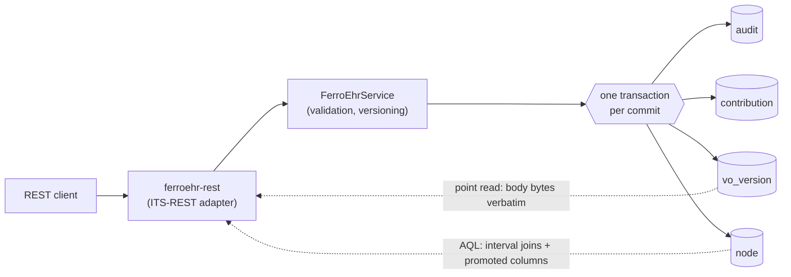
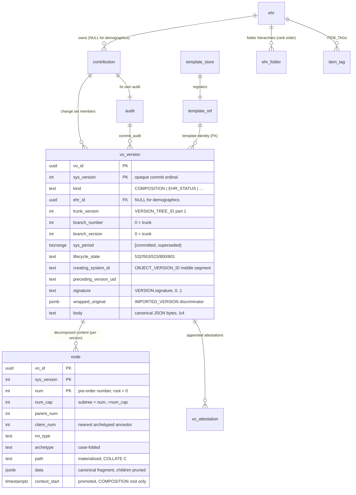
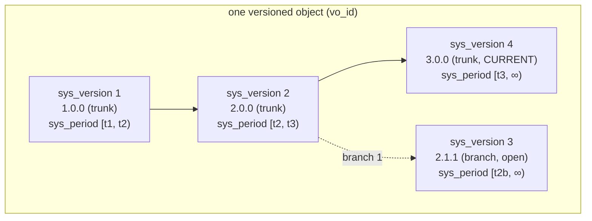
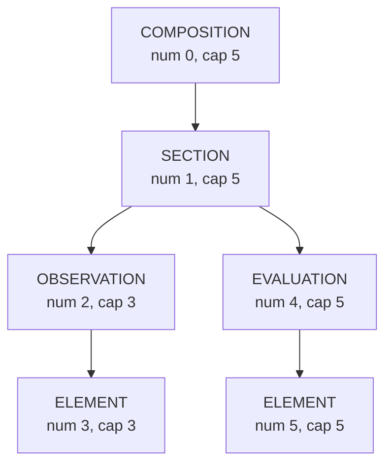
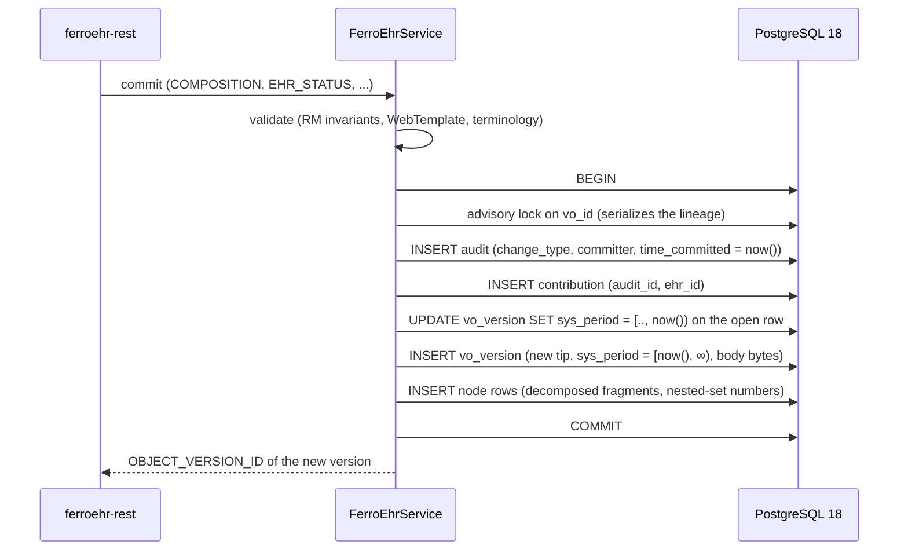
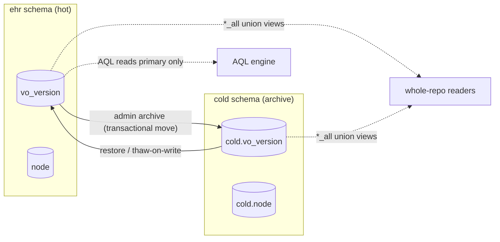

# Storage architecture

How FerroEHR physically stores clinical data. This is a living reference
document beside `docs/architecture.md` (the overall design) and
`docs/postgres-features.md` (the PostgreSQL 18 feature map); the authoritative
definition of every column is the schema itself
(`app/ferroehr/migrations/`), whose `COMMENT ON` lines carry the per-column
spec citations.

One thing up front: **openEHR defines no SQL schema.** What the specs do
define, and what this storage realizes, are the versioning and change-control
semantics (RM common `master06-change_control_package.adoc`), canonical data
fidelity (ITS-JSON), and the contribution/audit duties. The relational layout
below is our own PG18-native design, and the RM explicitly sanctions that
freedom: "Although the figure implies physical containment of Versions by a
Versioned object, this is only one possible implementation. Other
implementations (e.g. using orthodox relational structures) might use
references, separate compressed copies, or any other mechanism" (RM common
master06 §Overview).

## The big picture

Every versioned object (COMPOSITION, EHR_STATUS, EHR_ACCESS, FOLDER, the
demographic party kinds) is stored twice over, deliberately, in one
transaction:

1. **`vo_version`** holds the version row: identity, version tree position,
   validity interval, lifecycle state, and the canonical JSON body bytes
   served verbatim on point reads.
2. **`node`** holds the same content decomposed: one row per RM structure
   node, carrying a nested-set index and promoted predicate columns, so AQL
   never walks JSON to answer CONTAINS.

The database is PostgreSQL 18, split into four schemas:

| Schema | Holds | Migrations |
|---|---|---|
| `ehr` | the CDR proper: versions, nodes, EHRs, contributions, templates, queries, tags | `app/ferroehr/migrations/ehr/` |
| `ext` | our own `IMMUTABLE` helper functions (`openehr_magnitude`, `openehr_timestamp`) and the tenant context | `app/ferroehr/migrations/ext/` |
| `audit` | the IHE ATNA Audit Record Repository (`audit_event`), fed by `ferroehr::system_log` | `app/ferroehr/migrations/audit/` |
| `cold` | the archival tier: FK-free mirrors of `vo_version` / `node` / `vo_attestation` | `ehr/0007_cold_archive_tier.sql` |

## Core tables and how they relate

Supporting tables not drawn above: `stored_query` (stored AQL, qualified name
plus SemVer), `archetype_store` and `adl2_artefact` (the two DEFINITION
dialects), `ehr_index` (SM `I_EHR_INDEX`), `vo_archive` (the admin archive
marker), and the `sp_*` family (Subject Proxy Service). The `ehr` table itself
carries the three creation-immutable values (RM ehr master04 §Root EHR
Object: `system_id`, `id`, `time_created`) plus promoted copies of the current
EHR_STATUS subject reference and `is_queryable` / `is_modifiable` flags, which
back the one-EHR-per-subject index, the AQL full-population gate, and the
content-write guard without probing a JSON root per request.

## Versioning: one temporal table, no history pairs

Most CDRs split storage into a "current" table and a "_history" table.
FerroEHR does not: `vo_version` is one temporal table, and currency is a
predicate, not a location.

- Every version row carries `sys_period tstzrange`, the half-open validity
  interval `[committed, superseded)`. The current trunk version of an object
  is simply the row with `upper_inf(sys_period) AND branch_number = 0`, held
  unique by a partial index (`uq_vo_version_current`), which realizes RM
  common master06 `latest_trunk_version`.
- `ALL_VERSIONS` is the unfiltered table; `LATEST_VERSION` is that partial
  index. Time travel is a range containment test on `sys_period`.
- The spec-facing version identity is the three-part `OBJECT_VERSION_ID`
  `{object_id, creating_system_id, version_tree_id}` (RM common master06
  §Distributed versioning), stored as `vo_id` + `creating_system_id` +
  the `trunk_version`/`branch_number`/`branch_version` triple and held unique
  by `uq_vo_version_tree`. `sys_version` is deliberately not that number: it
  is an opaque per-object commit ordinal (1..n across trunk and branch
  commits) used as the join key for `node` and `vo_attestation`.
- Version keys and generated ids use PostgreSQL 18's native `uuidv7()`, so
  keys are time-ordered and index-friendly.
- A logical delete writes a content-less version with lifecycle state `523`
  (RM common master06 §Logical Deletion); nothing is physically deleted.
- An import (EHR-Extract, archive load) stores the wrapped
  `ORIGINAL_VERSION`'s own provenance verbatim in `wrapped_original`, while
  the row's own contribution/audit columns record the local act of committal
  (master06 §Committal and Audits). `NULL` there means a locally created
  `ORIGINAL_VERSION`; `NOT NULL` means the row is an `IMPORTED_VERSION`.

Non-overlap per lineage (one valid version per lineage at any instant) is
enforced by construction rather than by GiST exclusion constraints, which
were measured to serialize concurrent inserts: at most one open row per
lineage exists (the partial unique indexes), and every write closes the open
row and inserts its successor at the same `now()` inside one transaction, so
half-open ranges meet exactly. No openEHR spec governs the enforcement
mechanism; the semantics stay master06.

## Content decomposition: the `node` table

At commit, the accepted composition is decomposed into one row per RM
structure node. Each row stores the node's **canonical openEHR JSON fragment
verbatim** (the `openehr-its` ITS-JSON encoding) with its structure children
pruned out: no alias compaction, no synthetic fields, so what sits in
`node.data` is byte-identical in shape to what the API serves. Storage equals
wire.

The tree shape is captured as a **nested-set interval**: nodes are numbered
in pre-order (`num`, root = 0), and each row records the maximum number in
its subtree (`num_cap`). "B is contained in A" is then the integer test
`A.num < B.num AND B.num <= A.num_cap`, which makes AQL CONTAINS chains
plain integer range joins instead of JSON tree walks.

For the tree above, "OBSERVATIONs inside the SECTION" is
`section.num (1) < obs.num AND obs.num <= section.num_cap (5)`: rows 2 and 4
qualify by arithmetic alone.

Beside the interval, each row promotes the predicates AQL actually filters
on, so hot paths never open the JSON:

- `rm_type` (full RM type names, never compacted), `name`, `archetype`
  (case-folded at write, per BASE base_types master05 §Composite Identifiers
  and Case);
- the archetype-subsumption columns `arch_entity` / `arch_concept` /
  `arch_major`, parsed from full archetype HRIDs so a query naming a parent
  archetype matches specialisation children via an indexed prefix scan (BASE
  architecture_overview master10 §Design-time Relationships; the major
  boundary stays hard per AM master07 §Querying);
- `citem_num`, the nearest archetyped ancestor, for archetype-anchored path
  resolution;
- `context_start`, the promoted `EVENT_CONTEXT.start_time` on COMPOSITION
  roots, serving the dashboard ORDER BY from a partial index;
- `path`, the materialized path from the root (`COLLATE "C"`, so byte order
  equals tree order), used only for reassembly, never as an AQL predicate.

The promoted-column registry lives in `app/ferroehr/src/storage/promoted.rs`.
All of this is our own storage design; no openEHR spec governs storage
columns.

## The write path: one transaction per commit

Every write realizes the openEHR contribution rule: "a `CONTRIBUTION` object
will be created, listing the affected `VERSION` objects, and including its
own audit object" (RM common master06 §Contributions), and a Contribution
commits only if every member commits (master06 §Committal and Audits). In
storage terms, one `sqlx::Transaction` per service-level write:

Details that matter:

- `time_committed` is always server-computed (master06 §Committal and
  Audits: it "should therefore be computed on the server"), never
  client-supplied.
- The close-out UPDATE and the successor INSERT use the same `now()`, which
  is what makes the half-open intervals meet with no gap and no overlap.
- The body bytes in `vo_version.body` are materialized from the accepted,
  uid-stamped value **before** decomposition, stored as `text` (not `jsonb`,
  which would re-order keys) so a point read serves the codec's
  `_type`-first, BMM-declared field order verbatim.
- `vo_version.stable_compatible` (migration `0008`) stamps at commit whether
  the released-generation reader can express the body, which is what the
  `spec_profile` read gate consults (see `docs/VERSIONS.md` §Spec version
  policy).

## Read paths

**Point reads** (GET composition, EHR_STATUS, a named version) resolve the
version row and serve `vo_version.body` verbatim: one detoast, no
re-aggregation, zero translation between storage and wire.

**AQL** never touches the body. The engine plans over `node`: CONTAINS
chains become nested-set interval joins, class and archetype predicates hit
the promoted columns and their indexes, and leaf values are extracted from
the canonical fragments with `jsonb_path_query_first`, jsonpath item
methods, and `ext.openehr_magnitude` (our `IMMUTABLE` helper realizing
DV_ORDERED ordering semantics). `JSON_TABLE` (PG 17+) serves array
unnesting. The full construct-by-construct envelope lives in
`.claude/rules/aql-engine.md`; the AQL population gate filters the promoted
`ehr.is_queryable` column directly (SM `i_query_service.adoc`).

**Time travel** (VERSIONED_OBJECT version-at-time, REST `version_at_time`)
is a `sys_period @> timestamptz` containment test on the same one table.

## The cold archival tier

Admin-archived objects move physically out of the primary tables into the
`cold` schema (FK-free mirror relations of `vo_version`, `node`,
`vo_attestation`), transactionally and reversibly. The consequences are
deliberate and visible:

- point reads retry cold only on a primary miss;
- whole-repository readers (exports, dumps) use the `*_all` union views;
- **AQL stays primary-only**: archived content leaves the queryable store
  until restored;
- a write to an archived object thaws it back to the primary tier first.

No openEHR spec governs archival tiers; this is our own design, recorded
here and in the migration (`ehr/0007_cold_archive_tier.sql`).

## Why this design

The shape follows measured PostgreSQL physics rather than habit
(`docs/postgres-features.md` has the feature map):

- JSONB has no partial detoast: a big single-document design pays
  whole-document decompression for every leaf access. Decomposed ~360 B
  fragments stay under TOAST and each read touches only the rows it needs.
- GIN indexes serve neither ranges nor ordering, so CONTAINS and ORDER BY
  ride integers and promoted btree columns instead.
- PG 18's temporal machinery (`tstzrange`, partial unique indexes,
  `uuidv7()`, `RETURNING OLD/NEW`) makes the single temporal version table
  cheaper than current/history pairs, with `ALL_VERSIONS` a plain scan of
  one relation.

Every table and column comment in the migrations either cites the vendored
spec clause it realizes or states "our own storage design"; when this
document and the migrations disagree, the migrations win.
