# Templates & EHR browsing

These are the console's read-and-write screens over clinical content: the
templates the CDR validates against, and the EHRs, folders, compositions and
contributions committed under them. Every screen here is a view of the CDR's
public API, so anything you change is a normal openEHR write that every other
client sees.

<!-- toc -->

## Template Manager

Upload operational templates (the CDR's validation diagnostics surface
verbatim on rejection) and browse what is installed. The screen serves both
archetype-model families, switched by the **ADL 1.4** / **ADL 2** pills under
the title. The choice is in the URL — `/templates` is the ADL 1.4 listing and
`/templates?family=adl2` the ADL 2 one — so either is a shareable link, and
the filter and the paging footer work the same in both.

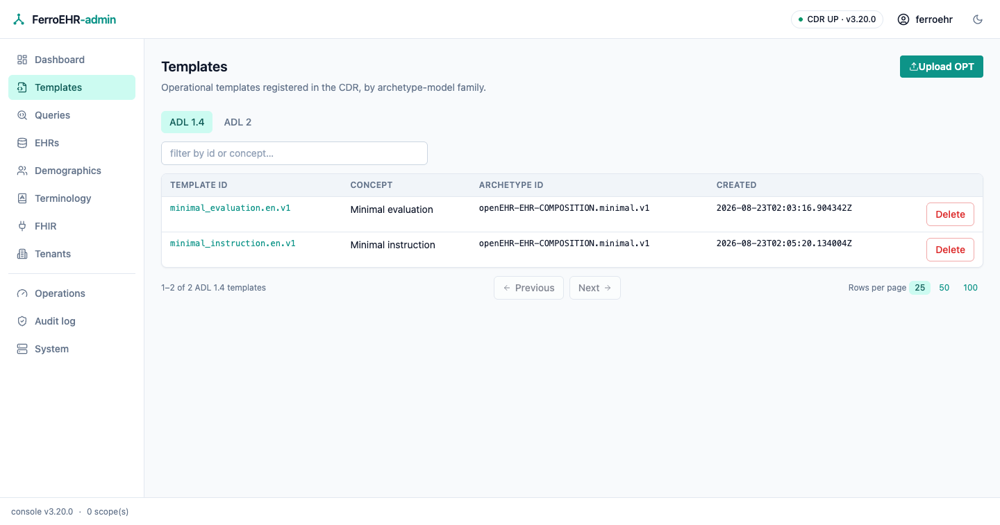

The template detail screen shows the **path catalog** — the template's tree
with each node's archetype path, RM type, and constrained value sets — plus
the raw OPT XML and a CDR-generated example composition in any supported
format.

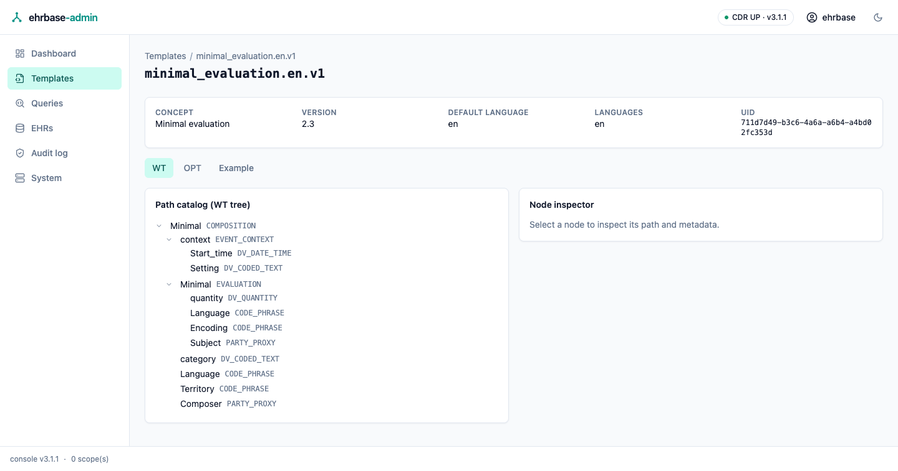

The list filters as you type, matching a template's id, its concept, or its
root archetype id, and is paged by the shared footer under the table — rows on
screen out of how many, previous/next, and 25/50/100 rows per page, all in the
URL (see [Paging](index.md#paging)). The filter narrows the rows; the footer
counts what the filter left.

The list also shows each template's root **archetype id**, and the detail
screen opens with an identity card — concept, version, default language,
languages, and the template **UID** — read from the operational template
itself.

### Deleting a template

When the CDR's admin API is enabled, each list row and the detail screen
offer **Delete**. It opens a confirmation dialog naming that template, and
nothing is sent until you confirm there. The CDR refuses a template that a
committed composition still uses — the refusal is shown with the referencing
count, so delete or migrate those compositions first, and it likewise refuses
a session without the ADMIN role, naming what is missing. If the admin API is
off, no delete button is shown at all: the console asks the server which API
groups it serves (the openEHR System API conformance manifest) before offering
any of them.

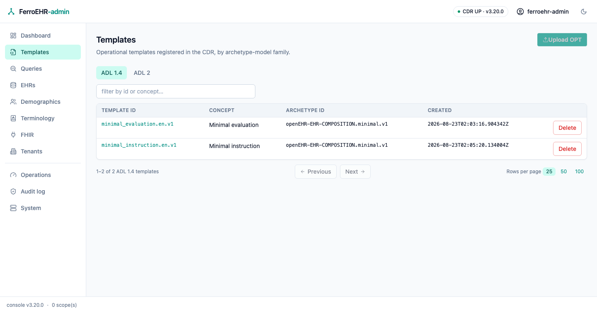

> [!WARNING]
> This is a physical delete of the template registration, not a versioned
> one. The server-side switch is `admin.enabled`
> (`FERROEHR__ADMIN__ENABLED`), off by default — see
> [`[admin]`](../installation/config-auth.md#admin).

### ADL 2 templates

The **ADL 2** family lists the operational templates the CDR compiled from
ADL 2 sources. An ADL 2 artefact is identified by its archetype HRID —
`openEHR-EHR-COMPOSITION.vitals.v1.0.0` — whose trailing `.v1.0.0` is the
artefact's own release version, so several versions of one template appear as
separate rows and the list shows all of them, not just the newest.

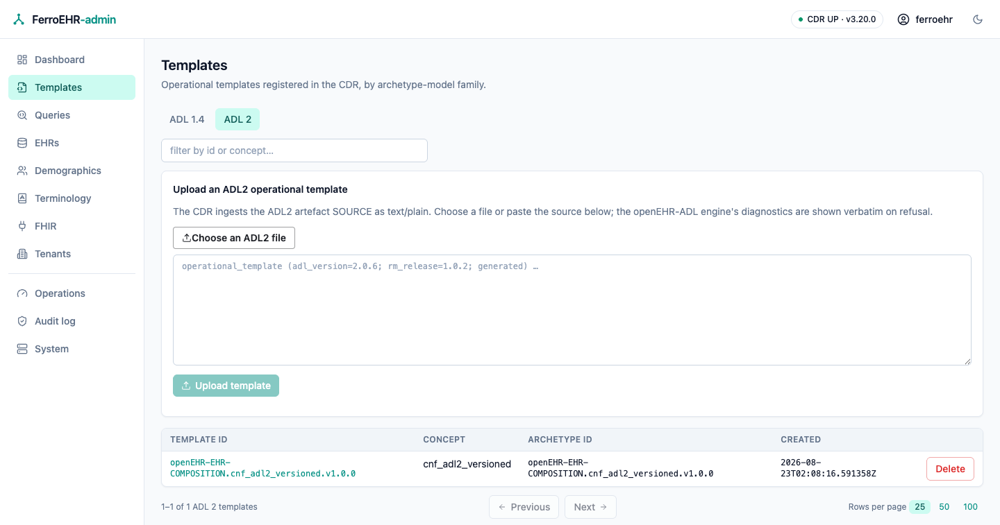

Uploading is different from ADL 1.4 in one way: the CDR ingests the ADL 2
artefact **source** as plain text rather than an XML document. The upload card
therefore offers both a file picker and a paste area, feeding the same editor —
choose a `.adls` file to load it in, or paste a source directly, then read it
over before sending it. **Upload template** stays disabled until there is
something to send. If the openEHR-ADL engine refuses the source, its
diagnostics — the AOM 2 rule codes with their line and column — are shown in
full above the editor as well as in the failure notification, so the source can
be corrected in place and re-sent.

Opening a row shows the artefact's three server-side representations:

- **Source** — the stored ADL 2 text, exactly as the CDR holds it.
- **AOM2 JSON** — the same operational template as canonical JSON
  (`OPERATIONAL_TEMPLATE`), which is where the constraint structure, node ids
  and occurrences are readable.
- **Example** — a composition the CDR generates from the template, in
  canonical JSON, canonical XML, FLAT or STRUCTURED.

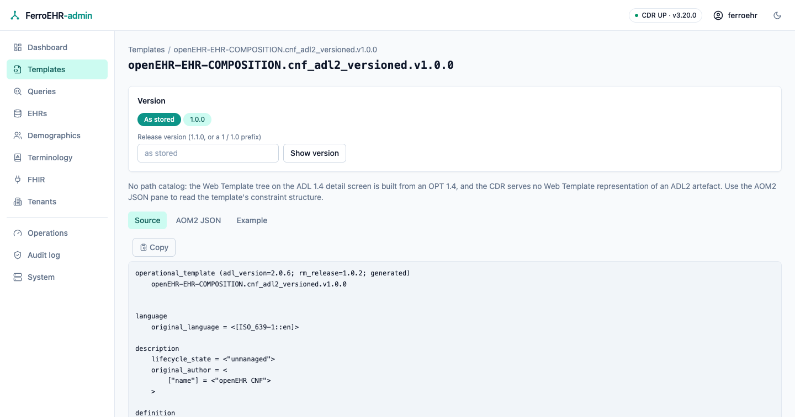

The **Version** bar above the panes pins the Source and AOM2 JSON reads to a
particular release version. The chips are the versions the CDR actually holds
for that HRID family, and *As stored* returns to the artefact the link named.
The box beside them also accepts a prefix — `1` or `1.0` — which the CDR
resolves to the highest matching version, so `1` on a family holding 1.0.0 and
1.1.0 shows 1.1.0. Whichever you pick lands in the URL as `?version=`, so a
pinned view is shareable. The example is generated from the artefact the link
named and does not follow the version bar: the CDR publishes no versioned
example resource.

> [!NOTE]
> ADL 2 templates have no path catalog. The catalog on the ADL 1.4 detail
> screen is built from an OPT 1.4 Web Template, and the CDR serves no Web
> Template representation of an ADL 2 artefact — so the screen says so instead
> of showing an invented tree. Read the AOM2 JSON pane for the structure.

#### Deleting an ADL 2 template

ADL 2 rows carry the same **Delete** affordance the ADL 1.4 rows do, and it
behaves the same way: a confirmation dialog naming the artefact, nothing sent
until you confirm, the refusal shown with its referencing count when a
committed composition still uses the template, and no button at all when the
CDR's admin API is off.

What differs is the resource underneath. An ADL 1.4 delete removes the
template registration from the Admin API's template store; an ADL 2 delete
removes the whole **artefact** — archetype, template or OPT — from the
definition store, which keeps no version history of it, so the deleted release
version is simply gone. Other versions of the same HRID family are untouched:
each is its own artefact, deleted from its own row. The route is admin-gated
like the rest, so a session without the ADMIN role is refused with a message
naming what is missing.

## EHR browser

Find an EHR by id (or browse the most recent), then work through its tabs:
EHR status, the status version history, the folder directory, the composition
list, contribution lookup, and the EHR's item tags. Find-by-id is a plain
form: it works in a browser with JavaScript disabled, and
`/ehrs?find=<ehr_id>` is a shareable shortcut straight to an EHR.

The EHR detail screen opens with a **summary header**. Its top line answers
"whose record is this, and what may be done with it": the **subject** — the
external id and namespace the EHR status references, or an explicit "self — no
external subject reference" when the EHR is bound to no outside identity — next
to the **queryable** and **modifiable** badges. Below it are the EHR resource's
own facts: its id, the system that created it, when it was created, and the
reference to its current EHR status. A mistyped or unknown id is reported
there, once, instead of once per tab.

The identity line and the Status tab read the *same* EHR status document, so
they can never disagree: saving a status change updates both at once.

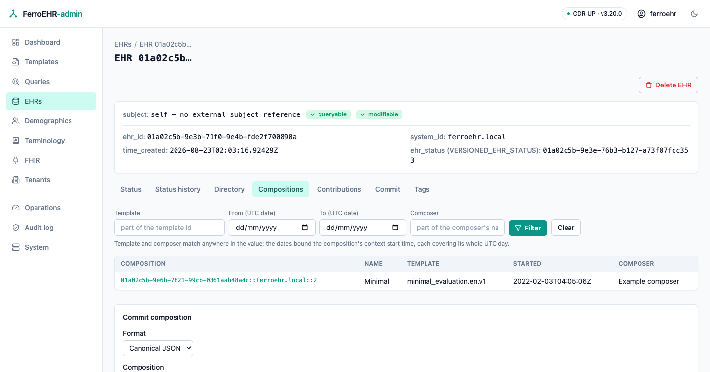

### Filtering an EHR's compositions

The compositions tab lists the EHR's compositions newest first, with their
template, context start time and composer, and narrows on four filters:

- **Template** — matches anywhere in the composition's template id.
- **From** / **To** — bound the composition's context start time. Each is a
  date and covers its whole UTC day, so a From and To of the same day keeps
  everything recorded during it.
- **Composer** — matches anywhere in the composer's name.

Every filter lives in the URL (`?template=`, `?from=`, `?to=`, `?composer=`),
so a filtered view is a link you can share or bookmark, a reload keeps it, and
the browser's back button walks the filters you tried. Applying a filter starts
again at the first page. Leave them all empty for the plain list.

The filtering happens in the CDR, as one AQL query: what you type is bound as a
query parameter, never pasted into the query text, so an id containing quotes,
wildcards or anything else is matched literally. An empty result says whether
the EHR holds no compositions at all or simply none that match.

Clicking a composition opens it in the viewer's **Rendered** clinical reading
(below) rather than the raw document — the other views are one click away.

### Deleting an EHR

With the CDR's admin API enabled, the EHR detail screen offers **Delete EHR**
above the tabs. The confirmation dialog spells out the EHR id and what goes
with it: this is the CDR's *physical* delete — every composition,
contribution and audit record under the EHR is removed, and it cannot be
undone. On success the console returns to the EHR list; a session without the
ADMIN role is refused with a message naming what is missing. Without the
admin API the button is not rendered at all.

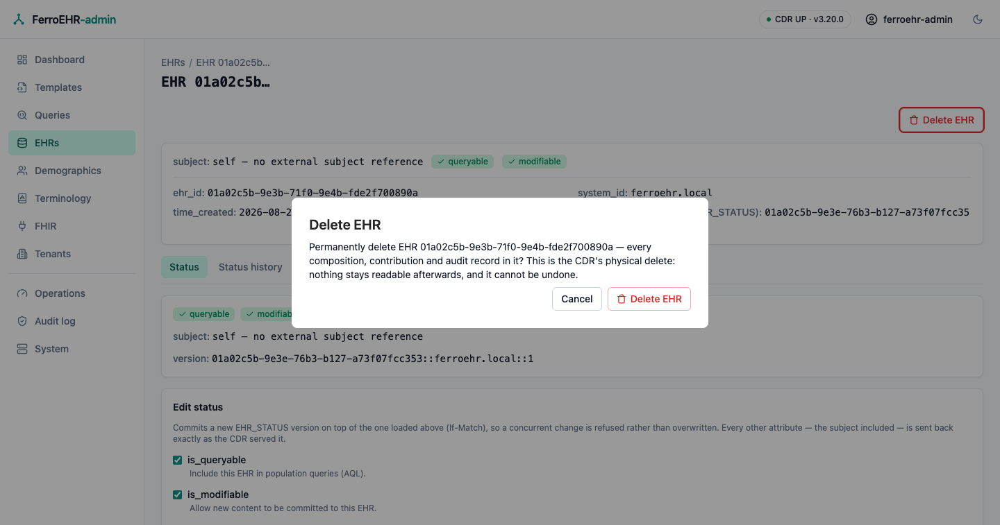

> [!WARNING]
> Use this for test data. It is not the openEHR logical delete: nothing
> stays readable afterwards.

### Creating EHRs and committing compositions

The EHRs screen can **create an EHR** — empty, or bound to an external
subject (id + namespace) — and find an existing one **by subject id** as
well as by EHR id. The create card also takes an optional **EHR id**: leave
it blank and the CDR mints one, or supply a UUID to create that exact EHR.
A value that is not a UUID is refused before anything is sent (openEHR
strongly recommends a UUID for a client-supplied EHR id), and an id that is
already in use comes back as the CDR's own conflict — nothing is silently
overwritten.

The EHR detail screen's compositions tab includes a
**Commit composition** form: paste a canonical JSON, canonical XML, or
FLAT document (FLAT requires the template id, sent as the
`openehr-template-id` header) and the CDR's validation diagnostics are
shown verbatim on rejection.

The contributions tab opens with a **contribution activity** timeline —
writes to this EHR per calendar day, bucketed from a wider window of the same
contribution data the paged list below it shows.

### Committing several changes at once

Each form above commits one thing. When changes belong *together* — a new
composition and the EHR status that goes with it — the **Commit** tab commits
them as one openEHR **contribution**: an atomic change set. Every staged
change is committed together, or none of them is. Nothing is written halfway.

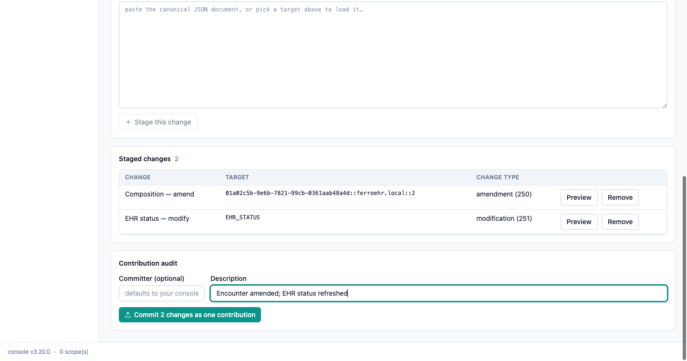

Build the change set one entry at a time. Each entry is one of three things:

- **Composition — create**: pick the template and paste the canonical JSON
  document. This commits a brand-new composition.
- **Composition — amend**: pick one of the EHR's existing compositions. Its
  current version is loaded into the editor for you, and the change carries
  that version as the one it supersedes, so a concurrent write is refused
  rather than overwritten.
- **EHR status — modify**: the EHR's current status is loaded the same way;
  edit it and it commits as a new status version.

The **change type** offered for each entry is exactly what the openEHR wire
accepts for it: a creation for a new composition, an amendment or a
modification for anything that supersedes an existing version. The
**contribution audit** below the list carries the change set's description
and, optionally, a committer name — leave it blank and your console identity
is used. The commit button always states what it is about to do
("Commit 2 changes as one contribution").

> [!NOTE]
> Staged changes live in the open browser tab only. The console stores nothing
> of its own, so leaving the screen discards them — and nothing reaches the
> CDR until you press commit.

On success the tab names the new contribution and every version it created,
and links straight to the Contributions tab, where the contribution opens with
all of its versions. On refusal nothing at all was committed: the staging list
is left exactly as it was, and the CDR's own diagnostic is shown verbatim so
you can correct the offending document and commit again.

### Directory editing

The Directory tab creates the EHR's FOLDER directory when none exists: it
commits the empty root folder, which the tree editor then fills. There is no
console-side library of folder shapes — the console stores nothing of its own,
and every folder you build is an ordinary directory version the CDR owns and
every other openEHR client can see.

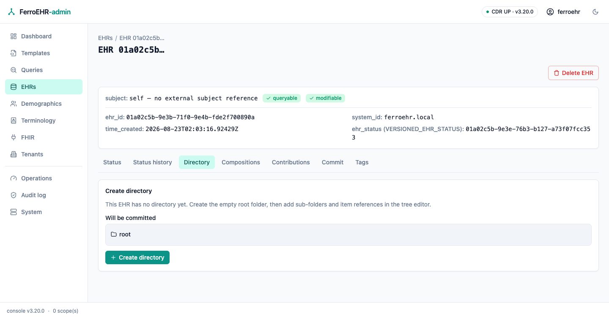

Once the directory exists, the tab is a full **structured tree editor**:
add, rename, and remove sub-folders at any node, and attach or remove
`OBJECT_REF` items — a picker lists the EHR's compositions, and a manual
form covers arbitrary references. Edits accumulate locally until the sticky
save bar commits them as one new version (`If-Match` concurrency: a
concurrent change never silently overwrites — a conflict banner keeps your
unsaved edits and offers an explicit reload-or-overwrite choice). An
advanced mode still edits the canonical JSON directly.

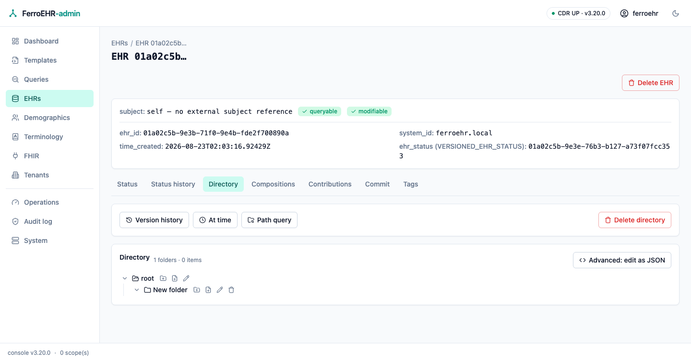

The toolbar adds the read-side tools: **version history** (every directory
version, read-only preview, one-click restore of an older tree), an **At time**
lookup that resolves the directory as it stood at a chosen instant, a
**path query** for one sub-folder, and the two-step **directory delete** (a
logical delete — the history stays readable, and a new directory can be created
afterwards).

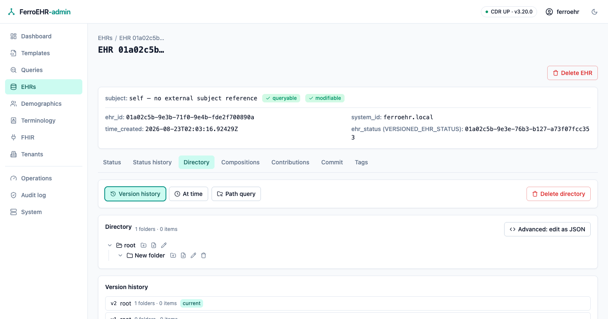

## Composition viewer

Any composition renders in canonical JSON, canonical XML, FLAT, or
STRUCTURED — switch freely; the CDR converts. The version dropdown walks
the revision history, and each version's audit (committer, time, change
type) is shown alongside.

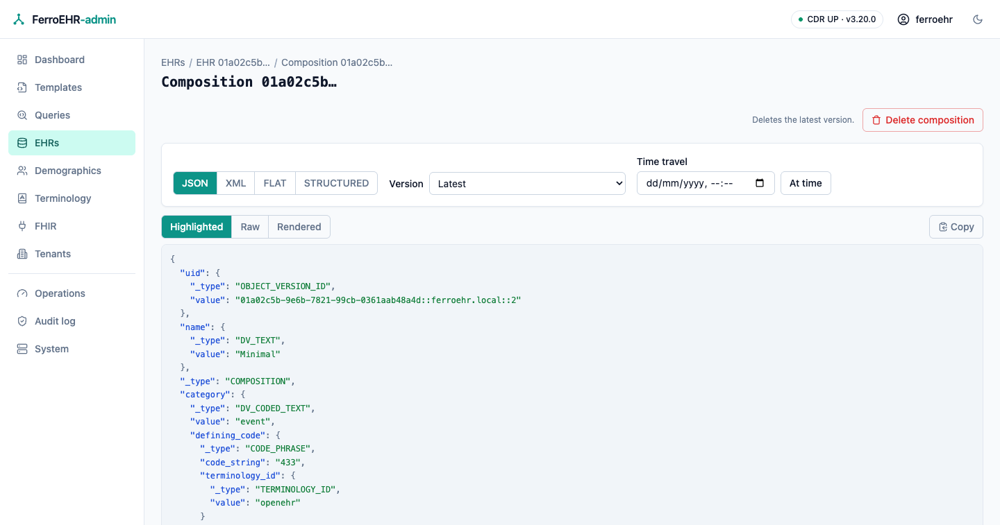

Every document pane in the console — the composition viewer, the EHR status
tab, the directory raw mode, a contribution, a template's OPT and example
tabs — is the same viewer:

- **Highlighted** (the default): the document exactly as the CDR returned it,
  with JSON and XML syntax highlighting. The highlighter is pure Rust, like
  everything else in the console; very large documents are shown unstyled
  rather than tokenized.
- **Raw**: the same text with no highlighting.
- **Rendered**: a template-free clinical reading of a canonical openEHR JSON
  document — RM section headings with their type and archetype node id, and
  one label/value row per `ELEMENT` (quantities with their units, coded text
  with its terminology code, a null-flavoured leaf saying so). It needs no
  operational template, so a composition whose template has since been
  removed still reads normally. The tab appears only for canonical JSON;
  bookkeeping (language, territory, category, uid) is folded away — the raw
  views remain the complete record.
- **Copy** puts the raw document text on the clipboard.

Which view a composition opens in is part of its link: `?view=rendered`,
`?view=raw` or `?view=highlighted` on the viewer's URL. That is how the
compositions tab's rows land straight on the clinical reading, and it makes
"open this composition the way I am looking at it" a shareable link.

**Edit as new version** opens the currently displayed canonical JSON in
an editor and commits it as the next version (`If-Match` on the latest
version — a concurrent change is reported instead of overwritten).

A version **timeline strip** walks the revision history at a glance, and
the **At time** picker resolves whichever version was current at a chosen
moment (`version_at_time`).

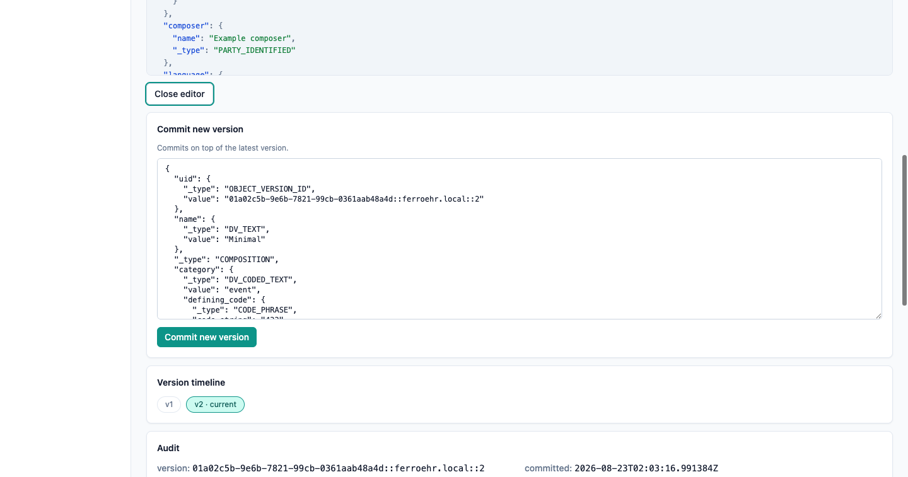

A **Versioned object** card below the audit reads the versioned composition
itself and the selected version directly: the versioned-object id, the owning
EHR, when the object was first created, and — for whichever version the
selector shows — its lifecycle state, its preceding version, the contribution
it was committed under, whether it carries a signature, and whether it still
carries content.

### Tags on a composition

Below the versioned-object card, **Tags** lists the composition's item tags —
free key/value markers any openEHR client can attach — and sets or deletes
one. Three things about them are worth knowing before you use them:

- **The panel edits the collection it names.** The line under the heading
  says which one: with the version selector on *Latest* that is the
  versioned composition's own collection; pin a version and the panel edits
  *that version's* tags instead. openEHR keeps the two apart — a tag belongs
  to exactly one target — so a tag set on the container is not visible on any
  version, and vice versa.
- **Saving re-sends the whole collection**, because that is what the openEHR
  tag update does. The console reads the current tags and merges yours in, so
  nothing is lost by accident — but the tag operations carry no version check
  at all, so a tag another client added between your load and your save can
  be. Reload before editing a busy composition.
- **A tag is identified by its key and target path together**, so the same key
  on two different paths is two tags; deleting addresses the key alone and
  removes both.

A tag write is not a versioned write: it commits no contribution, mints no
new version, and never appears in the revision history.

### Deleting a composition

**Delete composition** on the viewer performs the openEHR *logical* delete of
the composition's latest version, with a confirmation dialog first. The CDR
commits a deleted version on top of the current one: the composition stops
resolving as current and leaves the EHR's composition list, while every
earlier version and the audit trail stay readable. It is a normal versioned
write, so it needs no admin API — but it does need the version to still be
the latest one: if it moved on since the screen loaded, the CDR refuses the
delete and the message says to reload the history and retry.

> [!NOTE]
> This is not the same operation as **Delete EHR** above, which is the CDR's
> physical admin delete and leaves nothing readable.

The EHR detail's contributions tab lists the EHR's contributions — id,
commit time, committer, change type — with the by-uid lookup kept
underneath.

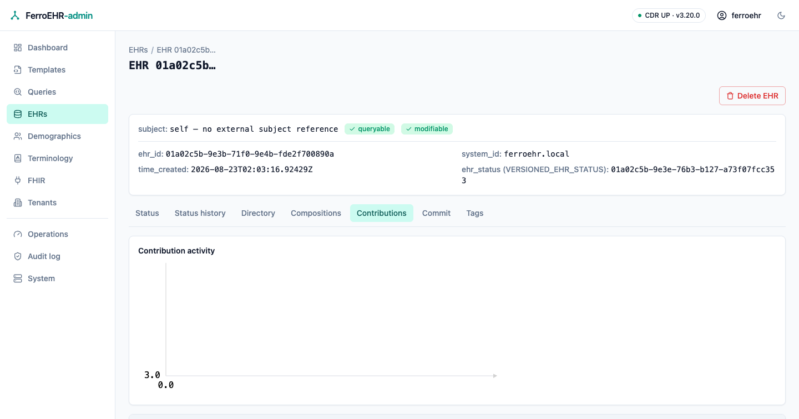

The commit form accepts canonical JSON, canonical XML, or FLAT:

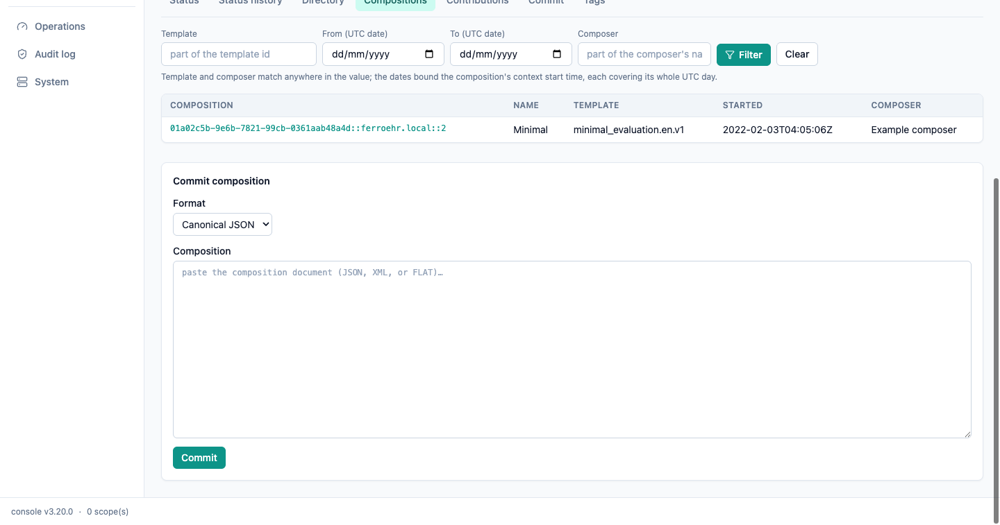

### EHR status

The **Status** tab renders the EHR's current `EHR_STATUS`: the queryable and
modifiable flags as badges, the subject, the version the document is, and the
full document itself. A non-queryable EHR is called out — AQL over it returns
nothing.

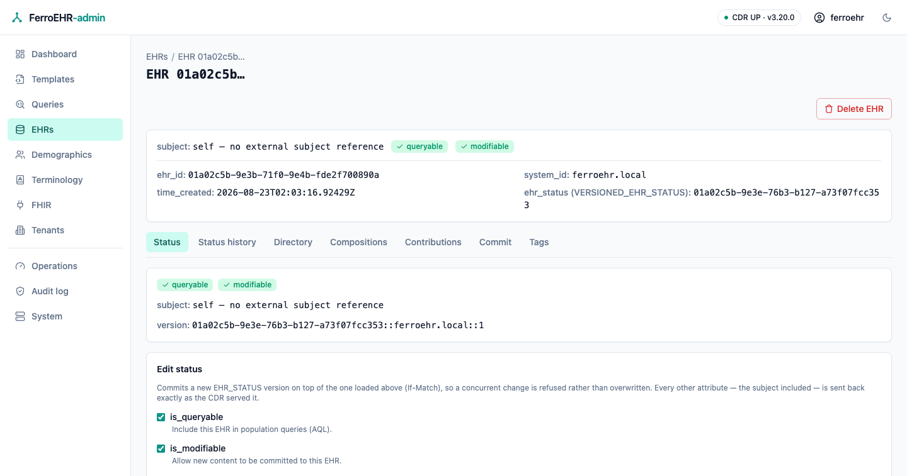

Below the document, **Edit status** changes the two flags and `other_details`:

- tick or untick **is_queryable** to include the EHR in population queries
  (AQL), and **is_modifiable** to allow new content to be committed to it;
- **other_details** takes a canonical-JSON `ITEM_STRUCTURE` (for example an
  `ITEM_TREE`); leaving it blank removes the attribute. A value that is not a
  JSON object is refused before anything is sent.

Saving commits a **new EHR_STATUS version** on top of the one the screen
loaded, and every other attribute — the subject included — is sent back
exactly as the CDR served it, so nothing the form does not show can be lost.

> [!NOTE]
> The save is conditional on the loaded version. If another client committed a
> new status in the meantime, the CDR refuses the write and the console says
> so ("EHR status changed on the server") instead of overwriting the change:
> reload the tab and reapply your edit. A rejected document keeps the CDR's own
> diagnostic on screen, beside the form.

### Tags on the EHR status

The Status tab ends with its own **Tags** panel, the same editor as the
composition one. It always edits the *versioned* EHR status's collection, so a
tag stays put when you edit the status into a new version — the status tab has
no version selector, and a tag pinned to a superseded version would quietly
disappear. Saving re-sends the whole collection and carries no version check,
exactly as on a composition.

### EHR status history

The **Status history** tab is the versioned view of the same object: the
`VERSIONED_EHR_STATUS` container and the selected version's envelope facts
(lifecycle state, preceding version, contribution, whether it is signed), the
revision history newest-first, and a date-and-time lookup that resolves the
version extant at that instant. Opening any row — or a resolved instant —
shows that version's `EHR_STATUS` document exactly as it stood at that commit.

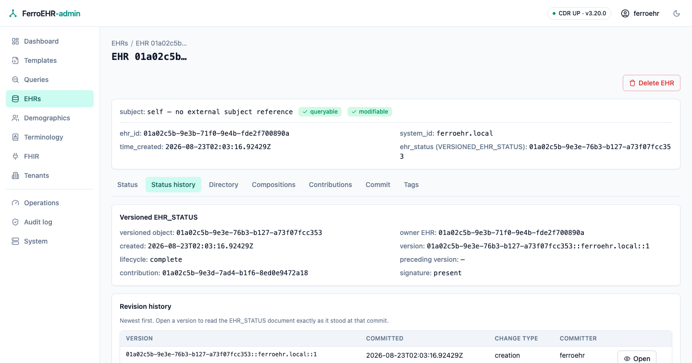

### Tags in this EHR

The EHR detail's **Tags** tab is the whole EHR's tag list in one place: every
tag on every object under it — compositions, the EHR status, the directory —
grouped by the object it sits on. Filter by key, value or target path; the
filter lives in the address bar, so a filtered view is shareable and
refresh-safe, and the shared footer pages the groups.

A tag names its target by identifier but not by kind, so each group's **Open**
asks the CDR which object holds that id before going there: a composition
opens in the viewer, the EHR status and the directory open on their own tabs.
If nothing in the EHR holds it any more — the object was deleted — the tab
says so instead of guessing.

The container form and one version of the same object appear as two groups,
because openEHR stores them as two separate collections.

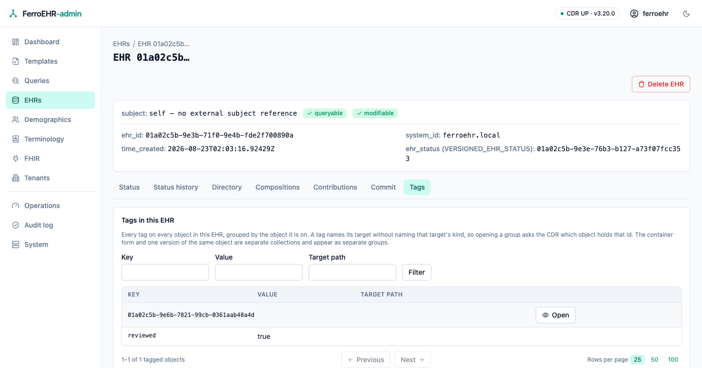
