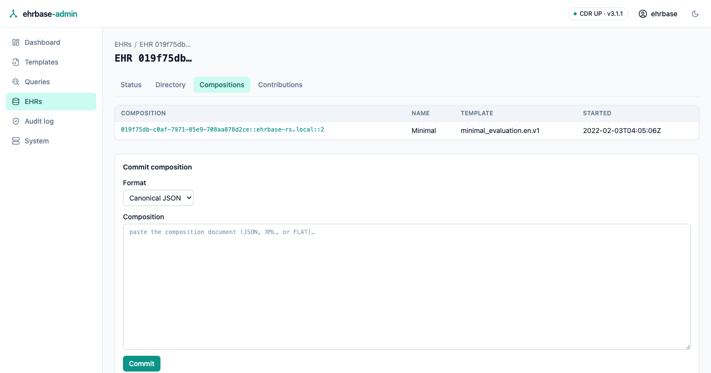
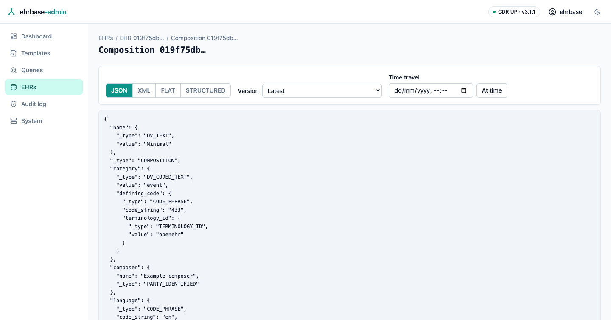
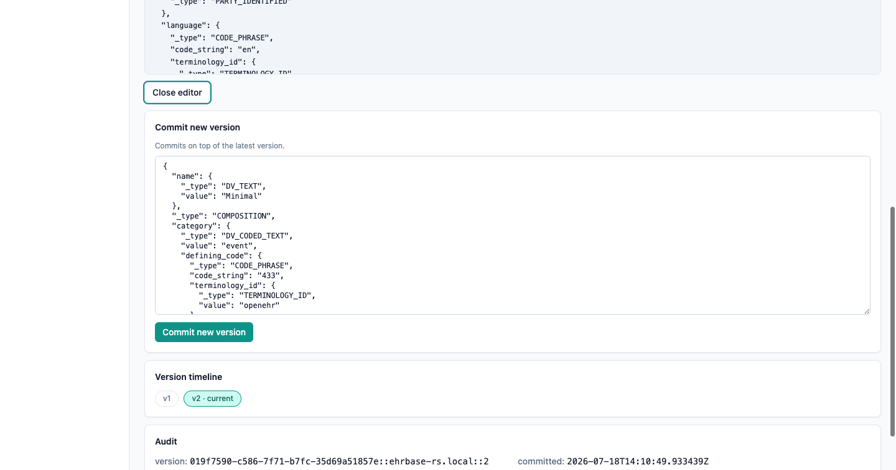
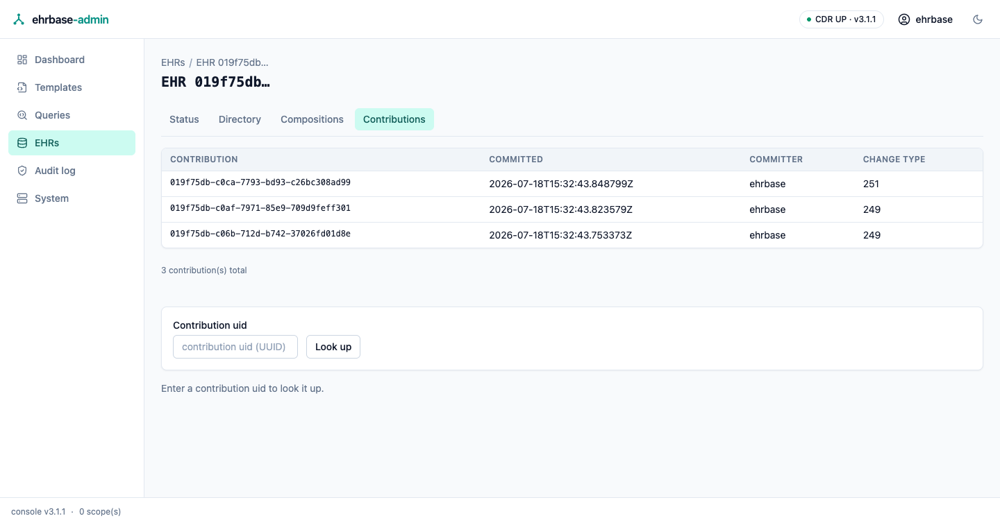
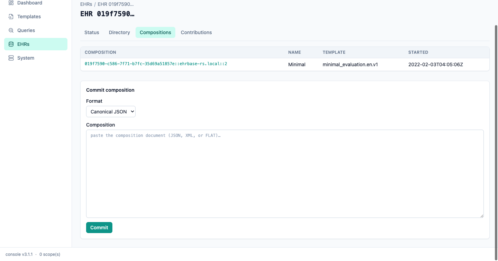
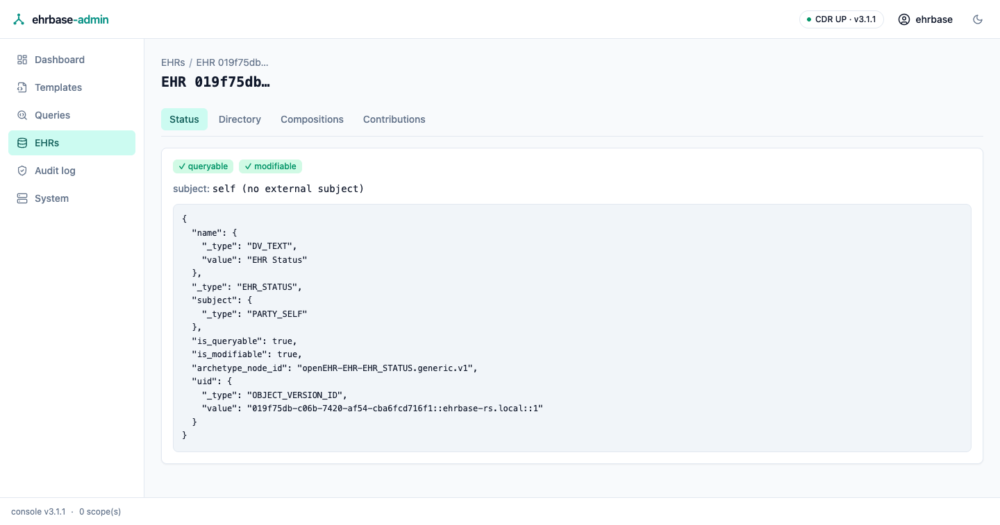

# Templates & EHR browsing

## Template Manager

Upload ADL 1.4 operational templates (the CDR's validation diagnostics
surface verbatim on rejection) and browse what is installed.

The template detail screen shows the **path catalog** — the template's tree
with each node's archetype path, RM type, and constrained value sets — plus
the raw OPT XML and a CDR-generated example composition in any supported
format.

The list also shows each template's root **archetype id**, and the detail
screen opens with an identity card — concept, version, default language,
languages, and the template **UID** — read from the operational template
itself.

## EHR browser

Find an EHR by id (or browse the most recent), then work through its tabs:
EHR status, the folder directory, the composition list, and contribution
lookup.

The EHR detail screen resolves the EHR status (queryable / modifiable) and
lists the EHR's compositions with their template, time, and version count.

### Creating EHRs and committing compositions

The EHRs screen can **create an EHR** — empty, or bound to an external
subject (id + namespace) — and find an existing one **by subject id** as
well as by EHR id. The EHR detail screen's compositions tab includes a
**Commit composition** form: paste a canonical JSON, canonical XML, or
FLAT document (FLAT requires the template id, sent as the
`openehr-template-id` header) and the CDR's validation diagnostics are
shown verbatim on rejection.

### Directory editing & folder templates

The Directory tab creates the EHR's FOLDER directory when none exists —
from an empty root or a console-local **folder template** (two built-ins
ship: episodes-by-year and clinical-areas) — and edits an existing one as
canonical JSON (committed with `If-Match`, so concurrent changes are
reported, never overwritten).

## Composition viewer

Any composition renders in canonical JSON, canonical XML, FLAT, or
STRUCTURED — switch freely; the CDR converts. The version dropdown walks
the revision history, and each version's audit (committer, time, change
type) is shown alongside.

**Edit as new version** opens the currently displayed canonical JSON in
an editor and commits it as the next version (`If-Match` on the latest
version — a concurrent change is reported instead of overwritten).

A version **timeline strip** walks the revision history at a glance, and
the **At time** picker resolves whichever version was current at a chosen
moment (`version_at_time`).

The EHR detail's contributions tab lists the EHR's contributions — id,
commit time, committer, change type — with the by-uid lookup kept
underneath.

The commit form accepts canonical JSON, canonical XML, or FLAT:

The EHR status tab renders the full `EHR_STATUS` document:

