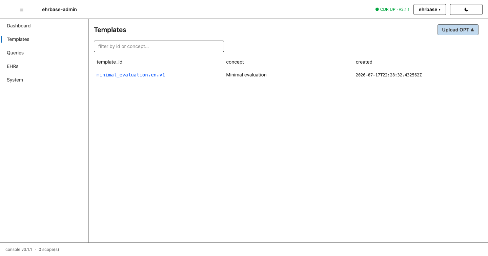
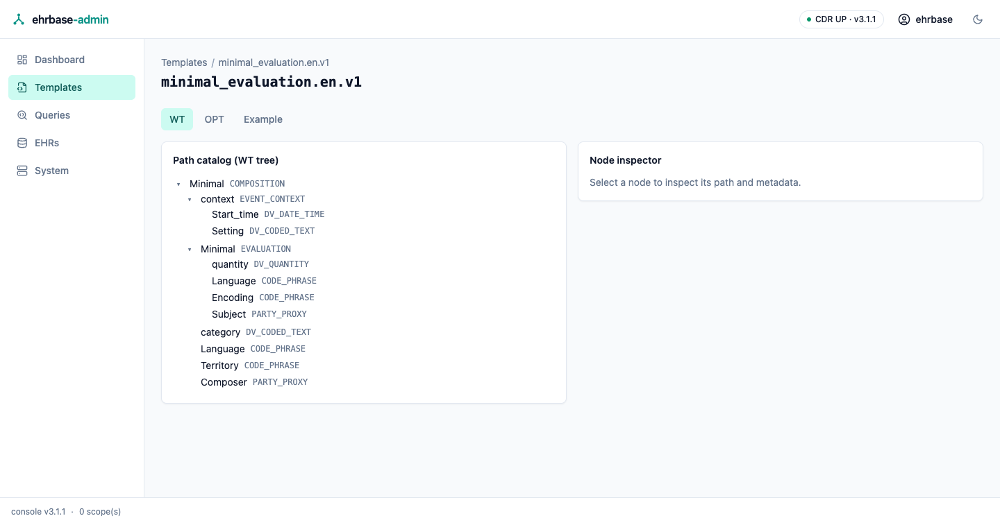
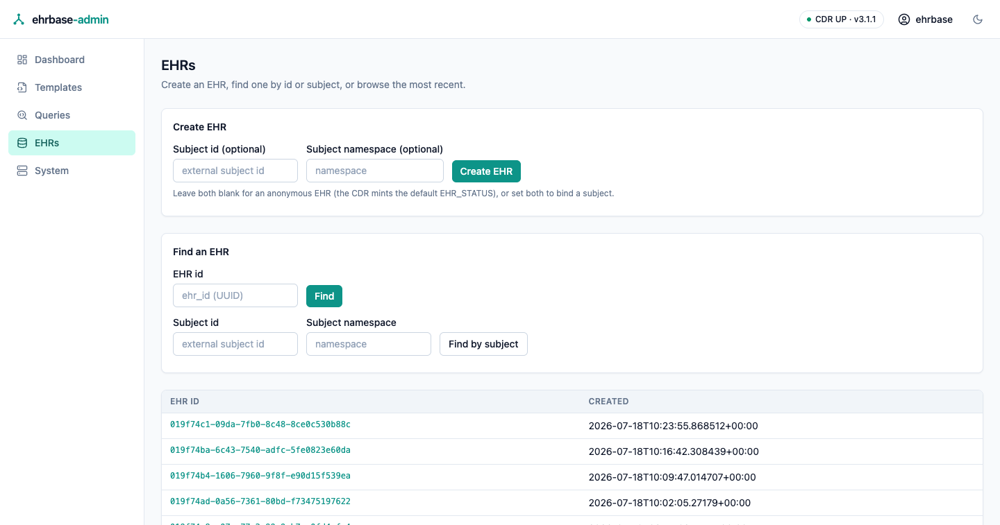
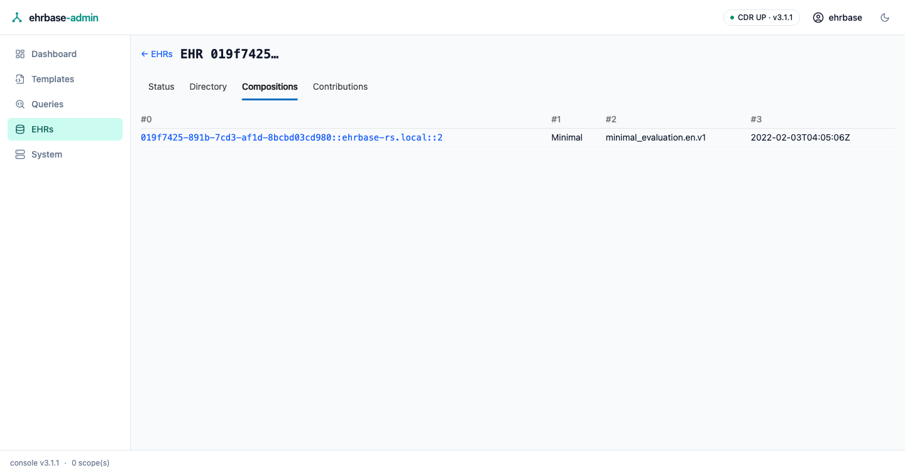
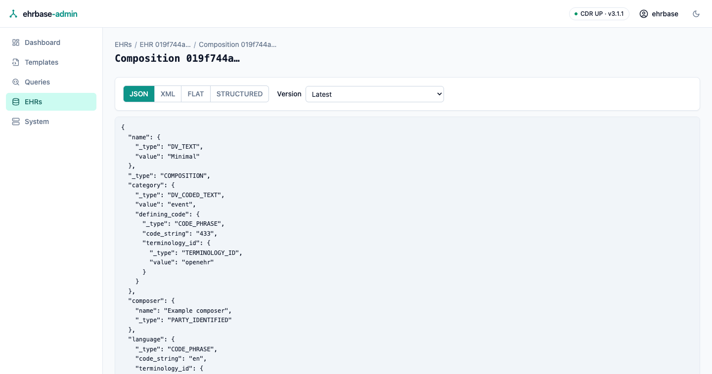

# Templates & EHR browsing

## Template Manager

Upload ADL 1.4 operational templates (the CDR's validation diagnostics
surface verbatim on rejection) and browse what is installed.

The template detail screen shows the **path catalog** — the template's tree
with each node's archetype path, RM type, and constrained value sets — plus
the raw OPT XML and a CDR-generated example composition in any supported
format.

## EHR browser

Find an EHR by id (or browse the most recent), then work through its tabs:
EHR status, the folder directory, the composition list, and contribution
lookup.

The EHR detail screen resolves the EHR status (queryable / modifiable) and
lists the EHR's compositions with their template, time, and version count.

## Composition viewer

Any composition renders in canonical JSON, canonical XML, FLAT, or
STRUCTURED — switch freely; the CDR converts. The version dropdown walks
the revision history, and each version's audit (committer, time, change
type) is shown alongside.

