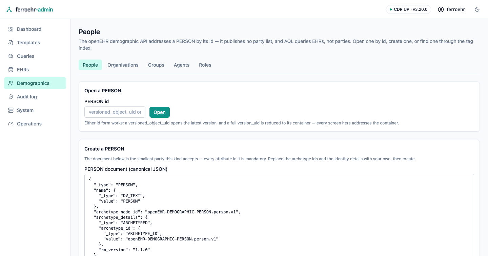

# Demographics

The **Demographics** screens work with the people, organisations, groups,
agents and roles the CDR holds — openEHR calls all five of them *parties* —
plus the relationships between them, the tags on them, and the commits that
changed them. Everything here is a view of the CDR's public API, so any change
you make is an ordinary openEHR write that every other client sees.

<!-- toc -->

> [!IMPORTANT]
> The openEHR demographic API is published in the **development** state within
> the REST release this server implements. It works, and this server implements
> it as specified, but the next openEHR release may change it — so treat these
> screens as less settled than the EHR ones, and expect the relationship
> surface in particular to move (see [Relationships](#relationships)).

## Finding a party

Pick a kind with the switcher across the top — **People**, **Organisations**,
**Groups**, **Agents**, **Roles** — then open a party by its id.

There is no party list, and that is the API rather than a gap in the console:
openEHR's demographic API publishes no "list all people" endpoint, and AQL
queries EHRs, not parties. A party is reached by its id. Two id forms work:

- a **versioned object uid** (`8849182c-82ad-4088-a07f-48ead4180515`) opens the
  latest version;
- a full **version uid** (`8849182c-…::your.system::2`) is reduced to the
  object it belongs to, because every screen here addresses the object.

Find-by-id is a plain form: it works before the page's WebAssembly has loaded,
and it works with JavaScript switched off entirely.

The one demographic collection the API *does* publish is the **tag index**, at
the bottom of the screen — see [Tags](#tags).

## Creating a party

The create card opens with the smallest document that kind accepts. Every
attribute in it is required by openEHR:

- the party's `name`, which openEHR uses for the party's **type** (`PERSON`,
  `ORGANISATION`, …) rather than for a person's name — the actual names live in
  `identities`;
- an `archetype_details` block, and a root `archetype_node_id` equal to the
  archetype id inside it;
- at least one `identity`;
- for a **role**, a `performer` — the party playing it.

Replace the archetype ids and the identity details with the ones your own
demographic archetypes use, then create. The document is sent exactly as you
wrote it, so nothing the console does not display can be lost; if the CDR
refuses it, the refusal is shown verbatim with the offending path.

On success the console opens the new party.

## Reading and editing a party

A party opens on four tabs. The tab is in the address bar, so a link to a tab
opens on that tab.

**Party** shows its facts — type, name, archetype, current version, how many
identities and inline relationships it carries — the whole document, and the
edit form. The document pane offers the same three views as everywhere else in
the console (highlighted, raw, and a rendered reading) and a copy button.

The edit form changes exactly two things: `identities` (which openEHR requires,
so it can never be emptied) and `details` (optional — clear the box to remove
it). Everything else in the document travels back to the CDR byte for byte as
it was served, so an edit can never silently drop an attribute this screen does
not show. Saving commits a **new version** on top of the one loaded, and the
CDR refuses the save if someone else committed in between — you are told to
reload and reapply rather than overwriting their change.

**Delete party** is above the tabs. It is openEHR's *logical* delete: it
commits a deleted version, so the party stops resolving as current while every
earlier version stays readable in History. The dialog spells that out before
anything is sent.

## Version history

**History** walks the versions of one party (or one relationship):

- the versioned object's own facts, plus the selected version's envelope —
  lifecycle state, preceding version, whether it is signed, and the
  **contribution** that committed it, linked to its own screen;
- the **revision history**, newest first, each row opening that version;
- an **at a point in time** lookup, which resolves an instant to the version
  that was current then and opens it;
- the document exactly as it stood at the opened version.

The current party and its past versions come from different endpoints on
purpose, which is why they live on different tabs: the Party tab is the one
reader of "what this party is now", and History never touches it.

## Relationships

A relationship joins two parties, from a **source** to a **target** — an
employment, an authority, a care relationship.

> [!NOTE]
> Relationship endpoints are **this server's own extension**. The openEHR
> release publishes no relationship API at all, so a different openEHR server
> will not serve them, and the console reports the resulting "not found"
> plainly rather than hiding it.

openEHR models a relationship in two ways, and both are visible here:

- **inside the source party.** A party document carries the relationships it is
  the source of, and the party's **Relationships** tab lists exactly those.
- **as its own object**, with its own id, versions and history — the shape this
  server's relationship endpoints serve.

The two are separate records; neither is a view of the other.

One consequence is worth knowing before you rely on the screen: **the target
side cannot be listed.** openEHR defines "relationships pointing at this party"
as a derived attribute, and the CDR does not populate it, so no request can
answer "who is related to this person". The tab says so where you would look
for the answer. What you can always do is open a relationship by its own id, or
follow it from either party it names.

**Relate this party** on the tab opens the create form with this party already
filled in as the source. Give the relationship a type (openEHR stores it as the
relationship's name), name the target party and its kind, optionally add a
`details` document, and create.

A relationship's own screen shows both ends as links to those parties, its
facts, an edit form for its type and details, its version history, and a
delete — all with the same versioning behaviour as a party. The two ends are
not editable: a relationship between different parties is a different
relationship.

## Tags

A tag is a free key/value marker a client can attach to a party — a follow-up
flag, a migration marker, a local cross-reference. The party's **Tags** tab
lists what it carries, sets a tag, and deletes one.

Two openEHR behaviours shape the panel:

- **Saving a tag re-sends the whole collection**, because that is what the
  openEHR tag update does. The console reads the current tags and merges yours
  in, so nothing is lost by accident — but a tag another client added between
  your load and your save can be. Reload before editing a busy party.
- **A tag is identified by its key and target path together**, so the same key
  on two different paths is two tags. Deleting addresses the key alone and
  removes both.

The **tag index** at the bottom of the browser screen is the demographic
space's whole tag list, filterable by key, value and target path, with the
filter in the address bar. It spans every kind, because a tag names its target
without naming that target's kind — which is why each row's **Open party** asks
the CDR where that id lives before opening it.

## Contributions

Every write on these screens commits a **contribution**: openEHR's record of
one change set, with who committed it, when, and why. Open one from the
contribution link on any version's envelope in History.

The contribution screen shows those audit facts, the versions the change set
touched — each linked to the party or relationship it belongs to — and the
whole record. It is read-only: contributions are made by writing parties, not
by authoring change sets here.
