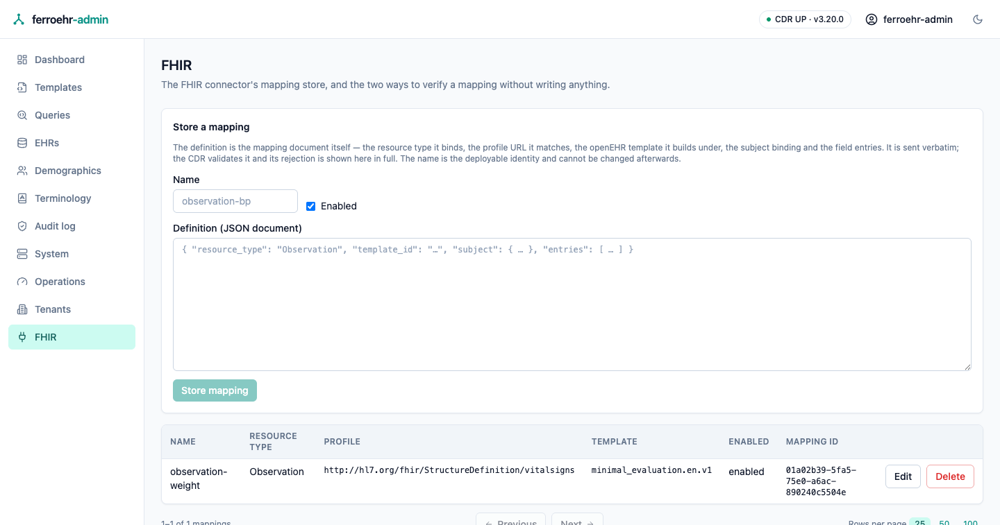
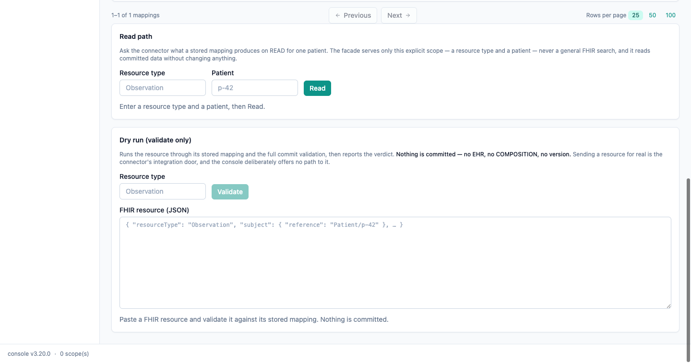

# FHIR connector

The **FHIR** screen administers the CDR's FHIR mapping store — the definitions
that translate between FHIR resources and openEHR compositions — and gives you
two ways to check a mapping does what you meant, without writing anything.
Everything on it comes from the CDR's own FHIR API over HTTP; the console has no
privileged channel and keeps no mapping state of its own.



<!-- toc -->

> [!NOTE]
> No openEHR specification governs FHIR interoperability — the connector is
> FerroEHR's own extension, and its wire vocabulary follows
> [HL7 FHIR R4](https://hl7.org/fhir/R4/). What the connector does with a
> mapping, and every status code it answers, is described in
> [FHIR connectors](../beyond-core/fhir.md); this page is about driving it from
> the console.

## The console never sends a resource for real

The connector's inbound door (`POST /fhir/r4/{type}`) maps a FHIR resource,
validates it, and **commits** it as an openEHR composition. That is an
integration act — something a sending system does, with its own credentials and
its own audit trail — so the console deliberately offers **no path to it**. You
cannot ingest a resource from this screen, by design.

What the console does offer is the two read-only ways to verify a mapping:

- the **read path**, which shows what a stored mapping produces when openEHR
  data is read back out as FHIR;
- the **dry run**, which runs a resource through the whole ingest pipeline
  including validation and reports the verdict, committing nothing.

## When it appears

The screen is **probe-and-hide**: on every page load the console asks the CDR
for `GET /admin/fhir_mapping`, and the sidebar entry appears only if that route
exists. A `404` — the CDR's answer when the connector is off, which is the
default — hides the entry entirely; any other answer counts as present, so a
refusal reaches you as a message on the screen that asked rather than as a
missing screen.

To get the screen, turn the connector on
([`[fhir]`](../installation/config-integrations.md#fhir)):

```toml
[fhir]
api_enabled = true
```

Reaching `/fhir` on a deployment without it is not an error either: the screen
renders one card naming that switch instead of a store that cannot be read.

> [!NOTE]
> The mapping store is mounted under `/admin`, so the CDR's role-based access
> control classes every call here as admin work. The screen renders whenever the
> surface exists — being allowed to use it is the CDR's per-request decision, and
> a session without the ADMIN role is refused with a message naming what is
> missing.

## The mapping store

The table lists every stored mapping with its name, the FHIR resource type and
profile it binds, the openEHR template it builds under, whether it is enabled,
and its store id — newest first, paged by the shared footer under the table (see
[Paging](index.md#paging)).

**A mapping is edited as a JSON document, and that is deliberate.** The
definition is a deep, open-ended structure — the subject binding, the commit
context, and one entry per mapped field with its own path and transform — whose
shape the CDR owns. A form built out of boxes here would be a second model of it
that drifts the moment the connector grows a field, so the console sends the
document you wrote, verbatim, and shows the CDR's answer, verbatim. The
definition's shape is documented under
[Mappings are data you manage](../beyond-core/fhir.md#mappings-are-data-you-manage).

- **Store a mapping** with the card above the table: a name and the definition
  document. The button stays disabled until the name is addressable (letters,
  digits, `_`, `.` and `-`) and the definition parses as a JSON object — that
  much the console checks before spending a round trip; everything else is the
  CDR's judgement, and its rejection is shown in full beside the failure
  notification. The most common one on a fresh deployment is an unknown
  `template_id`: upload the operational template first.
- **Enabled** decides whether the connector resolves the mapping at all. A
  disabled mapping stays stored and editable but takes part in nothing — the way
  to retire a mapping without deleting it.
- **Edit** on a row opens the document in an editor, seeded with what is
  currently stored. The name is not editable: the CDR treats it as the mapping's
  deployable identity, so a rename is a new mapping.
- **Delete** on a row asks for confirmation naming the mapping, and nothing is
  sent until you confirm there. Deleting a mapping stops the connector accepting
  and serving that resource type; **data already committed through it is
  untouched**, and stays readable through the openEHR API as normal.

Every one of those writes reports both outcomes — a success and a failure are
equally visible — so a refused change never looks like nothing happened.

> [!WARNING]
> Two enabled mappings for the same resource type resolve by
> `meta.profile`: an exact `profile_url` match wins, and a mapping with no
> profile is the type's default. A resource that declares no profile only ever
> matches the default, so a store with profile-scoped mappings and no default
> answers `404` for plain resources.

## Read path



Enter a resource type and a patient, then **Read**. The console calls the CDR's
read façade (`GET /fhir/r4/{type}?patient=…`) and shows the FHIR Bundle it
answers with — each entry produced by running a stored mapping in reverse over a
committed composition.

The scope lives in the URL, so a read is shareable, survives a reload, and works
before the page's WebAssembly has loaded. Both fields are required: the façade
serves this explicit scope only, never a general FHIR search.

Two answers are worth recognising:

- **An empty Bundle** (`"total": 0`) means the mapping resolved and nothing is
  stored for that patient — an answer, not a failure. Check the patient
  identifier against the mapping's `subject` binding: the connector strips the
  configured prefix (`Patient/`) and matches the remainder in the configured
  namespace.
- **An `OperationOutcome`** is the connector refusing the read — an unsupported
  resource type, a missing scope. It is rendered exactly as the CDR wrote it,
  inline, because its `diagnostics` text is the answer to what went wrong.

## Dry run

Paste a FHIR resource, name its type, and **Validate**. This calls the CDR's
[`$validate` operation](../beyond-core/fhir.md#validating-without-committing-validate),
which runs the full ingest pipeline — mapping resolution, the composition build,
the provenance stamp, and the *same validation the real commit runs* — and then
throws the result away.

**Nothing is committed: no EHR, no composition, no version.** The target EHR is
resolved and reported, never created.

The panel reports one of three verdicts, and the difference matters:

| Verdict | What it means |
|---|---|
| **Valid** | The validation ran and the resource maps to a composition the CDR would accept. The outcome names the resolved template and says whether the commit would land in an existing EHR or create one. |
| **Invalid** | The validation ran and the CDR would refuse the mapped composition. The outcome carries the openEHR validator's own rejection — the exact text a real ingest would fail with. |
| **Not validated** | No verdict was reached at all: no mapping matches the type, the type is outside the connector's set, or the resource could not be mapped. The outcome says which. |

The full `OperationOutcome` is shown under the verdict either way. This is the
loop mapping development is meant to run in: edit the definition above, dry-run a
real sample resource, read the rejection, repeat — and only point the sending
system at the real ingest door once the verdict reads valid.
