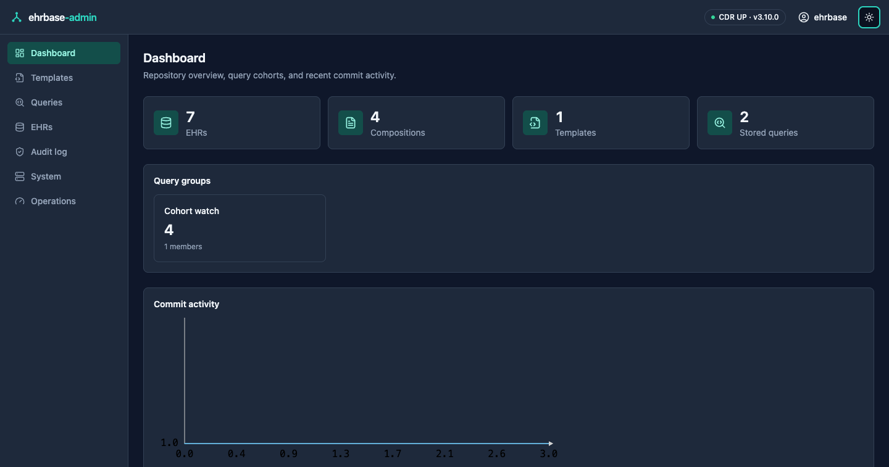
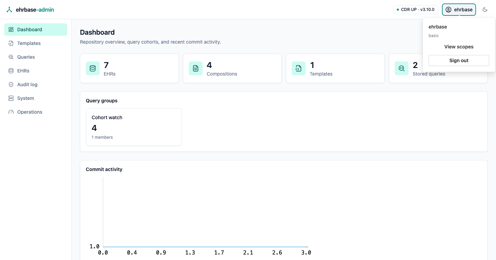
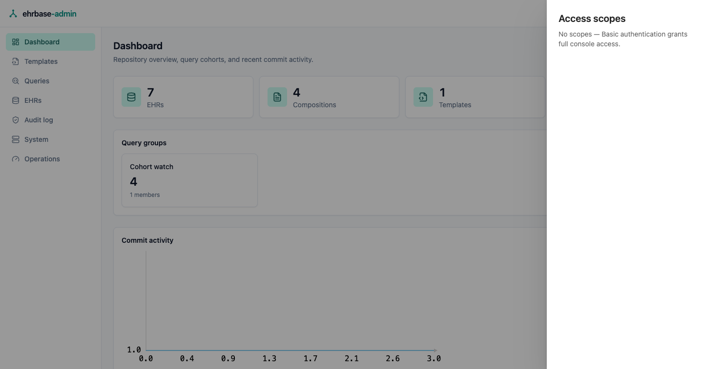
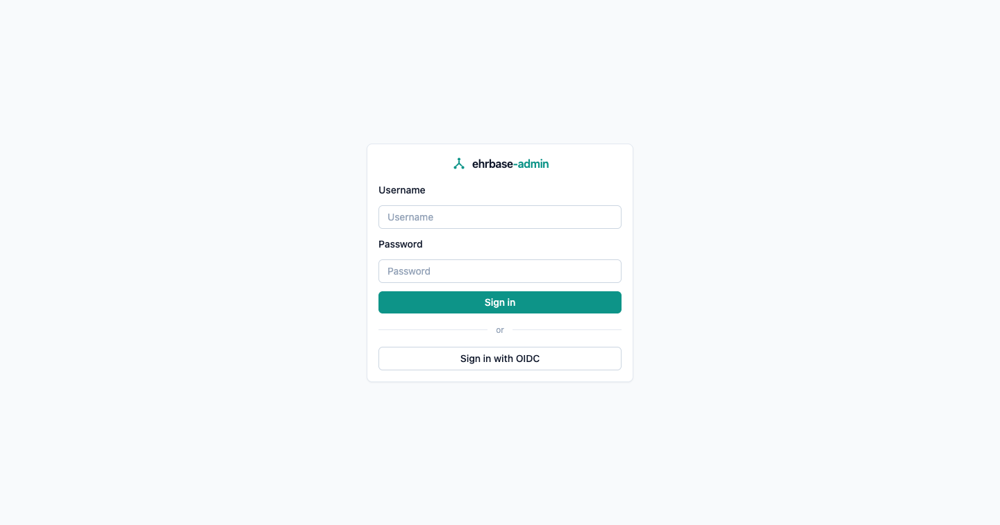
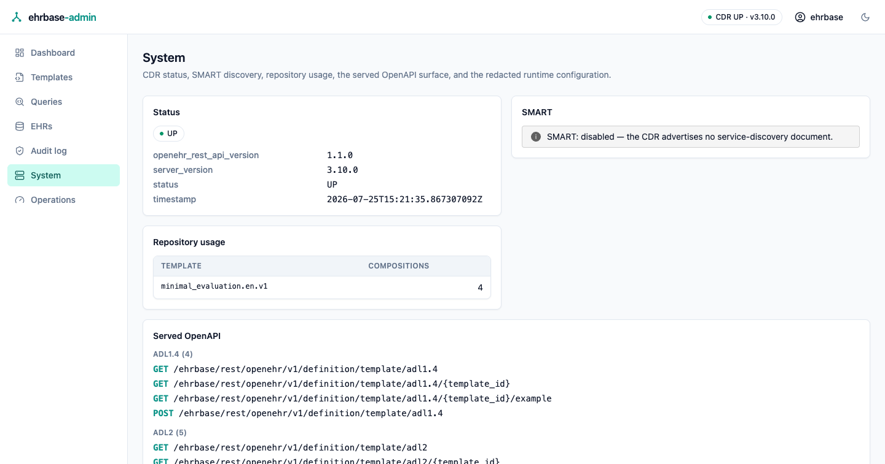
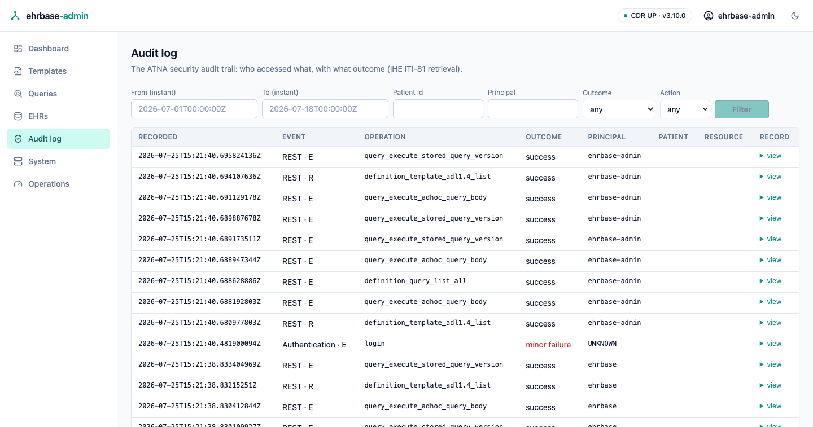
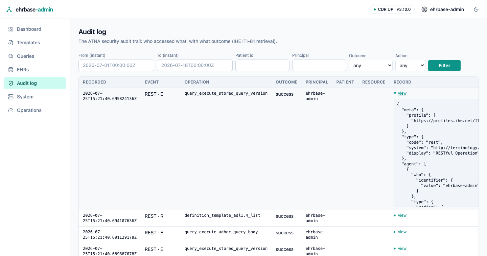
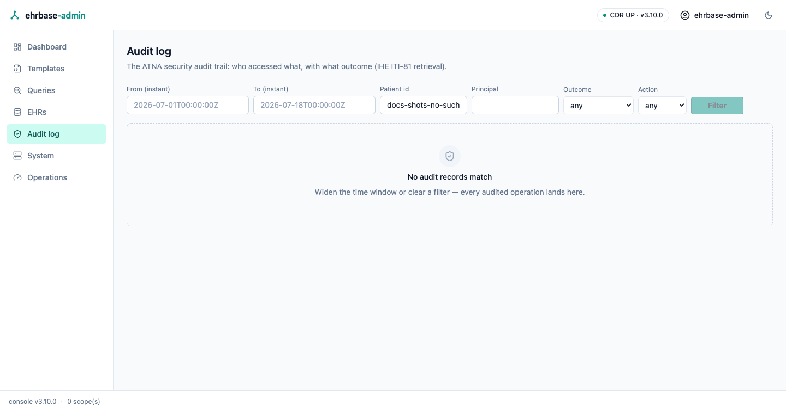

# Admin console

`ehrbase-admin-ui` is a standalone web console for managing an
ITS-REST-1.1.0 CDR — this server or any other. It is a **pure REST client**:
everything it does goes through the CDR's public API (never the database),
so what you see in the console is exactly what the API serves. The whole
application is Rust (Leptos SSR + WebAssembly); there is no hand-written
JavaScript anywhere, including its browser tests.

## Running it

The quickstart compose ships the console as the `ehrbase-admin-ui` service
on port 3000:

```bash
docker compose up ehrbase-postgres ehrbase ehrbase-admin-ui
# → http://localhost:3000  (log in with the dev users, e.g. ehrbase/ehrbase)
```

Standalone, point it at any CDR:

```bash
docker run -p 3000:3000 \
  -e EHRBASE_ADMIN__CDR__BASE_URL=https://cdr.example.org \
  ghcr.io/rubentalstra/ehrbase-rs-admin-ui
```

## Signing in

The sign-in page offers exactly the methods that can actually work: the
console's configured login modes intersected with the authentication
schemes the CDR advertises (its `WWW-Authenticate` challenge). A Basic
form is never shown against a bearer-only CDR, and vice versa. The page
is served fully rendered and works with JavaScript disabled.

The console ships a full dark theme (the toggle persists per browser),
and the user menu shows the session identity and its access scopes:







## Configuration

One TOML file (`ehrbase-admin-ui.toml`, searched in the working directory
and `/etc/ehrbase/admin-ui.toml`, or pointed at with
`EHRBASE_ADMIN_CONFIG`), with `EHRBASE_ADMIN__<SECTION>__<KEY>` environment
overrides:

| Key | Default | Meaning |
|---|---|---|
| `cdr.base_url` | `http://localhost:8080` | The CDR origin (the ITS-REST base path is appended). |
| `cdr.request_timeout_secs` | `30` | Per-request timeout toward the CDR. |
| `cdr.management_base_url` | `{cdr.base_url}/management` | The CDR's management surface, base path included — set it when the CDR serves management on its own internal listener (`management.port`) or under a renamed base path. Drives the [Operations panel](operations.md). |
| `auth.basic_enabled` | `true` | Offer the username/password form (validated against the CDR; held server-side). |
| `auth.oidc.enabled` | `false` | Offer OIDC login (authorization code + PKCE). |
| `auth.oidc.issuer` / `client_id` / `client_secret` (`_file`) / `public_base_url` / `scopes` | — | The OIDC client registration; `public_base_url` is the console's externally visible origin for the redirect URI. |
| `session.idle_minutes` | `60` | Session idle expiry. |
| `session.cookie_secure` | `false` | Set behind TLS. |
| `groups_file` | `admin-ui-groups.json` | Where console-local query groups persist (a small JSON file — the console has no database). |

Login and sessions live in the console's backend; CDR credentials and
bearer tokens never reach the browser.



## The screens

- **Dashboard** — record counts, per-group match-count tiles, and a
  commit-activity trend. See [Dashboard & queries](queries.md).
- **Templates** — upload and inspect operational templates. See
  [Templates & EHR browsing](browsing.md).
- **Queries** — the point-and-click Query Builder, the raw AQL editor, and
  stored-query management. See [Dashboard & queries](queries.md).
- **EHRs** — browse EHRs, folders, compositions, and version history. See
  [Templates & EHR browsing](browsing.md).
- **Audit log** — browse the CDR's ATNA security audit trail (see below).
- **System** — CDR status, SMART discovery, repository usage, the server's own
  OpenAPI document, the redacted runtime configuration, and a shortcut into
  the audit browser. 
- **Operations** — dependency health, build and spec provenance, the metric
  registry, and runtime log control. Appears only when the CDR serves its
  management surface. See [Operations panel](operations.md).

## Audit log

The **Audit log** screen browses the CDR's security audit trail — who
accessed what, with what outcome — through the standard IHE ITI-81
retrieval (`GET /fhir/r4/AuditEvent`; see the
[Audit trail chapter](../audit.md)). Filter by event-time window, patient,
principal, outcome, or action; every filter lives in the URL, so a filtered
view is shareable and refresh-safe. Each row opens the full stored FHIR
`AuditEvent` record.

The audit trail is an operator surface: under role-based access control the
screen requires the CDR's admin role, and when the CDR's local audit store
is disabled the screen says so instead of erroring.



Each row's **view** disclosure opens the full stored FHIR `AuditEvent`
record — exactly what the ITI-81 API serves:



A filter that matches nothing renders a distinct empty state, so "no
records" is always visibly different from "records you haven't found":


