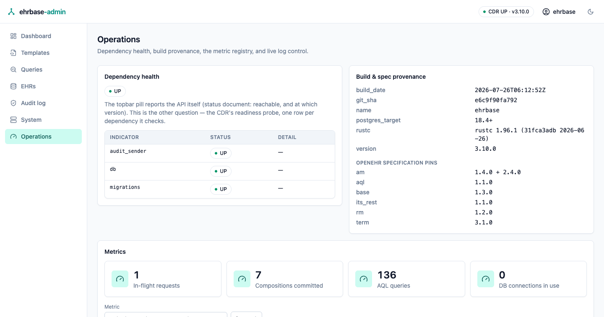
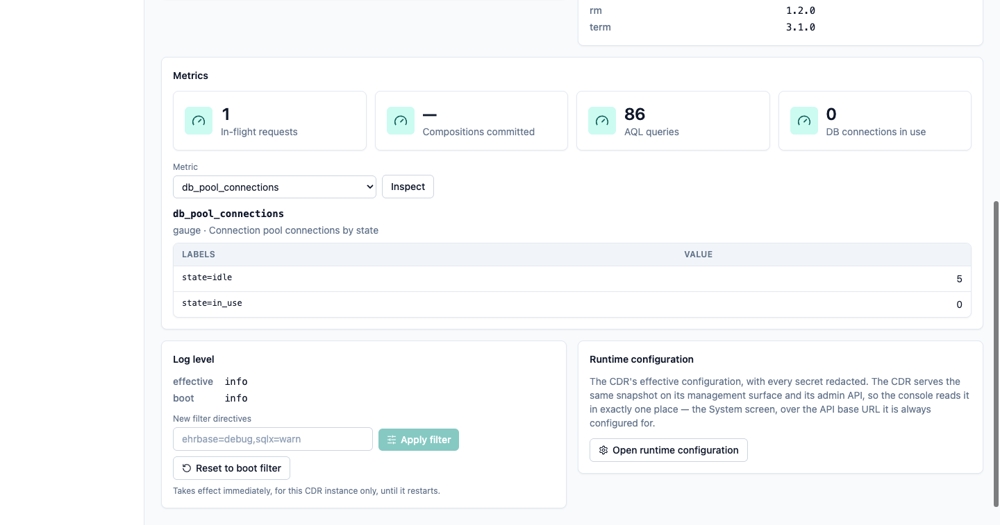
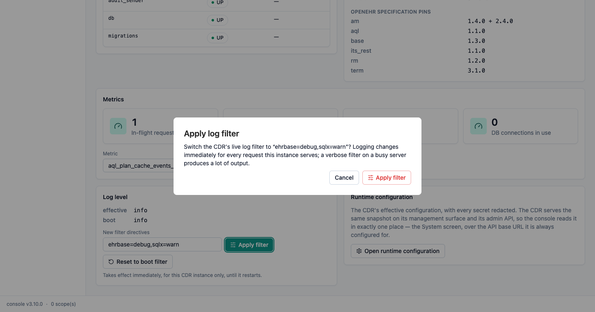

# Operations panel

The **Operations** screen is the console's operator view of a running CDR:
dependency health, what exactly is deployed, the live metric registry, and
runtime log control. Everything on it comes from the CDR's own operational
endpoints over HTTP; the console has no privileged channel.



<!-- toc -->

## When it appears

The panel is **probe-and-hide**: on every page load the console asks the CDR for
`GET /management/info`, and the sidebar entry appears only if that endpoint
exists. A `404` (the CDR's answer when the management surface is off, which is
the default) hides the entry entirely; any other answer counts as present, so a
refusal reaches you as a message on the card that asked rather than as a missing
screen.

To get the panel, enable the surface on the CDR and give each endpoint you want
an access level ([Operations → The management
surface](../operations.md#the-management-surface)). **Every endpoint ships
`off`**, so nothing is mounted until you name it:

```toml
[management]
enabled = true

[management.endpoints]
info = "admin_only"     # the availability probe — enable it alongside the rest
metrics = "admin_only"
env = "admin_only"
loggers = "admin_only"
```

The levels are `off` (not mounted, `404`), `private` (any authenticated
principal), `admin_only`, and `public` (served outside authentication). A card
whose endpoint is off says so in place instead of failing, but `info` is the
probe, so leaving `info` at `off` hides the whole panel.

If the CDR serves management on its own internal listener
(`management.port`) or under a renamed base path (`management.base_path`), point
the console at it with one setting, the full prefix, including the path:

```bash
FERROEHR_ADMIN__CDR__MANAGEMENT_BASE_URL=http://cdr.internal:9100/management
```

Unset, the console derives `{cdr.base_url}/management`.

> [!NOTE]
> The management endpoints are gated server-side at the level you chose. The
> console shows the panel whenever the surface exists; being allowed to read a
> particular endpoint is the CDR's per-request decision, and a refusal is
> reported on the card that asked, naming what to do about it.

## Dependency health

The health card reads the CDR's **public readiness probe**
(`GET /health/readiness`, always served, no configuration): the aggregate state
plus one row per dependency the server checks (the database ping, the
migrations probe, and any optional components) with the CDR's own detail text
where it gave one.

This is deliberately a different question from the **status pill** in the
topbar, which polls the product status document (`GET /ferroehr/rest/status`):

| Reader | Question it answers |
|---|---|
| topbar pill | is the API answering at all, and at which version? |
| health card | are the CDR's dependencies healthy enough to serve? |

The card states that split on screen, and nothing else in the console re-reads
either claim.

## Build & spec provenance

Straight from `GET /management/info`: the CDR's version, the git commit the
binary was built from, its build timestamp and `rustc` version, the PostgreSQL
target, and under their own heading the deployment's active
[`spec_profile`](../installation/configuration.md#spec_profile) and the openEHR
specification versions that profile selects. This is the card to screenshot into
an incident report: it says exactly what is running.

## Metrics

Four headline tiles (in-flight requests, compositions committed, AQL queries,
database connections in use) sit above a browser over the CDR's whole metric
registry: pick a metric, and the panel renders its current samples with their
labels: the same numbers Prometheus scrapes, without a Prometheus.



The selection lives in the URL (`/operations?metric=db_pool_connections`), so a
view is shareable and survives a refresh, and the picker works before the
browser app has loaded. A tile reads `—` when the deployment records nothing for
that metric yet.

For dashboards and alerting, scrape `GET /management/prometheus` instead; the
panel is for looking, not for collecting.

## Runtime configuration

The CDR serves its redacted effective configuration on both its management
surface and its admin API, and it is the same snapshot, so the console reads it
in exactly **one** place: the [System screen](index.md#the-screens). This card
links there rather than rendering a second copy.

## Log level

The log card shows the filter in effect right now and the boot filter a reset
restores, and lets an operator change the live filter without a restart
(`POST`/`DELETE /management/loggers`):



Type `tracing`-style directives (`ferroehr=debug,sqlx=warn`), press **Apply
filter**, and confirm: the dialog spells out that logging changes immediately
for every request the instance serves. **Reset to boot filter** puts the startup
value back. Both outcomes are reported as a toast, and the card re-reads the
CDR's answer, so what you see is what the server confirmed, not what was asked
for.

> [!IMPORTANT]
> A log-filter change applies to **that CDR instance only** and lasts until it
> restarts. Behind a load balancer, each instance is set separately; for a
> permanent change, set `log.filter` in the server configuration.
