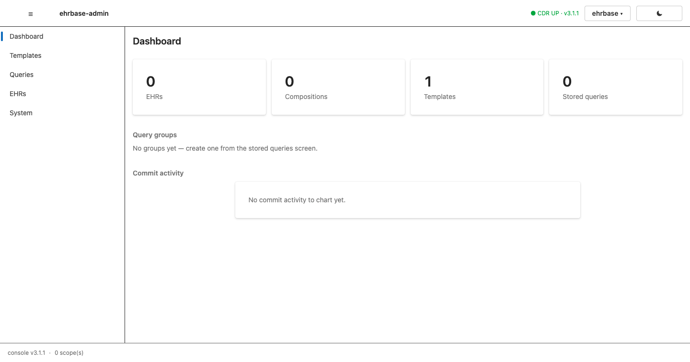
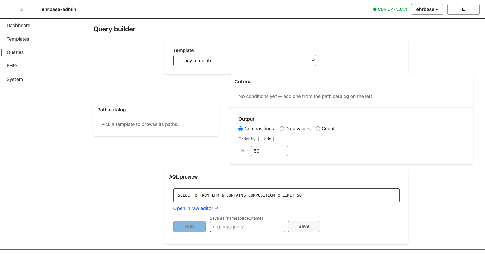
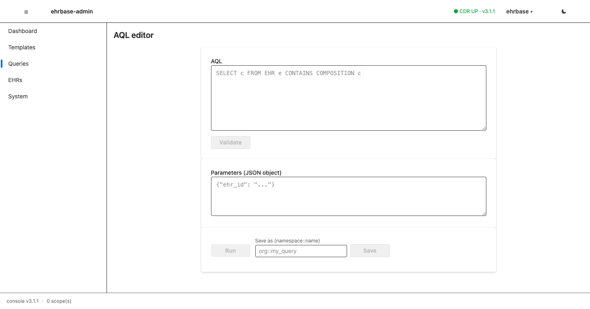
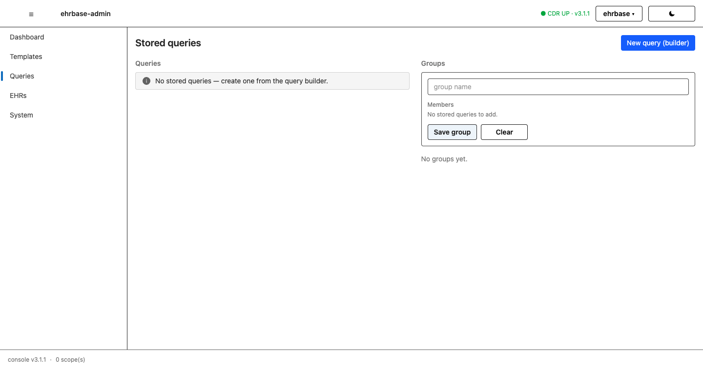

# Dashboard & queries

## Dashboard

The landing screen shows EHR / composition / template / stored-query counts,
one tile per query group (the summed match counts of its member queries),
and a commit-activity trend rendered as pure SVG.

## The Query Builder

Build AQL without writing it: pick a template, pick paths from its tree,
and add typed conditions — each data type gets the right widget, populated
from the template's own constraints (coded value sets, ordinal scales,
quantity units). Conditions combine into arbitrarily nested ALL/ANY groups
with per-condition and per-group negation. The generated AQL is previewed
live and is always grammatically valid — the builder assembles the same
query syntax tree the server validates, never text.

Choose what comes back: whole compositions, projected data points (with
column aliases), or a bare match count. Run pages through the result set;
save the query under a qualified name to the CDR's stored-query registry.

## The raw AQL editor

The same run/save surface for hand-written AQL: grammar validation before
anything reaches the CDR, JSON parameter bindings, paged results. The
builder's "open in raw editor" hands its generated query across.

## Stored queries & groups

List the CDR's stored queries, inspect a query's AQL, and jump into the
editor to run it. Query **groups** are console-local named sets of stored
queries whose combined match counts appear as dashboard tiles — useful as
lightweight cohort counters.

