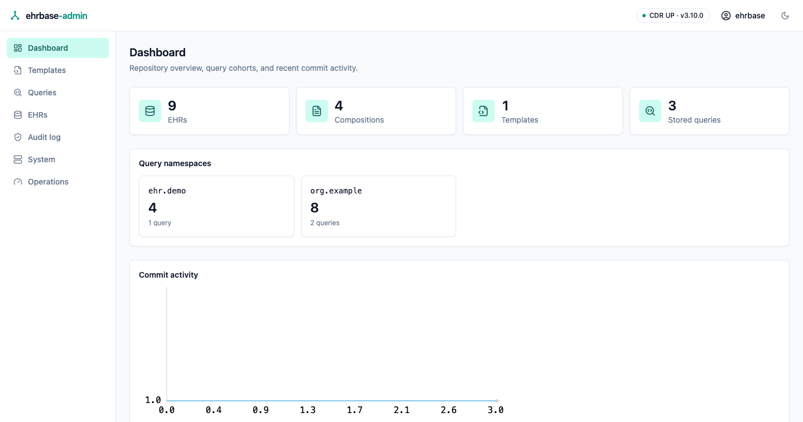
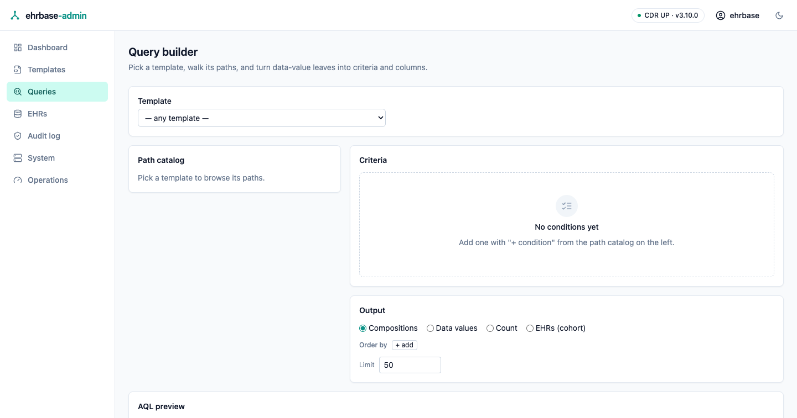
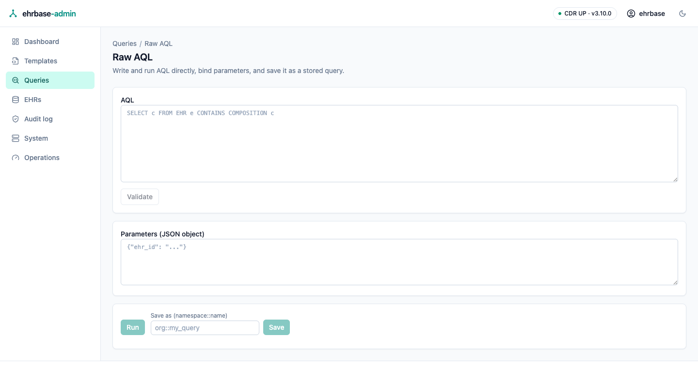
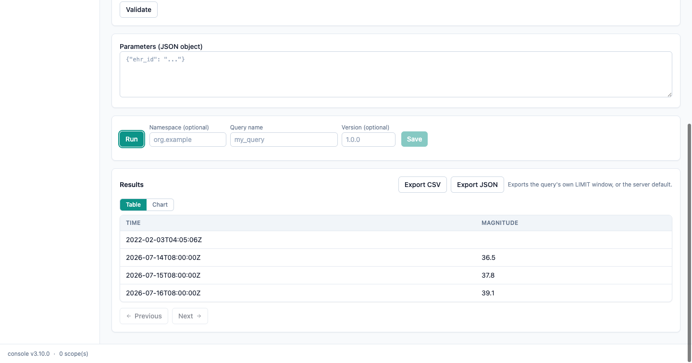
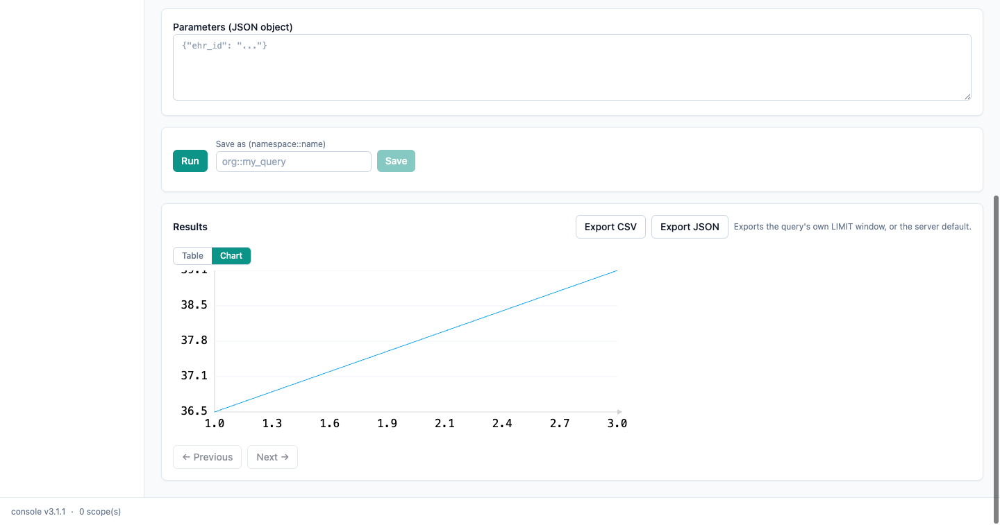
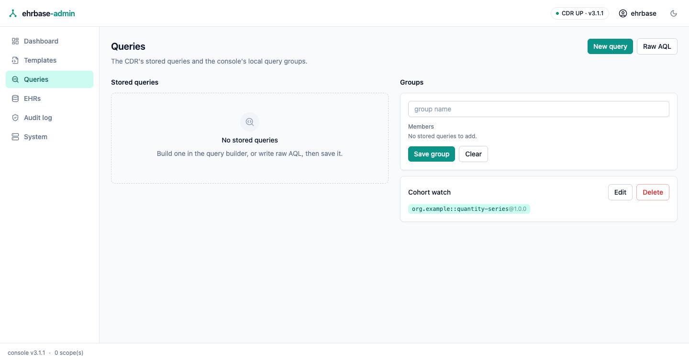
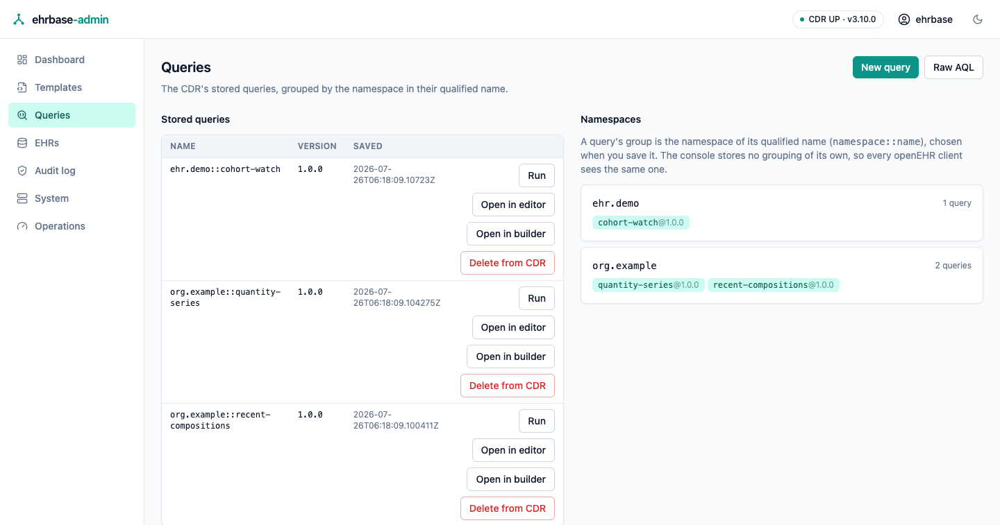
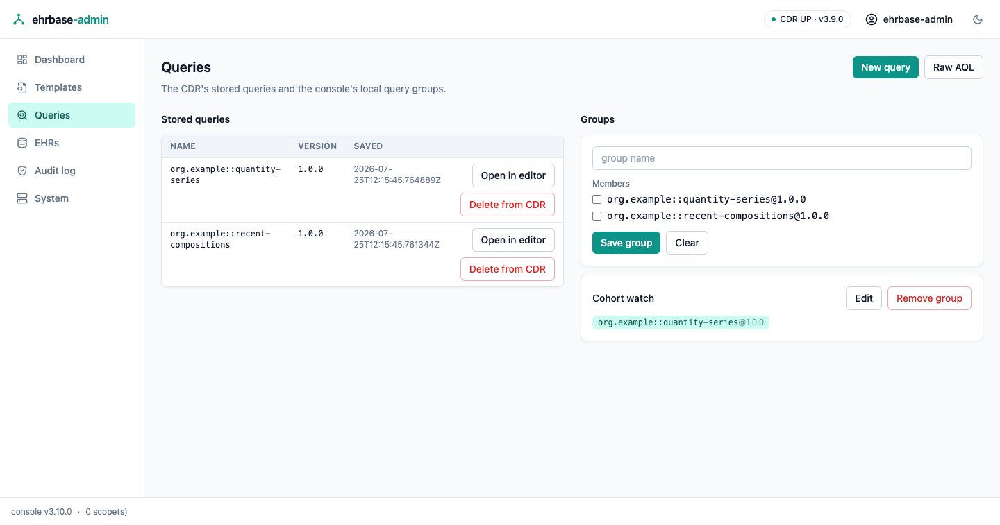

# Dashboard & queries

## Dashboard

The landing screen shows EHR / composition / template / stored-query counts,
one tile per **stored-query namespace** (the summed match counts of the
queries in it), and a commit-activity trend rendered as pure SVG.

## The Query Builder

Build AQL without writing it: pick a template, pick paths from its tree,
and add typed conditions — each data type gets the right widget, populated
from the template's own constraints (coded value sets, ordinal scales,
quantity units). Conditions combine into arbitrarily nested ALL/ANY groups
with per-condition and per-group negation. The generated AQL is previewed
live and is always grammatically valid — the builder assembles the same
query syntax tree the server validates, never text.

Choose what comes back: whole compositions, projected data points (with
column aliases), or a bare match count. Run pages through the result set;
save the query to the CDR's stored-query registry under a namespace and a
name (see [Grouping is the namespace](#grouping-is-the-namespace)).

## The raw AQL editor

The same run/save surface for hand-written AQL: grammar validation before
anything reaches the CDR, JSON parameter bindings, paged results. The
builder's "open in raw editor" hands its generated query across. When the editor
was opened from a stored query, it also links back the other way — **Open in
builder** and **Run with parameters** — so the three surfaces are reachable from
each other for the same stored definition.

Every non-empty result set offers a **Table | Chart** toggle. The chart draws
**one line per numeric column**, named by that column's alias, and its legend
switches a series on and off — the last visible series stays on, so the chart
never empties. When a column holds ISO-8601 date/times it is offered as the
**X axis** and used by default: a real time scale, where points sit at their
true distance apart whatever order the rows came back in. The row order stays
available as the fallback axis, and a single numeric column still draws as one
plain line. A result set with nothing to chart — no numeric column, or a single
row — says so in the chart pane rather than showing a blank box. The builder's
output shapes include **EHRs (cohort)**: the distinct EHR ids matching the
criteria tree.

## Exporting results

Both results panes (the builder and the raw editor) offer **Export CSV**
and **Export JSON** — a plain form download that works even before the
page's WebAssembly loads. The export runs the query's own `LIMIT` window,
or the server's default fetch limit when the query has none. CSV cells
hold scalar values verbatim; structured values are embedded as compact
JSON.

## Stored queries & namespaces

Fresh repositories start empty, with the action that fills the screen:

List the CDR's stored queries, inspect a query's AQL, and jump into the
editor to run it.

The table is paged by the shared footer under it — rows on screen out of how
many, previous/next, and 25/50/100 rows per page, all in the URL (see
[Paging](index.md#paging)). The namespace panel beside it is derived from the
same listing and shows every namespace, whichever page you are on.

Each stored query row offers three hand-offs:

| Action | What it opens |
| --- | --- |
| **Run** | The [stored-query runner](#running-a-stored-query) — executes *that stored query* on the CDR, with its parameters prompted |
| **Open in editor** | The raw AQL editor, seeded with that version's query text |
| **Open in builder** | The [query builder](#the-query-builder), with the query loaded back into its controls — when it fits (see [Opening a stored query in the builder](#opening-a-stored-query-in-the-builder)) |

Both editing hand-offs pre-fill the namespace, name, and version fields — with
the version set to the *next* one, so saving again publishes a new version
instead of colliding with the one you opened (see [Versions](#versions)).

### Opening a stored query in the builder

The builder writes one shape of AQL, and it will only load a stored query back
into its controls when it can reproduce that query **byte for byte**. Anything
else opens with a notice naming exactly what the builder cannot express — a
`$parameter` it has no field for, a query over other RM classes, an aggregate
outside its output shapes — beside a link to work on it in the raw editor
instead. There is no partial load: a builder that showed *most* of a stored
query would quietly rewrite it on the next save.

A query that does load arrives complete — template, conditions (including
nested ALL/ANY groups and negation), output shape, ordering, limit — with its
condition labels and value lists taken from the template's own constraints, and
the next version proposed in the save field.

### Running a stored query

**Run** on a stored-query row opens the runner for that query. It shows the
stored AQL, prompts one field per parameter the query declares, and executes the
*stored definition* on the CDR — not a copy of its text — so what runs is what
every other openEHR client would get.

Values are read as JSON first: `38.5` is sent as a number and `true` as a
boolean, while `at0037`, `2026-07-01` and `1.0.0` are sent as text without any
quoting. To force a numeric-looking value to stay text, quote it: `"0123"`. A
field left blank is not sent at all, so the CDR can apply its own default or say
what is missing.

Results render in the same results pane as the other query screens — table or
chart, with previous/next paging. A query that sets its own row window (an AQL
`LIMIT` or `TOP`) is run as stored and the pane says so rather than paging it,
because openEHR does not allow a request window and a query window together.

#### Choosing how the version resolves

openEHR defines three ways to name the version of a stored query you are
reading, and the runner offers all three. The line under the picker always
states the exact request your choice will send:

| Resolution | Request | Which version runs |
| --- | --- | --- |
| **Latest version** | `POST /query/{name}` | the latest version of that query |
| **Version prefix** | `POST /query/{name}/1` or `…/1.2` | the latest version matching the prefix |
| **Exact version** | `POST /query/{name}/1.2.0` | exactly that version |

A version that does not fit the chosen form (a full `1.2.0` typed as a prefix, or
a bare `1` typed as exact) is refused with an explanation before anything is
sent.

### Grouping is the namespace

A stored query is identified by a qualified name — `namespace::name`, the
namespace optional and, when present, a reverse domain name whose purpose in
the openEHR REST specification is exactly "separation of use of stored
queries by teams, companies, etc."

The console therefore does **not** invent a grouping of its own: a query's
group *is* its namespace, chosen when you save it. The right-hand panel on
**Queries** and the cohort tiles on the **Dashboard** are both derived live
from `GET /definition/query`. There is nothing to create, edit, or remove —
and nothing kept on the console's disk, so the grouping is durable in the
CDR and reads identically for every openEHR client and every console
replica. Queries saved without a namespace collect under **unqualified**.

Both save surfaces (the builder and the raw editor) therefore offer the
**Namespace** field beside the **Query name**, and show the exact qualified
name the save will write. Typing the whole `namespace::name` into the name
field works too.

### Versions

A stored query is identified by its qualified name **and a version**, and the
version is SEMVER-style — `major.minor.patch`. The save surfaces expose it as
an optional **Version** field, and the line under the fields always states
which of the two openEHR store operations a click will perform:

| Version field | What a save does |
| --- | --- |
| empty | `PUT /definition/query/{name}` — the CDR files it at the default slot `1.0.0` and **replaces** whatever was stored there |
| `1.2.0` | `PUT /definition/query/{name}/{version}` — stores a **new, immutable** version; if that exact `(name, version)` pair already exists the CDR refuses it (`409`) and the console says so |

Because an explicit version is immutable, **Open in editor** and **Open in
builder** both propose the next minor version (opening `1.0.0` fills the field
with `1.1.0`) — edit, save, and both versions are then listed side by side. Which part to bump is yours to
change; the field is free text and only checks that a version you type is a
complete triple.

A shorter pattern like `1` or `1.0` is a **read** form, not a store form: when
*fetching or executing* a stored query, openEHR resolves a partial version to
the latest one matching that prefix, and omitting the version entirely means
the latest of all. The console therefore refuses a partial version in the save
field (with an explanation) rather than filing a definition under a string that
later lookups would treat as a pattern. The CDR refuses one too, with a `400`:
a prefix names no version a store could create, and openEHR assigns the write
no other outcome.

The default slot `1.0.0` is the CDR's own choice — openEHR does not say which
version a version-less store mints, so the version-less form always writes and
reports that one slot, even when higher versions of the same name already
exist. If you need a specific version, type it.

### Deleting a stored query

**Delete from CDR** (on a stored-query row) deletes *that version* of the
query from the CDR's stored-query store, for every client — the only
destructive action on the screen. It appears only when the CDR's admin API is
enabled (`admin.enabled` / `FERROEHR__ADMIN__ENABLED`, off by default — see
[`[admin]`](../installation/config-auth.md#admin)); the delete itself
additionally needs the ADMIN role, and a session without it is refused with
a message naming what is missing.

It opens a confirmation dialog that names the exact query and version before
anything is sent, and a refused delete is reported with the CDR's own
diagnostic and the next action to take. Deleting the last query of a
namespace simply makes that namespace stop appearing.

