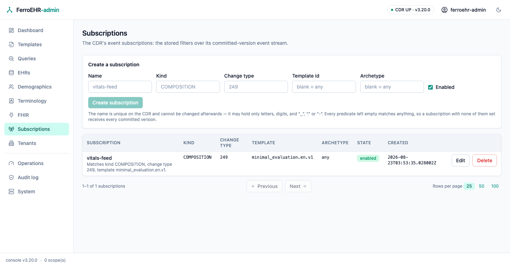

# Event subscriptions

The **Subscriptions** screen administers the CDR's event subscriptions — the
server-side filters that decide which committed versions are published to your
message broker, and to which queue. Everything on it comes from the CDR's own
subscription API over HTTP; the console has no privileged channel and keeps no
subscription state of its own.



<!-- toc -->

## When it appears

Change eventing is an **extension**: no openEHR specification governs event
publication or a subscription resource, so the whole surface — its paths, its
payloads, its status codes — is this CDR's own design, and it is off unless a
deployment turns it on. See [Change events (AMQP)](../beyond-core/amqp.md) for
what the stream carries and how a queue is bound.

The screen is **probe-and-hide**: on every page load the console asks the CDR
for `GET /admin/event_subscription`, and the sidebar entry appears only if that
route exists. A `404` — the CDR's answer while the subscription API is off,
which is the default — hides the entry entirely; any other answer counts as
present, so a refusal reaches you as a message on the screen that asked rather
than as a missing screen.

To get the screen, turn the subscription API on
([`[events]`](../installation/config-integrations.md#events)):

```toml
[events]
admin_api = true     # mount /admin/event_subscription
```

Reaching `/subscriptions` on a deployment without it is not an error either:
the screen renders one card naming that switch instead of a table that cannot
be read.

> [!NOTE]
> `admin_api` and `enabled` are separate switches, and this screen needs only
> the first. Subscriptions are **stored** whether or not the publisher is
> running, so you can define them before a broker exists; they start being
> delivered when `[events] enabled = true` connects the server to one.

> [!NOTE]
> The API is mounted under `/admin`, so the CDR's role-based access control
> classes every call here as admin work. The screen renders whenever the
> surface exists — being allowed to use it is the CDR's per-request decision,
> and a session without the ADMIN role is refused with a message naming what is
> missing.

## What a subscription is

A subscription is a name plus four **predicates**, each of which matches one
facet of a committed version:

| Field | Matches | Example |
|---|---|---|
| Kind | the versioned object's type | `COMPOSITION`, `EHR_STATUS`, `FOLDER` |
| Change type | the audit change-type code | `249` (creation), `251` (modification), `523` (deletion) |
| Template id | the template a composition was committed against | `vital_signs.v2` |
| Archetype | the root archetype | `openEHR-EHR-COMPOSITION.encounter.v1` |

**A field left empty matches anything.** The console says so in every cell —
an unset predicate reads `any`, never a blank — and each row carries a
plain-words line saying what it selects, so "matches every committed version"
is visible rather than inferred from four empty boxes.

> [!WARNING]
> Only the first three predicates reach the broker. A subscription's queue is
> bound with the three-field routing key
> [`<kind>.<change_type>.<template_id>`](../beyond-core/amqp.md#routing-keys-and-subscriptions),
> which has no archetype segment — so **Archetype** is stored on the
> subscription but does not narrow what is delivered today. A subscription
> whose only predicate is an archetype is bound as a full wildcard and
> receives everything; narrow it by kind, change type or template as well, or
> filter on the archetype in the consumer.

The **name** is unique on the CDR and is also the suffix of the queue the
server declares for the subscription (`ferroehr.events.<name>` with the default
exchange), so it may hold only letters, digits, and `_`, `.` or `-`. The create
button stays disabled until the name you typed is one the CDR can accept, and
the name cannot be changed afterwards — a rename would be a different queue.

**State** is the `enabled` flag: an enabled subscription is one the server
binds and delivers to; a disabled one is kept, exactly as you defined it, and
not delivered. Disabling is therefore the reversible way to stop a feed.

## Administering them

The table lists every stored subscription, newest first, paged by the shared
footer under the table (see [Paging](index.md#paging)).

- **Create** with the card above the table: a name, and as many predicates as
  you want to narrow by. Leave them all empty for a feed of everything.
- **Edit** on a row opens an editor seeded with that subscription's current
  values. Saving **replaces every predicate**, so a field you clear becomes
  `any` on the CDR — that is the whole update, not a patch. The name is shown
  and never editable.
- **Delete** on a row asks for confirmation naming the subscription and what it
  matches, and nothing is sent until you confirm there.

Every one of those writes reports both outcomes — a success and a failure are
equally visible — so a refused change never looks like nothing happened, and
the CDR's own words (a duplicate name, a rejected value) are shown in full
beside the failure notification.

> [!WARNING]
> Deleting a subscription stops the server binding its queue; it does not
> delete the queue from your broker. A durable queue left behind keeps whatever
> it already holds and stops receiving new messages, so reap orphaned queues on
> the broker side as part of the same change.
