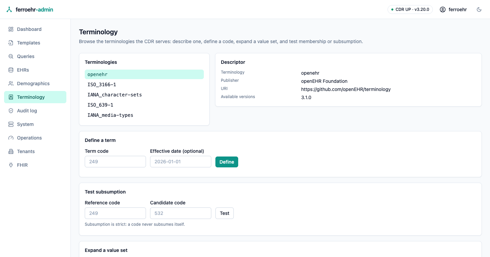

# Terminology

The **Terminology** screen browses the coded vocabularies the CDR can answer
questions about: which terminologies it serves, what a code means, which codes a
value set holds, whether a given code is one of them, and whether one code
subsumes another. Everything on it is a read of the CDR's public API; nothing
is stored on the console's side.



<!-- toc -->

> [!NOTE]
> The terminology API is **this server's own extension**. openEHR's REST release
> publishes no terminology contract, so the operations come from the openEHR
> Service Model (`I_TERMINOLOGY_SERVICE`) while the URLs and JSON envelopes are
> this server's. A different openEHR server will not serve them.

## Switching it on

The surface is **opt-in and off by default**. While it is off the CDR answers
its terminology routes as if they were not mounted, and the screen says so in
one card instead of pretending to work:

```toml
[terminology]
api_enabled = true
```

or, as an environment override, `FERROEHR__TERMINOLOGY__API_ENABLED=true`.

Turning it on exposes only lookups over terminologies the server already holds:
the bundled openEHR terminology plus the external code sets beside it. Binding
an external FHIR terminology server is a separate setting, and it changes what
these lookups can answer; both are covered in
[Terminology servers](../beyond-core/terminology.md).

## Picking a terminology

The list on the left is exactly what the CDR reports: the internal `openehr`
vocabulary and the external code sets beside it (languages, countries,
character sets, media types). Selecting one puts it in the address bar, so a
terminology is shareable and survives a reload, and the choice works before the
page's WebAssembly has loaded.

The **Descriptor** card beside it shows what the CDR publishes about that
terminology: publisher, identifying URI, available versions, and the
meta-model attributes an extract request may ask for. Fields the server does not
publish are not shown at all rather than filled in with a guess.

## Defining a term

Type a code and the screen asks the CDR what it means. A defined term comes back
as `code — text`, with the language it is written in and whether it is the
preferred term among alternatives; a code the terminology carries without any
display text comes back as the bare code, which is the honest answer rather than
a blank.

An **effective date** is optional. Supplied, it asks for the definition as it
stood on that date; left empty, it asks for the current one. The openEHR bundle
is a single pinned release, so a date does not change its answer; an external
terminology server can.

A code the terminology does not define is reported as a plain note on the card
that asked, naming the code and the terminology. It is not an error: asking
whether something exists is a legitimate question, and "no" is an answer.

> [!NOTE]
> openEHR terminology codes are **scoped to their group**, not global: `532` is
> `complete` in one group and `completed` in another. A code lookup treats the
> `openehr` terminology as flat and returns the first group's rubric, so use the
> value-set card below whenever the group matters.

## Expanding a value set

A value set is addressed by its id: for the `openehr` terminology, an openEHR
vocabulary group such as `audit_change_type` or `version_lifecycle_state`, by
its identifier or its display name. Expanding one lists its members as
`code — text`.

Under it, **Validate** answers one question: is this code a member of that value
set? Both verdicts read as a sentence, and a value set the CDR does not know
simply has no members, so a code is reported as *not* a member rather than the
question being refused.

## Testing subsumption

Subsumption asks whether one code is an ancestor of another. The test is
**strict**, so a code never subsumes itself, and the openEHR vocabulary is flat
(it defines no is-a hierarchy) so the honest verdict for any pair of openEHR
codes is "does not subsume". Hierarchical answers come from an external
terminology server when one is bound.

## Picking codes in the Query Builder

The same lookups back the Query Builder's **coded condition** editor, so a
coded criterion no longer has to be typed from memory; see
[Dashboard & queries](queries.md#the-query-builder). The model is unchanged:
whatever route a code took into the criterion, the query carries the bare code.
