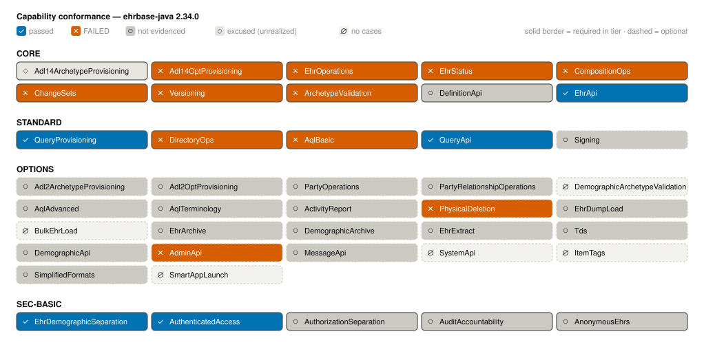
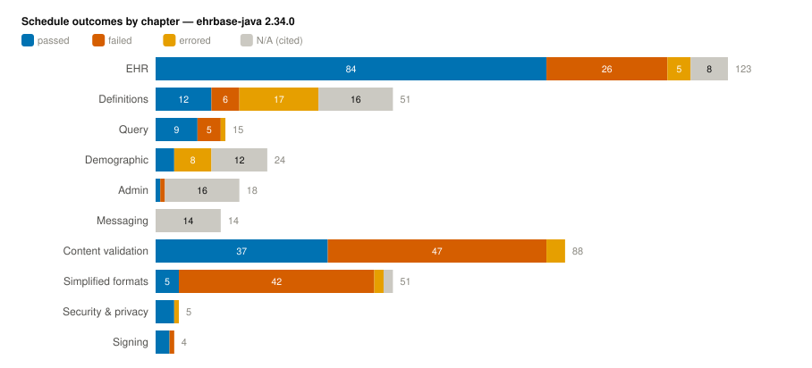

# Comparison with EHRbase

FerroEHR and EHRbase are two independent open-source openEHR CDRs;
this page measures them side by side on the same instruments FerroEHR applies to itself: the CNF 2.0
conformance runner executes the **same committed catalogue** against both
servers' official deployments, and the benchmark harness drives both with
byte-identical clinical workloads on the same host. Both directions are
always published; a result that favours either server is reported exactly like one that
favours the other.

Each side runs with its **own committed party set** — an ixit describing the
reachable instances (EHRbase's Basic auth has no read-only principal, so
its ixit declares none) and a statement (the ICS) declaring the capabilities
and ambiguity-register options that party actually claims. A capability a
party does not claim reads *not claimed* and never gates its verdicts; a
test whose ground cannot exist on a party's topology or technology profile
reads *not applicable with a machine citation*, never *fail*. That is how
the comparison stays fair without ever weakening a case.

Every number and every curve on this page is generated at build time from
the committed run artifacts (`docs/conformance/*/results.json` +
`verdicts.json` + `stress.json`) — nothing here is hand-typed, and the CI
stale-numbers gate rejects any attempt to hand-type it. To reproduce either
side yourself, see
[Conformance](conformance.md#running-the-suite-yourself) and
[Benchmarks](benchmarks.md).

<!-- toc -->

## Conformance

<!-- Generated by scripts/render-comparison.sh — never hand-type numbers here. -->
{{#include ../generated/comparison-conformance.md}}

Both servers' capability conformance, from each party's committed
verdicts (generated, diff-guarded — see [Conformance](conformance.md) for
how to read the grid):

And the per-chapter outcomes side by side. Both charts render the same
chapter-and-band taxonomy, so they read band-for-band: a band EHRbase did
not exercise shows as an explicit `no cases` row in the same position.
Compare the printed counts, not the bar lengths — each chart scales its bars
to its own widest band, and the legend states that scale.

Reading the EHRbase results honestly: the failures concentrate where the
catalogue pins strict specification behaviour — archetype-constraint
validation depth (the content chapter), exact status codes and version
headers, canonical-format details — that EHRbase implements differently or
predates. An **inconclusive** row means EHRbase answered with a status the
operation's specification-cited outcome map does not contain, or refused the
exchange that would have established the case's required ground, so the
runner refuses to guess a verdict. And where EHRbase simply does not
implement a surface (the ITS-REST simplified-format media types, ADL 2
provisioning, demographics), or where the specification dates a behaviour to
a REST-API release newer than the one EHRbase declares (EHRbase declares
ITS-REST 1.0.3; the catalogue realizes 1.1.0), the result reads *not
claimed* or *N/A with a citation* — EHRbase is never counted as failing a
surface it never claimed, never against a release it never declared, and
never on a FerroEHR-only extension.

### The principal EHRbase divergences, stated plainly

Each of these was reproduced live against the composed EHRbase stack during
triage of the committed record, and each is grounded at or below EHRbase's
own declared ITS-REST 1.0.3 unless marked; the full wire evidence lives in
the committed `docs/conformance/ehrbase-java/results.json`.

- A **quoted `If-Match` value is rejected** (`400 "UUID string too large"`)
  — including the server's own echoed `ETag` — while only the non-standard
  unquoted form is accepted. The quoted form dates to Release 1.0.2.
- **Semantic model violations answer `400` instead of `422`** (a Release
  1.0.1 correction), and some model-invalid documents are **accepted
  outright** — an `EHR_STATUS` without its mandatory archetype details
  commits as `201`.
- The **`openehr-audit-details` committal header is ignored** (both the
  current and the deprecated spelling), and the stored audit description is
  itself model-invalid (a `DV_TEXT` with no `value`).
- **Canonical XML is served with the root element in no namespace**, against
  the published XSD's qualified target namespace; the stored-query list even
  serves an XML `<List/>` document that conforms to no published schema on a
  JSON-only operation.
- **Unqualified stored-query names are rejected** although the specification
  makes the namespace optional and lists `my_compositions` as a valid
  example; a stale `If-Match` on a directory delete answers `404` where the
  specification requires `412`; and `405` responses omit the required
  `Allow` header.
- **The stored-query listing does not match by prefix.** The specification's
  own worked example lists "all versions of all queries with names starting
  with `org.openehr`"; EHRbase returns the versions of an exactly-named
  query but answers `200 []` for any shorter prefix, so a client cannot
  discover what a namespace holds.
- **A malformed identifier in the path answers `404`, not `400`.** Given a
  path segment that is not a UUID at all, EHRbase detects the type
  violation and still reports a miss — literally
  `"EHR not found, in fact, only UUID-type IDs are supported"` — for the
  EHR, versioned-COMPOSITION and CONTRIBUTION reads alike. (It does answer
  `400` for a malformed *version* identifier, so the behaviour is not even
  internally consistent.)
- **Directory writes against an EHR that has no directory answer `412`.**
  Both the update and the delete report `Precondition Failed` with the body
  "does not contain a directory" — a missing resource dressed as a failed
  precondition. HTTP requires the opposite order: a failure detectable
  before the precondition is evaluated takes precedence over evaluating it.
- **A contribution refusal surfaces as a raw `500`.** Committing a first
  version whose change type is `deleted` returns `500 "An internal error has
  occurred"`, where the specification assigns that family a `400`
  ("the modification type does not match the operation"). The neighbouring
  row is worse than an error: a *creation* whose lifecycle state is
  `deleted` is **accepted** (`204`) instead of refused.
- *(1.1.0-grounded)* The **template upload refuses `Accept:
  application/json`** (`406`), serving only XML — the released parameter
  enumeration lists JSON first. This single refusal is what makes most
  content-chapter rows inconclusive: the runner's provisioning uploads ask
  for JSON, EHRbase refuses, and the case's ground never exists.

**Two red rows are not EHRbase's fault, and are called out rather than
counted.** Storing a query with no version in the URL has to land at *some*
version, and no released sentence says which. Our suite pins `1.0.0` because
a suite must pin something; EHRbase continues the existing series instead
(a stored `2.0.0` makes the next version-less store `3.0.0`). Both are
defensible readings of a silence, so the two
`store_query-{default_slot_with_higher_version,update_in_place}` rows record
a difference of house convention, not a conformance defect — the open
question is with openEHR, not with either implementation.

## Performance

{{#include ../generated/comparison-bench.md}}

## Method, in one paragraph

The conformance instrument derives every expected outcome from the openEHR
specifications — never from either server's observed behaviour — and runs
against real composed deployments of both systems (`scripts/conformance.sh`,
`CONF_SUT=ehrbase-java` for the EHRbase side). The stress instrument drives
the same hospital-simulation workload (admissions, observations, medication
rounds, lab contributions, chart reviews, corrections, discharges) built
from official CKM templates with seeded determinism, so both servers receive
byte-identical requests; latencies are coordinated-omission-corrected from
each request's planned arrival instant, and the ladder bisects to the last
rate held inside the envelope. The full method chapters:
[Conformance](conformance.md) · [Benchmarks](benchmarks.md).
