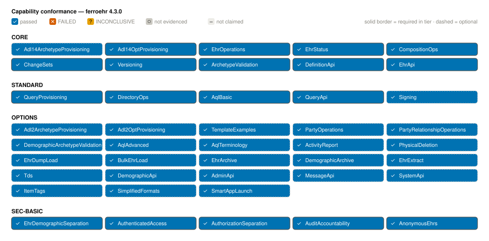
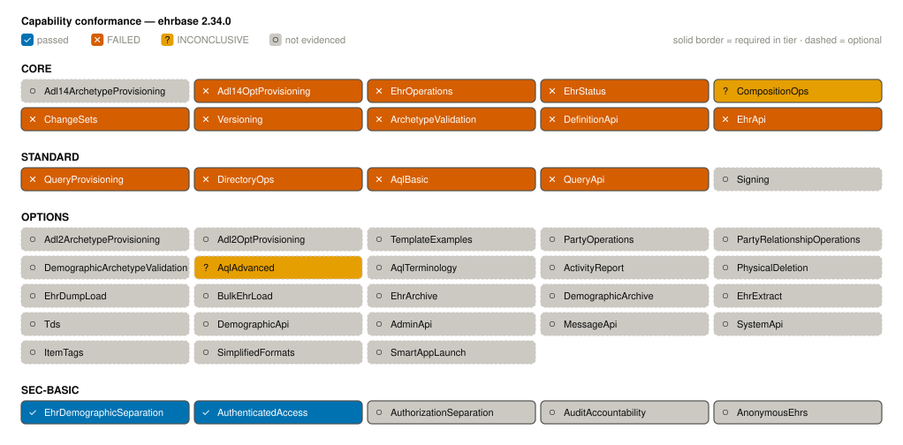
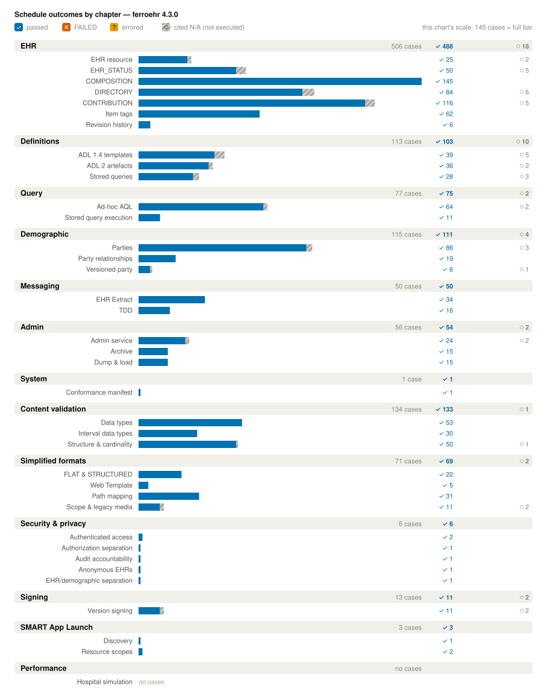
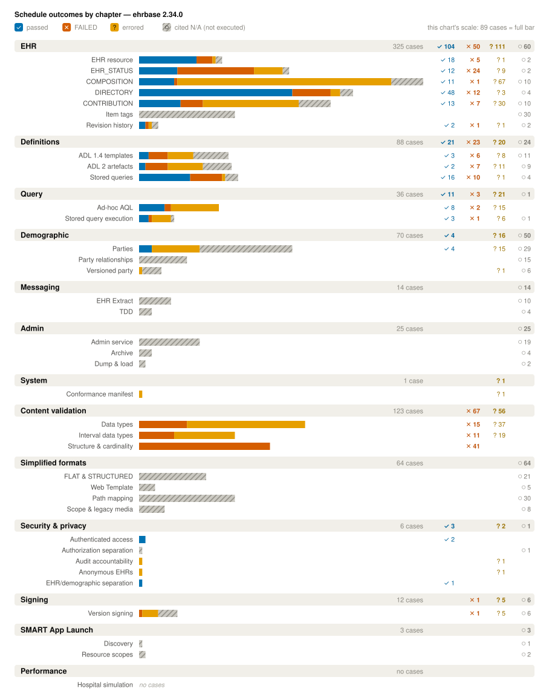

# Comparison with EHRbase

FerroEHR and EHRbase are two independent open-source openEHR CDRs. This page
measures them side by side with the instruments FerroEHR applies to itself: the
CNF 2.0 conformance runner executes the **same committed catalogue** against
both servers, and the step-load stress instrument drives both with the same
seeded clinical workload. Both directions are always published; a result that
favours either server is reported exactly like one that favours the other.

EHRbase is prior art here, never an oracle. Every expected outcome comes from
the openEHR specification text, so a row is red because the specification says
otherwise — never because the two servers disagree.

> [!NOTE]
> The two systems are **not** built or hosted alike, and the generated tables
> below say so. FerroEHR is built from this repository's current sources;
> EHRbase runs from its official published container images. The two runs were
> also measured on different machines — each committed report records its own
> environment. Read the conformance columns as comparable (identical catalogue,
> identical runner, each side's own declarations) and the performance columns as
> two separate measurements rather than a like-for-like hardware race.

Each side runs with its **own committed party set** — an ixit describing the
reachable instances (EHRbase's Basic auth carries one clinical and one admin
principal and no read-only one, so its ixit declares none) and a statement (the
ICS) declaring the capabilities, specification versions, and
ambiguity-register options that party actually claims. A capability a party
does not claim is dropped from its verdict scope and can never count against
it; a case whose ground cannot exist on a party's topology or technology
profile is recorded *not applicable with a machine citation*, never *fail*.
That is how the comparison stays fair without weakening a single case.

Every number and every curve on this page is generated at build time from the
committed run records (`results.json`, `verdicts.json`, `stress.json` under
`docs/conformance/`) — nothing here is hand-typed, and a CI stale-numbers gate
rejects any attempt to hand-type it. To reproduce either side yourself, see
[Conformance](conformance.md#running-the-suite-yourself) and
[Benchmarks](benchmarks.md).

<!-- toc -->

## Conformance

<!-- Generated by scripts/render/comparison.sh — never hand-type numbers here. -->
{{#include ../generated/comparison-conformance.md}}

Both servers' capability conformance, from each party's committed verdicts
(generated, diff-guarded — see [Conformance](conformance.md) for how to read
the grid):

And the per-chapter outcomes side by side. Both charts render the same
chapter-and-band taxonomy, so they read band-for-band: a band EHRbase did not
exercise shows as an explicit `no cases` row in the same position. Compare the
printed counts, not the bar lengths — each chart scales its bars to its own
widest band, and the legend states that scale.

### How to read the EHRbase column

Three mechanisms decide what the EHRbase column can say, and all three are
visible in the committed record:

- **Selection.** A case is in EHRbase's verdict scope only if its capabilities
  intersect what EHRbase claims and its behaviour is dated at or below the
  specification versions EHRbase declares. EHRbase declares ITS-REST 1.0.3
  while the catalogue realizes 1.1.0, so every Release-1.1.0-dated behaviour is
  cited out of scope rather than driven. Unclaimed surfaces drop out the same
  way — which matters, because the *raw* record does still hold red rows on
  surfaces EHRbase never claimed (the ADL 2 artefact operations, bulk EHR load,
  and version signatures). Those rows are excluded from the in-scope tally
  above, and they are not listed as divergences below. The headline is the
  verdict scope for exactly that reason.
- **Inconclusive, not failed.** A row is inconclusive when EHRbase answered
  with a status the operation's specification-cited outcome map does not
  contain, or when the exchange that would have established the case's ground
  was refused. The runner never guesses a verdict, and an inconclusive row is
  never counted as a failure of the behaviour under test.
- **Report-only grounds.** Where a case rests on an openEHR silence our
  ambiguity register marks report-only — an upstream problem report still open
  — the row is recorded but does not gate either party's verdicts.

Where the red rows *do* concentrate is the content chapter: no content case
passed — each one either failed or never established its ground — and the
direction is the opposite of a permissive server. The catalogue's content cases
are accept/reject decision tables committed against a template the case itself
provisions, and in the ones that ran, EHRbase's rejected rows pass while its
**accepted** rows fail: it refuses documents its own template admits. Some rows
require a plain bad request rather than a semantic refusal (the document is
malformed, not merely invalid), and there EHRbase refuses too — in the wrong
class.

### The principal EHRbase divergences, stated plainly

Each item below is a red row in the committed EHRbase record, restated from what
that record holds: the outcome the specification-cited expectation required
versus the outcome observed. Except where marked, every one was selected for
EHRbase's own declared ITS-REST 1.0.3 — the Release-1.1.0-dated behaviours never
reach this list. The record carries the case id, the failing step, the rows
driven and the reason string — it is not a wire transcript, so nothing is quoted
here beyond what it actually captured.

- **Every `EHR_STATUS` write is refused.** Setting or clearing
  `is_queryable`/`is_modifiable` is realized as a read-modify-write: read the
  status, flip the flag, `PUT` it back with the version identifier from the
  server's own `ETag` in a quoted `If-Match` — the exact form the released
  overview's own example shows. Every one of those rows, including the plain
  happy path, answers `400` instead of updating: the status the same released
  section reserves for a client that did **not** provide `If-Match` at all. The
  rest of that path is therefore unreadable — a row meant to distinguish a
  semantic refusal from a malformed request gets that same `400`, so the record
  cannot say what EHRbase's validation would have done.
- **No `Last-Modified` anywhere.** The released overview says both `ETag` and
  `Last-Modified` SHOULD be included for versioned resources; EHRbase sends no
  `Last-Modified` on any of them — contribution commits, contribution reads,
  directory reads, updates and deletes, and the versioned `EHR_STATUS` reads in
  JSON and XML alike. It is the single widest header difference in the record.
  Relatedly, a stale `If-Match` on a directory update is refused without the
  `ETag` naming the latest version that the refusal is supposed to carry.
- **Some model-invalid content is accepted.** `POST /ehr` with an
  `EHR_STATUS` that is an archetype root carrying no `archetype_details` is
  created rather than refused, while the four sibling rows in the same case
  (missing mandatory members, an undecodable polymorphic slot) are refused
  correctly — so this is a validation gap, not a missing validator. A directory
  whose root archetype identifier does not match the one required is likewise
  accepted, on both the create and the update path, and a CONTRIBUTION member
  marked deleted that still carries data commits instead of being refused.
- **Contribution refusals land in the wrong family.** A CONTRIBUTION whose
  `EHR_STATUS` member carries an invalid change type is refused as a semantic
  validation error where the catalogue requires a conflict; the variant that
  deletes the mandatory `EHR_STATUS` answers not-found instead. A CONTRIBUTION
  naming a template that does not exist answers a generic validation error
  rather than the template-not-found branch, and a modification against a
  directory that does not exist answers a failed precondition.
- **A missing directory is dressed as a failed precondition.** Both the update
  and the delete of a directory on an EHR that has none answer
  `412 Precondition Failed` where the released text requires not-found — HTTP
  requires the opposite order, since a failure detectable before the
  precondition is evaluated takes precedence over evaluating it. On the same
  operation a genuinely stale `If-Match` answers `409`, a status the
  operation's outcome map does not contain at all, so that row is recorded
  inconclusive rather than red.
- **A malformed identifier in the path answers not-found, not bad request.**
  Given a path segment that is not a UUID at all, both the EHR read and the
  versioned-COMPOSITION read report a miss instead of a client error. The
  treatment is not uniform: the malformed *version*-identifier rows pass.
- **Stored-query names the released grammar admits are refused.** The released
  qualified-name grammar makes the namespace optional (it lists a plain
  `my_compositions` among its valid examples) and puts the dot inside the
  query-name character set, with `::` as the only separator. Both a plain
  unqualified name and a namespace-less dotted name are refused as bad
  requests. A third store — a fully qualified name whose AQL carries a `TOP` —
  is refused as well, so the paging conflict that case exists to test never got
  driven.
- **The stored-query listing does not honour the prefix.** The released list
  operation's own worked example lists "all versions of all queries with names
  starting with `org.openehr`". After storing two names under one prefix, the
  case's prefix listing comes back with no first row to read a `name` from at
  all, so a client cannot discover what a namespace holds.
- **Version-grammar refusals are missing at the store.** A version that is only
  a prefix and a pre-release version are both stored where the catalogue
  requires a bad request, and a second store under a case-variant of an
  existing name is accepted where a conflict is required.
- **An XML `Accept` on a JSON-only operation is answered, not refused.** The
  released stored-query listing declares `Accept: application/json` and nothing
  else, and the overview requires `406 Not Acceptable` when an XML request
  cannot be fulfilled. Both the listing and its version-get sibling answer
  success instead.
- **A `405` carries no `Allow` header**, which RFC 9110 makes mandatory on that
  status; and the versioned-`EHR_STATUS` container names its owner with a
  lower-case `ehr` type where the Reference Model's object reference spells it
  `EHR`.
- *(1.1.0-grounded)* **The template upload refuses a JSON `Accept`.** Asked for
  `application/json` it answers `406` — the refusal body the record captured
  reads `"No acceptable representation"` — and serves XML only, while the
  released parameter enumeration for that header lists JSON first. This single
  refusal is what makes most content-chapter rows inconclusive: the runner's
  provisioning uploads ask for JSON, EHRbase refuses, and the case's ground
  never exists.

Two things the record deliberately does **not** support, and therefore are not
claimed here: it captures no response bodies beyond the few a case records, so
no error text is quoted above that the record does not contain; and it says
nothing about EHRbase's canonical-XML root namespace — the case that would have
established it never got past provisioning, and the negotiated-namespace
siblings are out of scope for EHRbase's declared options.

### Where the difference is a reading of a silence

Some red rows are not EHRbase's fault, and are called out rather than counted.

- **Which version a version-less stored-query store lands on.** A store with no
  version in the URL has to land at *some* version, and no released sentence
  says which. Our suite pins the lowest slot because a suite must pin
  something; EHRbase continues the existing series instead, so a store beside
  an already-stored higher version takes the next one up. Both are defensible
  readings, so those two rows record a difference of house convention. The
  open question is with openEHR, not with either implementation.
- **What an unknown EHR scope does to an ad-hoc query.** The Service Model
  declares an `ehr_id_does_not_exist` error for query execution; the released
  REST text binds it to no status and the ad-hoc operation declares no
  not-found branch at all. Our suite resolves that silence to not-found;
  EHRbase answers success. Reported upstream, and recorded here as a reading
  rather than a defect.

Both silences are recorded in the runner's typed ambiguity register and
reported upstream — a specification silence is never resolved privately, and
never resolved by looking at what a server happens to do.

## Performance

{{#include ../generated/comparison-bench.md}}

### Reading the stress table honestly

The step-load ladder declares a rate *sustained* only if the whole envelope
holds at that rate — the latency budget **and** the error budget. EHRbase's
ladder found no sustained rung, and its own report records two simultaneous
breaches on every rung it tried, down to the lowest one:

- **The error tolerance.** Composition commits and updates, contribution
  commits, `EHR_STATUS` updates, directory creates and the item-tag operations
  error deterministically — these are the same wire refusals the conformance
  section above lists, met again under load.
- **The latency budget**, on the ward-round query, by more than an order of
  magnitude.

Because both breaches are already present at the ladder's lowest rung, neither
is a throughput ceiling: EHRbase's entry in the generated table says the
envelope never held, not how fast the server can go, and it must not be read as
a speed comparison. The per-operation latencies its report carries are honest
observations from those same rungs.

## Method, in one paragraph

The conformance instrument derives every expected outcome from the openEHR
specifications — never from either server's observed behaviour — and runs
against real composed deployments of both systems (`scripts/conformance.sh`,
`CONF_SUT=ehrbase` for the EHRbase side). The stress instrument drives the same
hospital-simulation workload (admissions, observations, medication rounds, lab
contributions, chart reviews, corrections, discharges) built from official CKM
templates with seeded determinism, so both servers receive byte-identical
requests from the same corpus; latencies are coordinated-omission-corrected
from each request's planned arrival instant, and the ladder bisects to the last
rate held inside the envelope. Each run records its own environment, and the
two runs' environments differ. The full method chapters:
[Conformance](conformance.md) · [Benchmarks](benchmarks.md).
