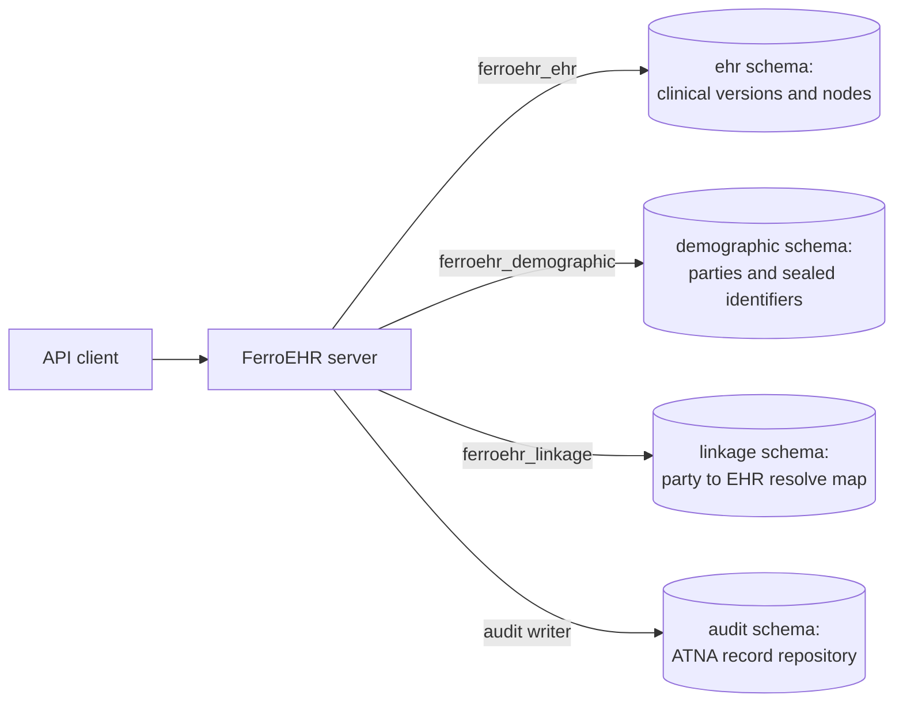

# Compliance overview

FerroEHR is software. It is not a controller, not a processor and not a
certified organisation, so nothing on this page says that a deployment
complies with anything. What this page does say is which technical controls
the product ships today, which are planned and tracked in public, and which
obligations stay with the organisation that runs it.

The page is written for three readers. A privacy officer wants the legal
sources and the split of duties. A hospital CISO wants the controls and their
status. A developer wants to know where the boundary between clinical and
identifying data runs. Each of those three readings takes about ten minutes.

It is also written in two layers, because openEHR is not a national standard
and FerroEHR is published for every country that runs it. The GDPR, the EDPB
guidelines and the EHDS apply to every EU deployment and come first. After
them come the national sections, one per jurisdiction, each on top of that
same EU layer. The Netherlands is filled in first because that is where the
project's own deployments are, not because it is the default; the
[national law](#national-law) section says how to add another.

<!-- toc -->

## What FerroEHR claims, and what it does not

FerroEHR aims to be the first openly developed, source-available openEHR CDR
with a published, tracker-backed EU compliance posture, and an EHDS conformity
self-assessment is on its roadmap.

It holds no certification, no declaration of conformity and no third-party
assessment. No page on this site will tell you that FerroEHR is "GDPR
compliant", "NEN 7510 certified" or "EHDS conformant", because none of those
statements would be true of a piece of software on its own.

What the project does instead is publish the record. A shipped control has a
feature page in this book and an issue in the tracker that delivered it. A
planned control has an open issue and appears here as planned, with its
number. The [control matrix](control-matrix.md) is generated from the tracker,
so a control cannot sit on this site as "planned" after it has shipped, or as
"shipped" before it has.

> [!WARNING]
> The legal texts linked here change, and some of them are not yet in force.
> The EHDS obligations phase in over several years on the dates its own final
> provisions carry, and NEN republishes its standards on its own cycle
> (NEN 7510 was reissued in December 2024). Check each publisher directly
> before you rely on a statement here: [EUR-Lex](https://eur-lex.europa.eu/)
> for EU law, [wetten.overheid.nl](https://wetten.overheid.nl/) for Dutch law,
> the [EDPB](https://www.edpb.europa.eu/) for guidelines, and
> [NEN](https://www.nen.nl/zorg-welzijn/ict-in-de-zorg/informatiebeveiliging-in-de-zorg)
> for the 7510 family. This page is a summary for evaluators and deployers,
> not legal advice.

## The pseudonymisation boundary

A clinical record is identifying as soon as the record and the person can be
put back together by whoever holds the database. Separating the two, and
controlling who may rejoin them, is what
[GDPR Art. 4(5)](https://eur-lex.europa.eu/eli/reg/2016/679/oj) calls
pseudonymisation, and it is the control the
[EDPB Guidelines 01/2025](https://www.edpb.europa.eu/our-work-tools/documents/public-consultations/2025/guidelines-012025-pseudonymisation_en)
expect a supplier to describe rather than assert.

openEHR anticipated this. The Reference Model's
[PARTY_SELF and Referring to the Patient from the EHR](https://specifications.openehr.org/releases/RM/Release-1.1.0/common.html#_party_self_and_referring_to_the_patient_from_the_ehr)
section names three schemes for pointing at the record subject, and calls the
one that never sets `external_ref` anywhere in the EHR "the most secure
approach", because the link between record and patient is then held outside
the EHR. The second scheme sets it once, in
[`EHR_STATUS.subject`](https://specifications.openehr.org/releases/RM/Release-1.1.0/ehr.html#_ehr_status_class),
whose own class description says the association "may be done elsewhere for
security reasons". The reference itself is a
[`PARTY_REF`](https://specifications.openehr.org/releases/BASE/Release-1.2.0/base_types.html#_party_ref_class),
described by the specification as an "identifier for parties in a demographic
or identity service", so it carries a namespace, a party type and an id and no
demographic content of its own. The specification leaves the choice of scheme
to the implementation. Where the schemas, the database roles and the resolve
path live is FerroEHR's own design, and no openEHR spec governs it.

### What ships today

Clinical content and demographic parties live in separate PostgreSQL schemas,
`ehr` and `demographic`, each with its own archival tier and its own runtime
database roles. `ferroehr_ehr` and `ferroehr_demographic`, and a read-only twin
of each, are `NOINHERIT`, hold explicit grants on one domain only, and carry an
explicit revoke on the other and on `linkage`. The server refuses to start if that does not
hold: a self-check enumerates every table, view, sequence and function in each
domain and names the role and the object it can reach. The database refuses the
mix as well, in both directions, so a code path that missed the split fails as
a write error rather than leaking quietly.

The separation of schemas is unconditional. Pointing the demographic and
linkage pools at their own DSNs (`[db] demographic_url` and
`[db] linkage_url`) makes it a separation of credentials too, which is what
stops one leaked connection string from reaching more than one domain.

The controls that apply across both domains are the same: role- and
attribute-based authorization, per-EHR access settings, tenant row-level
security, and the audit trail. Both sides carry openEHR's own provenance,
because every write commits a contribution and its audit in the same
transaction, which is the versioning discipline the
[Change Control Package](https://specifications.openehr.org/releases/RM/Release-1.1.0/common.html#_change_control_package)
defines.

The map that rejoins the two is separated as well. `linkage` is a third schema
under a fifth role, barred from both domains it joins and both of them from it,
holding identifiers and a validity period and no attribute. The one crossing
runs in the application over two pools and writes an access record. On the
clinical side the subject reference is an opaque pseudonym once
`[privacy] subject_namespaces` is declared, enforced by the write path and by a
database trigger, and the identifier scanner refuses a national identifier
anywhere in a clinical body.

### What is planned

One piece of the programme ([#3152](https://github.com/rubentalstra/FerroEHR/issues/3152) closed with v4.2.0) is still open,
and it is about reading across the boundary for secondary use rather than
holding the boundary.

| Planned control | Issue |
|---|---|
| A secondary-use read model as a separate pseudonymisation domain, fed from the outbox, under project-level pseudonyms | [#3160](https://github.com/rubentalstra/FerroEHR/issues/3160) |

Cross-domain cohort queries shipped with v4.2.0 ([#3159](https://github.com/rubentalstra/FerroEHR/issues/3159)): a cohort
question that spans both domains is answered through
[`POST /query/cohort`](../querying-aql.md#cohort-queries-across-the-pseudonymisation-boundary),
each step on its own credential with identifiers only crossing between them,
and a result set serving fewer distinct EHRs than the configured threshold is
withheld and marked suppressed. Until the read model lands, secondary use runs
on the primary store under those controls; size your access control, purpose
limitation and risk assessment on that. The [threat model](../threat-model.md)
states the residual risk at each boundary, and the [DPIA page](../security/dpia.md)
carries the risk register and the shipped controls by issue number.

### The deployment profile

A deployment declares what it may hold with the top-level `deployment_profile`
key ([configuration](../installation/configuration.md#deployment_profile)).
`production` refuses to start while a separation is missing and not accepted
by name: separated credentials, separated clusters, a declared pseudonym
namespace, an audit trail with a durable sink, schema preparation on its own
credential. `sandbox`, the default, must not hold real personal data and says
so on the banner, in the log and on `GET /rest/status`. The profile is
FerroEHR's own posture. GDPR Art. 4(5) asks that the additional information be
"kept separately and … subject to technical and organisational measures", not
that it sit on a separate server, so one cluster with separated schemas and
roles is a defensible reading; two clusters close the bridges no grant can,
the superuser, an instance-wide point-in-time recovery, a single compromise,
and the profile exists so that choice is made deliberately.

## GDPR

[Regulation (EU) 2016/679](https://eur-lex.europa.eu/eli/reg/2016/679/oj)
places its duties on the controller and the processor. A CDR can only supply
the technical measures those duties are met with. These are the articles a
repository actually touches.

| What the article asks for | What FerroEHR ships | Tracker | What the deploying organisation must do |
|---|---|---|---|
| **Art. 4(5)** pseudonymisation: identifying data kept separately, under technical measures | Clinical, demographic and linkage data in three schemas under non-overlapping `NOINHERIT` roles, enforced by grants, by a boot-time self-check in both directions and by a check on every table; separated credentials and clusters are asserted by the `production` [deployment profile](../installation/configuration.md#deployment_profile) | shipped, [#3153](https://github.com/rubentalstra/FerroEHR/issues/3153), [#3158](https://github.com/rubentalstra/FerroEHR/issues/3158), [#3226](https://github.com/rubentalstra/FerroEHR/issues/3226) | Run the production profile with the separations it asserts, and hold any additional information the CDR never sees to the same standard |
| **Art. 5(1)(f)** integrity and confidentiality | TLS 1.3 with optional mutual authentication, [authentication and authorization](../security.md), per-version digest [signing](../signing/index.md), a tamper-evident audit chain | shipped | Terminate TLS correctly, run the identity provider, hold the keys |
| **Art. 5(2)** accountability: being able to demonstrate compliance | An audit trail of every access, [retrievable over ITI-81](../audit.md#retrieving-audit-records-iti-81), plus openEHR's own contribution and audit chain on every write | shipped | Keep the records, define retention, be able to produce them |
| **Art. 9** special categories of data | Object-level [`EHR_ACCESS`](../security.md#per-ehr-access-control-ehr_access) settings, RBAC, ABAC, tenant row-level security | shipped | Establish the Art. 9(2) condition and the national derogation that permits the processing |
| **Art. 25** data protection by design and by default | Deny-by-default authorization, an `EHR_ACCESS` default that can be set to restricted, tenancy that fails closed, audit on by default | shipped | Choose the restrictive settings. Two defaults favour compatibility instead: the per-EHR access default is `open`, and the audit fail mode is `open` |
| **Art. 30** records of processing activities | The effective configuration as a redacted JSON tree at `GET {base}/admin/config`, and this book as a description of what the software does | shipped | Write and maintain the record itself; the software cannot know your purposes or recipients |
| **Art. 32** security of processing | The controls listed in [Security & multi-tenancy](../security.md) and the residual risk in the [threat model](../threat-model.md) | shipped | Assess whether they are appropriate to your risk, and supply everything below the application |
| **Art. 35** data protection impact assessment | A [DPIA page](../security/dpia.md) with the processing description, the data categories per schema, the roles, the retention including the Dutch access-log floor, a risk register and the shipped controls by issue, beside [records of processing](../security/records-of-processing.md) pre-filled with what the software does and a [go-live checklist](../security/go-live-checklist.md) | shipped, [#3161](https://github.com/rubentalstra/FerroEHR/issues/3161) | Run the DPIA; it is the controller's, and no supplier document replaces it |

## EDPB Guidelines 01/2025 on pseudonymisation

The [EDPB guidelines](https://www.edpb.europa.eu/our-work-tools/documents/public-consultations/2025/guidelines-012025-pseudonymisation_en)
ask for something more specific than "we pseudonymise": a named
pseudonymisation domain, a stated attacker, and additional information kept
where that attacker cannot reach it.

| What the guidelines ask for | What FerroEHR ships | Tracker | What the deploying organisation must do |
|---|---|---|---|
| A pseudonymisation domain stated explicitly | The clinical and demographic domains are separate schemas with their own roles, and the server refuses to boot if a role reaches across | shipped, [#3153](https://github.com/rubentalstra/FerroEHR/issues/3153) | State the domain for your deployment, including the parts outside FerroEHR |
| The additional information held separately from the pseudonymised data | The party-to-EHR map lives in its own `linkage` schema under its own `NOINHERIT` role, revoked from both domains it joins and reached by no other pool; it is temporal, so a merge or split closes a row rather than deleting it, and it is backed up under its own key and its own job | shipped, [#3158](https://github.com/rubentalstra/FerroEHR/issues/3158), [#3157](https://github.com/rubentalstra/FerroEHR/issues/3157) | Hold any mapping outside the CDR to the same standard, and give the linkage backup the narrowest audience |
| A written attacker model, including the insider holding a credential | The [threat model](../threat-model.md) names actors, boundaries and the risk surviving each control | shipped | Extend it with the actors your environment adds: operators, backups, the network |
| Resolution of a pseudonym recorded and controlled | Every resolution, merge and split is a linkage-domain access record, refused when it cannot be recorded under `fail_mode = "closed"`; a cohort query names its cohort by a digest of its predicates and never by their values | shipped, [#3155](https://github.com/rubentalstra/FerroEHR/issues/3155), [#3235](https://github.com/rubentalstra/FerroEHR/issues/3235), [#3159](https://github.com/rubentalstra/FerroEHR/issues/3159) | Restrict who may resolve, and review the trail |

## EHDS

[Regulation (EU) 2025/327](https://eur-lex.europa.eu/eli/reg/2025/327/oj)
splits into chapters that reach a CDR differently. Chapter III is the one that
speaks to an EHR system as a product, and its obligations apply from a date in
the regulation's own final provisions rather than today.

| Chapter | What FerroEHR ships | Tracker | What the deploying organisation must do |
|---|---|---|---|
| **Chapter II**, primary use, including the patient's access to their data and to a record of who accessed it | An [access trail](../audit.md) of every read, write and refusal, searchable by patient and by agent | shipped | Build the patient-facing access route; the CDR exposes the trail to an admin caller, not to the patient |
| **Chapter III**, EHR systems: a European interoperability software component and a European logging software component, with published technical documentation | The [EHDS readiness page](ehds-readiness.md) maps every Annex II requirement to a status with its evidence, the [technical documentation](technical-documentation.md) page maps the Annex II documentation items, and the access trail records the logging component's elements ([audit](../audit.md#the-ehds-logging-elements-mapped)) | readiness shipped, [#3168](https://github.com/rubentalstra/FerroEHR/issues/3168), [#3169](https://github.com/rubentalstra/FerroEHR/issues/3169), [#3170](https://github.com/rubentalstra/FerroEHR/issues/3170), [#3171](https://github.com/rubentalstra/FerroEHR/issues/3171); the exchange format itself is an open question until the Article 36 implementing acts fix it | Follow the implementing acts; the conformity assessment and the EU declaration are the manufacturer's, and who that is for a source-available CDR is stated on the readiness page |
| **Chapter IV**, secondary use | [AQL](../querying-aql.md) over the stored record, a [change-event outbox](../beyond-core/amqp.md), and [cohort queries across the pseudonymisation boundary](../querying-aql.md#cohort-queries-across-the-pseudonymisation-boundary) with small-cell suppression | shipped, [#3159](https://github.com/rubentalstra/FerroEHR/issues/3159); a separate pseudonymisation domain for secondary use is planned, [#3160](https://github.com/rubentalstra/FerroEHR/issues/3160) | Deal with the health data access body; a CDR is not a data-holder's permit process |

## National law

Everything above this line applies to every EU deployment. Everything below it
is one country's law on top of it, and a deployment reads only its own
section plus the EU layer.

One jurisdiction is filled in today. The product side of the split is already
plural: the write-path
[identifier scanner](../installation/config-privacy.md) ships a named rule per
national identifier — Finland, the United Kingdom, the Netherlands, Norway and
Sweden — each transcribing the checksum its own issuing register publishes,
and a deployment selects the ones its content can carry. Denmark and Belgium
are named there too, with the reason each is deliberately absent.

**Adding a jurisdiction** takes three things, and none of them is a change to
how the scanner works: the national acts that sit on top of the GDPR, as a
section in the shape of the Dutch one below (provision, what the product
ships, tracker status, what the organisation must do); the national security
and logging standards, in the shape of the NEN section; and, where the country
issues a personal identifier with a published algorithm, a rule in
`app/ferroehr/src/privacy/detect.rs` citing the register that defines it. Open
a [regulation request](https://github.com/rubentalstra/FerroEHR/issues/new?template=regulation.yml)
with the official source and the provisions that reach a repository, and the
project vendors the text and records a status per provision, the way the acts
below are handled. A checksum transcribed from a secondary source is refused,
because a rule that guesses tells an operator their data was scanned when it
was not.

### The Netherlands: UAVG and Wabvpz

Two Dutch acts sit on top of the GDPR for a care provider. The
[UAVG](https://wetten.overheid.nl/BWBR0040940) is the national implementation
act; the [Wabvpz](https://wetten.overheid.nl/BWBR0023864) governs the
burgerservicenummer in care and the patient's electronic access to their
record.

| Provision | What FerroEHR ships | Tracker | What the deploying organisation must do |
|---|---|---|---|
| **UAVG Art. 30**, exceptions for health data | Access control at the record and the attribute level, and an audit trail of who used it | shipped | Establish that your processing falls inside the exception, per role and per purpose |
| **UAVG Art. 46**, processing a national identification number | A national identifier is sealed at rest in the demographic domain under authenticated encryption with a per-tenant key, looked up through a keyed digest, resolved only through a `SECURITY DEFINER` function on the demographic role, and every resolution, hit or miss, is a recorded linkage access that never carries the value | shipped, [#3155](https://github.com/rubentalstra/FerroEHR/issues/3155) | Hold the statutory authorisation before a BSN enters the store, and restrict who may resolve |
| **Wabvpz Art. 4 to 9**, use and verification of the BSN by care providers | Nothing specific: FerroEHR performs no BSN verification and consults no index | not planned | Verify identity and the BSN in your own systems before data reaches the CDR |
| **Wabvpz Art. 15d**, electronic access and copy for the patient | The full record over the openEHR REST API, and [EHR Extract export](../beyond-core/messaging.md) for a whole record | shipped | Build the patient-facing route and authenticate the patient |
| **Wabvpz Art. 15e**, a record of who made data available and who consulted it | The ATNA trail records reads, writes and refusals with the agent, the patient, the action and the outcome, and answers a per-patient search | shipped | Turn the trail into something a patient can read, and set retention |

### The Netherlands: NEN 7510, NEN 7512 and NEN 7513

The [NEN 7510 family](https://www.nen.nl/zorg-welzijn/ict-in-de-zorg/informatiebeveiliging-in-de-zorg)
governs information security in Dutch healthcare. NEN 7510 is a
management-system standard, which no product can be certified against.
NEN 7512 governs what exchanging parties promise each other. NEN 7513 is the
one that states requirements a piece of software meets directly.

| Standard | What FerroEHR ships | Tracker | What the deploying organisation must do |
|---|---|---|---|
| **[NEN 7510-1](https://www.nen.nl/nen-7510-1-2024-nl-331311)** and **[7510-2](https://www.nen.nl/nen-7510-2-2024-nl-331314)**, the management system and its controls | Technical controls an ISMS can point at, documented per control with their residual risk | shipped | Run the ISMS and hold the [certification](https://www.nen.nl/certificatie-en-keurmerken-nen-7510); a product cannot be certified against a management-system standard |
| **[NEN 7512](https://www.nen.nl/nen-7512-2022-nl-297137)**, the trust basis for data exchange | Mutually authenticated TLS ([IHE ITI-19](../audit.md#node-authentication-iti-19-mutual-tls)), OAuth2 and OIDC with an [enterprise identity provider](../identity-providers.md), signed and verifiable [releases](../verifying-releases.md) | shipped | Agree the trust basis with each counterparty and operate the certificate estate |
| **[NEN 7513](https://www.nen.nl/nen-7513-2018-nl-245399)**, logging actions on electronic patient records | An IHE ATNA trail that records every operation including refusals, in FHIR `AuditEvent` and DICOM PS3.15 form, hash-chained in the database and retrievable per patient | shipped | Map the recorded fields onto the standard's own list, set retention, and review the trail |

## Where to go next

- **[Control matrix](control-matrix.md):** the machine-generated status of every
  declared control, straight from the tracker.
- **[Shared responsibility](shared-responsibility.md):** which obligation is
  the software's and which is yours, obligation by obligation.
- **[Security & multi-tenancy](../security.md):** how each control is
  configured.
- **[Threat model](../threat-model.md):** what survives each control.
- **[Audit trail](../audit.md):** what is recorded, in which formats, and how
  to read it back.
- **[Data protection impact assessment](../security/dpia.md):** the technical
  description, the risk register, and the shipped controls by issue number.
- **[Records of processing](../security/records-of-processing.md):** an
  Art. 30 template pre-filled with what the software does.
- **[Go-live checklist](../security/go-live-checklist.md):** what to verify
  before a deployment holds real patient data.
