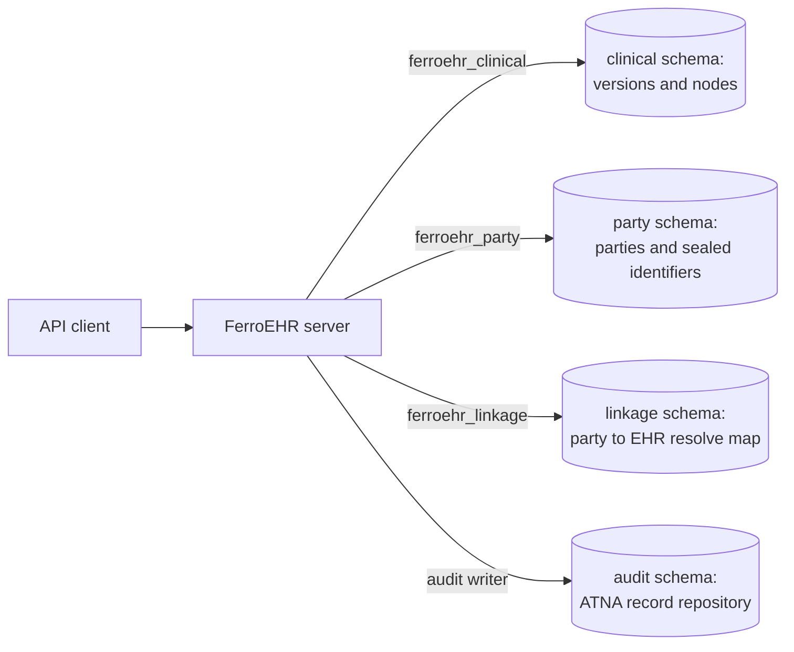

# Compliance overview

FerroEHR is software. It is not a controller, not a processor and not a
certified organisation, so nothing on this page says that a deployment
complies with anything. What this page does say is which technical controls
the product ships today, which are planned and tracked in public, and which
obligations stay with the organisation that runs it.

The page is written for three readers. A privacy officer wants the legal
sources and the split of duties. A hospital CISO wants the controls and their
status. A developer wants to know where the boundary between clinical and
identifying data runs. Each of those three readings takes about ten minutes.

It is also written in two layers, because openEHR is not a national standard
and FerroEHR is published for every country that runs it. The GDPR, the EDPB
guidelines and the EHDS apply to every EU deployment and come first. After
them come the national sections, one per jurisdiction, each on top of that
same EU layer. The Netherlands is filled in first because that is where the
project's own deployments are, not because it is the default; the
[national law](#national-law) section says how to add another.

<!-- toc -->

## What FerroEHR claims, and what it does not

FerroEHR aims to be the first openly developed, source-available openEHR CDR
with a published, tracker-backed EU compliance posture, and an EHDS conformity
self-assessment is on its roadmap.

It holds no certification, no declaration of conformity and no third-party
assessment. No page on this site will tell you that FerroEHR is "GDPR
compliant", "NEN 7510 certified" or "EHDS conformant", because none of those
statements would be true of a piece of software on its own.

What the project does instead is publish the record. A shipped control has a
feature page in this book and an issue in the tracker that delivered it. A
planned control has an open issue and appears here as planned, with its
number. The [control matrix](control-matrix.md) is generated from the tracker,
so a control cannot sit on this site as "planned" after it has shipped, or as
"shipped" before it has.

> [!WARNING]
> The legal texts linked here change, and some of them are not yet in force.
> The EHDS obligations phase in over several years on the dates its own final
> provisions carry, and NEN republishes its standards on its own cycle
> (NEN 7510 was reissued in December 2024). Check each publisher directly
> before you rely on a statement here: [EUR-Lex](https://eur-lex.europa.eu/)
> for EU law, [wetten.overheid.nl](https://wetten.overheid.nl/) for Dutch law,
> [gesetze-im-internet.de](https://www.gesetze-im-internet.de/) and
> [recht.bund.de](https://www.recht.bund.de/) for German federal law,
> [Fedlex](https://www.fedlex.admin.ch/) for Swiss federal law,
> the [EDPB](https://www.edpb.europa.eu/) for guidelines, and
> [NEN](https://www.nen.nl/zorg-welzijn/ict-in-de-zorg/informatiebeveiliging-in-de-zorg)
> for the 7510 family. This page is a summary for evaluators and deployers,
> not legal advice.
>
> The exact texts these pages were written against are vendored in the
> repository under
> [`docs/law/`](https://github.com/rubentalstra/FerroEHR/tree/main/docs/law), each
> at a named consolidation with its digest and licence, and that directory's
> README maps every act to the pages citing it. A statement here resolves to
> those bytes, and a publisher's later amendment is a re-pin there, not a
> silent change of meaning.

## The pseudonymisation boundary

A clinical record is identifying as soon as the record and the person can be
put back together by whoever holds the database. Separating the two, and
controlling who may rejoin them, is what
[GDPR Art. 4(5)](https://eur-lex.europa.eu/eli/reg/2016/679/oj) calls
pseudonymisation, and it is the control the
[EDPB Guidelines 01/2025](https://www.edpb.europa.eu/our-work-tools/documents/public-consultations/2025/guidelines-012025-pseudonymisation_en)
expect a supplier to describe rather than assert.

openEHR anticipated this. The Reference Model's
[PARTY_SELF and Referring to the Patient from the EHR](https://specifications.openehr.org/releases/RM/Release-1.1.0/common.html#_party_self_and_referring_to_the_patient_from_the_ehr)
section names three schemes for pointing at the record subject, and calls the
one that never sets `external_ref` anywhere in the EHR "the most secure
approach", because the link between record and patient is then held outside
the EHR. The second scheme sets it once, in
[`EHR_STATUS.subject`](https://specifications.openehr.org/releases/RM/Release-1.1.0/ehr.html#_ehr_status_class),
whose own class description says the association "may be done elsewhere for
security reasons". The reference itself is a
[`PARTY_REF`](https://specifications.openehr.org/releases/BASE/Release-1.2.0/base_types.html#_party_ref_class),
described by the specification as an "identifier for parties in a demographic
or identity service", so it carries a namespace, a party type and an id and no
demographic content of its own. The specification leaves the choice of scheme
to the implementation. Where the schemas, the database roles and the resolve
path live is FerroEHR's own design, and no openEHR spec governs it.

### What ships today

Clinical content and demographic parties live in separate PostgreSQL schemas,
`ehr` and `demographic`, each with its own archival tier and its own runtime
database roles. `ferroehr_clinical` and `ferroehr_party`, and a read-only twin
of each, are `NOINHERIT`, hold explicit grants on one domain only, and carry an
explicit revoke on the other and on `linkage`. The server refuses to start if that does not
hold: a self-check enumerates every table, view, sequence and function in each
domain and names the role and the object it can reach. The database refuses the
mix as well, in both directions, so a code path that missed the split fails as
a write error rather than leaking quietly.

The separation of schemas is unconditional. Pointing the demographic and
linkage pools at their own DSNs (`[storage.party] url` and
`[storage.linkage] url`) makes it a separation of credentials too, which is what
stops one leaked connection string from reaching more than one domain.

The controls that apply across both domains are the same: role- and
attribute-based authorization, per-EHR access settings, the
domain-separated database roles, and the audit trail. Both sides carry openEHR's own provenance,
because every write commits a contribution and its audit in the same
transaction, which is the versioning discipline the
[Change Control Package](https://specifications.openehr.org/releases/RM/Release-1.1.0/common.html#_change_control_package)
defines.

The map that rejoins the two is separated as well. `linkage` is a third schema
under a fifth role, barred from both domains it joins and both of them from it,
holding identifiers and a validity period and no attribute. The one crossing
runs in the application over two pools and writes an access record. On the
clinical side the subject reference is an opaque pseudonym once
`[privacy] subject_namespaces` is declared, enforced by the write path and by a
database trigger, and the identifier scanner refuses a national identifier
anywhere in a clinical body.

### What is planned

One piece of the programme ([#3152](https://github.com/rubentalstra/FerroEHR/issues/3152) closed with v4.2.0) is still open,
and it is about reading across the boundary for secondary use rather than
holding the boundary.

| Planned control | Issue |
|---|---|
| A secondary-use read model as a separate pseudonymisation domain, fed from the outbox, under project-level pseudonyms | [#3160](https://github.com/rubentalstra/FerroEHR/issues/3160) |

Cross-domain cohort queries shipped with v4.2.0 ([#3159](https://github.com/rubentalstra/FerroEHR/issues/3159)): a cohort
question that spans both domains is answered through
[`POST /query/cohort`](../querying-aql.md#cohort-queries-across-the-pseudonymisation-boundary),
each step on its own credential with identifiers only crossing between them,
and a result set serving fewer distinct EHRs than the configured threshold is
withheld and marked suppressed. Until the read model lands, secondary use runs
on the primary store under those controls; size your access control, purpose
limitation and risk assessment on that. The [threat model](../threat-model.md)
states the residual risk at each boundary, and the [DPIA page](../security/dpia.md)
carries the risk register and the shipped controls by issue number.

### The deployment profile

A deployment declares what it may hold with the top-level `deployment_profile`
key ([configuration](../installation/configuration.md#deployment_profile)).
`production` refuses to start while a separation is missing and not accepted
by name: separated credentials, separated clusters, a declared pseudonym
namespace, an audit trail with a durable sink, schema preparation on its own
credential. `sandbox`, the default, must not hold real personal data and says
so on the banner, in the log and on `GET /rest/status`. The profile is
FerroEHR's own posture. GDPR Art. 4(5) asks that the additional information be
"kept separately and … subject to technical and organisational measures", not
that it sit on a separate server, so one cluster with separated schemas and
roles is a defensible reading; two clusters close the bridges no grant can,
the superuser, an instance-wide point-in-time recovery, a single compromise,
and the profile exists so that choice is made deliberately.

## GDPR

[Regulation (EU) 2016/679](https://eur-lex.europa.eu/eli/reg/2016/679/oj)
places its duties on the controller and the processor. A CDR can only supply
the technical measures those duties are met with. These are the articles a
repository actually touches.

| What the article asks for | What FerroEHR ships | Tracker | What the deploying organisation must do |
|---|---|---|---|
| **Art. 4(5)** pseudonymisation: identifying data kept separately, under technical measures | Clinical, demographic and linkage data in three schemas under non-overlapping `NOINHERIT` roles, enforced by grants, by a boot-time self-check in both directions and by a check on every table; separated credentials and clusters are asserted by the `production` [deployment profile](../installation/configuration.md#deployment_profile) | shipped, [#3153](https://github.com/rubentalstra/FerroEHR/issues/3153), [#3158](https://github.com/rubentalstra/FerroEHR/issues/3158), [#3226](https://github.com/rubentalstra/FerroEHR/issues/3226) | Run the production profile with the separations it asserts, and hold any additional information the CDR never sees to the same standard |
| **Art. 5(1)(f)** integrity and confidentiality | TLS 1.3 with optional mutual authentication, [authentication and authorization](../security.md), per-version digest [signing](../signing/index.md), a tamper-evident audit chain | shipped | Terminate TLS correctly, run the identity provider, hold the keys |
| **Art. 5(1)(e)** storage limitation: data kept in identifying form no longer than the purposes need | A [retention register](retention.md#the-retention-register) of the period per content category and jurisdiction with the citation it rests on, a per-EHR anchor, and a view of what has run out. The repository deletes no clinical content on a timer: an openEHR record is indelible, so the register produces a list | shipped, [#3346](https://github.com/rubentalstra/FerroEHR/issues/3346) | Choose the periods, which follow from the law you run under and not from the software, and decide record by record what to do with the list |
| **Art. 5(2)** accountability: being able to demonstrate compliance | An audit trail of every access, [retrievable over ITI-81](../audit.md#retrieving-audit-records-iti-81), plus openEHR's own contribution and audit chain on every write | shipped | Keep the records, define retention, be able to produce them |
| **Art. 9** special categories of data | Object-level [`EHR_ACCESS`](../security.md#per-ehr-access-control-ehr_access) settings, RBAC, ABAC, and the domain-separated database roles | shipped | Establish the Art. 9(2) condition and the national derogation that permits the processing |
| **Art. 12(3)** action on a rights request within one month, by electronic means where the request came electronically | Every right in the rows below is served by an API call, so the record is read, exported, corrected or deleted in the run that answers the request | shipped | Start the clock at receipt, verify the requester's identity, and use the two-month extension only with the reasons 12(3) asks for |
| **Art. 15(1)** and **15(3)** access, and a copy of the data undergoing processing | The full record over the REST API in canonical openEHR JSON or XML, and [EHR Extract export](../beyond-core/messaging.md#exporting-an-ehr) for a whole record; the recipients 15(1)(c) asks about come from the [per-patient trail search](../audit.md#retrieving-audit-records-iti-81) | shipped | Supply what the software cannot know: the purposes of 15(1)(a) and the storage period of 15(1)(d) are your configuration and your retention schedule. Authenticate the requester and build the patient-facing route |
| **Art. 16** rectification, and completion by a supplementary statement | A correction commits a new version while the prior one stays in the append-only history, which is the supplementary statement the article allows for incomplete data | shipped | Decide what is inaccurate or incomplete, and reconcile the correction with the record-keeping duty your national law imposes |
| **Art. 17(1)** erasure, subject to the grounds in **17(3)(b) to (d)** | `DELETE {base}/admin/ehr/{ehr_id}` ([physical deletion](../operations-admin-apis.md#physical-deletion)) removes, in one transaction, the EHR and everything it owns over both storage tiers: compositions, `EHR_STATUS`, item tags, folder memberships, contributions, every historical version, the restriction and retention marks and the pending change events. The cross-reference row naming the subject is erased in the linkage domain, the externalized multimedia blobs no surviving version references are deleted from the object store, and an erasure tombstone on the change-event stream tells each consumer to delete what it derived (Art. 19). What stays is the audit trail naming the `ehr_id`, because Art. 17(3)(b) withholds erasure where processing is necessary for compliance with a legal obligation and the access-logging periods are that obligation | shipped, [#3347](https://github.com/rubentalstra/FerroEHR/issues/3347) | Decide whether a 17(3) ground refuses the request, a legal obligation, public health, or research under Art. 89(1), and record that decision. Backups, replicas and copies outside the CDR are reached by your own rotation, not by the call |
| **Art. 18** restriction of processing, which Art. 4(3) defines as marking stored data to limit its future processing | A [restriction register](retention.md#restriction-of-processing) at two grains, a whole EHR or one versioned object in it: a marked object stays in storage and every path that would process it stops, the point read, the versioned read and the revision history with **403**, AQL at every scope, the EHR Extract, the event stream and any write. The register keeps the request and stamps it lifted, so the sequence 18(3) turns on survives | shipped, [#3324](https://github.com/rubentalstra/FerroEHR/issues/3324) | Record the 18(1) ground on the request, hold the restriction in the systems around the CDR, and tell the subject before you lift it (18(3)) |
| **Art. 19** communicating a rectification, erasure or restriction to each recipient, and naming those recipients to the subject on request | Every read and export is an access record naming the agent, the patient, the action, the outcome and the time, so the recipient list is answerable from the [trail](../audit.md#retrieving-audit-records-iti-81) | shipped | Send the communications. The trail records who received data; it notifies nobody. How far back the recipient list reaches is your `retention_days`: the regulation sets no retention period for an access log |
| **Art. 20(1) and (2)** portability in a structured, commonly used and machine-readable format, and direct transmission where technically feasible | Canonical openEHR JSON and XML, the [simplified FLAT and STRUCTURED formats](../using-the-api/content-negotiation.md#simplified-formats-flat-and-structured), and the [EHR Extract](../beyond-core/messaging.md#exporting-an-ehr), which another openEHR system imports directly | shipped | Check the trigger before answering: 20(1)(a) reaches processing based on consent or on a contract, and 20(3) excludes processing for a task carried out in the public interest, which is the basis much care runs on |
| **Art. 21(1)** objection, and **21(6)** objection to research processing under Art. 89(1) | A [research objection](retention.md#objection-to-research-processing) per EHR: while it stands, the record leaves every full-population query, every export and the event stream, the three surfaces a secondary-use consumer reads the repository through, while a query naming the `ehr_id` and a read for care are untouched. The public-interest override 21(6) admits is recorded beside it and says on whose authority | shipped, [#3325](https://github.com/rubentalstra/FerroEHR/issues/3325) | Weigh the compelling legitimate grounds 21(1) asks for, record the outcome, and carry the objection into the systems outside the CDR |
| **Art. 25** data protection by design and by default | Deny-by-default authorization, an `EHR_ACCESS` default that can be set to restricted, tenancy that fails closed, audit on by default | shipped; the by-default setting Art. 25(2) asks for, so that a record is not accessible without the individual's intervention, is planned, [#3323](https://github.com/rubentalstra/FerroEHR/issues/3323) | Choose the restrictive settings. Two defaults favour compatibility instead: the per-EHR access default is `open`, and the audit fail mode is `open` |
| **Art. 28(3)(e) to (h)** what a processor's contract must let it do: assist with the rights, assist with Arts. 32 to 36, delete or return the data at the end of service, and make audit information available | For a vendor operating a deployment: the rights operations in the rows above for (e), the trail and the controls documented in this book for (f), [EHR Extract export](../beyond-core/messaging.md#exporting-an-ehr) beside admin [physical deletion](../operations-admin-apis.md#physical-deletion) for (g), and `GET {base}/admin/config` with the trail as the evidence (h) asks for | shipped | Conclude the contract Art. 28(3) requires with whoever operates the deployment; no software supplies it. The FerroEHR project operates nothing and is not your processor |
| **Art. 30** records of processing activities, and **30(1)(f)** the envisaged time limits for erasure of the different categories of data | The effective configuration as a redacted JSON tree at `GET {base}/admin/config`, this book as a description of what the software does, and the [retention register](retention.md#the-retention-register) as the machine-readable answer to the time limits per category 30(1)(f) asks for | shipped, [#3346](https://github.com/rubentalstra/FerroEHR/issues/3346) | Write and maintain the record itself; the software cannot know your purposes or recipients |
| **Art. 32** security of processing | The controls listed in [Security](../security.md) and the residual risk in the [threat model](../threat-model.md) | shipped | Assess whether they are appropriate to your risk, and supply everything below the application |
| **Art. 33(3)(a)** the categories and approximate number of subjects and of records a breach touched, and **Art. 34(3)(a)** the measures that remove the duty to tell patients | The trail records reads, writes and refusals per patient and per agent, so whose records an incident reached, and how many, is countable from it | shipped | Assess and notify inside the deadlines. 34(3)(a) lifts the duty to inform patients only where the protection measures "were applied to the personal data affected", so check what was in fact protected: the application seals national identifiers in the demographic domain and nothing else, and encryption of clinical content at rest belongs to the database and the disk. The regulation's text says nothing about encryption at rest, so the measure and its strength are your choice to make and to defend |
| **Art. 35** data protection impact assessment | A [DPIA page](../security/dpia.md) with the processing description, the data categories per schema, the roles, the retention including the Dutch access-log floor, a risk register and the shipped controls by issue, beside [records of processing](../security/records-of-processing.md) pre-filled with what the software does and a [go-live checklist](../security/go-live-checklist.md) | shipped, [#3161](https://github.com/rubentalstra/FerroEHR/issues/3161) | Run the DPIA; it is the controller's, and no supplier document replaces it |
| **Art. 89(1)** research safeguards: where the purpose can be met by processing that no longer identifies anyone, it must be met that way | [Cohort queries across the pseudonymisation boundary](../querying-aql.md#cohort-queries-across-the-pseudonymisation-boundary) answer a research question as an aggregate, withheld when fewer distinct EHRs than the configured threshold match | shipped, [#3159](https://github.com/rubentalstra/FerroEHR/issues/3159); the secondary-use read model as its own pseudonymisation domain is planned, [#3160](https://github.com/rubentalstra/FerroEHR/issues/3160) | Decide whether the purpose can be met without identification and take that route where it can. Until the read model lands, secondary use runs on the primary store |

## EDPB Guidelines 01/2025 on pseudonymisation

The [EDPB guidelines](https://www.edpb.europa.eu/our-work-tools/documents/public-consultations/2025/guidelines-012025-pseudonymisation_en)
ask for something more specific than "we pseudonymise": a named
pseudonymisation domain, a stated attacker, and additional information kept
where that attacker cannot reach it.

| What the guidelines ask for | What FerroEHR ships | Tracker | What the deploying organisation must do |
|---|---|---|---|
| A pseudonymisation domain stated explicitly | The clinical and demographic domains are separate schemas with their own roles, and the server refuses to boot if a role reaches across | shipped, [#3153](https://github.com/rubentalstra/FerroEHR/issues/3153) | State the domain for your deployment, including the parts outside FerroEHR |
| The additional information held separately from the pseudonymised data | The party-to-EHR map lives in its own `linkage` schema under its own `NOINHERIT` role, revoked from both domains it joins and reached by no other pool; it is temporal, so a merge or split closes a row rather than deleting it, and it is backed up under its own key and its own job | shipped, [#3158](https://github.com/rubentalstra/FerroEHR/issues/3158), [#3157](https://github.com/rubentalstra/FerroEHR/issues/3157) | Hold any mapping outside the CDR to the same standard, and give the linkage backup the narrowest audience |
| A written attacker model, including the insider holding a credential | The [threat model](../threat-model.md) names actors, boundaries and the risk surviving each control | shipped | Extend it with the actors your environment adds: operators, backups, the network |
| Resolution of a pseudonym recorded and controlled | Every resolution, merge and split is a linkage-domain access record, refused when it cannot be recorded under `fail_mode = "closed"`; a cohort query names its cohort by a digest of its predicates and never by their values | shipped, [#3155](https://github.com/rubentalstra/FerroEHR/issues/3155), [#3235](https://github.com/rubentalstra/FerroEHR/issues/3235), [#3159](https://github.com/rubentalstra/FerroEHR/issues/3159) | Restrict who may resolve, and review the trail |

## EHDS

[Regulation (EU) 2025/327](https://eur-lex.europa.eu/eli/reg/2025/327/oj)
splits into chapters that reach a CDR differently. Chapter III is the one that
speaks to an EHR system as a product, and its obligations apply from a date in
the regulation's own final provisions rather than today.

| Chapter | What FerroEHR ships | Tracker | What the deploying organisation must do |
|---|---|---|---|
| **Chapter II**, primary use, including the patient's access to their data and to a record of who accessed it | An [access trail](../audit.md) of every read, write and refusal, searchable by patient and by agent | shipped | Build the patient-facing access route; the CDR exposes the trail to an admin caller, not to the patient |
| **Chapter III**, EHR systems: a European interoperability software component and a European logging software component, with published technical documentation | The [EHDS readiness page](ehds-readiness.md) maps every Annex II requirement to a status with its evidence, the [technical documentation](technical-documentation.md) page maps the Annex II documentation items, and the access trail records the logging component's elements ([audit](../audit.md#the-ehds-logging-elements-mapped)) | readiness shipped, [#3168](https://github.com/rubentalstra/FerroEHR/issues/3168), [#3169](https://github.com/rubentalstra/FerroEHR/issues/3169), [#3170](https://github.com/rubentalstra/FerroEHR/issues/3170), [#3171](https://github.com/rubentalstra/FerroEHR/issues/3171); the exchange format itself is an open question until the Article 36 implementing acts fix it | Follow the implementing acts; the conformity assessment and the EU declaration are the manufacturer's, and who that is for a source-available CDR is stated on the readiness page |
| **Chapter IV**, secondary use | [AQL](../querying-aql.md) over the stored record, a [change-event outbox](../beyond-core/amqp.md), and [cohort queries across the pseudonymisation boundary](../querying-aql.md#cohort-queries-across-the-pseudonymisation-boundary) with small-cell suppression | shipped, [#3159](https://github.com/rubentalstra/FerroEHR/issues/3159); a separate pseudonymisation domain for secondary use is planned, [#3160](https://github.com/rubentalstra/FerroEHR/issues/3160) | Deal with the health data access body; a CDR is not a data-holder's permit process |

## National law

Everything above this line applies to every EU deployment. Everything below it
is one country's law on top of it, and a deployment reads only its own
section plus the EU layer.

Three jurisdictions are filled in today: the Netherlands, Germany and
Switzerland, each vendored under `docs/law/` and read against the text. The
product side of the split is plural too: the write-path
[identifier scanner](../installation/config-privacy.md) ships a named rule per
national identifier — Finland, the United Kingdom, the Netherlands, Norway and
Sweden — each transcribing the checksum its own issuing register publishes,
and a deployment selects the ones its content can carry. Denmark and Belgium
are named there too, with the reason each is deliberately absent.

**Adding a jurisdiction** takes three things, and none of them is a change to
how the scanner works: the national acts that sit on top of the GDPR, as a
section in the shape of the Dutch one below (provision, what the product
ships, tracker status, what the organisation must do); the national security
and logging standards, in the shape of the NEN section; and, where the country
issues a personal identifier with a published algorithm, a rule in
`app/ferroehr/src/privacy/detect.rs` citing the register that defines it. Open
a [regulation request](https://github.com/rubentalstra/FerroEHR/issues/new?template=04-regulation.yml)
with the official source and the provisions that reach a repository, and the
project vendors the text and records a status per provision, the way the acts
below are handled. A checksum transcribed from a secondary source is refused,
because a rule that guesses tells an operator their data was scanned when it
was not.

### The Netherlands: UAVG and Wabvpz

Two Dutch acts sit on top of the GDPR for a care provider. The
[UAVG](https://wetten.overheid.nl/BWBR0040940) is the national implementation
act; the [Wabvpz](https://wetten.overheid.nl/BWBR0023864) governs the
burgerservicenummer in care and the patient's electronic access to their
record.

| Provision | What FerroEHR ships | Tracker | What the deploying organisation must do |
|---|---|---|---|
| **UAVG Art. 30**, exceptions for health data | Access control at the record and the attribute level, and an audit trail of who used it | shipped | Establish that your processing falls inside the exception, per role and per purpose |
| **UAVG Art. 46**, processing a national identification number | A national identifier is sealed at rest in the demographic domain under authenticated encryption with the instance's identifier-protection key, looked up through a keyed digest, resolved only through a `SECURITY DEFINER` function on the demographic role, and every resolution, hit or miss, is a recorded linkage access that never carries the value | shipped, [#3155](https://github.com/rubentalstra/FerroEHR/issues/3155) | Hold the statutory authorisation before a BSN enters the store, and restrict who may resolve |
| **Wabvpz Art. 4 to 9**, use and verification of the BSN by care providers | Nothing specific: FerroEHR performs no BSN verification and consults no index | not planned | Verify identity and the BSN in your own systems before data reaches the CDR |
| **Wabvpz Art. 15d**, electronic access and copy for the patient | The full record over the openEHR REST API, and [EHR Extract export](../beyond-core/messaging.md) for a whole record | shipped | Build the patient-facing route and authenticate the patient |
| **Wabvpz Art. 15e**, a record of who made data available and who consulted it | The ATNA trail records reads, writes and refusals with the agent, the patient, the action and the outcome, and answers a per-patient search | shipped | Turn the trail into something a patient can read, and set retention |

### The Netherlands: NEN 7510, NEN 7512 and NEN 7513

The [NEN 7510 family](https://www.nen.nl/zorg-welzijn/ict-in-de-zorg/informatiebeveiliging-in-de-zorg)
governs information security in Dutch healthcare. NEN 7510 is a
management-system standard, which no product can be certified against.
NEN 7512 governs what exchanging parties promise each other. NEN 7513 is the
one that states requirements a piece of software meets directly.

| Standard | What FerroEHR ships | Tracker | What the deploying organisation must do |
|---|---|---|---|
| **[NEN 7510-1](https://www.nen.nl/nen-7510-1-2024-nl-331311)** and **[7510-2](https://www.nen.nl/nen-7510-2-2024-nl-331314)**, the management system and its controls | Technical controls an ISMS can point at, documented per control with their residual risk | shipped | Run the ISMS and hold the [certification](https://www.nen.nl/certificatie-en-keurmerken-nen-7510); a product cannot be certified against a management-system standard |
| **[NEN 7512](https://www.nen.nl/nen-7512-2022-nl-297137)**, the trust basis for data exchange | Mutually authenticated TLS ([IHE ITI-19](../audit.md#node-authentication-iti-19-mutual-tls)), OAuth2 and OIDC with an [enterprise identity provider](../identity-providers.md), signed and verifiable [releases](../verifying-releases.md) | shipped | Agree the trust basis with each counterparty and operate the certificate estate |
| **[NEN 7513](https://www.nen.nl/nen-7513-2018-nl-245399)**, logging actions on electronic patient records | An IHE ATNA trail that records every operation including refusals, in FHIR `AuditEvent` and DICOM PS3.15 form, hash-chained in the database and retrievable per patient | shipped | Map the recorded fields onto the standard's own list, set retention, and review the trail |

### Germany: BDSG, SGB V, GDNG and § 203 StGB

Four federal acts sit on top of the GDPR for a German care provider. The
[BDSG](https://www.gesetze-im-internet.de/bdsg_2018/) carries the national
health-data ground and the research derogation; [SGB V](https://www.gesetze-im-internet.de/sgb_5/)
§§ 341 to 355 define the elektronische Patientenakte (ePA) and §§ 360 to 363
the telematics infrastructure, as rewritten by the
[Digital-Gesetz](https://www.recht.bund.de/bgbl/1/2024/101/VO.html); the
[GDNG](https://www.gesetze-im-internet.de/gdng/) governs secondary use; and
[§ 203 StGB](https://www.gesetze-im-internet.de/stgb/__203.html) is the
professional secrecy every access by a non-clinician is measured against.
State law (the Landeskrankenhausgesetze and the state data protection acts) is
not covered here; a hospital reads its own state's law beside this section.

FerroEHR is not an ePA, holds no telematics-infrastructure component, and
performs no electronic health professional card (HBA) or institution card
(SMC-B) authentication. Where a provision below binds the ePA operator, the
health insurer or gematik, the row says so.

| Provision | What FerroEHR ships | Tracker | What the deploying organisation must do |
|---|---|---|---|
| **BDSG § 22 Abs. 1 Nr. 1 lit. b and Abs. 2**, the health-care ground for special categories and the measures named for it: traceability of who entered, changed or removed data, access restriction inside the controller and its processors, pseudonymisation, encryption | An append-only version history where every write commits a contribution and its audit in one transaction, an [access trail](../audit.md) of every read, write and refusal, deny-by-default [authorization](../security.md#authorization) with read-only roles, the three-schema [pseudonymisation boundary](#the-pseudonymisation-boundary), TLS 1.3 and national identifiers sealed at rest | shipped, [#3153](https://github.com/rubentalstra/FerroEHR/issues/3153), [#3155](https://github.com/rubentalstra/FerroEHR/issues/3155) | Establish that the processing is by, or under the responsibility of, persons bound by professional secrecy, as lit. b requires; the Abs. 2 list is a menu of measures the law names, and the duty is to choose appropriate and specific ones |
| **BDSG § 27 Abs. 3**, research: identifying characteristics stored separately and rejoined only as the research purpose requires, anonymised as soon as possible | Clinical, demographic and linkage data in separate schemas under separate roles; [cohort queries](../querying-aql.md#cohort-queries-across-the-pseudonymisation-boundary) that cross the boundary on identifiers only, with small-cell suppression | shipped, [#3158](https://github.com/rubentalstra/FerroEHR/issues/3158), [#3159](https://github.com/rubentalstra/FerroEHR/issues/3159); a separate secondary-use domain under project-level pseudonyms is planned, [#3160](https://github.com/rubentalstra/FerroEHR/issues/3160) | Decide when the research purpose no longer needs the link and anonymise; hold the balancing test Abs. 1 asks for |
| **BDSG § 35 Abs. 2 and 3**, restriction of processing in place of erasure where erasure would harm the subject or a retention period bars it | The same [restriction register](retention.md#restriction-of-processing) the GDPR Art. 18 row above describes, at whole-EHR or single-object grain, with `national` as the ground a member-state rule like this one is recorded under | shipped, [#3324](https://github.com/rubentalstra/FerroEHR/issues/3324) | Decide per request whether Art. 17 or the restriction applies, record which of Abs. 2 or Abs. 3 it rests on, and notify the subject of a restriction |
| **SGB V § 339 Abs. 3 and 5, § 352, § 361**, access to the ePA and to prescriptions only with a professional credential, a verifiable log of who accessed which data and who authorised a delegated access, and a closed per-role matrix of read and write scopes | Role- and attribute-based authorization over the roles the identity provider asserts, and an access trail naming the agent, its roles, the patient, the action and the outcome, refusals included | shipped | Bind the identity provider to the HBA and SMC-B credentials; these sections bind access to the ePA itself, which the CDR is not, and the CDR encodes the § 352 matrix only as far as the roles reach it |
| **SGB V §§ 346 to 348**, the duty to write treatment data into the patient's ePA, conditioned on the provider's system holding it in semantically and syntactically interoperable form, with discharge letters, laboratory and imaging reports named outright | Every record is structured against an openEHR template and served over the [REST API](../getting-started.md) and as an [EHR Extract](../beyond-core/messaging.md#exporting-an-ehr), so a hospital's data meets the condition that triggers the duty | shipped | Run the transport into the ePA: the connector, the telematics infrastructure and the information objects § 355 prescribes are outside the CDR |
| **SGB V § 347 Abs. 1, 4 and 6, § 348 Abs. 3 to 6, § 353 Abs. 3 and 5**, every objection, consent and refusal ground recorded verifiably in the treatment documentation; genetic results only by the responsible physician on explicit consent | A consent, objection or refusal recorded as a composition is versioned, attributed and audited like every other entry; FerroEHR ships no dedicated consent register and no per-category export gate | shipped, as versioned content | Model the consent and objection records in your templates, and gate the ePA transfer on them in the transport |
| **SGB V § 309**, the telematics-infrastructure access log: attempted accesses as well as successful ones, who accessed which data, three years' retention and deletion on expiry, person-identifiable from 2030 | The trail records attempts and refusals with the agent and the object touched; `[audit.store] retention_days` and the [retention reaper](../audit.md#retention-and-who-chooses-it) implement the period, and `[audit.store] sgb_v_309_controller` turns Abs. 3 into a [boot-checked ceiling](retention.md#the-audit-trail-and-the-access-log-ceiling) that refuses any horizon above the three-year period, keep-forever included | shipped, [#3346](https://github.com/rubentalstra/FerroEHR/issues/3346) | This section binds the controllers of TI applications under § 307; a CDR outside the TI is not one. Set the declaration only if you are one, set the retention you owe, and review the trail |
| **SGB V § 355**, interoperability of ePA content: international standards, the BfArM terminologies, a versioned terminology server | openEHR archetypes and templates as the content model, terminology bindings resolved at commit time against any FHIR R4B terminology server through [`[terminology.external]`](../installation/config-integrations.md), which is the interface gematik's terminology server exposes | shipped | Point the terminology route at the server gematik runs and adopt the information objects the KBV publishes; the text names no serialization, and neither does this page |
| **SGB V § 360 Abs. 16**, electronic prescription transport outside the telematics infrastructure is prohibited | Nothing, and nothing planned: the CDR carries no prescription transport | not planned | Run prescriptions through the TI |
| **GDNG § 6**, a provider's own patient data reprocessed for quality assurance, research and statistics: pseudonymised, anonymised as soon as possible, under a rights-and-roles concept with logging, deleted after thirty years at the latest, and disclosable to the subject by kind, scope and concrete purpose | Per-domain roles that keep a research credential off the identifying data, [cohort queries](../querying-aql.md#cohort-queries-across-the-pseudonymisation-boundary) named by a digest of their predicates and withheld under a small-cell threshold, an access record per query carrying the deployment's declared `purpose` and `legal_basis`, and the [retention register](retention.md#the-retention-register) as where the thirty-year limit for the repository's own copies is written down and read back | shipped, [#3159](https://github.com/rubentalstra/FerroEHR/issues/3159), [#3346](https://github.com/rubentalstra/FerroEHR/issues/3346); the rebuildable read model under project-level pseudonyms is planned, [#3160](https://github.com/rubentalstra/FerroEHR/issues/3160) | Write the rights-and-roles concept, publish the purposes, run the thirty-year clock against the register, and answer subjects' requests from the trail |
| **SGB V § 290**, the Krankenversichertennummer every insured person's record carries | The [identifier scanner](../installation/config-privacy.md)'s `de-kvnr` rule refuses the number's unchangeable part in clinical content, transcribed from the GKV-Spitzenverband's Richtlinie; no access-log retention floor is registered for Germany, because the BDSG sets none for a hospital and SGB V § 309 binds the telematics-infrastructure controllers | shipped, [#3318](https://github.com/rubentalstra/FerroEHR/issues/3318) | Keep the number out of the clinical record as the scanner asks, and hold it sealed in the demographic domain |
| **§ 203 StGB Abs. 3 and 4**, disclosure to persons who keep the systems running is lawful only as far as their work requires it, and the professional is liable for not binding them to secrecy | Operations reach the CDR through separate [surfaces](../security.md#operational-surfaces-what-is-reachable-and-by-whom) (management, admin, clinical), every admin read of clinical content is an access record naming the caller, the database roles hold one domain each, and secrets are mounted rather than baked | shipped | Bind every operator and subcontractor to secrecy in writing, and give support a route that needs no standing read of clinical content |

### Switzerland: DSG, DSV, EPDG and its ordinances

Switzerland is not an EU member state, so a Swiss deployment processes under
the [Datenschutzgesetz (DSG)](https://www.fedlex.admin.ch/eli/cc/2022/491/de)
and its ordinance, the [DSV](https://www.fedlex.admin.ch/eli/cc/2022/568/de),
in force since 1 September 2023, and the GDPR does not apply to it. The
[EPDG](https://www.fedlex.admin.ch/eli/cc/2017/203/de) with the
[EPDV](https://www.fedlex.admin.ch/eli/cc/2017/204/de) and the
[EPDV-EDI](https://www.fedlex.admin.ch/eli/cc/2017/205/de) govern the
elektronisches Patientendossier (EPD), a retrieval layer run by certified
communities over records that stay where they are. Cantonal health and data
protection law is not covered here. The German text is the authentic one;
Fedlex's English translations of the DSG and DSV are vendored beside it and
bind nobody.

FerroEHR is not an EPD community and holds no certification. Where a provision
binds a community or the identity issuers, the row says so.

| Provision | What FerroEHR ships | Tracker | What the deploying organisation must do |
|---|---|---|---|
| **DSG Art. 7**, data protection by design and by default: processing arranged from the planning stage so the Art. 6 principles hold, and defaults that limit processing to the minimum | Deny-by-default [authorization](../security.md#authorization), tenancy that fails closed, audit on by default, and a `production` [deployment profile](../installation/configuration.md#deployment_profile) that refuses to start while a separation is missing | shipped | Choose the restrictive settings. Two defaults favour compatibility instead: the per-EHR access default is `open`, and the audit fail mode is `open` |
| **DSG Art. 8 and DSV Art. 2 and 3**, the minimum security measures: need-to-know access control, storage and transport control, restoration, malfunction reporting, system security, entry control, disclosure control, breach detection | Role- and attribute-based [authorization](../security.md#authorization) and per-EHR `EHR_ACCESS`; one database role per domain; TLS 1.3 with optional mutual authentication; health and readiness endpoints; a locked, advisory-gated dependency set and [signed releases](../verifying-releases.md); every write attributed and versioned; an [access trail](../audit.md) naming who read what, refusals included | shipped | Run the backup and restore path, patch on the release cadence, and detect breaches from the trail and the metrics; the DSV names the controls, the deployment supplies everything below the application |
| **DSV Art. 4 Abs. 1, 4 and 5**, logging for large-scale processing of sensitive data: storing, changing, disclosing, deleting, destroying and reading, each entry with the actor, the kind, the date, the time and the recipient, kept at least one year separately from the processing system and readable only by the oversight roles | The trail records every operation including reads and refusals with the agent, the patient, the action, the outcome and the time, in a dedicated `audit` schema retrievable by an admin caller only, with [forwarding sinks](../audit.md#getting-the-log-out) (syslog, IHE ITI-20) that put a copy outside the system; `[audit.store] retention_days` sets the period | shipped | Forward the trail to a repository outside the CDR, set the retention at a year or more, and restrict who may read it; the one-year floor is enforced at boot once a Swiss identifier rule is active, [#3319](https://github.com/rubentalstra/FerroEHR/issues/3319) |
| **DSG Art. 12 and DSV Art. 24**, the register of processing activities, from which large-scale processing of sensitive data has no small-organisation exemption | The effective configuration as a redacted JSON tree at `GET {base}/admin/config`, [records of processing](../security/records-of-processing.md) pre-filled with what the software does, and the retention and security-measure inputs Art. 12 Abs. 2 lit. e and f ask for | shipped | Write and maintain the register; the software cannot know your purposes or recipients |
| **DSG Art. 22 Abs. 2 lit. a**, a data protection impact assessment before large-scale processing of sensitive data | The [DPIA page](../security/dpia.md) with the processing description, the data categories per schema, the roles, the retention, a risk register and the shipped controls by issue | shipped, [#3161](https://github.com/rubentalstra/FerroEHR/issues/3161) | Run the assessment; it is the controller's. Art. 22 Abs. 5 lets a private controller skip it for a system certified under Art. 13, and FerroEHR holds no such certification |
| **DSG Art. 24**, notifying the EDÖB of a breach as soon as possible, with its kind, consequences and measures | The evidence a notification is written from: the trail with refusals attributed to the caller, the hash chain that shows tampering, the boot-time domain self-check | shipped | Detect, assess and notify; nothing in the software sends a notification |
| **DSG Art. 25 Abs. 2, 3 and 7, DSV Art. 16 and 18**, the right of access within 30 days: the data themselves, the purpose, the retention, the provenance and the recipients, in an understandable form, health data deliverable through a designated health professional | The full record over the openEHR REST API and as an [EHR Extract](../beyond-core/messaging.md#exporting-an-ehr), a [per-patient search of the trail](../audit.md#retrieving-audit-records-iti-81) that answers who received the data, and the [retention register](retention.md#the-retention-register), which is where the Abs. 2 lit. d answer, the retention period or the criteria that fix it, is read from rather than recalled | shipped, [#3346](https://github.com/rubentalstra/FerroEHR/issues/3346) | Identify the requester (DSV Art. 16 Abs. 5), render the answer in an understandable form, route it to the patient or the designated professional, and meet the 30 days |
| **DSG Art. 28 and DSV Art. 21**, data portability in a common electronic format that another controller can reuse | Canonical openEHR JSON and XML, the simplified FLAT and STRUCTURED formats, and the EHR Extract, all published open formats | shipped | Decide which data are subject-provided or observed and which are derived (DSV Art. 20 Abs. 2), and export accordingly |
| **DSG Art. 6 Abs. 4 and Art. 31 Abs. 2 lit. e**, destruction or anonymisation once the purpose lapses, and research on the condition that data are anonymised as soon as the purpose allows, with measures against identifiability meanwhile | Clinical, demographic and linkage data in separate schemas under separate roles, [cohort queries](../querying-aql.md#cohort-queries-across-the-pseudonymisation-boundary) with small-cell suppression, admin deletion and archival of a record, and the [retention register](retention.md#the-retention-register) that says when a purpose has lapsed and lists what is due | shipped, [#3158](https://github.com/rubentalstra/FerroEHR/issues/3158), [#3159](https://github.com/rubentalstra/FerroEHR/issues/3159), [#3346](https://github.com/rubentalstra/FerroEHR/issues/3346); a separate secondary-use domain under project-level pseudonyms is planned, [#3160](https://github.com/rubentalstra/FerroEHR/issues/3160) | Set the retention the cantonal health law requires, decide when anonymisation is possible, and hold the research ground |
| **EPDG Art. 9 and 10, EPDV Art. 1 to 4, 10 and 12, EPDV-EDI Anhang 5**, the EPD: three confidentiality levels and grantable access rights, emergency access with notification of the patient, every processing logged and the logs kept ten years, EPD data stored separately and encrypted, data stores in Switzerland, and the IHE profiles a community speaks (ATNA with Record Audit Event ITI-20 and Authenticate Node ITI-19, CH:ATC with Retrieve ATNA Audit Event ITI-81, IUA, XUA, XDS, MHD) | What a community integration consumes: [IHE ATNA](../audit.md) audit events over ITI-20 with [ITI-19 mutual TLS](../audit.md#node-authentication-iti-19-mutual-tls) and ITI-81 retrieval, the record in published formats, a self-hosted deployment with no dependency outside the operator's control, and the [retention register](retention.md) for Art. 10's twenty-year destruction, with the per-object hold Abs. 2 lit. b asks for | shipped, [#3346](https://github.com/rubentalstra/FerroEHR/issues/3346); FerroEHR has no emergency-access mode and encrypts national identifiers only, so encryption at rest is the database's and the disk's | These provisions bind the certified community, which the CDR is not. Feed the EPD through a community's access point, place the data stores in Switzerland, and carry the confidentiality level on each document you contribute |
| **EPDV Art. 5 and 7, EPDV-EDI Anhang 1, AHVV Art. 133**, the patient identification number (eighteen digits with a published check digit, entered manually only under a check-digit control, never a source of inference about the patient) and the AHV number it is issued from | The [identifier scanner](../installation/config-privacy.md)'s `ch-epd-pid` and `ch-ahvn13` rules refuse either number in clinical content, transcribed from the ordinance's annex and the BSV's Wegleitung; the access-log retention floor of DSV Art. 4 Abs. 5 is enforced once a Swiss rule is active | shipped, [#3319](https://github.com/rubentalstra/FerroEHR/issues/3319) | Treat the number as opaque, and keep the AHV number out of clinical content |

## Where to go next

- **[Control matrix](control-matrix.md):** the machine-generated status of every
  declared control, straight from the tracker.
- **[Shared responsibility](shared-responsibility.md):** which obligation is
  the software's and which is yours, obligation by obligation.
- **[Security](../security.md):** how each control is
  configured.
- **[Threat model](../threat-model.md):** what survives each control.
- **[Audit trail](../audit.md):** what is recorded, in which formats, and how
  to read it back.
- **[Data protection impact assessment](../security/dpia.md):** the technical
  description, the risk register, and the shipped controls by issue number.
- **[Records of processing](../security/records-of-processing.md):** an
  Art. 30 template pre-filled with what the software does.
- **[Go-live checklist](../security/go-live-checklist.md):** what to verify
  before a deployment holds real patient data.
