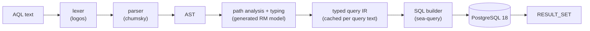
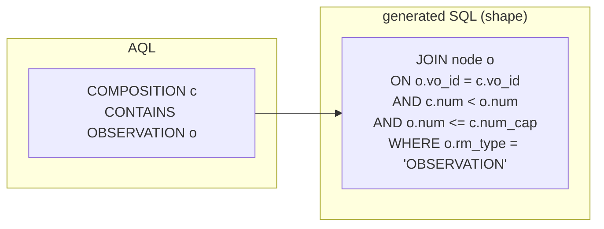

# The AQL engine

How FerroEHR turns an AQL query into SQL, and why the result is fast. This
page is about the engine's internals; for writing queries against the API,
see [Querying with AQL](../querying-aql.md).

The language is openEHR AQL 1.1. openEHR defines the language, not its
execution, so everything after the parse is FerroEHR's own design.

<!-- toc -->

## The pipeline

One query passes through six stages. Each stage has a single job, a typed
output, and a typed refusal: a construct the engine does not support is
rejected with an error naming the QUERY specification section it comes from,
never answered approximately.

### Lexer and parser

The front end is a hand-written crate (`openehr-query`) with no ANTLR
runtime: a `logos` tokenizer transcribed from the official `AqlLexer.g4`
grammar and a `chumsky` parser that builds one AST type per `AqlParser.g4`
rule. AQL keywords are case-insensitive; quoted temporal literals stay
strings at this layer because the QUERY specification resolves their typing
from the path context, not from the literal. The crate stops at the AST and
is validated against the grammar's own example corpus.

### Path analysis and typing

The planner types every identified path
(`c/content[...]/data/events[...]/...`) against a **generated RM attribute
model**: the same code generator that produces the RM types from openEHR's
machine-readable meta-model also emits a static table of every class's
attributes, their declared types, containers and cardinalities, plus the
abstract-to-concrete descendant sets. Path resolution is therefore a table
lookup, not runtime reflection and not a hand-maintained list, and it cannot
drift from the RM: regenerating the spec layer regenerates the oracle.

This stage answers, per path step: which RM classes can this step land on,
is it a structural hop or a data leaf, what value type does the leaf carry,
and which archetype predicates bound it.

### The typed IR

Analysis and lowering produce a typed query intermediate representation. The
IR carries no SQL and bakes in no request state: no parameter values, no
paging window, no EHR scope. That purity is deliberate. Because the IR is a
pure function of the query text, the query service caches lowered plans
keyed on that text, so a stored query is planned once, not once per call;
per-request parameter checking runs separately against the cached plan.

### SQL generation

The IR lowers to one `SELECT` built entirely with `sea-query`'s typed
expression API: no string-concatenated SQL anywhere, every literal bound as
a parameter. The shapes it emits are where the
[storage design](storage.md) pays off:

- **CONTAINS is integer arithmetic.** The node store keeps a nested-set
  interval per RM node: "B inside A" is
  `A.num < B.num AND B.num <= A.num_cap`. A CONTAINS chain becomes a chain
  of integer range joins over one table. No JSON is opened to answer
  containment.

- **Class and archetype predicates hit promoted columns.** `rm_type`, the
  parsed archetype identifier columns and names are plain indexed columns;
  a predicate naming a parent archetype matches specialised children through
  an indexed prefix scan.
- **Leaf values come out through SQL/JSON.** Data values are extracted from
  the canonical node fragments with `jsonb_path_query_first` and jsonpath
  item methods; `JSON_TABLE` unnests arrays; ordering on clinical magnitudes
  uses `openehr_magnitude`, an `IMMUTABLE` helper function realizing
  DV_ORDERED ordering semantics, usable in expression indexes.
- **Version scope is a predicate, not a join through history tables.**
  `LATEST_VERSION` is a partial-index predicate on the one temporal version
  table; `ALL_VERSIONS` is the same table unfiltered.

### Execution and RESULT_SET

The built statement executes with bound parameters, and rows assemble into
the ITS-REST `RESULT_SET` shape. Whole-object projections serve the
version's stored canonical body bytes; leaf projections serve the extracted
values.

## What the engine refuses

Every AQL construct outside the accepted envelope is a typed error carrying
its QUERY specification reference. The same strictness applies inside the
pipeline: an unknown class, an unresolvable attribute, a type mismatch, or
an unbound `$parameter` refuses the query at plan time, before any SQL
exists. A query never degrades into a silently wrong answer.

## Why it is fast

The speed is a property of the storage and planning design, not of tuning
flags:

1. **No JSON tree walking on the hot path.** The classic CDR cost is walking
   large JSON documents to test containment and extract predicates. That
   cost is gone by construction: containment is integer math, predicates
   are indexed columns.
2. **Decomposed fragments stay small.** Node fragments average a few hundred
   bytes, so the rows a query touches decompress cheaply, and point reads
   of whole compositions bypass reassembly entirely by serving stored
   canonical bytes.
3. **Plans are cached.** The IR is request-independent and cached on query
   text; repeated and stored queries skip lexing, parsing and typing.
4. **PostgreSQL 18 does the heavy lifting.** B-tree skip scan, `OR` to
   `= ANY` rewriting, self-join elimination, asynchronous I/O and the
   SQL/JSON function family are exactly the features the generated SQL
   leans on.
5. **Everything is measured, nothing declared.** The performance FerroEHR
   publishes comes from committed, re-checkable measurement records under
   the conformance instrument: see [Performance](../performance.md) and
   [Benchmarks](../benchmarks.md). This page explains the design; those
   pages carry the numbers.
