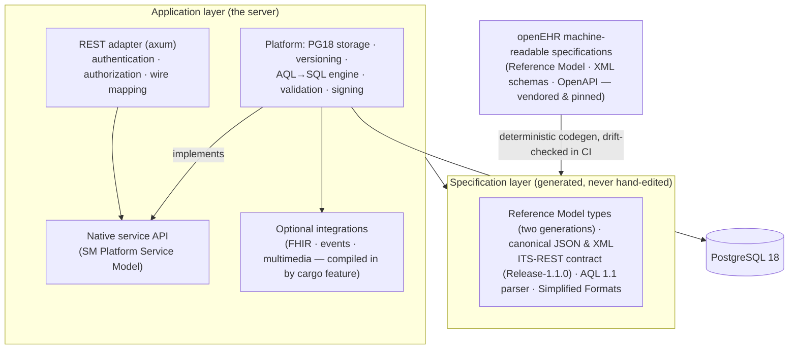

# System architecture

This chapter explains how FerroEHR is built and where your data lives, in
practical terms. You do not need any of it to use the API — but it clarifies
why the server behaves the way it does: why compliance claims are trustworthy,
why versioning is exact, and why AQL is fast. Two ideas run through everything:
the openEHR *specification layer* is generated from the official models rather
than hand-written, and the *storage* is designed natively for PostgreSQL 18.

## Two layers

**The specification layer is generated.** openEHR publishes its Reference
Model, serialization schemas, and REST contract as machine-readable models.
FerroEHR generates its Rust types, canonical JSON/XML (de)serialization, the
REST API contract, and the AQL front end directly from those models. The
consequence for you: the server's data shapes and wire contract cannot silently
drift from the standard — a continuous-integration check regenerates everything
and fails the build on any divergence. A specification update is a
regeneration, not a rewrite.

**The application layer is the server** — everything the generated layer does
not give you: storage, the query execution engine, validation, and security.
This is where design choices specific to FerroEHR live. The optional
integrations (FHIR, change events, S3 multimedia) sit beside it in their own
crate behind additive cargo features, so a build without them contains none of
their code — see [Beyond the core](../beyond-core/index.md).

## Two specification generations, one selectable set

The Reference Model is not pinned to a single version. The generated layer
emits **two generations side by side** — the latest released one and the
development one — and a single configuration key, `spec_profile`, picks which
set the server runs: `development` (Reference Model 1.2.0 with BASE 1.3.0, the
default) or `stable` (Reference Model 1.1.0 with BASE 1.2.0). Because openEHR's
minor releases are additive supersets, everything valid under `stable` is valid
under `development`; the reverse is not guaranteed, so the profile also acts as
an **acceptance boundary** — a query naming a class or attribute the selected
released generation does not define is refused, naming the active profile,
rather than answering rows that would overclaim it. See
[`spec_profile`](../installation/configuration.md#spec_profile).

## The native service API

Internally the server is organised around the openEHR **Platform Service
Model** — a standard catalogue of service components (EHR, Composition,
Directory, Contribution, Query, Definition, Terminology, Admin, and more) —
one module per component, whose methods carry the specification's own operation
names and parameters. The REST layer is a thin protocol adapter over that
native API. Practically, this means the HTTP behaviour you observe maps
one-to-one onto the standard's own service definitions, and the same core can
be driven by adapters other than REST.

## Storage: the node model on PostgreSQL 18

A clinical composition is a deep tree. Storing each as one large JSON blob makes
queries slow — extracting a single value forces the database to read and
decompress the whole document every time. FerroEHR instead **decomposes** each
versioned object into one row per structural node, in a single unified table:

- Each node carries an integer **interval index** so that AQL's `CONTAINS`
  (structural nesting) becomes a fast integer-range join rather than a
  tree-walk.
- Hot query predicates — RM type, archetype, name, path, and the owning EHR —
  are promoted to indexed columns.
- The node's own content is stored as **canonical openEHR JSON, verbatim**.
  There is no proprietary encoding and no translation step: what the storage
  holds is exactly what the API serves, which makes both querying and debugging
  straightforward.

Versioning uses a single **temporal version table**. Instead of separate
"current" and "history" tables, each version is a row with a validity period,
and PostgreSQL 18's temporal constraints enforce that periods never overlap.
The current version is the one whose period is still open. Because history is
just rows in the same table, FerroEHR can serve both `LATEST_VERSION` and
`ALL_VERSIONS` queries — reading the record as it is now, or across its entire
history — from one place.

Time-ordered UUIDv7 keys, database-generated, keep inserts index-friendly.
Every write emits a contribution and an audit row in the *same* transaction, so
the change-control trail is never out of step with the data.

> [!NOTE]
> openEHR does not define a database schema — it defines *semantics*
> (versioning, indelibility, canonical data fidelity). FerroEHR is free to
> choose the storage design that best serves those semantics on PostgreSQL,
> and its versioning behaviour is verified against the specification, not
> against any particular table layout.

## The AQL engine

An AQL query is parsed, then its paths are typed against the generated Reference
Model (which types an attribute may hold, whether it is multi-valued, which
concrete types a slot can contain). From that typed form it is lowered to a
single SQL statement: `CONTAINS` chains become interval joins on the node
table, leaf values are extracted with PostgreSQL's JSON path functions, and
ordered comparisons on quantities go through a helper that implements openEHR's
magnitude semantics. The result is assembled into the standard `RESULT_SET`
shape. See [Querying with AQL](../querying-aql.md) for the language itself and
its supported feature envelope.

## What this means for you

- **Trustworthy conformance.** Because the wire contract and data types are
  generated from the standard and drift-checked, and because each release runs
  the full conformance catalogue against the live server, the compliance claims
  are machine-verified rather than asserted. See [Conformance](../conformance.md).
- **Exact versioning.** Nothing is overwritten; every version and its audit are
  retained and queryable.
- **Operational simplicity.** The server is a single static binary on
  PostgreSQL 18 — see [Installation](../installation/index.md).
