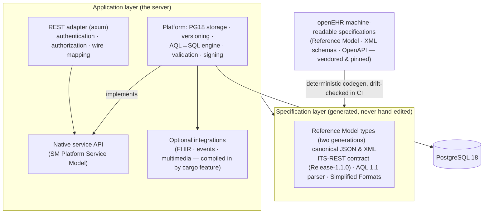

# System architecture

This chapter explains how FerroEHR is built and where your data lives, in
practical terms. You do not need any of it to use the API, but it clarifies why
the server behaves the way it does: why the compliance claims are checkable, why
versioning is exact, and why AQL does not degenerate into a document scan. Two
ideas run through everything: the openEHR *specification layer* is generated from
the official machine-readable models, and the *storage* is designed natively for
PostgreSQL 18.

<!-- toc -->

## Two layers

**The specification layer is generated.** openEHR publishes its Reference
Model, serialization schemas, and REST contract as machine-readable models.
FerroEHR generates its Rust types, canonical JSON/XML (de)serialization, the
REST API contract, and the AQL front end directly from those models. The
consequence for you: the server's data shapes and wire contract cannot silently
drift from the standard. A continuous-integration check regenerates everything
and fails the build on any divergence. A specification update is a
regeneration. That layer is also published for reuse, as
[standalone Rust crates](../crates.md).

**The application layer is the server.** It holds everything the generated
layer does not: storage, the query execution engine, validation, and security.
This is where design choices specific to FerroEHR live. The optional
integrations (FHIR R4, change events, S3 multimedia) sit beside it in their own
crate behind additive cargo features, so a build without them contains none of
their code; see [Beyond the core](../beyond-core/index.md).

What you actually deploy is small: **one self-contained server binary** plus
PostgreSQL. No JVM, no language runtime, and a pure-Rust TLS stack. The
published container image is distroless and non-root, with no shell and no
package manager. (It is not a *static* binary: the server links the system C
library dynamically, which is why the image is the `cc` distroless variant. See
[Operations](../operations.md#the-container-image-and-pod-hardening).) The
[admin console](../admin-ui/index.md) is a separate, optional binary and image
that talks to the server strictly over the public REST API.

## Two specification generations, one selectable set

The Reference Model is not pinned to a single version. The generated layer emits
**two generations side by side** (the latest released one and the development
one), and a single configuration key, `spec_profile`, picks which set the server
runs: `development` (Reference Model 1.2.0 with BASE 1.3.0, the default) or
`stable` (Reference Model 1.1.0 with BASE 1.2.0). Because openEHR's minor
releases are additive supersets, everything valid under `stable` is valid under
`development`; the reverse is not guaranteed, so the profile also acts as an
**acceptance boundary** in both directions:

- Surface the selected generation does **not** define is refused: an AQL `FROM`
  class or a path attribute RM 1.1.0 does not declare is rejected at planning
  time, with the active profile named in the error.
- Released surface the development line later dropped **stays accepted** under
  `stable`: the request is read by that generation's own reader at ingress, and
  the one attribute the newer generation removed is validated and then dropped
  (the server recomputes it) rather than stored.

Stored content is never silently rewritten to fit another generation. See
[`spec_profile`](../installation/configuration.md#spec_profile) for the direction
contract and how to change it on an existing deployment.

## The native service API

Internally the server is organised around the openEHR **Platform Service
Model**, a standard catalogue of service components (EHR, Composition,
Directory, Contribution, Query, Definition, Terminology, Admin, Messaging,
System Log, and more), with one module per component and its methods following
that component's own operations. The REST layer is a thin protocol adapter over that
native API. Practically, this means the HTTP behaviour you observe maps onto the
standard's own service definitions, and the same core can be driven by adapters
other than REST.

## Storage: the node model on PostgreSQL 18

A clinical composition is a deep tree. Storing each as one large JSON blob makes
queries slow: extracting a single value forces the database to read and
decompress the whole document every time. FerroEHR instead **decomposes** each
versioned object into one row per structural node, in a single unified table:

- Each node carries an integer **interval index** so that AQL's `CONTAINS`
  (structural nesting) becomes a fast integer-range join rather than a
  tree-walk.
- Hot query predicates (RM type, archetype, name, path, and the owning EHR)
  are promoted to indexed columns. The archetype identifier is stored split into
  its parts as well, which is what lets a query naming a parent archetype match
  data created with a specialisation of it.
- The node's own content is stored as **canonical openEHR JSON, verbatim**
  (compressed, with the structural children pruned into their own rows). There
  is no proprietary encoding and no translation step: what the storage holds is
  exactly what the API serves, which makes both querying and debugging
  straightforward.

## Versioning: one table, one interval per version

Versioning uses a single **version table** rather than separate "current" and
"history" tables. Each version is a row carrying the validity interval during
which it was the version of record; the current one is the row whose interval is
still open. Branches are modelled explicitly, so an imported or branched version
coexists in time with the trunk without ambiguity.

Non-overlap is a property of how writes are performed, not a constraint the
database re-checks per row: a partial unique index admits at most one open row
per lineage, and every write closes the outgoing row and inserts its successor in
the same transaction at the same instant, so the intervals meet exactly.
PostgreSQL's exclusion constraints would enforce the same property directly, but
they serialize concurrent inserts on the write path, so this design does not use
them.

Because history is just rows in the same table, FerroEHR serves both
`LATEST_VERSION` and `ALL_VERSIONS` (the record as it is now, or across its
entire history) from one place. Time-ordered UUIDv7 keys keep inserts
index-friendly, and every write emits a contribution and an audit row in the
*same* transaction, so the change-control trail is never out of step with the
data.

There is also a **cold tier**: an administrator can archive EHRs and demographic
parties into a separate schema in the same database, shrinking the tables that
serve everyday traffic. Archived records stay readable by id and come back
automatically on write, but they leave the AQL-visible store until then. The
trade is spelled out in
[Admin & messaging APIs](../operations-admin-apis.md).

> [!NOTE]
> openEHR does not define a database schema; it defines *semantics*
> (versioning, indelibility, canonical data fidelity). FerroEHR is free to
> choose the storage design that best serves those semantics on PostgreSQL,
> and its versioning behaviour is verified against the specification, not
> against any particular table layout.

## The AQL engine

An AQL query is parsed, then its paths are typed against the generated Reference
Model (which types an attribute may hold, whether it is multi-valued, which
concrete types a slot can contain). From that typed form it is lowered to a
single SQL statement: `CONTAINS` chains become interval joins on the node table,
leaf values are extracted with PostgreSQL's JSON path functions, and ordered
comparisons on quantities and date/times go through small immutable helper
functions that implement openEHR's own magnitude and temporal semantics, which
also makes them usable in indexes. The result is assembled into the standard
`RESULT_SET` shape.

Anything the engine cannot lower is a typed refusal naming the construct, never
a silently different answer. See [Querying with AQL](../querying-aql.md) for the
language and its supported feature envelope.

## What this means for you

- **Checkable conformance.** The wire contract and data types are generated from
  the standard and drift-checked, and the conformance catalogue is executed
  against a live server with its records committed to the repository, so the
  compliance claims are machine-derived. See
  [Conformance](../conformance.md).
- **Exact versioning.** Nothing is overwritten; every version and its audit are
  retained and readable.
- **Operational simplicity.** One self-contained binary and a PostgreSQL 18
  database; see [Installation](../installation/index.md).
