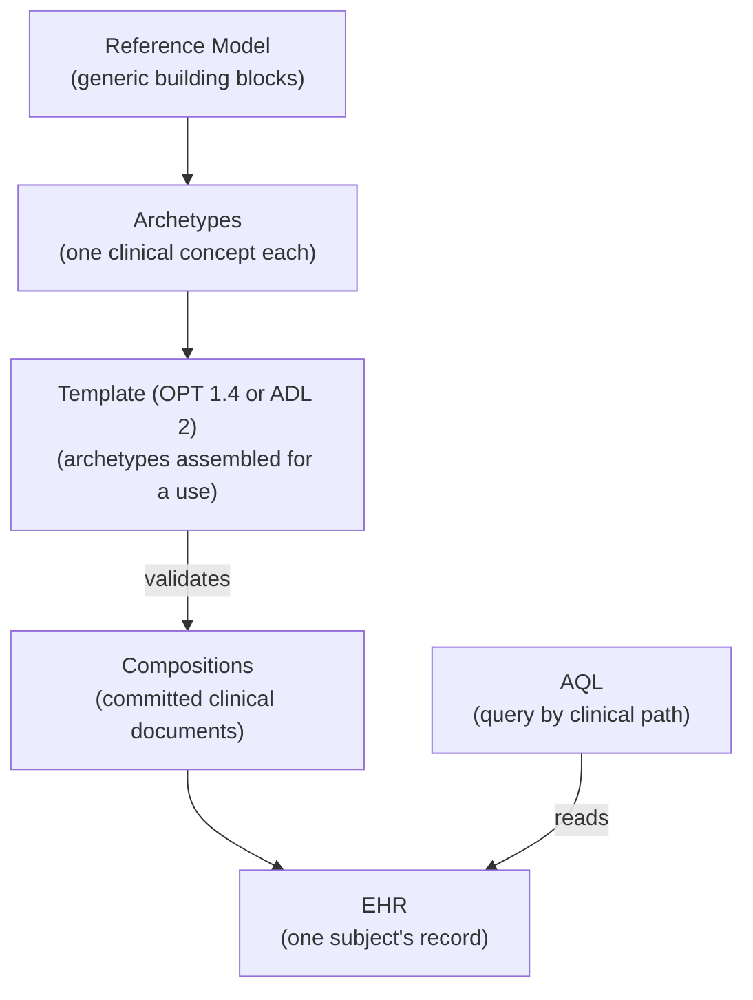

# openEHR primer

openEHR is an open standard for storing health records in a way that outlives
any single application. Its central idea is to keep *what clinical data means*
separate from *the software that stores it*. This chapter introduces the pieces
you meet when using FerroEHR (the Reference Model, archetypes and templates,
compositions, versioning, and AQL) in plain terms. It is enough to follow the
rest of this book; the [openEHR specifications](https://specifications.openehr.org/)
are the full reference.

<!-- toc -->

## The Reference Model: a fixed vocabulary of shapes

At the bottom is the **Reference Model (RM)**, a fixed, general set of building
blocks that never changes per project. It defines generic structures such as a
`COMPOSITION` (a clinical document), a `SECTION` (a heading), an `OBSERVATION`,
`EVALUATION`, `INSTRUCTION` and `ACTION` (the kinds of clinical statement), and
the data types that carry actual values: `DV_QUANTITY` (a measured amount with
a unit), `DV_CODED_TEXT` (a term from a terminology), `DV_DATE_TIME`,
`DV_TEXT`, and so on.

The RM is deliberately generic: it knows about "a quantity with a unit" but not
about "systolic blood pressure in mmHg". That specificity comes from the layer
above.

FerroEHR carries **two Reference Model generations**, and one configuration key,
`spec_profile`, chooses which one a deployment runs: **RM 1.2.0** (the
`development` default) or **RM 1.1.0** (`stable`, the latest released
generation). openEHR's minor releases are additive, so data written against
1.1.0 reads unchanged under 1.2.0; the reverse is not guaranteed, which is why
the choice is worth making before you commit clinical data. See
[`spec_profile`](../installation/configuration.md#spec_profile).

## Archetypes and templates: the meaning layer

An **archetype** is a reusable, computable definition of one clinical concept
("blood pressure", "body weight", "medication order") expressed as constraints
over the Reference Model. It says which fields exist, how many times each may
occur, what units and value ranges are allowed, and which terminology codes are
valid. Archetypes are authored once by clinicians and modellers (often drawn
from the international [Clinical Knowledge Manager](https://ckm.openehr.org/))
and shared across systems.

A **template** assembles and further constrains a set of archetypes for a
specific use: a particular form, message, or dataset. It picks the archetypes
you need, narrows their optionality (mandatory here, hidden there), and pins
down defaults. The template is what a CDR is actually loaded with.

FerroEHR ingests templates as **Operational Template (OPT) 1.4** XML, and
**ADL 2** artefacts as ADL 2 source. Once a template is uploaded, the server
derives what it needs to validate incoming data and to describe the data's shape
to client applications; see [Templates & validation](../templates-validation.md).

> [!NOTE]
> The order is always: agree on archetypes → build a template from them →
> upload the template to the CDR → commit data that conforms to it. You do not
> define a database schema; the template *is* the schema, and it lives in the
> clinical model, not the code.

## Compositions: the unit of clinical data

A **composition** is the openEHR unit of committed clinical content: one
document, conforming to one template, stored inside one patient's record. A
blood-pressure reading, an encounter note, a lab result set: each is a
composition. Compositions are grouped and organised inside an **EHR**, the
container that represents a single subject of care.

Every EHR also has an **EHR_STATUS** (metadata about the record, including
whether it is queryable and modifiable, and the link to the subject) and,
optionally, a **directory**, a folder tree for organising compositions.

## Versioning: nothing is ever overwritten

openEHR records are **versioned and indelible**. When you update a composition,
the previous version is retained and a new version is created alongside it.
You can read any composition as of a point in time, list its full
history, and never silently lose clinical data. Deletion is *logical*: the
object is marked deleted but its history remains readable.

Every change is wrapped in a **contribution**, an atomic change-set that also
records an **audit** entry (who, when, why). A single contribution can commit
several compositions together, and either all of them land or none do.

FerroEHR serves both the **latest version** and **all versions** of an object,
and AQL can query across version history; see
[Querying with AQL](../querying-aql.md).

## AQL: querying by meaning, not by table

The **Archetype Query Language (AQL 1.1)** is how you get data back out. Instead
of SQL over hidden tables, you query against the clinical model using archetype
and template paths. A query names the RM types and archetypes it wants, uses
`CONTAINS` to express structural nesting, and selects values by their path
within the archetype:

```text
SELECT
    o/data[at0001]/events[at0006]/data[at0003]/items[at0004]/value/magnitude AS systolic
FROM EHR e
    CONTAINS COMPOSITION c
        CONTAINS OBSERVATION o[openEHR-EHR-OBSERVATION.blood_pressure.v2]
WHERE o/data[at0001]/events[at0006]/data[at0003]/items[at0004]/value/magnitude > 140
```

The same query runs unchanged against any conformant openEHR system holding
that archetype. That is the portability payoff. The
[Querying with AQL](../querying-aql.md) chapter is a full walkthrough, including
which constructs this engine supports and how it refuses the ones it does not.

## How it fits together



With these concepts in hand, the [System architecture](architecture.md) chapter
shows how FerroEHR realises them.
