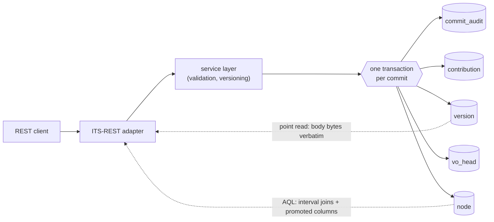
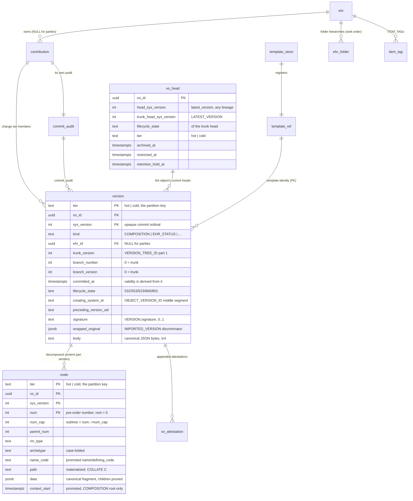
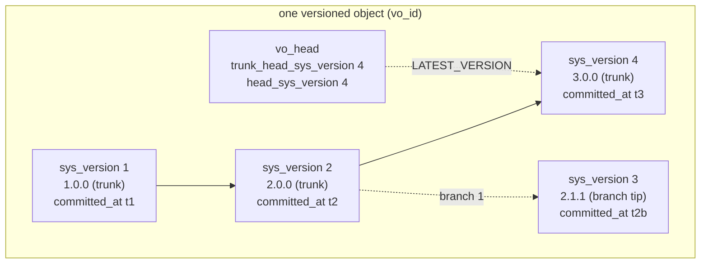
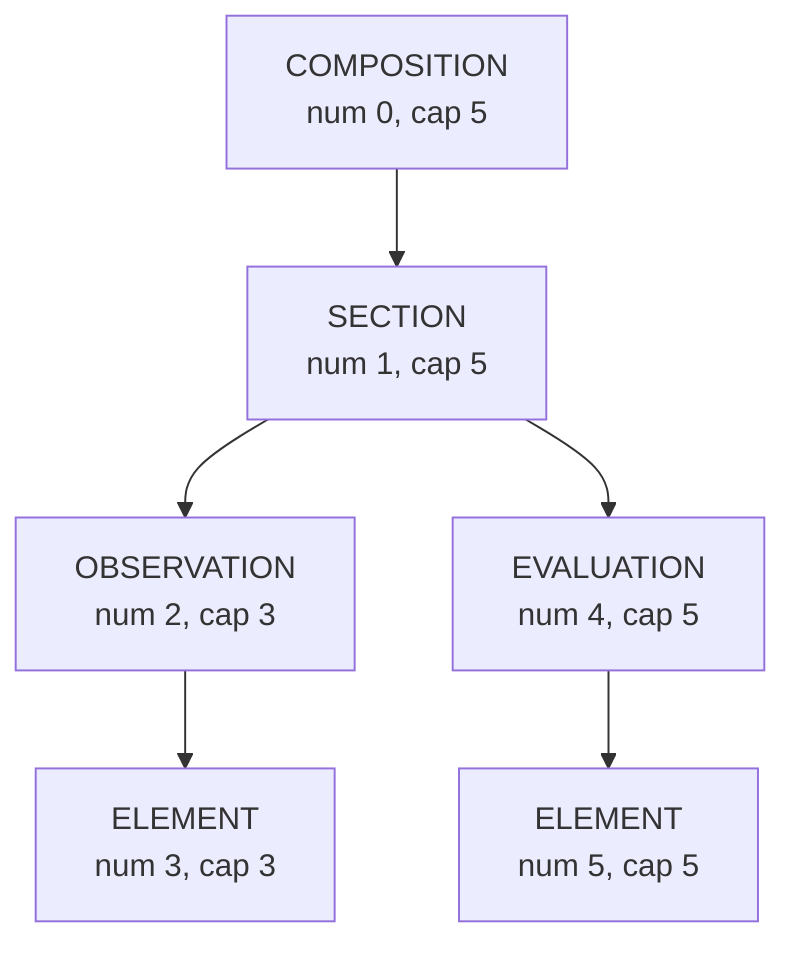
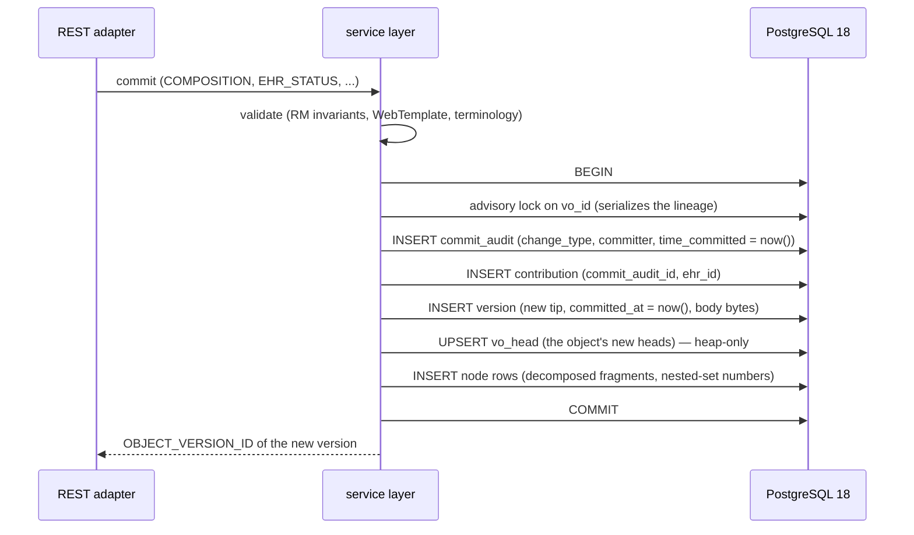
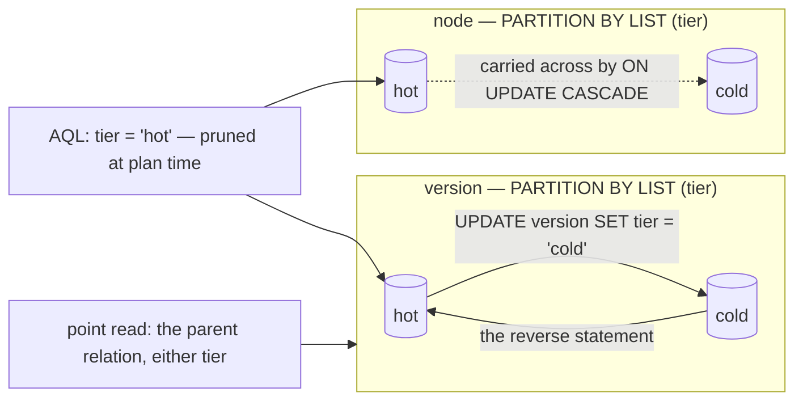

# Storage architecture

How FerroEHR physically stores clinical data. This page goes one level below
the [system architecture](architecture.md): the tables, the write path, the
read paths, and the reasons the layout looks the way it does. If you read the
source, the schema itself is the authority: every column in
`app/ferroehr/migrations/` carries a `COMMENT ON` line with its citation.

One thing up front: **openEHR defines no SQL schema.** What the specs do
define, and what this storage realizes, are the versioning and change-control
semantics (RM `common` change control), canonical data fidelity (ITS-JSON),
and the contribution and audit duties. The relational layout below is
FerroEHR's own PostgreSQL-18-native design, and the RM explicitly sanctions
that freedom: "Although the figure implies physical containment of Versions
by a Versioned object, this is only one possible implementation. Other
implementations (e.g. using orthodox relational structures) might use
references, separate compressed copies, or any other mechanism."

<!-- toc -->

## The big picture

Every versioned object (COMPOSITION, EHR_STATUS, EHR_ACCESS, FOLDER, the
demographic party kinds) is stored twice over, deliberately, in one
transaction:

1. **`version`** holds the version row: identity, version tree position,
   commit instant, lifecycle state, and the canonical JSON body bytes served
   verbatim on point reads. It is written once and never updated.
2. **`node`** holds the same content decomposed: one row per RM structure
   node, carrying a nested-set index and promoted predicate columns, so AQL
   never walks JSON to answer CONTAINS.

The database is PostgreSQL 18, split into five schemas:

| Schema | Holds |
|---|---|
| `ext` | FerroEHR's own `IMMUTABLE` helper functions (`openehr_magnitude`, `openehr_timestamp`), the runtime roles and the deployment posture |
| `clinical` | the clinical CDR: versions, heads, nodes, EHRs, contributions, templates, queries, tags |
| `party` | the demographic pseudonymisation domain: party versions, heads, nodes, contributions, commit audits, and the sealed `national_identifier` values |
| `linkage` | the linkage pseudonymisation domain: `subject_ehr`, which party and which subject identifier name which EHR |
| `audit` | the IHE ATNA Audit Record Repository (`audit_event`) |

Each carries its own migration set and its own `_sqlx_migrations` bookkeeping
table, applied in that order. The archival tier is not a sixth schema: it is a
partition of the relations it archives, described below.

The instance is **single-tenant**. No relation carries a tenant column and no
row policy scopes a read: several organisations are served by several
instances. openEHR puts multi-tenancy at the layer that hosts several logical
EHR systems rather than inside one (BASE `architecture_overview`
`master06-design_of_the_ehr.adoc` §The EHR System).

### The three pseudonymisation domains

Parties (PERSON, ORGANISATION, GROUP, AGENT, ROLE, PARTY_RELATIONSHIP) live in
`party`, never in `clinical`, and the split is enforced by the database in both
directions: each domain's `version` relation carries a `CHECK` admitting only
its own kinds. The clinical record and the
identity of its subject are therefore never in the same schema, the same
archival tier, or the reach of the same runtime role — GDPR Art. 4(5) and
Art. 32(1)(a), <https://eur-lex.europa.eu/eli/reg/2016/679/oj>. Which role reads
which domain, and how a deployment turns the schema split into a credential
split, is [Operations → Database roles](../operations.md#database-roles-and-least-privilege).

The mechanism inside the server is deliberately small: the two domains' change
control and node relations are **rendered from one DDL template**, so they carry
the same names, the same column shape, the same indexes and the same foreign
keys and cannot drift; and the pool serving each domain sets its own
`search_path`. One set of storage code — the nested-set node codec, the
versioning engine, the AQL path machinery — therefore serves both domains
unchanged, and no SQL in the server names a domain schema. A test renders both
files and refuses any difference beyond the kind `CHECK` and the foreign keys
into the `ehr` relation, which the party domain has none of.

The third domain is one table. `linkage.subject_ehr` is the EHR id / subject
cross-reference — the service the openEHR Service Model calls EHR Index — and
it records which party and which subject identifier name which EHR,
temporally: a merge, a split or an index correction closes the row in force and
opens its successor, and the temporal key
(`UNIQUE (party_id, sys_period WITHOUT OVERLAPS)`) admits one
open mapping per party. It carries identifiers, the association metadata the
Service Model defines, and a validity period, and nothing else, because a row
here is already the additional information that re-attributes a record to a
person. It holds no foreign key into either schema it joins, since PostgreSQL
enforces a foreign key by reading the referenced row and no credential here
may. `ferroehr_linkage` holds `SELECT`, `INSERT` and `UPDATE` on it and no
`DELETE`, so a mapping is closed rather than removed — with one exception, and
it is the one the law requires: `linkage.erase_ehr` is a `SECURITY DEFINER`
function the role may execute, and deleting an EHR calls it so no row survives
naming a record that no longer exists.

The wire is unaffected. The ITS-REST Demographic API, the RM change-control
semantics and every version identifier are exactly what they were; only where
the rows physically sit has changed. No openEHR spec governs storage layout —
this is FerroEHR's own design.

## Core tables and how they relate

Supporting tables not drawn above: `stored_query` (stored AQL, qualified name
plus SemVer), `archetype_store` and `adl2_artefact` (the two DEFINITION
dialects), and the `restriction` and retention registers. The `ehr` table
itself carries the
three creation-immutable values the RM names (`system_id`, `id`,
`time_created`) plus promoted copies of the current EHR_STATUS subject
reference and `is_queryable` / `is_modifiable` flags, which back the
one-EHR-per-subject rule, the AQL full-population gate, and the content-write
guard without probing a JSON root per request.

## Versioning: an append-only table and one mutable head row

Most CDRs split storage into a "current" table and a "_history" table.
FerroEHR does not, and it does not carry a validity interval either.

- **`version` is written once.** A version row and its node rows are never
  updated after commit, which is the property BASE `architecture_overview`
  `master07-security.adoc` §Integrity states. A supersession is therefore one
  insert: no close-out statement, no dead tuple, no index churn on a column
  that changed.
- **Validity is derived from `committed_at`.** The RM already copies the
  contribution audit into every version (RM `common` change control, §Committal
  and Audits), so the commit instant is a column of the version row rather than
  a join, and version *i* is valid over `[committed_at_i, committed_at_i+1)`.
  Time travel is "the trunk row with the greatest `committed_at` at or before
  the instant", one descending index probe.
- **`vo_head` is the one mutable row per object**, and the only row a commit
  updates. `trunk_head_sys_version` IS `LATEST_VERSION` (the RM's
  `latest_trunk_version`); `head_sys_version` is its `latest_version` across
  every lineage. It also carries the lifecycle state, the template, the tier,
  the archive marker and the legal marks, so "what is current" is one
  primary-key probe. None of the columns a commit changes appears in an index,
  which is the condition PostgreSQL 18 §"Heap-Only Tuples (HOT)" states for a
  heap-only update.
- `ALL_VERSIONS` is the unfiltered table; `LATEST_VERSION` is the head row's
  answer.
- The spec-facing version identity is the three-part `OBJECT_VERSION_ID`
  `{object_id, creating_system_id, version_tree_id}`, stored as `vo_id` +
  `creating_system_id` + the `trunk_version`/`branch_number`/`branch_version`
  triple and held unique together. `sys_version` is deliberately not that
  number: it is an opaque per-object commit ordinal (1..n across trunk and
  branch commits) used as the join key for `node` and `vo_attestation`.
- Generated ids use PostgreSQL 18's native `uuidv7()`, so keys are time-ordered
  and index-friendly.
- A logical delete writes a content-less version with lifecycle state `523`;
  nothing is physically deleted.
- An import (EHR-Extract, archive load) stores the wrapped
  `ORIGINAL_VERSION`'s own provenance verbatim in `wrapped_original`, while
  the row's own contribution and audit columns record the local act of
  committal. `NULL` there means a locally created `ORIGINAL_VERSION`;
  `NOT NULL` means the row is an `IMPORTED_VERSION`.

One valid version per lineage at any instant now holds by construction rather
than by any constraint: a version is superseded exactly when a later commit
ordinal exists under the same branch number, and a fork onto a branch carries a
branch number of its own, so it does not supersede the trunk.

## Content decomposition: the `node` table

At commit, the accepted composition is decomposed into one row per RM
structure node. Each row stores the node's **canonical openEHR JSON fragment
verbatim** (the ITS-JSON encoding) with its structure children pruned out: no
alias compaction, no synthetic fields, so what sits in `node.data` is
byte-identical in shape to what the API serves. Storage equals wire.

A party body decomposes the same way. The party root, each `PARTY_IDENTITY`,
`CONTACT`, `ADDRESS` and `CAPABILITY` nested in it, and the `ITEM_STRUCTURE`
under each get their own row, so a predicate over a contact address reaches it
by the same interval join a clinical predicate uses.

The tree shape is captured as a **nested-set interval**: nodes are numbered
in pre-order (`num`, root = 0), and each row records the maximum number in
its subtree (`num_cap`). "B is contained in A" is then the integer test
`A.num < B.num AND B.num <= A.num_cap`, which makes AQL CONTAINS chains
plain integer range joins instead of JSON tree walks.

For the tree above, "OBSERVATIONs inside the SECTION" is
`section.num (1) < obs.num AND obs.num <= section.num_cap (5)`: rows 2 and 4
qualify by arithmetic alone.

Beside the interval, each row promotes the predicates AQL actually filters
on, so hot paths never open the JSON:

- `rm_type` (full RM type names, never compacted), `name`, `archetype`
  (case-folded at write, because openEHR identifier equality is
  case-insensitive);
- the archetype-subsumption columns `arch_entity` / `arch_concept` /
  `arch_major`, parsed from full archetype HRIDs so a query naming a parent
  archetype matches specialised children through an indexed prefix scan (the
  major-version boundary stays hard, as the AM requires);
- `citem_num`, the nearest archetyped ancestor, for archetype-anchored path
  resolution;
- `context_start`, the promoted `EVENT_CONTEXT.start_time` on COMPOSITION
  roots, serving dashboard ordering from a partial index;
- `path`, the materialized path from the root (`COLLATE "C"`, so byte order
  equals tree order), used only for reassembly, never as an AQL predicate.

## The write path: one transaction per commit

Every write realizes the openEHR contribution rule: a `CONTRIBUTION` lists
the affected `VERSION`s and carries its own audit, and it commits only if
every member commits. In storage terms, one transaction per service-level
write:

Details that matter:

- `time_committed` is always server-computed, never client-supplied; the RM
  requires the committal time to reflect the EHR server's own clock.
- There is no close-out statement: the head row advancing past the previous
  version is what supersedes it, and that update is heap-only because none of
  the columns it changes is indexed.
- The whole chain above is ONE statement — a data-modifying CTE — so the audit,
  the contribution, the version row, the head row and every node row commit or
  roll back together and cost one round trip.
- The body bytes in `version.body` are materialized from the accepted,
  uid-stamped value **before** decomposition, stored as `text` (not `jsonb`,
  which would re-order keys) so a point read serves the canonical
  `_type`-first field order verbatim.

## Read paths

**Point reads** (GET composition, EHR_STATUS, a named version) resolve the
version row and serve `version.body` verbatim: one detoast, no
re-aggregation, zero translation between storage and wire.

**AQL** plans over `node`, with one exception: a whole-object projection
loads the matching `body` rows in a batch instead of reassembling fragments.
CONTAINS chains become nested-set interval joins, class and archetype
predicates hit the promoted columns and their indexes, leaf values are
extracted from the canonical fragments with `jsonb_path_query_first`, arrays
are unnested with `jsonb_path_query` as a lateral set-returning function, and
comparison and ordering go through `ext.openehr_magnitude` (the `IMMUTABLE`
helper realizing DV_ORDERED ordering semantics) and `ext.openehr_timestamp`
(`STABLE`, because its result depends on the session time zone). The engine
uses no jsonpath item methods, no `JSON_TABLE` and no GIN index. The whole
pipeline has [its own page](aql-engine.md).

**Time travel** (a version at a point in time) is the trunk row with the
greatest `committed_at` at or before the instant, served by a descending index
on the same one table.

## The archival tier is a partition

`version`, `node` and `vo_attestation` are each `PARTITION BY LIST (tier)` with
a `hot` and a `cold` partition and no default partition. Archiving an EHR is one
statement — `UPDATE version SET tier = 'cold' WHERE ehr_id = $1` — and
PostgreSQL moves the rows between partitions; the `node` and `vo_attestation`
foreign keys carry their rows across with `ON UPDATE CASCADE`. Restore is the
reverse statement. Archiving never merges the two pseudonymisation domains: each
has its own partitions.

The consequences are deliberate and visible:

- **foreign keys hold across the tier**, which a separate mirror table could
  never do, so an archived version still references its contribution and its
  commit audit;
- **every read path reaches cold by naming the parent relation**, so an
  archived object stays retrievable in one statement with no union view, no
  primary-miss retry and nothing to rebuild when a column is added;
- **AQL stays hot-only**: the emitter writes `tier = 'hot'` as a literal, which
  PostgreSQL prunes at plan time, so archived content leaves the queryable store
  until it is restored;
- a write to an archived object thaws it back to the hot tier first, so a
  versioned object is never split across tiers;
- the cold partitions carry the primary key alone, because nothing queries
  them, and can sit on a cheaper tablespace.

No openEHR spec governs archival tiers; this is FerroEHR's own design.

## Why this design

The shape follows documented PostgreSQL behaviour rather than habit:

- JSONB has no documented partial detoast: a big single-document design pays
  whole-document decompression for every leaf access. Decomposed fragments
  are small enough to stay under the TOAST threshold, so an AQL leaf access
  touches only the rows it needs. A point read takes the other route on
  purpose: it serves the whole `body` in one detoast.
- GIN indexes serve neither ranges nor ordering, so CONTAINS and ORDER BY
  ride integers and promoted btree columns instead.
- An append-only version table replaces current/history pairs, with
  `ALL_VERSIONS` a plain scan of one relation. The reason it is append-only is
  PostgreSQL's own rule for a heap-only update: it applies when "the update does
  not modify any columns referenced by the table's indexes" (PostgreSQL 18,
  "Heap-Only Tuples (HOT)"). A validity interval cannot satisfy that, because
  the currency predicates index it; a separate head row whose updated columns
  are in no index can, and does.
- Archival is a partition rather than a mirror table for the same kind of
  reason: an `UPDATE` that changes a partition key moves the row, so the tier
  becomes a property of a row in one relation instead of a second relation with
  no foreign keys and a union view over it.

Four comments in the baseline migration cite measurements (a POC-window
p99, the share of node rows carrying at-code archetype text, the average
fragment size, an index-order profile) whose records live on closed tracker
issues rather than in a committed artifact. They are historical notes on the
decisions, not claims this page makes; a number reaches this site only
through a generated include over a committed record.

The performance this buys is measured, not asserted: see
[Performance](../performance.md) for the earned deployment classes and the
committed measurement records behind them.
