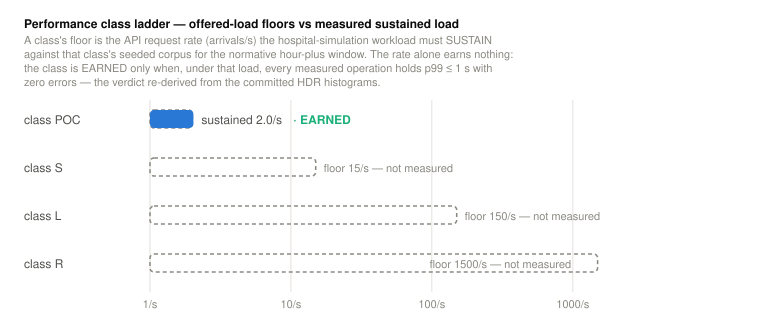
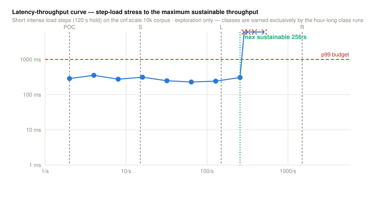
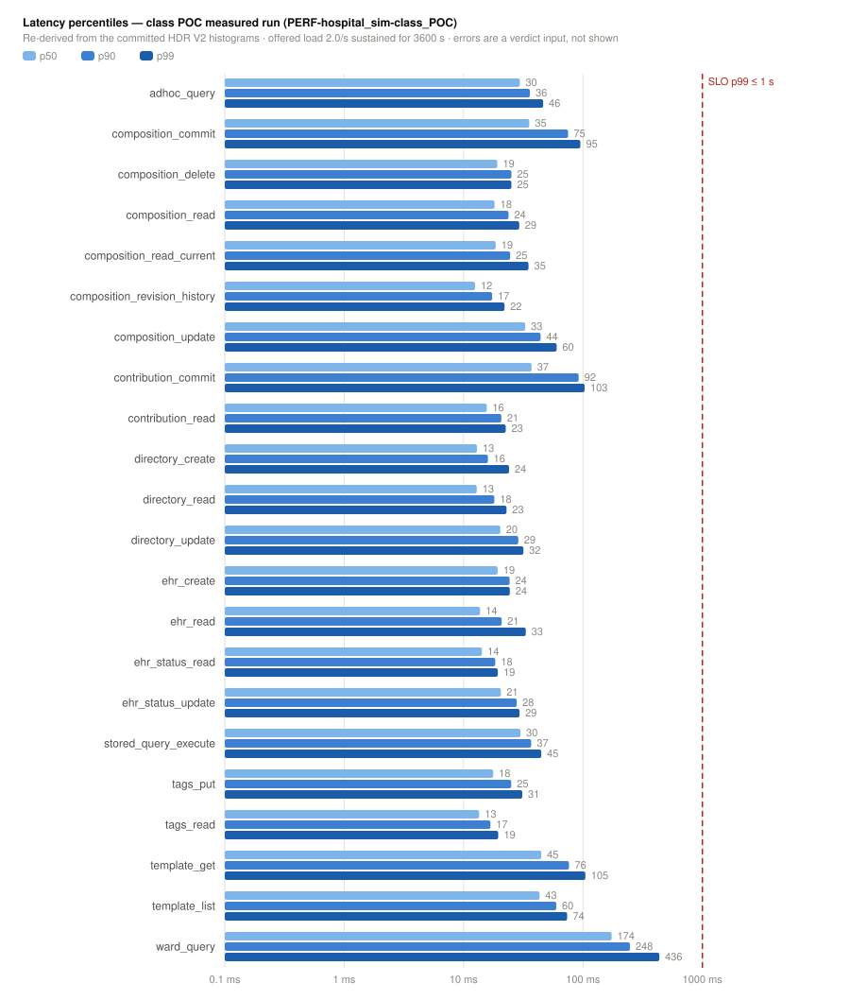
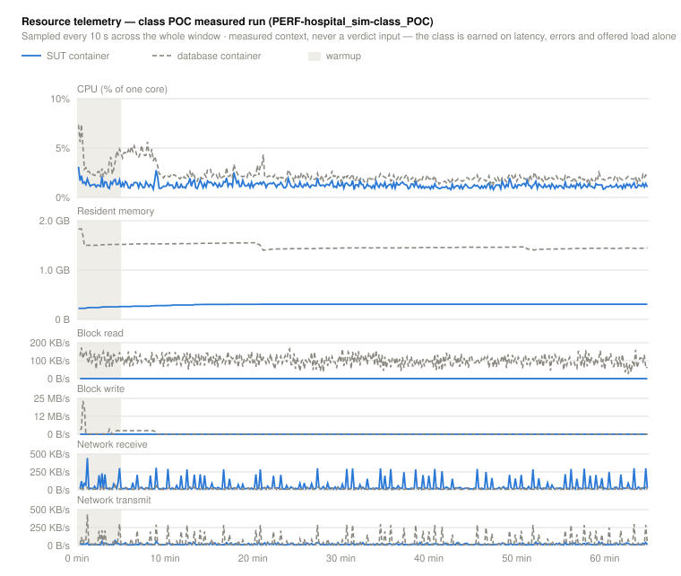
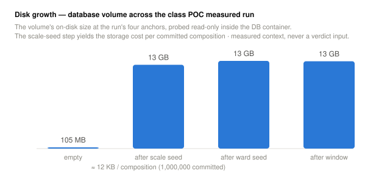

# Performance

FerroEHR applies the same discipline to performance that it applies to
conformance: a *class* is a verdict a server **earns by measurement** on a
stated environment, or does not.
The performance chapter of the CNF suite runs an open-loop clinical workload at a
published offered-load floor, records the result as a re-checkable histogram, and
lets the verdict pipeline recompute (earned or not earned) from that artefact.
Nothing on this page is hand-typed; every number comes from the committed
measurement records or the generated assets below.

<!-- toc -->

## The volumetric class ladder

Performance conformance is graded on a small, closed ladder of deployment
classes: proof-of-concept (`POC`), small (`S`), large (`L`), and regional
(`R`). Each
class fixes an **offered-load floor** (the peak API arrival rate the server must
sustain), a **latency budget** (a p99 service-level objective, uniform across
classes), and an **error budget** (zero: a failed request under load is a failed
class). A class is *earned* only when a measured run holds every threshold; a
class is never *declared*.

Crucially, a class verdict is **environment-bound**: it is meaningful only
alongside the hardware, core count, memory, storage class, and topology it was
measured on, which the runner records in the measurement's environment block and
stamps into every asset. The same binary earns different classes on different
hardware, and the artefact always says which.



## Where the floors come from

The offered-load floors are **anchored to population**, so a class corresponds
to a real catchment a deployment might serve. The derivation is a short chain of published, official activity
statistics:

- **Clinical documents per person per year.** Summing the major encounter types
  that each commit a clinical document gives roughly forty-six documents per
  capita per year: primary- and specialist-care consultations (OECD, *Health at a
  Glance 2023*), inpatient discharges (OECD/Eurostat hospital discharge
  statistics), emergency-department visits (OECD emergency-care indicators),
  laboratory reports (Royal College of Pathologists activity data),
  diagnostic-imaging events (NHS England *Diagnostic Imaging Dataset*, 2023/24),
  and dispensed prescriptions (NHS Business Services Authority *Prescription Cost
  Analysis*, 2024/25). The result sits between the major-document exchange rates
  Denmark and Estonia report and Finland Kanta's all-inclusive figure, which is
  the sanity check that keeps it arguable.
- **Average write rate.** Multiplying a class's served population by that
  per-capita rate and dividing by the number of seconds in a year gives the
  average sustained document-write rate for the class:

  $$
  \text{writes/s}_{\text{avg}}
    = \frac{\text{population} \times 46}{365 \times 24 \times 3600}
  $$

- **Busy-hour peak.** Real clinical traffic is not flat: it concentrates in ward
  rounds and clinic hours. Following the ITU-T E.500 busy-hour engineering
  convention, the average is scaled to a busy-hour peak by a peak factor of
  eight:

  $$
  \text{writes/s}_{\text{peak}} = 8 \times \text{writes/s}_{\text{avg}}
  $$

- **Read multiplier.** A CDR is a read-heavy OLTP system: charts are read far
  more often than they are written. Following the read-heavy OLTP convention used
  by standard database benchmarks (YCSB, OLTP-Bench), the offered load applies a
  read-to-write ratio of 10:1 on top of the write rate; audit-log evidence of how
  many record interactions one encounter actually generates bounds the read-heavy
  band from above.

The floors that fall out of this chain are the published defaults the runner
enforces; the concrete rates per class are carried in the class ladder above and
the summary table below, never re-typed into this prose.

## The hospital simulation

The measured workload is not a flat operation mix: it **simulates a hospital, end
to end**. Load arrives as *clinical journeys* (ordered, time-offset operation
sequences drawn from a committed journey catalogue):

- **ADT flow:** an admission creates the EHR, sets its status, commits the
  admission problem list and summary, and opens the per-episode directory folder
  tree; a discharge writes the discharge summary and closes the episode out.
- **Monitoring:** nursing observation rounds commit vital-signs documents at
  ward cadence.
- **The medication loop:** an order is followed by scheduled administration
  commits at the drug-round interval; medicines reconciliation reads the standing
  medicines list and amends it as a new version.
- **Order → result pipelines, asynchronous:** a laboratory or imaging request is
  committed at one instant and its result lands as its *own* arrival after a
  realistic turnaround drawn from the catalogue; the ordering clinician's chart
  review follows later still. Nothing ever blocks on anything else.
- **Clinical review:** ward-round chart reads (at version, current, and the
  revision history), per-patient AQL trends, cross-EHR ward worklists, and a
  registered stored query executed continuously.
- **Governance:** versioned amendments, the occasional logical delete,
  contribution inspection (the audit trail's read side), and workflow tagging of
  hot documents.
- **The platform surface:** template listing and retrieval (the
  integration-engine poll), specialist synoptic reports, registry submissions, and
  statutory public-health notifications.

Every stage of every journey instance is its **own planned arrival instant** on
the global open-loop schedule (an order at $t$, its administrations at
$t + k \cdot \text{interval}$, the result at $t + \Delta$) so many patients'
journeys interleave exactly as wards do, and cross-operation state effects (status
transitions during active commits, folder consistency under parallel writes,
version chains under interleaved amendments, AQL against a mutating corpus) are
exercised under load, which a flat four-operation mix can never reach. A dependent
stage whose prerequisite has not landed when its instant fires (a stalled server)
records honestly as an error; that *is* the measurement.

The journey payloads commit against **published openEHR CKM templates** (vital
signs, laboratory results, ePrescription, medicines list, problem list, the
International Patient Summary, imaging and cancer synoptic reports, registry and
public-health forms), vendored with provenance and committed as byte-identical
example skeletons so every measured server receives exactly the same bytes.

**The envelope stays population-anchored.** The derivation above still fixes the
aggregate operation arrival rate (the class floor) and the read:write ratio; the
journey catalogue only *decomposes* those totals into many more operation kinds.
Each journey cites the activity statistic that grounds its shape (the same
register the floors derive from) and the runner's artefact validator recomputes
the expansion on every load: the catalogue-expanded write share must reconcile to
the derivation's read-heavy band (between the 10:1 floor convention and the
audit-log-evidenced ceiling), so the mix stays arguable, never arbitrary.

For the extended eight- and twelve-hour holds, the schedule can follow a **diurnal
day curve** (morning and afternoon peaks, shift-change bumps, a night-time
trough) applying the same ITU-T E.500 busy-hour convention the peak factor cites:
the class floor is then the busy-hour rate, and the off-peak troughs are the
design, not a shortfall.

Finally, the conformance certificate prints the **workload coverage**: the set of
claimed capabilities the simulation actually exercised, joined against the claims
matrix. A claimed capability the hospital never touches must carry an adjudicated
exclusion printed with its reason: a design-time operation like archetype
provisioning is not a sustainable per-patient arrival, and saying so beats
pretending the load reached it.

## How a measured run works

A performance run is deliberately **open-loop**: the runner plays a seeded arrival
schedule (request $i$ is *due* at a planned instant computed before the run
starts) rather than a closed loop of virtual users that would slow its own
offered load down whenever the server stalls. This makes the run
**coordinated-omission-free**: each request's latency is measured from its
*planned* arrival instant, so a server that pauses cannot hide the queue it built
up behind a handful of fast replies.

A run has two phases: a discarded **warmup** window (caches fill, pools warm, the
JIT of a compared server settles) followed by the **sustained measurement window**
at the class's offered-load floor. Latencies are accumulated into per-operation
**HDR V2 histograms**, which are base64-encoded verbatim into the measurement
record in `results.json`. Because the full histogram is embedded (not just a
handful of pre-computed percentiles) any consumer can re-derive every percentile
and re-check every threshold from the committed artefact. The class verdict itself
is then **recomputed by the verdict pipeline** from those records: the runner
never writes a verdict it cannot reproduce from the data.

The measured corpus is seeded strictly through the public write path (create EHR,
commit composition) and never a database backdoor, so what the run reads is exactly
what the server's own write path produced. The database's maintenance debt is
settled deterministically, and identically for every system under test, *outside*
the measured windows, so neither a stale-statistics plan nor an autovacuum firing
mid-window ends up in the record.

## Reproducing it

The measured run is a stage of the conformance pipeline. Selecting a class seeds
the matching scale corpus, plays the open-loop schedule against the composed
server, and merges the measurement records into `results.json`:

```bash
# seed the class corpus, run the open-loop schedule, merge the record
CONF_PERF_CLASS=POC bash scripts/conformance.sh

# hold the same offered load for longer — the hours ladder is 1 (the case's
# normative window and the default), 2, 4, 6, 8, or 12
CONF_PERF_CLASS=POC CONF_PERF_HOURS=8 bash scripts/conformance.sh
```

There is deliberately no shortened run: the measurement record always covers at
least the case's normative window, so nothing sub-normative can ever be mistaken
for a measured result. A longer hold is a *stricter* demonstration of the same
class, not a different one. The record carries the actual warmup and window it
held, and the verdict machinery re-derives everything from the embedded
histograms. Every run seeds a freshly composed server from empty; there is no
seed reuse, so no run ever measures another run's leftovers.

The runner can also be driven directly against a running server, which is how you
point it at a deployment the pipeline does not compose. Its `perf` subcommand
takes the catalogue root, the ixit topology file (whose environment block is
mandatory: a measurement without the deployment described is not a
measurement), the `results.json` to merge into, and the class:

```bash
cnf-runner perf --root <catalogue-root> --ixit <ixit.json> \
                --results <results.json> --class POC --hours 8
```

## Stress testing — the second instrument

Beside the class runs sits a deliberately different instrument: a **step-load
stress test**. Where a class run holds a real-life, population-anchored rate for
at least an hour, the stress test climbs a geometric ladder of short, intense load
steps (about two minutes each, doubling the offered rate every step) until the
system leaves the stress envelope, then **bisects** between the last stable rate
and the breached one to locate the boundary precisely, the point performance
engineering calls the knee of the latency-throughput curve. The headline it finds
is the **maximum sustainable throughput**: the highest offered rate held inside
the latency budget (the same idea TPC benchmarks report as maximum qualified
throughput).

```bash
cnf-runner stress --root <catalogue-root> --ixit <ixit.json> \
                  --out <stress.json> --corpus-class POC
```

The two instruments never blur. A stress report earns no class, never touches
`results.json`, and carries no class vocabulary at all; the class ladder belongs
to the measured class runs, and the stress chart shows one thing only: where the
system breaks. Their envelopes differ on purpose too: a conformance class demands
a zero error budget, while a stress step allows the small error tolerance standard
load testing works with, because the instrument's job is to find the knee rather
than to certify anything. Every load step embeds its own re-checkable histograms
and its own resource telemetry (the same per-container CPU/memory/I/O series the
measured runs record, so a breached step shows *where* it saturated), a breached
step is reported with the exact envelope violation, and a step where the load
*generator* topped out before the server is flagged as such rather than counted
against the system.



### The optimization probe

Between the two verdict-bearing instruments sits a third, purely diagnostic one:
the **AQL probe**. It seeds the same class corpus fresh, fires the measurement
machinery's own AQL set repeatedly, and records each query's wire-latency
percentiles alongside the database-side cost per SQL statement, so an
optimization is argued from attributed evidence on a realistically seeded
database, never from a hunch on an empty one. Its report is exploration evidence
for the optimization loop: it earns nothing and never touches the conformance
record.

```bash
cnf-runner aql-probe --root <catalogue-root> --ixit <ixit.json> \
                     --out <aql-probe.json>
```

The published assets on this page are rendered from the committed `results.json`
by the runner's `perf-assets` subcommand (wrapped by
`scripts/render/perf-assets.sh`); the docs CI job re-renders and diffs them, so a
hand-edited or stale asset fails the build.

## The latest measured run

The per-operation percentiles below are re-derived at build time from the
committed HDR V2 histograms for the proof-of-concept class:



### What the run cost the machine

Alongside the latencies, every measured run records its resource telemetry: CPU
and resident memory for the server and database containers separately, plus
block-device and network I/O, sampled at a fixed interval across the whole window
with the warmup shaded. These numbers are capacity-planning context; they never
influence whether a class is earned.



The database volume's on-disk size is probed at four anchors: before the scale
seed (the empty baseline), after it, after the standing-ward seed, and after the
measured window drained. The first two give the storage cost per committed
composition; the last two give the sustained load's write amplification. An
anchor that could not be probed is honestly absent rather than guessed:



Both charts render only from a committed measurement record; nothing on this page
is ever mocked.

{{#include ../generated/perf-summary.md}}
