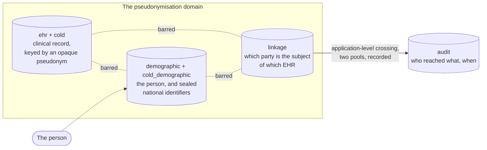

# Data protection impact assessment

[GDPR Art. 35](https://eur-lex.europa.eu/eli/reg/2016/679/oj) makes a data
protection impact assessment mandatory before large-scale processing of health
data. That assessment belongs to the controller, and it is about a deployment:
its purposes, its users, its network, its organisation. What this page supplies
is the half a supplier can supply, which is the technical description the
assessment builds on.

FerroEHR is software. It is not a controller, not a processor and not a
certified organisation, so nothing here says a deployment is compliant with
anything. It says what the software does with personal data, which controls it
ships, and what those controls do not reach.

<!-- toc -->

## How to use this page

Copy the sections you need into your own assessment and replace what is yours.
Sections 1 to 5 describe the software and are the same for every deployment.
The risk register in section 6 lists the risks the product's own design creates
and the control it ships against each; your assessment adds the risks your
deployment creates. Section 7 maps shipped controls to the legal source each
was built for.

Read it alongside the [threat model](../threat-model.md), which states the
residual risk at each boundary, and the
[shared responsibility](../compliance/shared-responsibility.md) page, which
says which duties the software cannot carry.

## 1. The processing this software performs

A FerroEHR deployment stores and serves an openEHR clinical data repository.
Seven activities carry personal data, and they are described one by one, with
the Art. 30 fields, in
[Records of processing](records-of-processing.md):

1. **Storage** of clinical content as versioned objects.
2. **Versioning and change control**: every write commits a contribution and
   an audit entry in the same transaction, and no version is overwritten.
3. **Query** over stored content, in AQL.
4. **Identity and linkage**: parties, protected national identifiers, and the
   map from a party to the EHR whose subject it is.
5. **Access logging**: one record per access, in DICOM PS3.15 and FHIR
   `AuditEvent` renderings.
6. **Change-event publication**: a PHI-free envelope per commit, drained to a
   broker when `[events]` is enabled.
7. **The FHIR façade**: inbound ingestion and outbound emission of mapped
   resources, when `[fhir]` is enabled.

Everything else the server does (templates, terminology lookup, conformance
reporting) operates on definitions rather than on people.

## 2. Data categories, by schema

The database is split so that no single runtime credential holds two of the
three parts. Each schema is a separate category of data with its own role.

| Schema | Personal data it holds | GDPR category |
|---|---|---|
| `ehr`, `cold` | Clinical content: compositions, EHR status, folders, contributions, attestations, item tags. The subject appears as `EHR_STATUS.subject.external_ref`, which is an opaque pseudonym once `[privacy] subject_namespaces` is declared | Art. 9 special-category health data |
| `demographic`, `cold_demographic` | Parties: persons, organisations, groups, agents, roles and their relationships, with names, addresses and contacts as the operational template defines them. Protected national identifiers live in `national_identifier`, sealed under a per-tenant key with a keyed digest beside them | Art. 4(1) personal data; a national identifier is Art. 87 national identification number |
| `linkage` | `party_ehr`: a party id, an EHR id, a tenant and a validity period. No attribute of any kind | The additional information of Art. 4(5): identifying only when joined to one of the other two |
| `audit` | One record per access: who, from which organisation, under which roles, what they read or wrote, the declared purpose, the outcome and the time | Art. 4(1) personal data about both the subject and the accessing person |
| `ext` | No personal data. Helper functions and the tenant context | — |

## 3. Roles and the credentials that serve them

Five runtime database roles, each holding one domain and revoked from the
others in both directions, plus a migration credential used for one boot step.
The full grant-by-grant table, and what a backup artefact per schema is worth
to a holder, is
[the threat model](../threat-model.md#what-each-database-credential-can-reach).

At the API, an access decision runs through authentication, the openEHR
`EHR_ACCESS` gateway, RBAC, optional ABAC and optional SMART scopes, each stage
only able to narrow the previous one. That layering is
[Security](../security.md#authorization).

## 4. The pseudonymisation domain

Read one domain and you hold a clinical record whose subject is an opaque
identifier, or a set of people with no records attached, or two identifier
columns naming neither. Only the three together re-identify anything.

One call crosses the boundary. `resolve_ehr_for_identity` asks the demographic
pool for the party holding a sealed identifier, by keyed digest and without
decrypting, then asks the linkage pool for that party's EHR. The two hops are
two connections in the application, so no statement performs the join and no
credential could issue one. Every crossing writes an access record naming the
actor, the declared purpose and whether anything matched.

## 5. Retention

FerroEHR expires almost nothing on its own, which is deliberate: an openEHR
record is indelible by design, and deciding when a record stops being needed is
the controller's judgement rather than a default.

| Data | What the software does | Key |
|---|---|---|
| Clinical content and its versions | Kept until an administrator deletes it. Archiving moves a record to the cold tier without expiring it | the admin API |
| Demographic parties | The same | the admin API |
| Linkage mappings | Never deleted. A merge or a split closes the period and opens a successor, and the linkage role holds no `DELETE` | — |
| Access records | Kept forever by default; reaped hourly when a retention is set | `[audit.store] retention_days` |
| Change-event envelopes | Published rows pruned after seven days by default | `[events] retention_days` |

**The access log carries a jurisdictional floor.** Where one of the active
identifier-scan rules names a jurisdiction with a registered retention floor, a
shorter `audit.store.retention_days` is a boot error naming the floor rather
than a silent trim. The Netherlands is the one registered floor today: five
years from the moment the entry is written, under the
[Besluit vaststelling bewaartermijn logging](https://wetten.overheid.nl/BWBR0042391),
expressed as 1830 days because five calendar years never exceed that. Adding a
jurisdiction is a code change, not a configuration one, so a deployment
elsewhere sets its own floor by hand and records why.

## 6. Risk register

Each row is a risk the product's own design creates or leaves. "Shipped
control" is what the software does about it today; "what remains" is what your
assessment has to size.

| # | Risk | Shipped control | What remains |
|---|---|---|---|
| R1 | A clinical record and the identity of its subject are held together, so one credential re-identifies everyone | Three schemas, five `NOINHERIT` roles, explicit revokes in both directions, and a boot self-check that refuses to serve when a role can read across | With `[db] demographic_url` and `linkage_url` unset, all three pools use one credential and the split is a schema split. A superuser and a cluster-wide restore span everything |
| R2 | A national identifier is written into clinical content | The identifier scanner over every string leaf of every clinical write, `strict` by default, with all five shipped rules active; the subject rule; the refusal of identifying party proxies; and a database trigger on `ehr` once the namespaces are declared | A rule matches a checksummed number, not a name, an address or a local record number. `subject_namespaces` is empty by default, which leaves the subject rule and the trigger out of force |
| R3 | A national identifier is readable in the demographic store, in a backup or on a replica | AES-256-GCM per record with the scheme and tenant bound in, a keyed HMAC-SHA-256 digest for lookup, per-domain and per-tenant subkeys, and a `SECURITY DEFINER` resolve function only the demographic role may execute | Protection is off by default. An identifier whose scheme is not configured stays in the versioned body. The root key held beside a dump defeats all of it |
| R4 | Someone re-identifies a record and nobody can tell afterwards | Every resolve, link, merge and split writes a `linkage`-domain access record naming the actor, purpose and outcome, including a miss | Recording is not prevention. An actor entitled to the crossing re-identifies by design |
| R5 | Content identifies a person without carrying an identifier | Small-cell suppression on the cohort query: a result serving fewer distinct EHRs than `cohort.small_cell_threshold` (default `5`) withholds its rows and says so | A rare diagnosis with a date and a place identifies without any identifier field. The threshold covers the cohort query alone; an ordinary AQL execution takes none |
| R6 | One tenant reads another's rows | The tenant is resolved from a configured claim and applied as a session setting driving `FORCE ROW LEVEL SECURITY` on every tenant-scoped table, cold tiers included | `FERROEHR__TENANCY__HEADER` is a client-controlled selector that wins over the claim; leave it unset. A missing claim falls through to the default tenant |
| R7 | Access records are altered or lost | Records are hash-chained and `audit.verify_audit_chain()` names any that changed; the runtime role can insert and stamp delivery and nothing more; syslog and FHIR-feed forwarding put copies off the box | The chain is evidence, not prevention. A local repository shares the blast radius of the database it audits, and a read made straight against the database appears nowhere |
| R8 | A backup carries what the grants withheld | One dump per domain, each under its own read-only `BYPASSRLS` role and its own claim, and the chart refuses to render when two domains name the same claim | Each dump is plaintext of its own domain. Two of them together rebuild the join. Nothing prunes old dumps |
| R9 | A deployment has made none of the separations and looks like one that has | `deployment_profile = "production"` refuses to start while a separation is open and not accepted by name; `sandbox` names every open one on the banner, in the log and on `GET /rest/status` | The default is `sandbox`, so an operator who sets nothing gets the loud version rather than the enforced one |
| R10 | Anyone with a database connection is past every API control | Least-privilege roles, row-level security that binds the table owner too, and a version table that is appended to rather than overwritten | This is inherent. Authorization is enforced at the API, so protecting the credentials and the network path is yours |

## 7. Controls, by issue and legal source

Each control below is a closed tracker issue, so the claim is checkable against
the pull request that delivered it. The complete list, generated from the
tracker and re-checked by a CI job, is the
[control matrix](../compliance/control-matrix.md); these are the ones a
pseudonymisation assessment usually asks for.

A cell carries a mapping only where the delivering issue declares it, which is
what the generated matrix reads, or where the source code itself cites the
standard. An empty cell means no such declaration exists, never that the
control is irrelevant to that source.

| Control | Issue | GDPR | EDPB 01/2025 | EHDS | NEN |
|---|---|---|---|---|---|
| Demographic parties in their own schema under a non-overlapping runtime role | [#3153](https://github.com/rubentalstra/FerroEHR/issues/3153) | Art. 4(5), Art. 32(1)(a) | pseudonymisation domain | — | — |
| The clinical side refuses identifying data; the subject reference is constrained to a pseudonym namespace | [#3154](https://github.com/rubentalstra/FerroEHR/issues/3154) | Art. 4(5), Art. 25(2) | — | — | — |
| National identifiers sealed, looked up by keyed digest, resolved under audit | [#3155](https://github.com/rubentalstra/FerroEHR/issues/3155) | Art. 32(1)(a) | — | — | NEN 7510-2 cryptographic controls |
| Per-domain access logging for reads and queries | [#3156](https://github.com/rubentalstra/FerroEHR/issues/3156) | — | — | Art. 9 | NEN 7513 event content |
| Separate encryption keys and per-schema backup handling | [#3157](https://github.com/rubentalstra/FerroEHR/issues/3157) | Art. 4(5), Art. 32(1)(c) | — | — | — |
| The linkage map as its own schema and role | [#3158](https://github.com/rubentalstra/FerroEHR/issues/3158) | Art. 4(5) | pseudonymisation domain | — | — |
| The declared deployment profile: `production` refuses what it cannot prove | [#3226](https://github.com/rubentalstra/FerroEHR/issues/3226) | Art. 32(1) | — | — | — |
| The server mints the subject pseudonym; no caller value becomes one | [#3232](https://github.com/rubentalstra/FerroEHR/issues/3232) | Art. 4(5) | — | — | — |
| A jurisdictional floor under access-log retention | [#3242](https://github.com/rubentalstra/FerroEHR/issues/3242) | Art. 5(1)(e) | — | — | NEN 7513 retention |
| The accessing organisation on every access record | [#3204](https://github.com/rubentalstra/FerroEHR/issues/3204) | — | — | Annex II 3.2(a) | — |
| The actor's roles on every access record | [#3239](https://github.com/rubentalstra/FerroEHR/issues/3239) | — | — | — | NEN 7513 actor role |

The legal sources, each cited to its publisher:
[GDPR](https://eur-lex.europa.eu/eli/reg/2016/679/oj),
[EHDS](https://eur-lex.europa.eu/eli/reg/2025/327/oj),
[EDPB Guidelines 01/2025 on pseudonymisation](https://www.edpb.europa.eu/system/files/2025-01/edpb_guidelines_202501_pseudonymisation_en.pdf),
[NEN 7510](https://www.nen.nl/nen-7510-1-2024-nl-331311),
[NEN 7513](https://www.nen.nl/nen-7513-2018-nl-245399).
`NEN 7510-2` is the control set of that standard; the entries above name the
control family a measure belongs to rather than quoting a clause, because the
standard's text is not free to redistribute and the linked publisher is the
authority.

## 8. What this software cannot do for your assessment

- **It cannot decide your lawful basis, your purposes or your retention.**
  Those are the assessment's own findings.
- **It cannot tell you who your processors are**, including whichever managed
  PostgreSQL, object store, broker or terminology server the deployment uses.
- **It cannot serve a data subject's rights on its own.** Which requests the
  software can answer and which the organisation must is
  [shared responsibility](../compliance/shared-responsibility.md).
- **It cannot certify anything.** No conformity assessment has been carried
  out and no EU declaration of conformity exists; see
  [EHDS readiness](../compliance/ehds-readiness.md).

## Next

- [Records of processing](records-of-processing.md) — the Art. 30 template.
- [Go-live checklist](go-live-checklist.md) — the checks to run before a
  deployment holds real patient data.
- [Threat model](../threat-model.md) — the residual risk at each boundary.
