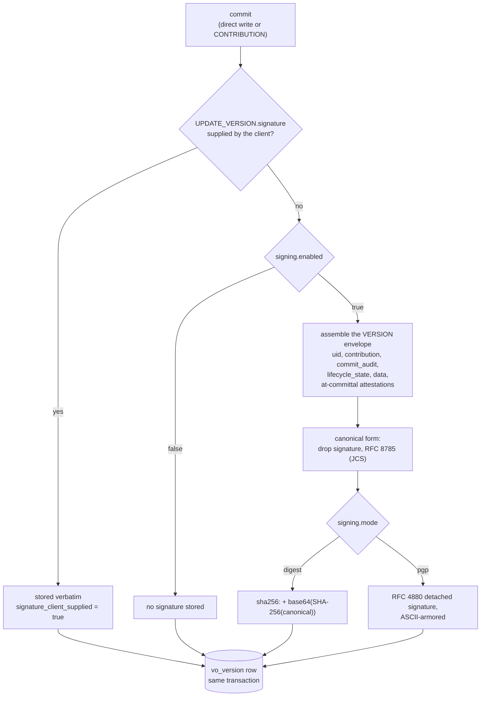

# Digest signing

Every version FerroEHR commits can carry a `VERSION.signature`. openEHR
defines two depths for that value: hash the version and store the digest,
or sign the hash with a private key. The
[openEHR RM Common IM, Change Control §Digital
Signature](https://specifications.openehr.org/releases/RM/Release-1.1.0/common.html#_digital_signature)
puts it directly: "If only the hashing step is done, the digest acts as a
data integrity check, indicating if the data have been tampered with after
creation. If the signing step is carried out, it authenticates the user as
the author of the content."

This page covers the hashing depth, which FerroEHR calls `digest` mode and
runs by default. [PGP signing](pgp.md) covers the other one.

<!-- toc -->

## What the digest covers

The signed value is the whole VERSION object as the server will serve it,
with the `signature` attribute itself left out. Concretely, for a locally
committed version that is the `ORIGINAL_VERSION` carrying:

- `uid`, the `OBJECT_VERSION_ID` this repository allocated;
- `preceding_version_uid`, when the version has a predecessor;
- `contribution`, the `OBJECT_REF` of the enclosing CONTRIBUTION;
- `commit_audit`, including its committer and `time_committed`;
- `lifecycle_state`;
- `data`, the clinical content;
- `attestations`, the ones committed **with** the version.

The assembled object is reduced to a canonical string with
[RFC 8785 (JSON Canonicalization
Scheme)](https://www.rfc-editor.org/rfc/rfc8785), and the digest is
`sha256:` followed by the standard-base64 encoding of the SHA-256 of that
string:

```text
sha256:jtWX/CULavvzX0ehjowv2XZPICTQhN1t0+AXHfbEaNc=
```

The `sha256:` prefix is a FerroEHR addition. openEHR names the OpenPGP
format for the signing depth, and says nothing about how a bare digest is
spelled on the wire, so the prefix carries the algorithm and encoding that
a raw radix-64 hash would leave unstated. It is also what lets a reader
tell a digest from a PGP signature without a second stored column.

The RM section marks the exact serialization "To Be Determined" and notes
that ODIN might be preferred because XML libraries differ. FerroEHR uses
canonical openEHR JSON reduced by RFC 8785, which is deterministic and
independent of the signature itself.

> [!NOTE]
> A logically deleted version has no `data` attribute at all: openEHR
> deletes by committing a new version whose data is Void. Its digest
> therefore covers the identity, provenance and `523|deleted|` lifecycle
> state, and nothing else. It is a signature over a real version, not an
> empty one.

## When it is computed

At commit, inside the write transaction, before any row is inserted. The
commit instant and the CONTRIBUTION id are both known up front (the commit
instant is the transaction timestamp), so the server assembles the exact
version envelope it will later serve, signs that, and writes the version
row, the CONTRIBUTION and the audit together.

Two properties follow, and both matter for verification:

- **The signed bytes and the stored bytes are the same bytes.** The
  content is decomposed into storage rows once and reassembled once; that
  reassembled value is what gets signed and what a read returns. There is
  no second serialization that could drift.
- **A version that fails to sign does not commit.** Signing sits inside
  the transaction, so a canonicalization or signer failure rolls the whole
  change back rather than storing an unsigned version.



## What a stored digest proves

It proves that the version served today canonicalizes to the same bytes it
did at commit. Any change to the content, the committer, the commit time,
the lifecycle state or an at-committal attestation moves the digest, so a
row edited behind the server's back is detected the next time that VERSION
is read.

It proves nothing about **who** wrote the version. A digest needs no key,
so anyone holding the bytes can compute the same value, and an attacker who
can rewrite a version row can rewrite its digest with it. Digest mode is a
tamper-detection control against accidental corruption and against an actor
who reaches the data but not the write path. Authorship and non-repudiation
need a key, which is [PGP mode](pgp.md).

It also covers one of the two copies FerroEHR stores. Every version's
content is written twice in the same transaction: as the materialized
document a point read serves, and as the decomposed rows the AQL engine
queries. The digest is computed over the first one, and read-time
verification recomputes it from the same place. The decomposed rows are
never recomputed on a read, so a row edited behind the server's back is
invisible to this check and can still reach a client through an AQL scalar
result.

That copy has its own channel: `POST {base}/admin/integrity/verify`
re-derives every stored version from its decomposed rows and reports any
that no longer match the stored document. It is an admin route, it runs
outside the request path, and it reports by identifier rather than by
content. The [admin API reference](../operations-admin-apis.md#storage-integrity)
documents the report and its four defect values.

## Verification at read

`signing.verify_on_read` resolves to `strict` whenever signing is enabled,
so the default deployment checks its own digests. On a VERSION read the
server rebuilds the envelope from the stored row, recomputes the canonical
form, recomputes the digest, and compares.

| `verify_on_read`                                | On a mismatch                                                                                                |
|-------------------------------------------------|--------------------------------------------------------------------------------------------------------------|
| `strict` (the default while signing is enabled) | `500`; the record is provably corrupt and is not served                                                      |
| `warn`                                          | logs at `error` level, increments `version_signature_invalid_total{verdict="digest_mismatch"}`, still serves |
| `off`                                           | no check at all                                                                                              |

Verification runs where the server serves a VERSION object: the
`versioned_composition` and `versioned_ehr_status` version routes, their
`version_at_time` forms, the demographic version reads, and the versions a
CONTRIBUTION read resolves under `Prefer: resolve_refs`. A plain content read
(`GET /ehr/{ehr_id}/composition/{uid_based_id}`) returns the COMPOSITION
rather than the VERSION that carries the signature, and runs no check. AQL
reads the decomposed storage rows directly and runs no check either; the
[storage-parity sweep](../operations-admin-apis.md#storage-integrity) is what
covers those.

> [!WARNING]
> A `strict` mismatch is a `500` on purpose. The alternative is serving a
> record the server can prove was altered after committal, which in a
> clinical repository is worse than an outage on that one version. If a
> deployment needs reads to continue while an integrity problem is
> investigated, `warn` is the deliberate downgrade, and it is metered so
> the downgrade is visible.

Two cases are never verified, whatever the setting says:

- **A client-supplied signature.** A `VERSION.signature` a caller sent in
  a CONTRIBUTION is stored verbatim and served verbatim. The author may
  have signed another agreed serialization, which this server cannot
  recompute, so treating a non-match as corruption would be wrong. The
  stored row records which of the two it holds.
- **The `ORIGINAL_VERSION` wrapped inside an imported version.** Its
  signature belongs to the system that created it. See
  [PGP signing](pgp.md#imported-versions-carry-two-signatures).

## Verifying a digest yourself

The digest is reproducible from the served JSON. Fetch the VERSION:

```shell
BASE=http://localhost:8080/ferroehr/rest/openehr/v1
curl -u ferroehr:ferroehr -o version.json \
  "$BASE/ehr/$EHR_ID/versioned_composition/$VO_UID/version/$VERSION_UID"
```

Then, over `version.json`:

1. read the stored value, `jq -r '.signature' version.json`;
2. drop that member, `jq 'del(.signature)' version.json`;
3. canonicalize the result per RFC 8785 (the served bytes are canonical
   openEHR JSON, whose member order is `_type`-first, so they are **not**
   already in JCS order; this step is the one that decides whether the
   comparison works);
4. `openssl dgst -sha256 -binary`, `base64`, and prefix `sha256:`.

Step 3 needs an RFC 8785 implementation. FerroEHR ships no command-line tool
for it, so use a canonicalizer from your own language's ecosystem.

> [!NOTE]
> One case does not reproduce. openEHR allows an attestation to be added
> "at any time after committal", and such an attestation post-dates the
> signature. FerroEHR appends those to the served `attestations` list after
> verification, so the served list can hold more entries than the signed
> form did, and the wire carries no marker separating the two. The server's
> own check uses the at-committal set; an outside recomputation over a
> version attested after committal will not match. Versions with no
> after-committal attestations reproduce exactly.

## Switching modes later

The stored format decides how a signature is checked, so a mode change does
not invalidate history: a `sha256:` digest keeps verifying after the server
moves to `pgp` mode, because the check keys off the value's own prefix.
The reverse direction is weaker. A PGP-signed version read by a server in
`digest` mode has no key to verify against, so it is served without a
verdict rather than failing. Keep the certificate configured if those
versions must stay checkable.

Every key in `[signing]`, with defaults and environment forms, is in the
[configuration reference](../installation/config-auth.md#signing).
