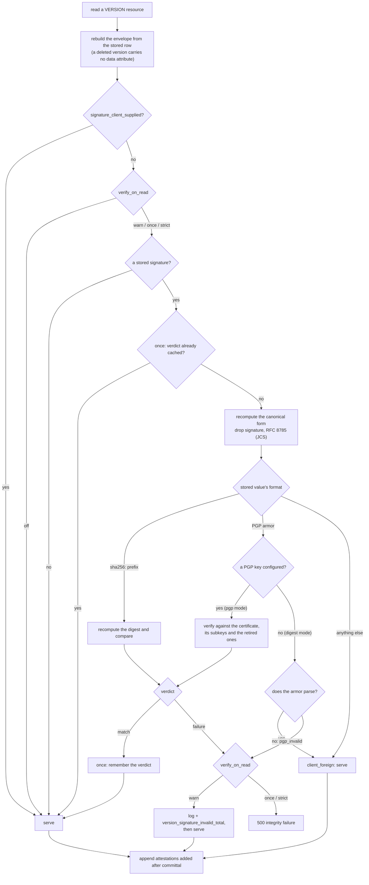

# PGP signing

`pgp` mode replaces the stored SHA-256 digest with an OpenPGP
([RFC 4880](https://www.rfc-editor.org/rfc/rfc4880)) detached signature made
with a key the server holds. openEHR names that format directly: the
signature "is generated according to the openPGP standard", and where a
digest only detects tampering, a signature "authenticates the user as the
author of the content to readers of the content" and "acts as a
non-repudiation measure, since the signature is stored permanently with the
data" ([RM Common IM, Change Control §Digital
Signature](https://specifications.openehr.org/releases/RM/Release-1.1.0/common.html#_digital_signature)).

Read [Digest signing](digest.md) first: what gets signed, when, and
how the canonical form is built are identical in both modes. This page
covers what changes.

<!-- toc -->

## What differs from digest mode

|                      | `digest`                                    | `pgp`                                          |
|----------------------|---------------------------------------------|------------------------------------------------|
| Stored value         | `sha256:` + base64(SHA-256(canonical form)) | ASCII-armored RFC 4880 detached signature      |
| Key material         | none                                        | an armored secret key the server loads at boot |
| Hash                 | SHA-256                                     | SHA-256, inside the OpenPGP signature          |
| Proves               | the version was not altered after committal | that, plus which key signed it                 |
| Boot behaviour       | nothing to validate                         | refuses to start without a usable key          |
| Verification at read | recompute and compare                       | verify against the configured certificate      |

The bytes being signed do not change. The server assembles the version
envelope, drops the `signature` attribute, reduces it to its RFC 8785
canonical form, and hands that string to the signer. Only the last step
differs.

## Configuring the key

`pgp` mode needs a `key_path` pointing at an armored secret key, and the
passphrase that unlocks it if it has one:

```toml
[signing]
enabled = true
mode = "pgp"
key_path = "/etc/ferroehr/signing.asc"
key_passphrase_file = "/run/secrets/pgp-pass"
retired_key_paths = ["/etc/ferroehr/signing-2025.pub.asc"]
```

The same settings as environment variables:

```shell
FERROEHR__SIGNING__MODE=pgp
FERROEHR__SIGNING__KEY_PATH=/etc/ferroehr/signing.asc
FERROEHR__SIGNING__KEY_PASSPHRASE_FILE=/run/secrets/pgp-pass
FERROEHR__SIGNING__RETIRED_KEY_PATHS=/etc/ferroehr/signing-2025.pub.asc
```

Prefer `key_passphrase_file` over the inline `key_passphrase`: it is the
shape Docker Secrets and Kubernetes Secrets deliver, and the passphrase then
never appears in the environment. Setting both of the pair is a boot error.
The full key table, the Kubernetes `config.files` mount, and the rotation
walkthrough are in the
[configuration reference](../installation/config-auth.md#signing).

**Boot is fail-closed.** The server loads the key, then signs a fixed test
string with it. A missing `key_path`, an unparseable file, a wrong
passphrase, or a certificate with no usable signing component all stop
startup with an error rather than leaving a running server that cannot sign.

**The signing component is chosen by capability.** If the certificate
carries a subkey flagged for data signing
([RFC 9580 §5.2.3.29](https://www.rfc-editor.org/rfc/rfc9580#section-5.2.3.29),
key flag `0x02`), the server signs with that subkey; otherwise it signs with
the primary key. Position in the file decides nothing, so an encryption
subkey is never used to sign.

**An RSA signing key is accepted with a warning.** Every commit would then
perform an RSA private-key operation, the operation the Marvin timing
sidechannel (RUSTSEC-2023-0071 / CVE-2023-49092) concerns, and the
underlying `rsa` crate has no fixed release. The server warns at boot and
keeps working, because a repository whose history is RSA-signed still needs
that key to verify it. Ed25519 or ECDSA keeps that code off the signing
path.

### Retired keys and rotation

A stored `VERSION.signature` records no key identifier, and it is an
immutable committed fact that cannot be re-issued. Rotating a key therefore
has to keep the old one verifiable. Two mechanisms do that:

- **A new signing subkey on the same certificate.** The server picks the
  signing-capable subkey, the certificate retains the previous one, and
  verification tries the primary key and every subkey. Nothing else changes.
- **`retired_key_paths`.** A replaced certificate's **public** half is
  listed there and consulted during verification. A public key verifies and
  can never sign again, so a retired entry cannot become an active signer.

## Server-generated versus client-supplied signatures

A `VERSION.signature` in this repository is one of two things, and the
distinction is recorded on the row rather than guessed from the value.

**Server-generated** is the ordinary case. The direct write routes
(`POST`/`PUT`/`DELETE` on a composition, the EHR status, the directory, a
demographic party) carry no signature field at all, so every version they
commit is signed by this server when signing is enabled.

**Client-supplied** reaches the server through one route: an
`UPDATE_VERSION.signature` inside a CONTRIBUTION commit. When a member
carries one, the server stores it verbatim and does not sign that version
itself, whatever `signing.mode` says. openEHR models the signature as a
fact created by the committer and carried with the data, potentially in
another agreed serialization, so the server has nothing to recompute it
against. Such a signature is never re-verified at read, and no
`verify_on_read` setting changes that.

> [!NOTE]
> A client-supplied value is stored as sent, so an opaque or invalid one is
> served back unchanged rather than refused. It is a claim by the committer,
> and this server neither vouches for it nor mistakes it for its own. Only
> signatures the server generated are covered by read-time verification.

## Imported versions carry two signatures

An EHR Extract import wraps each received `ORIGINAL_VERSION` in an
`IMPORTED_VERSION`, and openEHR is explicit about what happens to signatures
there. The wrapped original "is never modified", and the wrapper is signed
like any other version: "all attributes of the object are serialised and
then used to generate a signature. The result will be that the
`IMPORTED_VERSION` instance will carry its own signature which signifies the
act of importing and making available locally an `ORIGINAL_VERSION` from
another system."

FerroEHR implements exactly that:

- **The wrapper is signed by this server**, over the whole
  `IMPORTED_VERSION` including the wrapped `item`, using the configured mode.
  An import is a local act of committal, so it is signed like one.
- **The wrapped original's signature rides inside `item` untouched.** It
  belongs to the source system's key, which this server does not hold, so it
  is served verbatim and never verified.

Reading such a version verifies the wrapper and leaves the wrapped
signature alone. Reading the same version as an `ORIGINAL_VERSION` (the form
an EHR Extract export carries) reproduces the received original with its
foreign signature and verifies nothing, which is what makes a re-export a
faithful copy.

## Read-time verification

The stored signature's own format decides how it is checked, which is why a
mode change does not strand history. The full path:



The server reaches one of five verdicts: `digest_match`, `digest_mismatch`,
`pgp_valid`, `pgp_invalid`, `client_foreign`. Two of them are failures,
`digest_mismatch` and `pgp_invalid`, and those are the ones counted, under
the `verdict` label on `version_signature_invalid_total`.

Three parts of the path are worth stating in prose:

- **Attestations added after committal are appended after verification.**
  openEHR allows an attestation "at any time after committal", so such an
  attestation post-dates the signature and cannot be inside it. The server
  verifies the at-committal form and then extends the served list.
- **A version with no stored signature is served normally.** Versions
  committed while signing was disabled carry none, and their absence is not
  a failure.
- **`strict` is the default while signing is enabled.** A mismatch is a
  `500` rather than a served record that is provably altered. `warn`
  downgrades that to a logged and metered event, which is a deliberate
  reduction in an integrity guarantee rather than a setting to leave on.
