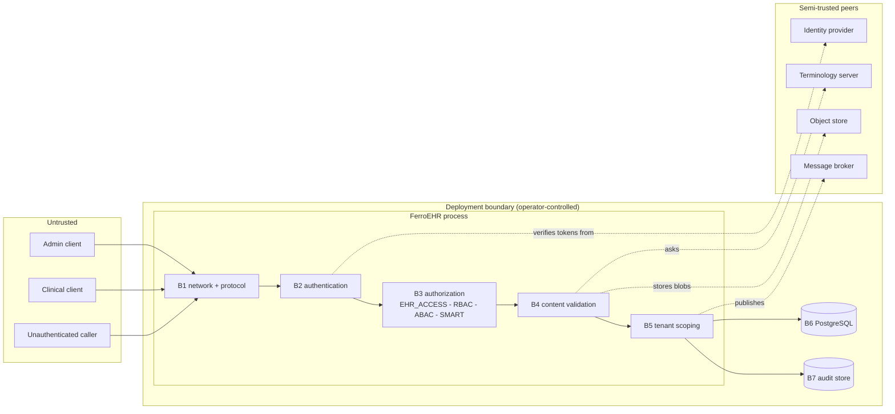

# Threat model

This chapter says what FerroEHR defends against, how, and (more usefully)
**what remains true after the control has done its job**. It exists because the
parts of this system that actually protect patient data are the parts no
external specification governs: openEHR's REST specification makes
authentication a `SHOULD` and mandates no scheme, and the Service Model places
authorization out of band, so only the 401-versus-403 split is
specification-grounded. Everything finer is this project's own design, and a
design nobody has written down asks every deployer to reconstruct it privately.

<!-- toc -->

## What this is, and what it is not

This is an **attack-surface and trust-boundary analysis with named residual
risk**. Boundaries are enumerated, the control at each is stated, and the risk
that survives the control is stated beside it.

It is **not** a certification, an audit report, or an assurance case in the
formal sense, and it does not make FerroEHR compliant with anything. It is also
not a substitute for your own analysis: your deployment introduces boundaries
this document cannot see: your identity provider's token policy, your
network, your operators, your backups. The value here is that you do not have
to reverse-engineer *our* half of it from configuration prose.

Read it alongside [Security & multi-tenancy](security.md) (how each control is
configured), [Audit trail](audit.md) (what is recorded),
[Verifying releases](verifying-releases.md) (establishing what you are running),
[Operations](operations.md) (the deployment surface) and
[Cluster hardening](installation/kubernetes-hardening.md) (what the platform
owes).

**Where this document and the code disagree, the code is right and this
document is a defect.** Report it.

## Assets

What an attacker wants, in the order the loss hurts:

| Asset | Where it lives | Why it matters |
|---|---|---|
| **Clinical payload:** compositions, EHR status, folders | the `ehr` schema's `node` and `vo_version` tables, and the `cold` archive mirrors | this is PHI; disclosure is the primary harm and it is not undoable |
| **Demographic parties and their identifiers** | the `demographic` schema and its `cold_demographic` tier, with protected national identifiers sealed in `national_identifier` | who the people are, held apart from what is recorded about them |
| **The party-to-EHR map** | `linkage.party_ehr` | the additional information that re-attributes a pseudonymised record to a person; on its own it names neither |
| **The audit trail** | the `audit` schema, plus any configured forwarding sink | it is the evidence that everything else happened; an attacker who can edit it can make an access disappear |
| **Version history and its integrity** | `vo_version`, `contribution`, attestations | an openEHR record's value is that it is *append-only and attributable*; a silently rewritten prior version is worse than a deleted one |
| **Signing keys** | the configured signing key material for commit attestation | forging an attestation forges provenance of clinical content |
| **Bearer credentials and password hashes** | tokens in flight; Argon2id PHC hashes at rest | a stolen token is an authenticated clinical caller until it expires |
| **Tenant separation** | the `ferroehr.tenant_id` session setting and the row-level-security policies | in a multi-tenant deployment, one tenant reading another is a breach of two organisations at once |
| **Availability** | the whole stack | a CDR that is down is a clinical system that is down; denial of service is a patient-safety issue here, not an inconvenience |

## Actors

| Actor | Reaches | Assumed capability |
|---|---|---|
| **Unauthenticated caller** | the listening port | can send arbitrary bytes, replay anything observed, and probe every route |
| **Authenticated clinical caller** | the openEHR API within their grants | holds a valid token; may be a legitimate user acting outside their remit, or a compromised client |
| **Admin / management caller** | the admin, management and messaging surfaces | can delete physically, archive, dump and load; the most dangerous *authorized* actor |
| **Tenant peer** | their own tenant's API | a legitimate tenant of a shared deployment, trying to reach another's rows |
| **Database** | everything stored | trusted for confidentiality, but assumed to be a place where a mistake is permanent |
| **Terminology server (FHIR R4B)** | called out to at validation and commit time | operator-configured; semi-trusted: it answers our questions and can lie |
| **Object store (S3)** | called out to for multimedia | operator-configured; semi-trusted, and its responses are parsed |
| **Message broker (AMQP)** | receives change events | operator-configured; a sink for data, so a confidentiality boundary |
| **Identity provider** | issues the tokens everything else believes | fully trusted by construction; if it is compromised, no control below it holds |
| **Cluster / host operator** | the process, its memory, its filesystem, its secrets | fully trusted; outside the software's reach |

## Trust boundaries

Each boundary below names the control that holds and the risk that remains.

### B1 — Network and protocol

**Control.** TLS terminates either at the server (`rustls`, TLS 1.3 by default)
or in front of it. Connection-level bounds apply before a request even exists (an
HTTP/1 header-read timeout, an HTTP/2 stream cap with keep-alive PINGs); request
bodies are size-limited, requests are timed out, concurrency is capped by an
admission limit, and a two-tier `tower_governor` rate limit is **on by
default**. Panics are caught and become a clean `500` rather than a dropped
connection, and release builds run with overflow checks on so an arithmetic
mistake is a loud panic rather than a silently wrong number. Response security
headers are set. Every parser that reads attacker-controlled bytes (canonical
JSON, canonical XML, AQL, ADL, OPT 1.4 templates, the simplified formats, and
the identifier types) has a libFuzzer harness, built on the pull-request path
and fuzzed on a nightly campaign, and a crash is fixed in the crate, never in
the harness.

**Residual risk.**

- **Fuzzing finds crashes; it does not prove their absence.** The harnesses
  cover the parsers we identified as reachable. A parser reached by a path we
  did not enumerate is not covered by anything.
- **Rate limiting is per-process.** A multi-replica deployment behind a load
  balancer divides the effective limit by the replica count; it is not a
  distributed limiter. The shipped defaults are also deliberately generous:
  they sit above this implementation's own measured whole-server ceiling, so the
  limiter refuses abuse rather than shaping normal load.
- **Algorithmic complexity in query execution is not bounded by the limiter.**
  A syntactically small AQL query can be an expensive one. Statement timeouts at
  the database are the backstop, and they are the operator's to set.
- **TLS termination in front of the server is the operator's**; nothing in the
  software can tell whether the hop behind the proxy is encrypted.

### B2 — Authentication

**Control.** Two mechanisms: HTTP Basic against Argon2id PHC hashes with a
verified-credential cache, and OAuth2/OIDC bearer tokens validated against the
issuer. Configuration is validated **at boot**, not on the first request: a
mandatory audience list, an `https` issuer, an algorithm set bound to its key
source (with `none` refused outright and two competing key sources refused as a
contradiction), an HMAC entropy floor, and the OWASP Argon2id parameter floor. A
malformed `Authorization` header is a `400`, not a `401`: the server never read
a credential. An unreachable issuer is a `503`, never a silent pass. A `401` body
names no reason, so it is not an oracle for expired-versus-forged.

**Residual risk.**

- **A valid token is a valid caller.** FerroEHR verifies signature, audience,
  issuer and expiry; it does not and cannot know whether the human behind the
  token is who the token says. Token theft is defended against by your identity
  provider's lifetimes and binding, not by us.
- **There is no token binding, no proof-of-possession and no replay window.** A
  bearer token replayed from another network location is accepted.
- **The identity provider is unconditionally trusted.** A compromised issuer,
  or an attacker who can mint tokens with the right audience, defeats every
  authorization stage below, all of which read their inputs from claims.
- **Basic authentication has no session, no lockout and no second factor.** It
  is intended for machine callers and small deployments; the Argon2id cost is
  the only brake on offline cracking if a hash leaks.

### B3 — Authorization

**Control.** Five stages, each of which can only *narrow* what the previous one
allowed, which is what makes an optional stage safe to leave off:

1. **Authentication** produces a principal or a typed refusal.
2. **`EHR_ACCESS`** is always on and unconditional, from the openEHR Reference
   Model's own gateway clause.
3. **RBAC** checks the coarse operation class (public, clinical, or admin)
   against roles taken from the RFC 9068 claim carriers. An OAuth2
   scope is deliberately not treated as a role. The read-only restriction
   overrides any grant. (The `/management/*` surface is *not* in this
   classification: it is governed endpoint-by-endpoint by its own configuration,
   and an endpoint you do not name is not mounted at all.)
4. **ABAC** (off by default) evaluates subject and resource attributes through
   embedded Cedar or an external policy decision point, fanning multi-valued
   attributes out as a cartesian product with all-must-permit and short-circuit
   deny.
5. **SMART scopes** (off by default) are AND-composed onto the ABAC decision.

Deny-by-default throughout, and **fail-closed in both senses**: no stage permits
by omission (an unconfigured resource kind on the external PDP denies, and the
missing rule is a boot error), and a stage that cannot *decide* is never read as
a decision: an unreachable issuer is `503`, a policy server answering `5xx` or a
Cedar policy that errors during evaluation is a fail-closed `500`. Silence is
never consent, and a broken control never looks like a policy outcome.

**Residual risk.**

- **Coarse by default.** With ABAC off (the default) authorization is
  role-level and `EHR_ACCESS`-level. Any authenticated clinical caller can reach
  any EHR that `EHR_ACCESS` does not restrict. If your model is "a clinician may
  read only their own patients", that is ABAC, and you must turn it on and write
  the policy.
- **Policy is only as good as the attributes.** Every decision is made from
  claims the identity provider asserted. A wrong `organization` claim produces a
  correct decision on a false premise.
- **The external PDP is a network dependency in the request path.** Fail-closed
  means an outage is an outage: correct, and an availability risk you should
  size.
- **Authorization is enforced at the API.** Anything with a direct database
  connection is past it entirely; see B6.
- **A legitimate caller acting outside their remit is not prevented, only
  recorded.** That is what the audit trail is for, and detection is not
  prevention.

### B4 — Content validation and outbound calls

**Control.** Committed content is validated against the operational template
(the WebTemplate walker), the Reference Model's own invariants (machine-derived
from the specification's meta-model rather than hand-written) and terminology
bindings. Canonical JSON is read by a **strict** reader that refuses undeclared
and duplicate keys. Outbound terminology, object-store and broker calls go only
to operator-configured endpoints.

**Residual risk.**

- **The terminology server is trusted to answer honestly.** A compromised or
  misconfigured one can permit a code that should have been refused. It is a
  correctness boundary, and a clinical-safety one.
- **A response parsed from a semi-trusted peer is still parsed.** A terminology
  answer, an object-store response and a broker message are all parsed by the
  server, so a compromised endpoint reaches a parser rather than only a
  validator. The object-store path once carried an XML parser version with
  denial-of-service advisories the client-facing canonical-XML codec did not
  share; both are now on the patched version, and the only pre-fix copy left in
  the build reaches it through the flamegraph renderer, which writes SVG and
  parses nothing. That argument is published as a machine-readable
  [VEX document](https://github.com/rubentalstra/FerroEHR/tree/main/security/vex)
  rather than left in a comment. Read the current documents for the current
  position: they name the versions, and they are regenerated from the gate.
- **Multimedia blobs are stored, not inspected.** FerroEHR is not an antivirus
  and does not pretend to be; a malicious blob is delivered faithfully to
  whatever opens it.
- **Validation does not make content true.** A well-formed composition asserting
  a clinically wrong fact is stored, correctly.

### B5 — Tenant scoping

**Control.** Off by default; when off the server is byte-for-byte
single-tenant. When on, the tenant is resolved from a configured JWT claim and
applied as a PostgreSQL session setting that drives **`FORCE ROW LEVEL
SECURITY`** policies on every tenant-scoped table, including the cold-archive
mirrors. A tenant key that names no registered tenant is refused with a `403`,
because the reserved default tenant it would otherwise fall through to owns
every row written while tenancy was off. A request carrying no tenant key at
all still runs against that default rather than guessing.

A tenant *registry* that cannot be reached is a separate case and is not read as
"no tenant": it answers `503`, like any other dependency failure, rather than
falling through to the default.

**Residual risk.**

- **`FERROEHR__TENANCY__HEADER` is a tenant selector a client controls**, and
  when set it **wins over the JWT claim**. It is a development affordance and
  there is no way to make it safe in production. If it is set, tenancy is not a
  boundary. Leave it unset.
- **A missing claim still degrades quietly to the default tenant**, and so does
  an unknown one when `FERROEHR__TENANCY__UNKNOWN_TENANT=default_tenant` is set
  to trade the `403` for existence-hiding. On a deployment that enabled tenancy
  after going live, that default tenant is the whole pre-tenancy store. The
  server counts its stored versions at boot and warns when it holds any; moving
  that content into a named tenant is a manual step today.
- **Row-level security binds a connection, not a request.** The scoping is
  applied per connection from a shared pool; a defect in that plumbing is a
  cross-tenant read, which is why it is enforced by the database rather than by
  application `WHERE` clauses: the database refuses even if the query forgets.
- **Tenancy separates rows, not resources.** One tenant's expensive query
  competes with another's for the same CPU, connections and disk. It is not a
  noisy-neighbour control.

### B6 — The database

**Control.** The application connects with least-privilege roles, one per
pseudonymisation domain, and the schema is prepared by a separate credential
that is not any of them
([what each credential reaches](#what-each-database-credential-can-reach)). `FORCE ROW LEVEL SECURITY`
means even a table owner is subject to the policies. Version history is
temporal (`PRIMARY KEY … WITHOUT OVERLAPS`) rather than overwritten, so a prior
version is a row that exists, not one that was replaced. Every write emits a
contribution and an audit record in the same transaction.

**Residual risk.**

- **Anyone with a database connection is past every control in B1–B5.** That is
  the single largest residual risk in this system, and it is inherent: FerroEHR
  enforces authorization at the API. Protect the credentials and the network
  path accordingly.
- **Encryption at rest is the operator's.** FerroEHR does not encrypt clinical
  payload before it reaches PostgreSQL; the payload is queryable JSONB, which is
  what makes AQL possible and is incompatible with application-level encryption
  of the same fields.
- **A superuser can rewrite history.** The temporal design makes accidental
  overwrite structurally hard; it does not defend against someone with `UPDATE`
  on the tables. The audit chain (B7) is the detection layer.
- **Backups carry PHI with none of these controls.** A restored dump is a
  complete copy of the schemas it covers. Which schemas that is, and what two
  dumps are worth together, is
  [Backup artefacts](#backup-artefacts) below.

### B7 — The audit trail

**Control.** Every access is recorded in both official renderings (DICOM PS3.15
and FHIR R4 `AuditEvent`/BALP) into a local Audit Record Repository, on by
default, with optional syslog and ATX:FHIR-Feed forwarding. Refusals (`401`,
`403`, and the `400` a malformed credential header earns) are always recorded,
and an unattributable denial is recorded as unattributed rather than under a
fabricated subject. Records are **hash-chained**, so
`SELECT * FROM audit.verify_audit_chain()` names any record that was altered
or removed. ITI-81 is the retrieval side; ITI-19 mutual TLS is available for
node authentication.

**Residual risk.**

- **Tamper *evidence*, not tamper *proof*.** The chain proves alteration
  happened; it does not prevent it. An attacker with write access to the audit
  schema can rewrite the chain from the point of compromise forward, which is
  precisely why forwarding to an off-box sink matters, and why the sink should
  not be writable by the same identity.
- **A local repository shares the blast radius of the thing it audits.** If the
  database is lost, so is the local audit trail.
- **The trail records what the server saw.** A read performed directly against
  the database appears nowhere in it.
- **Audit records are themselves sensitive.** They name patients, subjects and
  actions; ITI-81 retrieval is a PHI-disclosure surface and is authorized like
  any other.

### B8 — The supply chain

**Control.** Releases are built by a reusable workflow that satisfies SLSA v1.0
Build L3, signed through Sigstore with a signer identity a consumer can pin,
carrying a CycloneDX dependency SBOM, a SPDX repository SBOM, in-toto
provenance and a plain `sha256sum`; the verification procedure is
[Verifying releases](verifying-releases.md). The release is created as a draft
and only published once its full asset set is present, because a published
release is immutable. Container base images are digest-pinned, and the published
images are re-scanned weekly at the tag an operator actually pulls, with a
fixable high-or-critical finding both failing the run and filing an issue. Every
action is pinned to a commit SHA, workflows are audited by `zizmor` on every pull
request, and accepted advisories carry published VEX justifications. Commits and
tags are signed and the tags are protected by a ruleset.

**Residual risk.**

- **Provenance proves *where* an artifact was built, not that the source was
  good.** Build L3 says these bytes came from this workflow at this commit. It
  says nothing about what that commit contained.
- **The build is not hermetic and not reproducible.** Those are separate SLSA
  tracks this project does not address. A dependency resolved at build time is
  trusted to be what the lock file names.
- **Review capacity is one person.** No second human is structurally required
  between an idea and a released binary; the mitigation is machine enforcement
  and it is honestly recorded in
  [GOVERNANCE.md](https://github.com/rubentalstra/FerroEHR/blob/main/GOVERNANCE.md).
- **Only the newest release receives fixes.** There is no maintenance branch to
  backport to; see [SECURITY.md](https://github.com/rubentalstra/FerroEHR/blob/main/SECURITY.md).

## What each database credential can reach

Every control from B1 to B5 is enforced at the API, so a database credential
is past all of them. What one credential holds is therefore the boundary that
survives a leaked connection string, and it is a property of the grants rather
than of the server's routing. The migrations under
`app/ferroehr/migrations/` apply those grants, revoke each domain from the
roles that do not own it, and make every domain role `NOINHERIT` and a member
of no other, so a privilege cannot arrive through a membership.

| Credential | Reaches | Cannot reach |
|---|---|---|
| `ferroehr_ehr` | `ehr` and `cold` with `SELECT`, `INSERT`, `UPDATE` and `DELETE`; the `ehr.posture` stamp; `USAGE` on `ext`; in `audit`, record an event, stamp it forwarded, run the retention reaper and verify the chain | `demographic`, `cold_demographic` and `linkage`, revoked explicitly and in both directions |
| `ferroehr_ehr_reader` | `SELECT` on `ehr` and `cold`; `USAGE` on `ext`; read the `audit` repository and verify the chain | the same three schemas |
| `ferroehr_demographic` | `demographic` and `cold_demographic` with `SELECT`, `INSERT`, `UPDATE` and `DELETE`, the sealed `national_identifier` rows included; `EXECUTE` on `demographic.resolve_national_identifier` | `ehr`, `cold` and `linkage`, revoked explicitly and in both directions |
| `ferroehr_demographic_reader` | `SELECT` on `demographic` and `cold_demographic`. On `national_identifier` the table-level grant is revoked and re-granted column by column, so it reads `id`, `party_id`, `scheme`, `tenant_id` and `created_at` and never `nonce`, `ciphertext` or `lookup_digest` | `ehr`, `cold` and `linkage` |
| `ferroehr_linkage` | `linkage.party_ehr` with `SELECT`, `INSERT` and `UPDATE`; `USAGE` on `ext` | `ehr`, `cold`, `demographic`, `cold_demographic`, and `demographic.resolve_national_identifier` by its own revoke. It holds no `DELETE` anywhere, so it cannot remove a mapping either |
| The schema-preparation credential (`[db] migrate_url`, normally a member of `ferroehr_migrator`) | every schema: it issues the DDL of all five migration sets and reads all five `_sqlx_migrations` tables, and it owns the objects it created | nothing. The server opens it for that one boot step and closes it again, so no pool is held on it and no request is served through it |
| `ferroehr_app`, `ferroehr_reader` | the earlier single-domain pair, still carrying `ehr`, `cold`, `ext` and the `audit` repository | `demographic`, `cold_demographic` and `linkage`, where they hold no grant. That is an absence of privilege rather than a revoke, and the boot self-check does not cover these two roles |

The `audit` schema is granted to the clinical pair (`ferroehr_ehr` records an
event, stamps it forwarded, runs the retention reaper and verifies the chain;
`ferroehr_ehr_reader` reads it) exactly as it is to the single-domain pair.
The local Audit Record Repository is written on the clinical pool, so a login
role that is a member of `ferroehr_ehr` alone writes its own access log. The
audit trail is not a pseudonymisation domain: the demographic and linkage
roles hold no privilege there, and the trail carries record identifiers, never
a subject's data.

The five domain roles are checked at every boot. The server reads the
catalogue for every table, partitioned table, view, materialized view, foreign
table, sequence and function each of them can reach in a domain it does not
own, and refuses to serve when it finds one, naming the role, the object kind
and the object. A role that does not exist is skipped rather than failed,
because role provisioning is a deployment step and the migrations create the
roles only where the migrator holds `CREATEROLE`. `ferroehr db verify` runs
the same check from outside the deployment.

**Residual risk.**

- **The grants are only a boundary once the credentials are separated.** With
  `[db] demographic_url` and `[db] linkage_url` unset, all three pools
  authenticate as `[db] url` and the split is a schema split. The
  `shared_credential` gap of `deployment_profile` is what names that.
- **A login role can be a member of several domain roles.** The compose stacks
  do exactly that, deliberately, and say so. The boot self-check measures the
  group roles, so it reports a boundary that a membership then crosses.
- **A superuser holds everything**, and so does the role that owns the
  objects. Neither is a runtime credential, and neither is constrained by any
  of the above.

### Backup artefacts

A dump leaves the database with none of the grants attached, so the chart
takes one per domain rather than one per cluster: `ehr` with `cold`, `ext` and
`audit`; `demographic` with `cold_demographic`; `linkage` on its own. Each job
authenticates as its own read-only role with `BYPASSRLS`, because every
tenant-scoped table carries `FORCE ROW LEVEL SECURITY` and `pg_dump` refuses a
table it would read through a policy. Each writes to its own claim, and the
chart refuses to render when two domains name the same one.

**Residual risk.**

- **Each dump is plaintext of its own domain.** The clinical one holds every
  composition. The demographic one holds every party and the sealed identifier
  columns with them, which stay sealed only while
  `[demographic.identifier_protection] key` lives somewhere the dump does not.
- **Two dumps together are worth more than twice one.** `demographic` beside
  `linkage` says which person holds which record id; add the clinical dump and
  the record is re-identified. Who may read each claim is the control, and it
  is yours.
- **A cluster-wide artefact spans all three.** A physical base backup and an
  instance-wide point-in-time recovery are bridges no grant closes. That is
  the `shared_cluster` gap, and running the three domains on one cluster
  accepts it by name.
- **Nothing prunes old dumps, and no network policy of ours selects the dump
  pods.**

## Re-identification

Pseudonymisation is worth what the paths back are worth. These are the ones
this system has.

### An identifier written into clinical content

**Control.** A data-minimisation pass reads the canonical JSON of every
clinical commit body before it is stored. `EHR_STATUS.subject.external_ref`
must name a declared pseudonym namespace and carry a UUID once
`[privacy] subject_namespaces` is set. A `PARTY_IDENTIFIED` or `PARTY_RELATED`
carrying `identifiers`, and a `PARTY_RELATED` carrying a `name`, are refused
unless the deployment opts in. An identifier scanner reads every string leaf
against the active rules: five ship, one per issuing register that publishes a
checksum (`fi-hetu`, `gb-nhs-number`, `nl-bsn`, `no-fodselsnummer`,
`se-personnummer`), all active by default in `strict` mode, and a deployment
adds regular expressions for the kinds no build can ship a rule for. The two
write paths that replay content verbatim, EHR-Extract import and the admin
archive load, are scanned too: they store what they receive, so a body
carrying an identifier can only be refused. The database keeps its own line.
Once the namespaces are declared the server stamps `ehr.posture`, and a
trigger on `ehr` refuses a `subject_id` that is not a UUID, whichever session
writes it.

**Residual risk.**

- **A checksum rule matches a number, not a person.** A name, a street
  address, a date of birth and a local record number with no check digit pass
  every shipped rule.
- **`subject_namespaces` is empty by default**, and with it empty the subject
  rule and the database trigger are both out of force. The
  `open_subject_namespace` gap of `deployment_profile` is what names that.
- **A finding names the RM path and the rule, never the value.** That is
  deliberate, and it means a refusal tells an operator where to look rather
  than what was there.

### Content that identifies without carrying an identifier

**Control.** None in the query engine. Clinical content is keyed by an opaque
subject pseudonym, and AQL returns the rows it was asked for.

**Residual risk.** A rare diagnosis with an admission date and a place of
treatment identifies a person with no identifier field involved. No threshold
is applied to a result set, and nothing counts how small a cohort a query
returned. Small-cell suppression is designed alongside the cross-domain cohort
query and is not built:
[#3159](https://github.com/rubentalstra/FerroEHR/issues/3159). Until it lands,
who may run AQL, for what purpose, and over which EHRs are the controls, and
they are configuration rather than arithmetic.

### The map that rejoins the two domains

**Control.** `linkage.party_ehr` holds a party id, an EHR id, a tenant and a
validity period. No name, no address and no plaintext identifier, because a
row here is already the additional information that re-attributes a record.
Its role is barred from both domains it joins and both of them from it. The
one crossing, `resolve_ehr_for_identity`, runs in the application over two
pools, so no single statement performs the join and no credential could issue
one. Each resolve, link, merge and split writes a `linkage`-domain access
event naming the actor, the declared purpose of use and whether anything
matched, and that event deliberately does not name the EHR that came back.
`link_as_subject` derives the subject pseudonym server-side and writes it onto
`EHR_STATUS` itself, so no caller-supplied value becomes a subject reference
on that path. A merge or a split closes a period rather than deleting a row,
and the temporal primary key admits one mapping in force per party.

**Residual risk.**

- **The crossing exists, and an actor entitled to call it re-identifies a
  record.** That is its purpose. The access log records who did it; recording
  is not prevention.
- **Nothing populates the map.** What it holds is what a consumer wrote, so a
  deployment that never calls `link` has no map and no crossing, and one that
  writes it from a batch job has whatever that job decided.
- **A miss is as informative as a hit.** Asking whether this deployment holds
  a record for a person is itself a disclosure, which is why the miss is
  recorded too.

### The sealed identifier and its lookup digest

**Control.** A protected national identifier leaves the versioned body and
lives in `demographic.national_identifier` under AES-256-GCM with a fresh
96-bit nonce per record, with the scheme code and the tenant bound in as
associated data so a ciphertext moved between either fails to open. Beside it
is an HMAC-SHA-256 digest under a separate subkey, which is what lets equality
lookup work without the plaintext ever reaching the database. Both subkeys are
derived per domain and per tenant from one configured root key. The resolve
function is `SECURITY DEFINER`, `PUBLIC` is revoked from it, and only
`ferroehr_demographic` may execute it. Every resolution records an access
event naming the scheme and whether it matched, never the value. The scheme
registry is a closed set: an identifier whose scheme nobody registered cannot
be stored as a protected one at all.

**Residual risk.**

- **The root key is the whole control.** Held beside a dump, the ciphertext
  opens and the digest can be recomputed over a nine-digit space in seconds.
  It belongs in a secret store, not next to the backup.
- **Protection is off by default**, and an identifier whose type the
  deployment did not list is left in the versioned body exactly as written.
- **Rotating the key is a re-encryption**, not an edit, because every record
  is sealed under a subkey derived from it.

### The subject pseudonym

**Control.** `mint_subject_pseudonym` derives the value from the party id
under the linkage key domain and the tenant, in the first declared pseudonym
namespace. No caller input enters it, so the same party yields the same
pseudonym within a tenant and a national identifier cannot become a subject
reference through that path.

**Residual risk.** A stable per-subject identifier across the whole clinical
store is what makes it an EHR, and it is also a linkage key. Anyone holding
the clinical domain can gather every record of one subject, without knowing
who the subject is. Across tenants the derivation differs, so the same person
in two tenants is two pseudonyms.

### The audit trail as a re-identification surface

**Control.** Access records live in `audit`, outside all three domains, and
retrieval is the admin-gated ITI-81 route. A `linkage` event names the party
and the purpose, not the EHR that was returned, so the trail is not a second
copy of the map.

**Residual risk.** The records name subjects, actors, organisations, roles and
what they read, which is sensitive in its own right and is a disclosure
surface like any other. Retention makes it durable on purpose: where one of
the deployment's active identifier rules names a jurisdiction with a
registered retention floor, a shorter `audit.store.retention_days` is a boot
error rather than a silent trim. The Netherlands is the one registered floor
today, at 1830 days.

## What is explicitly NOT defended against

Silence is never coverage, so these are stated rather than left to inference.

- **A compromised identity provider.** Everything downstream reads claims it
  asserted.
- **A compromised host, container runtime, or cluster operator.** Process memory
  holds decrypted PHI and key material by necessity.
- **Anyone with direct database credentials.**
- **A malicious maintainer, or a compromise of the maintainer's account or
  signing key.** The bus factor is one; see
  [MAINTAINERS.md](https://github.com/rubentalstra/FerroEHR/blob/main/MAINTAINERS.md).
- **Physical access, side channels, and speculative-execution attacks.**
- **Traffic analysis.** Request sizes, timings and error-code patterns can leak
  the existence of records; nothing pads or delays.
- **A legitimate user's authorized misuse**, beyond recording it.
- **Denial of service by a resource-holding authorized caller:** an expensive
  query, a large commit, a slow client. The rate limiter is on but coarse and
  per-process; database statement timeouts and container limits are the
  operator's.
- **Data remanence.** Physical deletion removes rows; it does not scrub
  filesystem blocks, WAL segments, replicas or backups.
- **Clinical correctness.** FerroEHR validates structure, invariants and
  terminology bindings. It does not know whether a recorded fact is true, and
  no control here is a substitute for clinical governance.

## Reporting a finding

If you believe a control is weaker than stated here, or a residual risk is
missing, that is a valid security report, including when the defect is in this
document rather than in the code. Follow
[SECURITY.md](https://github.com/rubentalstra/FerroEHR/blob/main/SECURITY.md):
report privately, never as a public issue.
