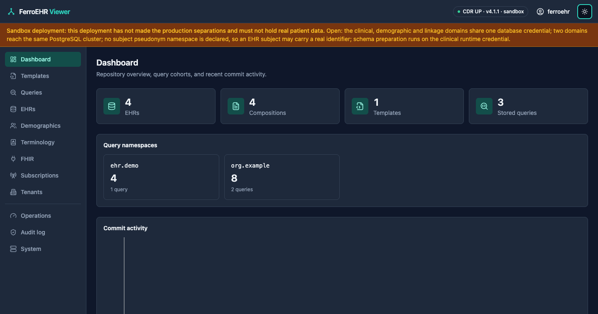
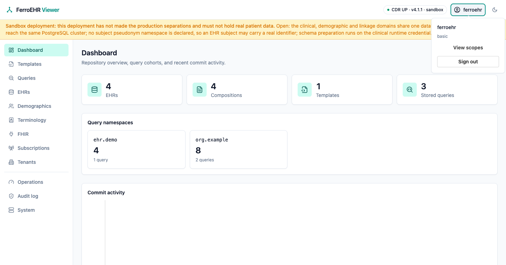
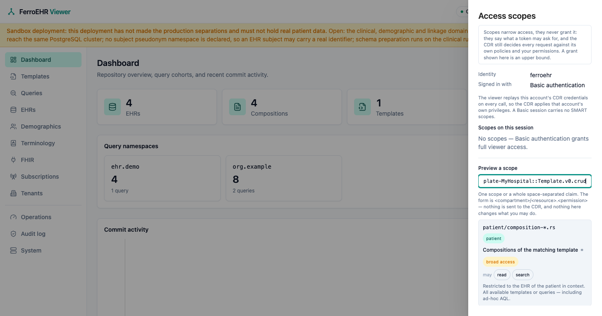
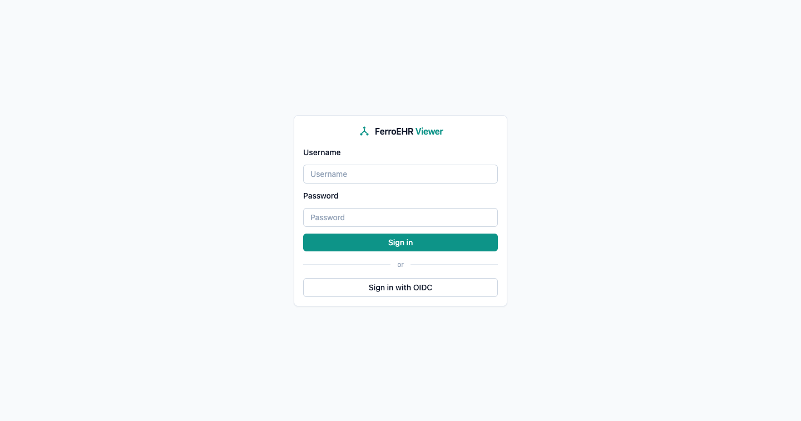
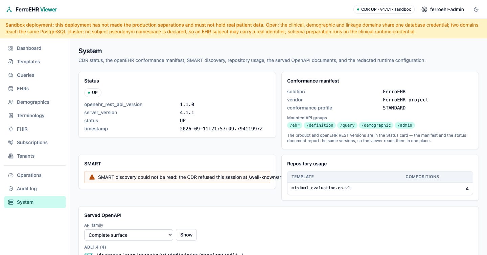
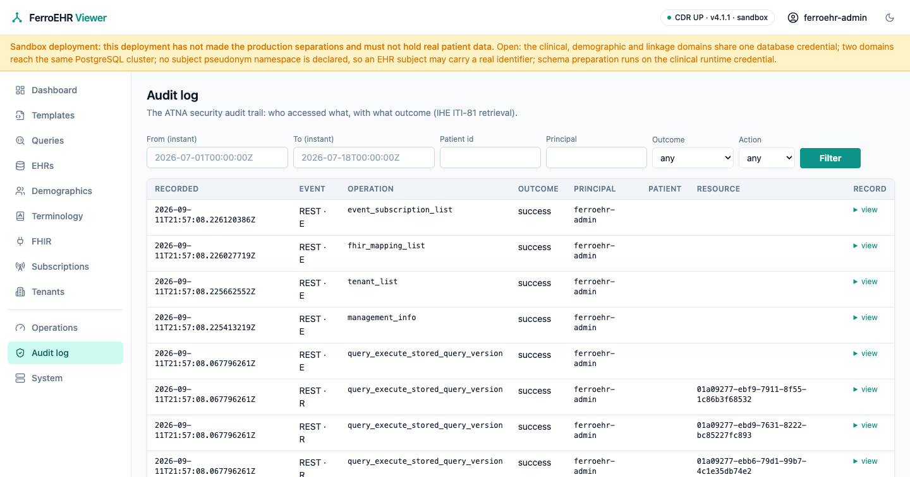
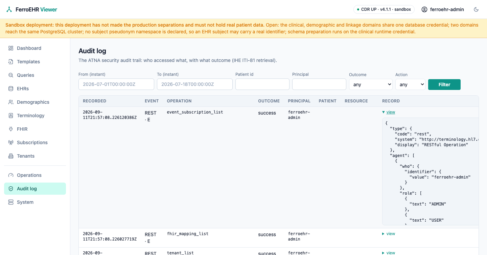
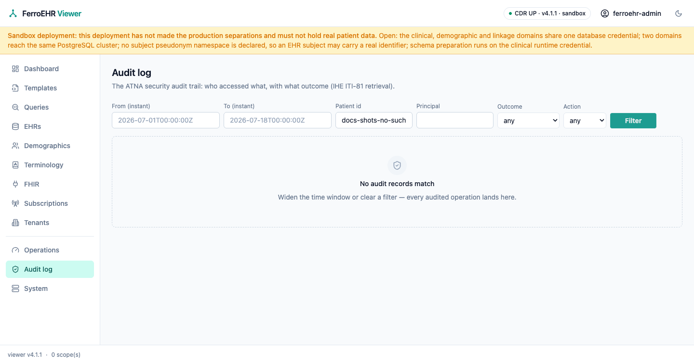

# FerroEHR Viewer

`ferroehr-viewer` is a standalone web console for managing an
ITS-REST-1.1.0 CDR, this server or any other. It is a **pure REST client**:
everything it does goes through the CDR's public API (never the database),
so what you see in the console is exactly what the API serves. The whole
application is Rust (Leptos SSR + WebAssembly); there is no hand-written
JavaScript anywhere, including its browser tests.

<!-- toc -->

## Running it

The quickstart compose ships the console as the `ferroehr-viewer` service on
port 3000, behind the `viewer` [profile](../installation/compose.md), so it
is opt-in and does not start with a plain `docker compose up`:

```bash
docker compose --profile viewer up
# → http://localhost:3000  (log in with the quickstart user ferroehr/ferroehr)
```

Standalone, point it at any CDR:

```bash
docker run -p 3000:3000 \
  -e FERROEHR_VIEWER__CDR__BASE_URL=https://cdr.example.org \
  ghcr.io/rubentalstra/ferroehr-viewer
```

### On Kubernetes

The Helm chart deploys the console as its own Deployment, Service and
ServiceAccount, with an optional Ingress and a NetworkPolicy that confines its
egress to the CDR and DNS: the console is a REST client of the CDR by mandate,
so the chart enforces that rather than trusting it. Off by default, and off
renders nothing:

```yaml
# values.yaml
viewer:
  enabled: true
  ingress:
    enabled: true
    hosts:
      - host: console.example.org
        paths:
          - path: /
            pathType: Prefix
  auth:
    oidc:
      enabled: true
      issuer: https://keycloak.example/realms/ferroehr
      clientId: ferroehr-console
      publicBaseUrl: https://console.example.org
  # the OIDC client secret is MOUNTED from a Secret you create, never env-borne
  existingSecret: console-oidc
```

It needs no database credential and never reaches the database. **Before you
enable OIDC:** a registered client whose redirect URI matches `publicBaseUrl`,
and a Secret holding its client secret. **To turn the console off**, set
`viewer.enabled: false` and upgrade; every console object is removed and the
CDR is untouched.

> [!NOTE]
> To scale the console past one replica, set the same `session.secret` on
> every replica: the session is a sealed cookie any key-holding replica can
> serve. Without a configured secret each replica seals with its own
> ephemeral key, and visitors get signed out whenever a request lands on
> another pod.

## Signing in

The sign-in page offers exactly the methods that can actually work: the
console's configured login modes intersected with the authentication
schemes the CDR advertises (its `WWW-Authenticate` challenge). A Basic
form is never shown against a bearer-only CDR, and vice versa. If the CDR
cannot be reached at all, the page falls back to the console's own
configuration and renders anyway, and the outage then surfaces on the login
attempt instead of hiding the page. Sign-in is served fully rendered and works
with JavaScript disabled.

The console manages no accounts of its own: it authenticates you against the
CDR (Basic) or your identity provider (OIDC), and there are no user, role, or
password screens to find; those live in the CDR's configuration and in your
IdP.

The console ships a full dark theme (the toggle persists per browser), and every
screen in this chapter has one, and [Dark mode](dark-mode.md) is the gallery.
The user menu opens the access drawer:





### The access drawer

"View scopes" answers *what may this session do, and who says so*:

- the authenticated principal and how it signs in: a Basic session replays
  its CDR account (and carries no SMART scopes), an OIDC session carries an
  access token whose scopes are listed;
- every scope on the session rendered as its **parsed grant**: the
  compartment it delegates to (`patient` / `user` / `system`), the resource
  family and id pattern it reaches, and the create/read/update/delete/search
  operations it permits, with a *broad access* marker on a bare `*`;
- a **previewer**: paste any scope string, or a whole space-separated claim,
  and read the same rendering. A scope shaped like a resource scope but
  malformed explains what the grammar expected instead of quietly reading as
  nothing.

The reading is not the console's own interpretation: it parses with the same
module the CDR's SMART scope gate enforces with, so the two can never drift.
Scopes **narrow** access and never grant it; the CDR remains the enforcer,
and a previewed grant is an upper bound.



## Configuration

One TOML file (`ferroehr-viewer.toml`, searched in the working directory
and `/etc/ferroehr/viewer.toml`, or pointed at with
`FERROEHR_VIEWER_CONFIG`), with `FERROEHR_VIEWER__<SECTION>__<KEY>` environment
overrides. Unknown keys are refused at startup, exactly as on the CDR:

| Key | Default | Meaning |
|---|---|---|
| `cdr.base_url` | `http://localhost:8080` | The CDR origin (the ITS-REST base path is appended). |
| `cdr.request_timeout_secs` | `30` | Per-request timeout toward the CDR. |
| `cdr.management_base_url` | derived from `cdr.base_url` | The CDR's management surface, base path included; set it when the CDR serves management on its own internal listener (`management.port`) or under a renamed base path. Drives the [Operations panel](operations.md). |
| `auth.basic_enabled` | `true` | Offer the username/password form (validated against the CDR; held server-side). |
| `auth.oidc.enabled` | `false` | Offer OIDC login (authorization code + PKCE). |
| `auth.oidc.issuer` / `client_id` / `client_secret` (`_file`) / `public_base_url` / `scopes` | — | The OIDC client registration; `public_base_url` is the console's externally visible origin for the redirect URI. Enabling OIDC without issuer, client id and public base URL is a startup error. |
| `auth.oidc.resolve` | — | A `host=ip:port` override for the issuer host, for split-horizon DNS: the console reaches an issuer whose canonical name only resolves inside the container network, while browsers and tokens keep the canonical URL. |
| `login.notice` | empty | Informational text on the sign-in card, line breaks preserved. A demo or evaluation deployment states its public credentials and usage expectations here. |
| `login.links` | empty | Links under the sign-in card, each `{ label, href }` — an API reference, a documentation page. |
| `session.idle_minutes` | `60` | Session idle expiry (sliding; carried inside the sealed cookie). |
| `session.cookie_secure` | `false` | Set behind TLS. |
| `session.secret` | empty | The session-cookie sealing key: base64 of at least 64 bytes (`openssl rand -base64 64`). Every replica of a scaled deployment must hold the same value. Empty = an ephemeral per-instance key, fine for exactly one replica. |
| `session.secret_file` | — | Path to a file holding the sealing key; wins over `session.secret`. |

The console is **stateless**: it has no database and keeps no local files of
its own. Everything it shows, including how stored queries are grouped,
which is derived from the namespace in each query's qualified name, lives in
the CDR and is read over ITS-REST, so nothing here needs backing up and
every replica shows the same repository. Sessions are a **sealed cookie**
(AES-256-GCM, keyed by `session.secret`), so any replica holding the key can
serve any signed-in visitor.

Login and sessions live in the console's backend; the browser stores only
the encrypted session cookie — CDR credentials and bearer tokens never reach
it in readable form.



## The screens

- **Dashboard:** record counts, per-namespace stored-query match tiles, and a
  commit-activity trend. See [Dashboard & queries](queries.md).
- **Templates:** upload and inspect operational templates. See
  [Templates & EHR browsing](browsing.md).
- **Queries:** the point-and-click Query Builder, the raw AQL editor, and
  stored-query management. See [Dashboard & queries](queries.md).
- **EHRs:** browse EHRs, folders, compositions, version history, and the
  item tags on any of them. See [Templates & EHR browsing](browsing.md).
- **Demographics:** browse and edit the five demographic party kinds, their
  relationships, version history, and tags. See
  [Demographics](demographics.md).
- **FHIR:** the connector's mapping-store editor, a read-path viewer, and a
  validate-only dry-run panel; appears only when the CDR's FHIR API is
  enabled. See [FHIR connector admin](fhir.md).
- **Terminology:** browse the terminologies the CDR serves, define a code,
  expand a value set, and test membership or subsumption. See
  [Terminology](terminology.md).
- **Audit log:** browse the CDR's ATNA security audit trail (see below).
- **System:** CDR status, the openEHR **conformance manifest** (what the
  server advertises about itself through the System API: product, vendor,
  claimed conformance profile, and the API groups it actually mounts), SMART
  discovery, repository usage, the server's own OpenAPI documents. Pick the
  complete surface or one API family, and the choice stays in the URL, so the
  redacted runtime configuration, and a shortcut into the audit browser.
  
- **Operations:** dependency health, build and spec provenance, the metric
  registry, and runtime log control. Appears only when the CDR serves its
  management surface. See [Operations panel](operations.md).
- **Tenants:** the tenant registry, and the tenant this session's credential
  resolves to. Appears only when the CDR runs with multi-tenancy on. There is
  no tenant switcher: tenancy is credential-derived, and the console displays
  it rather than choosing it. See [Tenant registry](tenants.md).
- **Subscriptions:** the event subscriptions that decide which committed
  versions the CDR publishes to a message broker. Appears only when the CDR
  serves its subscription API. See
  [Event subscriptions](subscriptions.md).

Every one of them is themed twice; [Dark mode](dark-mode.md) shows the dark
half of the console screen by screen.

### Paging

Every listing is paged, and the page lives in the **URL**: a page is
shareable and bookmarkable, a reload lands on the same rows, and the browser's
back and forward buttons walk the pages. The tables the console holds in full
(**Templates**, **Queries**) share one footer under the table: which rows are on
screen out of how many (`26–50 of 137 templates`), previous/next, and a
rows-per-page choice of 25/50/100 (`?page=` and `?size=`). The AQL-backed
listings (EHRs, an EHR's compositions) page through `?offset=` links, and the
audit browser through `?page=` beside its filters. Every one of these controls
is a plain link, so paging works before the page's WebAssembly loads, and a
page link carries the screen's other parameters (the tab you are on, the
filters you set) across with it.

## Audit log

The **Audit log** screen browses the CDR's security audit trail (who
accessed what, with what outcome) through the standard IHE ITI-81
retrieval (`GET /fhir/r4/AuditEvent`; see the
[Audit trail chapter](../audit.md)). Filter by event-time window, patient,
principal, outcome, or action; every filter lives in the URL, so a filtered
view is shareable and refresh-safe. Each row opens the full stored FHIR R4
`AuditEvent` record.

The audit trail is an operator surface: under role-based access control the
screen requires the CDR's admin role, and when the CDR's local audit store
is disabled the screen says so instead of erroring.



Each row's **view** disclosure opens the full stored `AuditEvent` record:
exactly what the ITI-81 API serves:



A filter that matches nothing renders a distinct empty state, so "no
records" is always visibly different from "records you haven't found":


