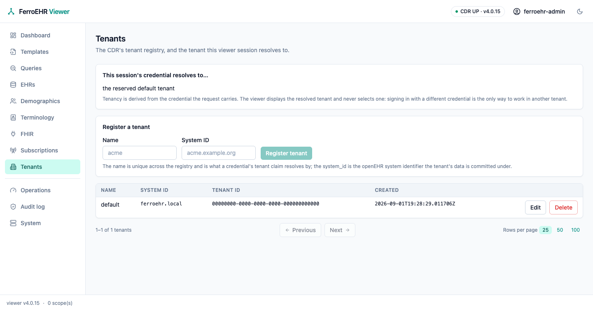

# Tenant registry

The **Tenants** screen administers the CDR's tenant registry (the named
tenants a credential's claim resolves against) and shows which tenant the
viewer session you are looking at actually runs as. Everything on it comes
from the CDR's own tenant API over HTTP; the viewer has no privileged channel
and keeps no tenant state of its own.



<!-- toc -->

## When it appears

The screen is **probe-and-hide**: on every page load the viewer asks the CDR
for `GET /admin/tenant`, and the sidebar entry appears only if that route
exists. A `404` (the CDR's answer when multi-tenancy is off, which is the
default) hides the entry entirely; any other answer counts as present, so a
refusal reaches you as a message on the screen that asked rather than as a
missing screen.

To get the screen, turn multi-tenancy on
([`[tenancy]`](../installation/config-auth.md#tenancy)):

```toml
[tenancy]
enabled = true
claim = "tenant"     # the JWT claim carrying the tenant key
```

Reaching `/tenants` on a single-tenant deployment is not an error either: the
screen renders one card naming that switch instead of a registry that cannot
be read.

> [!NOTE]
> The registry is mounted under `/admin`, so the CDR's role-based access
> control classes every call here as admin work. The screen renders whenever
> the surface exists; being allowed to use it is the CDR's per-request
> decision, and a session without the ADMIN role is refused with a message
> naming what is missing.

## The tenant this session resolves to

The card at the top of the screen answers one question: **which tenant does
this viewer session's credential put you in?** It reads the CDR's own answer
(`GET /admin/tenant/current`) rather than deriving anything locally, and it
shows either the resolved tenant's name and `system_id`, or *the reserved
default tenant* when the session runs unscoped, which is what happens when
the credential carries no tenant claim (every Basic session, and any token
without one).

**There is no tenant switcher, and that is deliberate.** Tenancy is derived
from the credential on each request
([Security & multi-tenancy](../security.md)), so the only honest ways a
viewer could change it would be to keep a tenant of its own beside the CDR
(state that would be invisible to every other client) or to send the CDR's
development-only tenant override header, which in production is an
authorization bypass. So the card displays and never selects: to work in
another tenant, sign in with a credential that resolves to it.

## The registry

The table lists every registered tenant with its name, `system_id`, registry
id and creation time, newest first, paged by the shared footer under the table
(see [Paging](index.md#paging)).

- **Register a tenant** with the card above the table: a name (unique across
  the registry, and the value a credential's tenant claim is matched against)
  and the `system_id` the tenant's data is committed under. The button stays
  disabled until both fields hold something, and the CDR's own refusal (a
  duplicate name, a missing field) is shown in full beside the failure
  notification.
- **Edit** on a row opens an editor seeded with that tenant's current values;
  saving replaces both fields. The row and the context card follow the CDR's
  answer, not the form.
- **Delete** on a row asks for confirmation naming the tenant, and nothing is
  sent until you confirm there. The CDR refuses to delete a tenant that still
  owns data, and the reserved default tenant can never be deleted; either
  refusal is shown verbatim.

Every one of those writes reports both outcomes, and a success and a failure are
equally visible, so a refused change never looks like nothing happened.

> [!WARNING]
> A tenant is a data boundary. Renaming one changes the key that credentials
> resolve against, so a claim naming the old value stops resolving and those
> requests fall back to the reserved default tenant instead of failing loudly.
> Change a name only in step with the identity provider that issues the claim.
